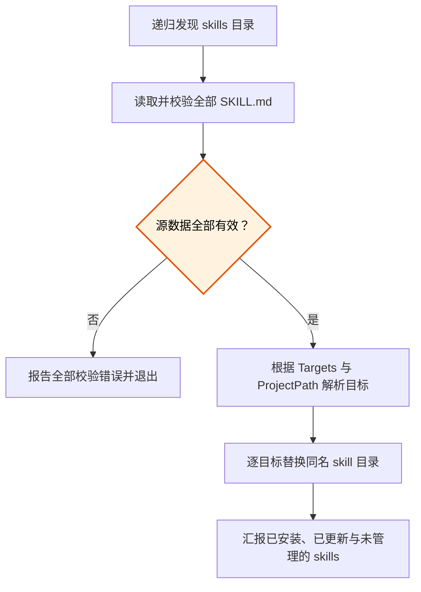

# Claude Code 与 Codex skill 双端兼容设计

## 结论

仓库继续以 `skills/` 作为唯一内容源，通过一个 Windows PowerShell 同步脚本把同一份 skill 安装到 Claude Code 和 Codex。个人级安装与项目级安装都受支持，不复制出两套长期维护的源文件。

Codex 已原生支持由 `SKILL.md`、配套参考资料和可选脚本组成的 Agent Skills。现有文档中“Codex 无 skill 发现机制，需手动读取”的判断已经过时，需要连同安装说明一起修正。

## 目标

- 在 Windows 上同时支持 Claude Code 与 Codex。
- 默认把仓库 skills 安装到当前用户的两个个人目录。
- 支持把 skills 安装到指定项目，让项目检出后能够使用自己的 skills。
- 保持 `skills/<category>/<name>/` 的分类式源目录。
- 安装过程不删除用户自行维护的其他 skills。
- 在写入任何目标前完成源数据校验，避免半途才发现内容错误。

## 不在本次范围内

- macOS 与 Linux 安装脚本。
- 把仓库发布成 Codex plugin 或第三方 marketplace 包。
- 为 Claude Code 和 Codex 分叉维护两套 skill 正文。
- 自动改写 skill 正文来生成平台专用版本。

## 目录与命令设计

`skills/` 保持当前分类结构。同步时按 skill 目录名扁平化：

| 安装范围 | Claude Code | Codex |
|---|---|---|
| 当前用户 | `%USERPROFILE%\.claude\skills\<name>` | `%USERPROFILE%\.agents\skills\<name>` |
| 指定项目 | `<ProjectPath>\.claude\skills\<name>` | `<ProjectPath>\.agents\skills\<name>` |

默认命令安装到当前用户的两个平台：

```powershell
pwsh ./scripts/sync-skills.ps1
```

调用方可选择平台，或用 `-ProjectPath` 切换到项目级安装：

```powershell
pwsh ./scripts/sync-skills.ps1 -Targets Codex
pwsh ./scripts/sync-skills.ps1 -Targets Claude,Codex -ProjectPath E:\some_project
```

`-Targets` 接受 `Claude` 和 `Codex`，大小写不敏感。省略时使用两者。`-ProjectPath` 必须指向已经存在的目录；省略时使用当前用户目录。

## 同步流程

同步过程分成发现、校验、解析目标、复制和汇报五个阶段。所有 skill 必须整体通过校验后，脚本才开始修改目标目录。



复制单个 skill 时沿用现有的“删除同名目标目录后完整复制”语义。这样源中已经删除的附属文件不会残留。不同名的目标目录保持不动。

## 校验与失败行为

开始复制前执行以下校验：

- 至少发现一个包含 `SKILL.md` 的 skill 目录。
- 每份 `SKILL.md` 的 YAML frontmatter 包含非空 `name` 和 `description`。
- `name` 与承载它的目录 basename 一致。
- 不同分类下不存在相同的目录名或 skill `name`。
- `Targets` 只包含支持的平台。
- `ProjectPath` 存在且是目录。

源数据校验失败时，脚本列出本次发现的全部问题，返回非零退出码，并且不写入任何目标。

目标写入仍可能因权限、锁文件或磁盘问题失败。此时脚本立即停止，返回非零退出码，并明确列出已经完成的目标和失败目标。首版不引入跨目标事务回滚，因为它会显著增加实现复杂度，而重新运行同步是安全且可重复的恢复方式。

## Skill 内容兼容策略

现有 `SKILL.md` 已普遍包含 Codex 要求的 `name` 和 `description`，因此不需要更换格式。兼容调整遵循以下规则：

- 通用工作流使用 agent-neutral 措辞，不把调用方式写死为 Claude Code 的 `Skill` tool。
- `description` 自身要包含触发条件与跳过条件，因为 Codex 主要用它决定是否隐式加载 skill。
- 现有 `when_to_use` 可以保留，作为 Claude Code 元数据和人工阅读补充；不能把 Codex 所需的唯一触发信息只放在这里。
- 真正依赖 Claude hooks、`settings.json` 或 `.claude/mcp.json` 的 skill 明确写出平台边界，并在有等价 Codex 路径时给出分支。
- 对只在文字中误称“Claude Code session”的通用 skill，直接改为中性称呼。

本次不会为了表面一致而虚构 Codex 等价能力。没有等价机制的 Claude 专属流程继续保留，但必须让 Codex 在加载后能识别限制并安全停止或采用已说明的替代路径。

## 测试设计

测试使用临时目录，不写入真实的 `%USERPROFILE%`。同步脚本提供仅用于测试或高级调用的用户根目录覆盖参数，使测试能够验证完整的路径解析和复制行为。

测试至少覆盖：

- 默认个人级双端安装。
- 个人级单平台安装。
- 项目级双端安装。
- 分类源目录到目标目录的扁平化。
- 目录名冲突与 skill `name` 冲突。
- 缺少或留空 `name`、`description`。
- 保留目标中与本仓库无关的 skill。
- 更新 skill 时删除源中已不存在的旧附属文件。
- 无效 `ProjectPath` 不产生任何目标写入。

测试脚本使用 PowerShell 自带能力实现，不引入 Pester 等额外依赖。实施完成后还要在临时目录运行测试，并用真实仓库执行一次只读校验或可控的 Codex 单目标同步检查。

## 文档改动

- `README.md`：说明 skill 是 Claude Code 与 Codex 都支持的开放格式，并给出个人级、项目级命令。
- `AGENTS.md`：删除“Codex 无 skill 发现机制”的旧说明，补充两个平台的发现目录与内容兼容规则。
- `scripts/sync-skills.ps1`：更新文件头说明、参数帮助和运行汇报。
- 现有 skills：只调整确实影响 Codex 使用的强平台措辞和路径说明，不做与兼容性无关的内容重写。

## 验收标准

- 同一份源 skill 可以通过一条命令安装到 Claude Code 与 Codex 的个人目录。
- 指定项目后，同一脚本可以生成项目级 `.claude/skills/` 与 `.agents/skills/`。
- 无效 skill 会在任何目标被修改前使同步失败。
- 目标中的非仓库 skill 不受影响。
- README 与 AGENTS.md 不再把 skill 描述成 Claude 专属能力。
- 自动测试在 Windows PowerShell 环境通过。
