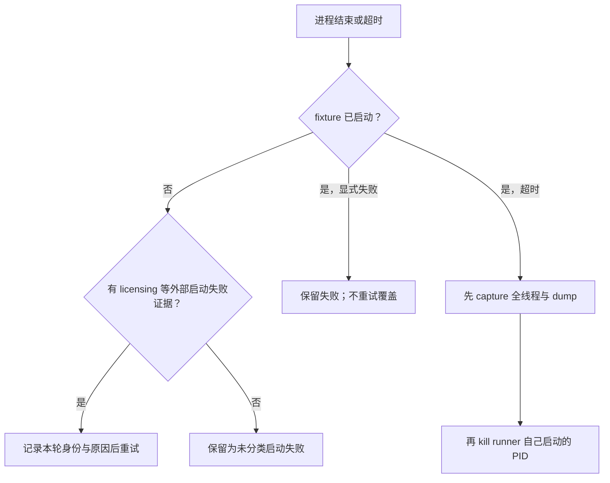

# Windows native crash / hang 的 dump 取证

诊断 Windows C++ host/plugin 的崩溃或卡死时，先分类结果，再选择 dump。crash、hang、脚本主动退出、超时终止和许可证启动失败
不是同一类事件；没有异常记录不能只凭“窗口消失”断言崩溃。

## 1. 先分类，不先归因

| 现象 | 首要证据 |
|---|---|
| crash | exception code、faulting thread、crash dump、Windows Event Log |
| hang/freeze | 进程仍存活、UI 无响应、Break All 后全线程栈 |
| 主动退出 | fixture/report 已写完、正常 exit code、调用 quit 路径 |
| harness 超时终止 | launcher report、超时记录、父进程 kill 记录 |
| 外部启动失败 | licensing/driver/环境日志更新，但无业务 report/marker/dump |

先保存 PID、命令行、模块版本/实际路径、场景/输入、时间线操作和最后一个成功 marker。重复复现要使用同一操作序列并给每轮证据
独立时间戳，禁止沿用旧 dump/report。

## 2. Runner 记录二进制身份，并限制重试边界

诊断“修复是否生效”时，路径和版本字符串不足以证明实际加载的是新二进制。launcher report 应在启动前记录 host 与每个目标
插件的 resolved path、文件大小、纳秒级修改时间和 SHA-256。报告、dump 与性能数据都必须绑定这组身份；打包目录与 build
目录存在同名 DLL 时尤其如此。

自动重试只用于 fixture 尚未启动的外部启动失败，例如没有业务 report、marker 或 dump，且 licensing 日志显示启动失败。
fixture 已启动后产生的显式失败或 timeout 是本次测试的真实结果，不能用下一轮成功覆盖。timeout 时按
`capture → kill owned process` 的顺序保存现场，只终止 runner 自己启动的 PID。



## 3. Hang：先抓全线程，不急着 kill

在 Visual Studio 或 WinDbg 对仍存活进程 Break All：

1. 保存所有线程栈和当前线程；
2. 记录 UI/main thread 在等待谁；
3. 找 worker 是否卡在同一锁、事件、GPU/driver 调用或引用计数路径；
4. 再保存普通 minidump；
5. 证据落盘后才继续、detach 或终止进程。

只有主线程栈不能证明死锁或竞争；必须看持锁/被等候的其它线程。单次栈只能定位停点，race 结论通常还需要重复 dump、相关线程
和对象生命周期证据。

## 4. Dump 选择

默认先保存**不带 heap 的普通 dump**：文件小，足够恢复线程、寄存器、模块和大部分调用栈，适合快速分享和多轮比较。

只有需要下列信息时才保存 full-memory/with-heap dump：

- 验证对象字段、引用计数、vtable 或容器内容；
- 栈上只有指针，必须沿指针还原所有权；
- 怀疑 use-after-free、内存破坏或错误共享对象；
- 普通 dump 已把范围缩到少数对象但仍无法裁决。

full dump 可能达到数 GB，并包含场景数据、路径、凭证或其它敏感内存。保存、传输和归档前先确认空间与数据边界；不要把它当默认
附件。

## 5. WinDbg 最小分析集

```text
!analyze -v          ; crash 的异常摘要
.ecxr                ; 切到异常上下文（有 exception 时）
k / kp               ; 当前线程栈
~* k                 ; 所有线程栈
lm                   ; 已加载模块与基址
lmvm <module>        ; 模块版本、路径、时间戳
```

没有私有 PDB 时仍可用 `module+offset` 与 Ghidra 对齐：

```text
RVA = runtime_address - runtime_module_base
Ghidra_address = Ghidra_image_base + RVA
```

记录模块版本/hash；不同构建的同一 RVA 不一定是同一函数。系统模块缺符号时先配置 Microsoft symbol server，插件自身无符号则用
map、导出、RTTI、字符串交叉定位，不要给未知地址编造函数名。

## 6. 竞争与生命周期结论的门槛

声称 race/refcount/use-after-free 前至少满足两类证据：

- fault/hang 栈落在共享对象的 retain/release、锁或销毁路径；
- 另一个并行线程正在读取/写入同一对象或上游几何；
- full dump 中对象字段、引用计数或 vtable 异常；
- 改变并行度、共享方式或调度后复现稳定消失；
- 使用不同上游实现仍复现，排除业务插件特有逻辑。

“栈上出现 refcount 函数”只说明停在那里，不足以单独证明 refcount race。

## Anti-Patterns

| 反 pattern | 后果 | 修法 |
|---|---|---|
| 窗口消失就称 crash | 主动退出/licensing 被误判 | 联合 exception、dump、report、launcher 日志分类 |
| hang 后立刻 kill | 丢失唯一线程现场 | Break All + 全线程栈 + normal dump 后再处理 |
| 一开始就存 full heap | 12GB 级文件慢且含敏感数据 | normal dump 先定位，按需升级 |
| 只看 UI thread | 看见等待，看不见谁持锁 | `~* k` 查所有线程 |
| 无 PDB 就停止 | 第三方闭源模块无法推进 | module base + RVA 映射 Ghidra |
| 单一停点就断言 race | 过度归因 | 多线程/对象/调度反证至少两类 |
| 只记插件路径，不记文件身份 | 实际加载旧副本却误判修复无效 | report 记录 resolved path、size、mtime 与 SHA-256 |
| fixture 已失败仍自动重试 | 后续成功掩盖真实故障 | 只重试 fixture 启动前的外部失败 |

## 相关 Guidelines

- [`../code/diagnose-before-fixing.md`](../code/diagnose-before-fixing.md) —— 先分类取证再归因，跟本篇"先分类结果、不先归因"同源
- [`../code/validation.md`](../code/validation.md) —— 崩溃类结论要 dump / 证据，不靠"看着像崩了"
- [`../../skills/maya/reverse-maya-closed-nodes/SKILL.md`](../../skills/maya/reverse-maya-closed-nodes/SKILL.md) —— 无 PDB 时 `module base + RVA` 映射 Ghidra 的分层证据工作流
