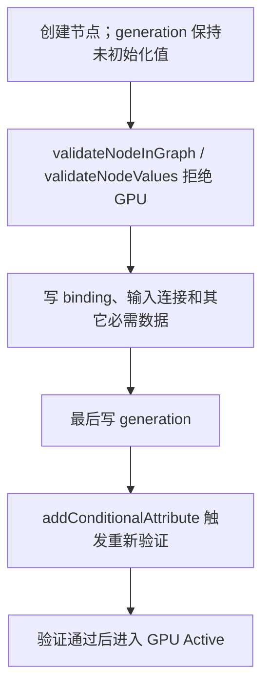

# Maya GPU deformer 的 GUI 自动化与有效性验证

Maya `MPxGPUDeformer` / GPU Override 的正确性和稳定性必须在真实 `maya.exe` GUI 环境验证。
`mayapy + maya.standalone` 没有完整 Viewport 2.0、Qt event loop 和图形互操作环境，只能覆盖注册、CPU DG、
绑定和独立 kernel；不能证明 GPU evaluator 真正执行。

## 核心规则

1. **先加载 `deformerEvaluator`，再加载自定义 GPU deformer 插件。** GPU creator 注册依赖 deformer evaluator
   已存在；顺序错误时应在空场景卸载重载或重启 Maya。
2. **GPU 通过必须有四重证据**：节点状态为 `GPU Active`、本轮每个节点都有新的 GPU success marker、目标确实产生
   非零形变、GPU 与 CPU 输出在阈值内一致。缺一项都不能声称 GPU 已验证。
3. **CPU 读回会污染 GPU 测试。** `MFnMesh::getPoints`、`cmds.xform` 等同步读取可能触发 buffer download 或 CPU
   重新求值；“GPU/CPU max delta = 0”本身不能证明 GPU 跑过。
4. **每个 GPU 节点独立验 success。** 多节点共享 driver 时，只看到一个 marker 或总图状态不够。
5. **不支持的输入显式回退 CPU。** partial membership、painted weights、旧 binding 或 kernel/buffer 失败时返回
   `kDeformerFailure`，不要忽略输入继续发布错误 GPU 输出。
6. **GPU `evaluate()` 不查询 live scene 几何。** 共享 driver 通过 evaluator 管理的输入或 auxiliary mesh buffer 进入；
   不在并行 GPU 求值中用场景查询同步拉取正在被其它 deformer 写入的 mesh。
7. **分多步创建的节点先完成初始化，再进入 GPU。** `validateNodeInGraph()` 和
   `validateNodeValues()` 必须拒绝 binding、输入连接或其它必需状态尚未就绪的节点。选择一个 generation
   属性注册到 `addConditionalAttribute()`，并在创建命令的最后写入它，让 evaluator 重新验证完整节点。

## 分多步创建节点的 GPU 生命周期

Maya 命令常先创建 deformer，再连接 driver、写 binding 和参数。GPU evaluator 可以在命令尚未完成时观察到这个节点；
若注册信息无条件返回 `true`，半初始化节点会进入 `evaluate()`，形成 `GPU evaluation failure`，严重时还会放大并行
求值或 GPU graph 重建中的生命周期问题。



generation 不是普通的数据版本号，而是初始化事务的提交标记。创建命令必须最后写它；如果后续修改会改变 GPU 可支持性，
同一属性也必须随之变化。回归测试至少断言两种状态：

- 半初始化节点没有 GPU `evaluate()` marker，状态也不是 `GPU evaluation failure`；
- 完整节点重新验证后是 `GPU Active`，并产生本轮新的 success marker。

## 证明 GPU 真执行的最小 Gate

| Gate | 证据 | 防止的假通过 |
|---|---|---|
| 注册 | `evaluator -name deformer -nodeType` 包含节点类型 | 插件加载了但 GPU creator 未登记 |
| 路由 | `deformerEvaluator` 报目标节点 `GPU Active` | evaluator 实际选择 CPU |
| 执行 | 每节点、本轮唯一 success marker 或 profiler scope | 沿用 warm-up/上一轮记录 |
| 激发 | target 位移、活跃点数或输出 hash 确实变化 | 节点没算也得到零误差 |
| 数值 | GPU 与显式关闭 deformer evaluator 的 CPU 输出对照 | GPU kernel 空跑或算错 |

切换 evaluator 后要跳帧或显式 dirty/refresh，确保当前帧重新求值。采集前删除旧 marker；marker 至少写节点标识、
轮次/时间戳、success/failure 和失败原因。

## GPU 路由按交互类型分别验证

`GPU Active` 表示节点具备 GPU 路由资格，不证明所有交互都会调用
`MPxGPUDeformer::evaluate()`。直接编辑 controller/locator、时间变化、Cached Playback
和显式 mesh 读取可能走不同的 Evaluation Manager 路径。

每种需要承诺的交互都必须单独激发和记录：

- 直接属性或 manip 拖动；
- 相隔足够远的真实时间 key；
- timeline scrub 和播放；
- Cached Playback 填充、cache hit、插入新 key 后的 fresh replay。

若直接编辑没有 GPU marker，不能因为静态状态为 `GPU Active` 就把 CPU 交互耗时称为
GPU 性能；应明确报告该交互由 Maya 路由到 CPU。时间线 GPU 验证仍需逐节点 fresh
evaluate/success marker、非零形变和 CPU/GPU 数值对照。

## GUI 启动方式

不要把多行 Python 直接塞进 `maya.exe -command`。它会经过 PowerShell、MEL 和 Python 三层引号解析，常把
`python("...")` 破坏成 `python(import ...)`。用 `-script bootstrap.mel`：

```mel
python("import sys\nsys.path.insert(0, r'H:/checkout')\nimport tools.gpu_fixture as f\nf.schedule()");
```

Python 模块用 Qt timer 等 GUI、modelPanel 和图形互操作初始化完成，再建图、播放和采集：

```python
from PySide2.QtCore import QTimer

def schedule():
    QTimer.singleShot(5000, run)
```

不要在 Maya 主线程阻塞 `sleep`。多阶段播放继续用 timer、`scriptJob(timeChanged=...)` 或状态机推进。测试结束时先原子地
写 report/marker，再 `cmds.quit`；需要人工操作时由显式 keep-open 开关控制。

## 进程与结果判定

- Windows 的 `maya.exe` 启动器可能很快把控制权还给 shell，不能用启动命令的 `$LASTEXITCODE` 判断 GUI 测试完成。
- 以新 PID、report、marker 和超时状态为准；runner 的外层超时必须大于单 case 超时。
- 自动化只终止自己启动的新 PID。除非用户明确授权独占 Maya，禁止无条件 kill 全部 `maya.exe`。
- Maya 很快退出且没有 report、marker、crash dump，但 licensing 日志刚更新时，优先按许可证启动失败重试，不计为插件崩溃。
- OpenColorIO、Arnold 等启动警告只要不阻止 fixture 写报告，就不是 GPU 失败证据。

## 稳定性压力矩阵

GPU 数值一致后再测交互时序：

- Parallel Evaluation + GPU Override；
- Cached Playback 填充后新增中间 key；
- 拖 driver/controller、拖 timeline、再次播放；
- 多个 GPU deformer 共享一个 animated driver；
- 多轮播放，每轮要求所有节点产生新的 success；
- CPU fallback case 单独验证结果正确，不与 GPU 性能 case 混算。

## Anti-Patterns

| 反 pattern | 后果 | 修法 |
|---|---|---|
| mayapy 通过就声称 GPU 通过 | 实际没有 VP2/GPU evaluator | GUI 四重证据 Gate |
| 只看 `registered=True` | 只证明 creator 存在 | 再验 active、success、激发、CPU 对照 |
| 读取 mesh 后才判断 GPU | 读回可能强制 CPU/download | marker/profiler 在读回前记录 |
| 多节点只验一个 marker | 共享 driver 的另一节点可能回退/失败 | marker 带 node id，逐节点验 |
| `maya.exe -command` 注入长 Python | 三层转义破坏语法 | `-script bootstrap.mel` + Python 模块 |
| Maya 退出一律记 crash | licensing/脚本主动退出被误判 | report、marker、dump、licensing 联合分类 |
| GPU 不支持输入仍继续算 | painted weight/membership 被静默忽略 | 返回 failure 交回 CPU |
| 节点刚创建就无条件接受 GPU | 半初始化数据进入 `evaluate()`，产生失败或生命周期风险 | 验证完整状态，最后写 conditional generation |

## 相关 Guidelines

- [`../code/validation.md`](../code/validation.md) —— "headless / 单测绿 ≠ GUI 对"；GPU deformer 必须真 GUI 四重证据验
- [`parallel-deformer-performance-profiling.md`](parallel-deformer-performance-profiling.md) —— 区分 wall、
  interval union、work sum，并用旁路消融判断真实 wall 收益上限
- [`../cpp/windows-native-crash-hang-evidence.md`](../cpp/windows-native-crash-hang-evidence.md) —— GUI 崩溃 / hang 时的 dump 取证（本篇 GPU 通过判定的补充面）
- [`../../skills/maya/reverse-maya-closed-nodes/SKILL.md`](../../skills/maya/reverse-maya-closed-nodes/SKILL.md) —— 诊断闭源 / GPU 节点行为的分层证据工作流
