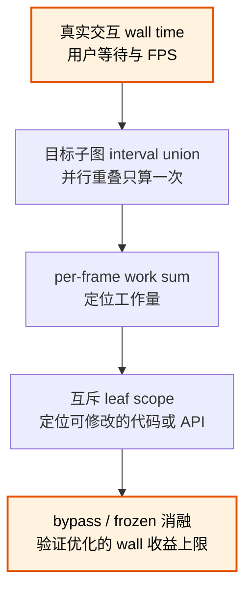

# Maya 并行 Deformer 性能取证

Maya Parallel Evaluation 同时存在墙钟时间、并行子图占据的时间窗和 worker 实际工作量。
三者回答不同问题。混用这些数字会把并行重叠算重，也可能把依赖等待误判成某个节点的纯计算。

## 核心规则

性能报告至少同时给出三种时间：

1. **wall time**：一次真实交互从激发到刷新完成的墙钟时间，直接决定用户 FPS；
2. **interval union**：目标子图所有事件区间的并集，重叠部分只计算一次，用来判断该子图
   占据的关键时间窗；
3. **per-frame work sum**：同类事件 duration 在每帧内的总和，用来衡量工作量和定位代码
   热点，不表示墙钟时间。

Parallel Evaluation 下，不同 category 和节点的 work sum 可能重叠，禁止直接相加推导
整帧耗时。outer scope 还可能包含依赖等待、共享 producer 或下游同步；单节点 duration
最大的节点不一定拥有最多纯计算。

## 最小取证 Gate

- 使用与生产一致的启动环境、插件二进制和场景，记录绝对路径、版本和 SHA-256；
- 等待大场景和 solver 真正 ready；
- 确认 controller、driver 和 driven output 都发生非零变化；
- 先采 unprofiled wall，再采相同激发序列的 profiler；
- warm-up 后做足够样本，同时报告样本数、P50 和 P95；
- nested scope 不相加，优先用互斥 leaf scope 定位代码成本；
- 用 interval union 判断并行子图的关键区间；
- 用单变量 bypass/frozen 消融测量子系统从关键路径移除后的实际 wall delta；
- 按 wall delta 排优化优先级，不按 category work sum 排序；
- 性能改动必须做同机、同 fixture、同二进制的 A/B，并保留数值快照。

消融只用于归因，不应直接当作生产解决方案。每个 case 都要确认仍应变化的 controller、
driver 和 driven output 没有被错误短路，否则“更快”可能只是整条图没有求值。

## 三种时间的关系

wall time 是整体结果的依据。interval union 说明一个子图覆盖了多长的帧时间窗，但这个时间窗
可能包含上游数据未 ready、调度空隙和同步。work sum 表示 worker 做了多少记录内工作，但这些
工作可能与其它子系统并行。只有把子系统从关键路径中单变量移除后测得的 wall delta，才能估计
继续优化它最多能为交互回收多少时间。

## 解释异常节点时间

若小网格节点的 duration 反而最大，先检查它是否承担：

- 共享输入 producer 的触发；
- 上游 skin/history ready 等待；
- Evaluation Manager 调度间隔；
- geometry data 锁或下游同步。

只有互斥 leaf scope 和单变量实验能证明纯计算热点。不要仅按节点 outer duration 排序后
重写该节点算法。

## P50、P95 与长尾

- P50 表示典型帧，适合比较稳定交互吞吐；
- P95 表示慢帧，适合观察调度、viewport、缓存和系统长尾；
- 平均值不能替代两者；
- 单次 P95 异常不能证明回退。至少重复一轮，并检查异常期间 leaf scope、interval union、
  内存、viewport 和系统状态是否同步变化。

性能优化的 A/B 应使用相同 warm-up、采样数、激发序列和机器状态。若 profiler 本身改变了
长尾，同时报告 unprofiled wall 和 profiled wall，不要只保留更好看的那组。

## Anti-Patterns

| 错误做法 | 后果 | 正确做法 |
|---|---|---|
| 把每个并行节点 duration 相加当帧耗时 | 重复计算并行重叠 | 另算 wall 和 interval union |
| 把分类 work sum 相加 | 忽略跨 category 重叠 | 用 wall 作为整体依据 |
| 用最大节点 duration 判断最慢 mesh | 把等待归因成计算 | 拆互斥 leaf scope |
| 看到内部热点就直接优化 | 热点可能隐藏在并行重叠中 | 先旁路该子系统，测实际 wall 上限 |
| 场景未 ready 就开始采样 | 暂态加载失败污染结论 | 非零激发和 ready marker 作 Gate |
| 只报告平均值 | 隐藏典型帧和调度长尾 | 同时报 P50、P95 和样本数 |
| 只证明没有 crash | 节点可能根本没有执行 | 验激发、执行 marker、数值和结果状态 |

## 相关 Guidelines

- [`gpu-deformer-gui-validation.md`](gpu-deformer-gui-validation.md) —— GPU deformer 的 GUI
  执行、交互路由、fresh marker 和数值验证
- [`../code/validation.md`](../code/validation.md) —— 自动 fixture、真实激发和证据门槛
- [`../cpp/windows-native-crash-hang-evidence.md`](../cpp/windows-native-crash-hang-evidence.md)
  —— Windows GUI crash/hang、二进制身份和 timeout 取证
