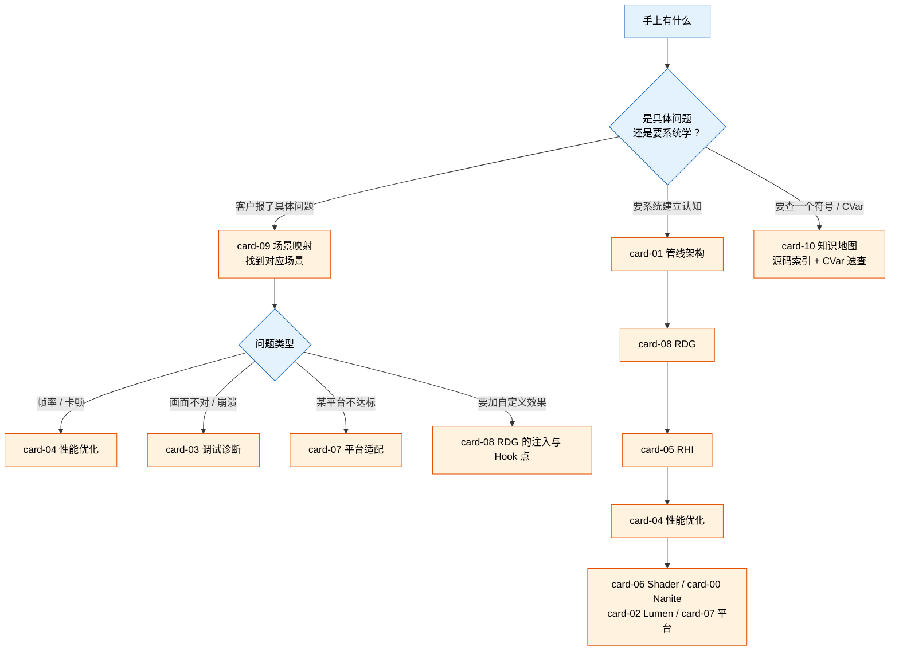

# UE 渲染管线知识库

面向 UE 渲染底层技术支持的参考资料——渲染管线定制与引擎项目底层优化两个方向。

> **覆盖版本**：UE 5.8（源码基准 `H:/Epic Games/UE_5.8`，5.8.0 / CL 55116800）
> **验证状态**：见每份文档开头的验证状态段。**引用前请按文档里给出的源码路径复核**——本库
> 部分内容来自自动化调研，已发现并修正过多处不存在的 API 名、CVar 名和文件路径。
> 校验工具：`scripts/verify-ue-rendering-refs.py`（机械核对全部路径与 CVar 断言是否真的存在于引擎源码）

## 文件列表

| 文件 | 规模 | 内容 |
|---|---|---|
| [card-01-pipeline-overview.md](card-01-pipeline-overview.md) | 536 行 | **渲染管线架构**：三级流水线、`FSceneRenderer` 流程、Deferred / Mobile 分支、各 Pass 顺序、Lumen 与 Nanite 的插入点 |
| [card-08-rdg.md](card-08-rdg.md) | 1540 行 | **RDG**：`FRDGBuilder` API、资源声明、Pass 类型、Transient 与别名、Barrier、裁剪执行、**自定义 Pass 注入与 Hook 点**、RDG 调试、5.8 新增特性 |
| [card-05-rhi.md](card-05-rhi.md) | 541 行 | **RHI 层**：抽象层结构、资源管理、GPU 同步、命令列表、各平台 RHI 差异 |
| [card-04-performance.md](card-04-performance.md) | 772 行 | **性能优化**：分析工具链、瓶颈定位方法、优化策略、CVar 速查 |
| [card-06-shader-material.md](card-06-shader-material.md) | 502 行 | **Shader 与材质**：材质系统链条、Shader 编译管线、Permutation 裁剪、Substrate |
| [card-00-nanite.md](card-00-nanite.md) | 693 行 | **Nanite**：Cluster / Page / Group 层级、Visibility Buffer、流式加载、显存管理、定制扩展、已知限制 |
| [card-02-lumen.md](card-02-lumen.md) | 499 行 | **Lumen**：三种追踪模式、反射、Surface Cache、性能调优与降级路径 |
| [card-07-platform-adaptation.md](card-07-platform-adaptation.md) | 496 行 | **平台适配**：Feature Level 系统、移动端 / 桌面 / 主机差异、VR、渲染管线裁剪 |
| [card-03-debugging.md](card-03-debugging.md) | 513 行 | **调试诊断**：内置与外部调试工具、常见渲染问题定位、Validation 层、CVar 汇总、工作流速查 |
| [card-09-scenario-mapping.md](card-09-scenario-mapping.md) | 556 行 | **场景映射**：客户需求分类 → 技术栈映射。⚠️ 当前仍是调研阶段的自查稿，待重写成问题路由表 |
| [card-10-knowledge-map.md](card-10-knowledge-map.md) | 629 行 | **知识地图**：结构化知识树、源码索引、CVar 速查表、学习路径 |
| [card-11-final-report.md](card-11-final-report.md) | 1508 行 | **总览**：执行摘要、管线全景图、学习路线、源码导航、自我评估 |

## 怎么用

## 引用纪律

这批内容不是引擎官方文档，**不要当权威直接答客户**。里面每条 API 名、CVar 名、源码路径都可能是
调研阶段生成的似真内容。已知的失败模式：编造出读起来完全合理的文件名（`NaniteRendering.cpp`）、
<!-- verify:ignore-start -->
不存在的 CVar 家族（`r.RDG.Debug.VerifyBarriers`）、以及不成立的版本变更说法。
<!-- verify:ignore-end -->

所以：

1. 要引用某条结论前，按文档给的路径去 `H:/Epic Games/UE_5.8/Engine/Source` 打开确认
2. 批量核对用 `python scripts/verify-ue-rendering-refs.py`——它把全部路径与 CVar 断言逐条对着引擎源码判定
3. 客户在别的版本上时，先确认该结论在那个版本成立，本库只以 5.8 为基准

这份库的价值在于**知识结构和排查路线**——哪些子系统、按什么顺序看、可能卡在哪一环。
具体符号请以源码为准。
