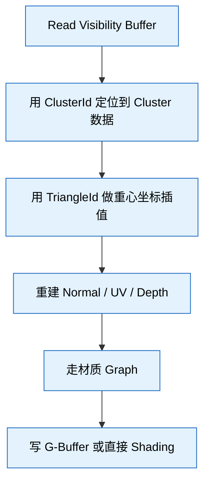
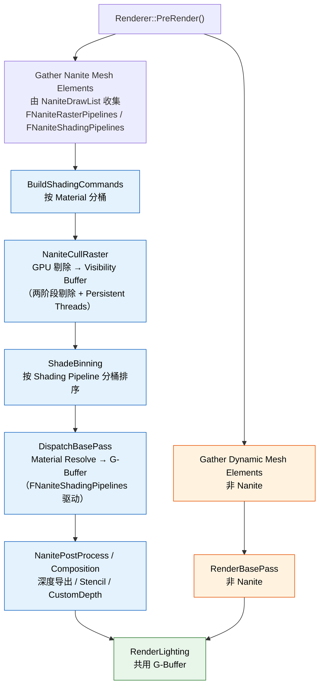
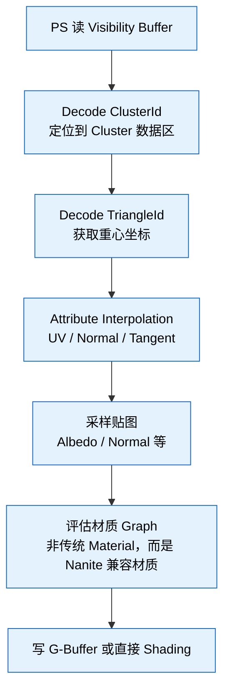
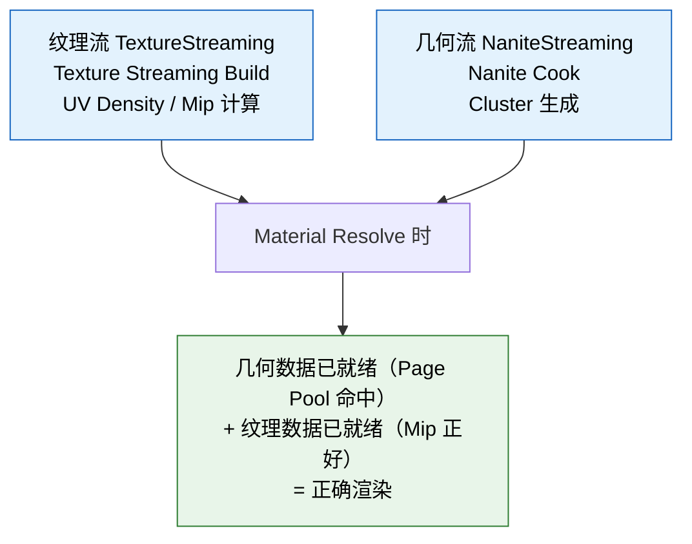

# Nanite 虚拟几何体系统 — UE 5.8 知识卡片

## 术语表

本文档中出现的 Nanite 特有术语：

| 术语 | 说明 |
|------|------|
| **Cluster** | 基本剔除 / 渲染单位，上限 128 个三角、256 个顶点 |
| **Page** | 磁盘 / 显存传输单位，打包 1~N 个 Cluster |
| **Root Page** | 资源内置的根级别 Page，包含基础 LOD 层级（无 Streaming 延迟）|
| **Streaming Page** | 按需流式加载的附加 Page，存放更高 LOD 细节的 Cluster |
| **Group** | LOD 选择逻辑单位，一个 Page 内的连续 Cluster 块 |
| **Visibility Buffer** | Nanite 替代传统 GBuffer 第一轮的核心数据结构，每像素存 ClusterId + TriangleId + Depth |
| **Material Resolve** | 从 Visibility Buffer 重建 G-Buffer 的第二遍绘制 |
| **Page Pool** | GPU 上驻留所有 Nanite 几何数据的环形缓冲区 |
| **Persistent LOD** | 每帧重新计算的 LOD 选择机制，非一次性选定 |
| **Assembly Part** | 可组合子网格，允许 Mesh 由多个独立 Part 组装（支持骨骼绑定）|
| **Shade Binning** | 将可见像素按材质 pipeline 分桶排序，提高 Material Resolve 的 coherence |
| **CLAS** | Cluster Acceleration Structure，Ray Tracing 专用加速结构 |

---

## 1. Nanite 核心架构 — Cluster / Page / Group 层级

Nanite 资产结构（从细到粗）：

- **Triangle（顶点）**
  - **Cluster（上限 128 个三角，256 个顶点）**
    - **Page（N 个 Cluster，按空间 / 拓扑打包）**
      - **Group（一个 Page 内的连续 Cluster 块，用于 LOD 选择）**
        - **Component（实例化一个 Nanite 网格）**

**Cluster** — 基本剔除 / 渲染单位：
- 上限 128 个三角（`NANITE_MAX_CLUSTER_TRIANGLES = 128`），256 个顶点（`NANITE_MAX_CLUSTER_VERTICES = 256`）
- 预先计算好 **Persistent Cluster Culling** 数据（包围盒、法线锥、误差值等）
- 顶点索引通过 **Group ID** 编码（非全局索引），支持局部索引缓冲
- 误差值（`Error`）决定该 Cluster 在哪个 LOD 层级可见
- 实际 Cluster 可能包含少于 128 的三角（非固定大小，有上限）

**Page** — 磁盘 / 显存传输单位：
- 打包 1~N 个 Cluster，大小约 128KB 对齐
- 每个 Page 对应磁盘上一个 `.nkp` 块（Nanite 专属压缩格式）
- 显存中 `PagePool` 以 Page 为粒度管理驻留
- **Root Page**：内嵌于资源本身，包含基础 LOD 数据，无需 Streaming 即可渲染
- **Streaming Page**：按需加载的高细节 Page，走 Streaming Manager 调度

**Group** — LOD 选择逻辑单位：
- 一个 Page 可按空间连续性切成若干 Group
- Group 的 **Screen-Space Error (SSE)** 作为 LOD 决策依据
- 渲染时 Group 级别的 `Persistent LOD` 选择决定哪些 Cluster 进入剔除管线

**隐式 LOD 层级 — 无传统 LOD 0/1/2**：
- 无手工 LOD。原始的 Cluster 层级就是 LOD 0，Cluster 合并后形成 LOD 1+
- 合并算法：`Simplify` 在 Cook 阶段把 Cluster 合并为更大三角形，产生新 Cluster 层级
- 每个 Cluster 的 `Error` 值决定它何时被更高 LOD 的 Cluster 替换

---

## 2. Persistent Streaming LOD 选择机制

**核心思想**：每帧为每个 Nanite Component 在 CPU 上选一个 LOD 阈值，GPU 在此基础上做 Per-Cluster 精细剔除。

**CPU 端**（`Engine/Private/Rendering/NaniteStreamingManager.cpp` `Nanite::FStreamingManager::UpdateLODs`）：

1. 计算每个 Component 的屏幕空间大小（Bounds x ViewProjection → 像素数）
2. 查预计算 LOD 层级表，获得该大小下的目标 Error 阈值
3. 选一个 Initial Group Index（LOD 层级）作为剔除起点
4. 把该层级信息写入 Constant Buffer，传 GPU

**GPU 端**（`NaniteCullRaster.cpp`，CullKernel）：

1. 对该 Component 的每个 Cluster：
   - 计算 Cluster 的投影屏幕误差
   - 若误差 > 目标阈值 → 保留（需要更精细）
   - 若误差 < 目标阈值 → 跳过（用更高 LOD 的合并 Cluster 替代）
2. Persistent Thread Group 做 View-Frustum / Occlusion 剔除（由 `r.Nanite.PersistentThreadsCulling` 控制）

**Persistent 的含义**：不是"一次性选完 LOD 层级就不管"——LOD 选择是 **每帧重新计算** 的，随相机距离、视野变化实时调整。

---

## 3. Visibility Buffer 工作原理

**Visibility Buffer 是 Nanite 替代传统 Deferred GBuffer 第一轮的核心数据结构**。

**传统流程**：

```
VS → 写 GBuffer (Albedo/Normal/Roughness/Metalness/Depth) → PS 读 GBuffer → Shading
```

**Nanite 流程**：

```
VS → 写 Visibility Buffer (Cluster ID + Triangle ID + Depth) → 第二遍 PS → 读 Visibility Buffer → 重建 G-Buffer → Shading
```

**Visibility Buffer 结构**：
- 每个像素存一个 **64-bit** 值：
  - `ClusterId`（32-bit）— 命中哪个 Cluster
  - `TriangleId`（32-bit）— 命中哪个三角形（准确重心坐标）
  - Depth 通过 `TriangleId` + 重心坐标在第二遍重建

**为什么多此一举**：

1. Nanite 的 VS 输出是 **Cluster 粒度**，不是 Mesh 粒度——每个顶点可能属于不同的 Cluster 组
2. **Visibility Buffer 解耦"可见性判定"与"材质计算"**：第一遍只关心谁可见，第二遍才读材质贴图
3. **Overdraw 消除**：第一遍用 `Early Z` 筛掉被遮挡的 Cluster，第二遍对每个可见像素恰好算一次

**第二遍（Material Resolve）**：



---

## 4. 渲染流程 — 剔除 / 光栅化 / Shading 管线

### 主入口（`Nanite.cpp` `RenderNanite()`）

Nanite 5.8 的渲染管线由三个核心组件构成，替代了旧版本的 `FNaniteProcessor`：



### 剔除与光栅化阶段（`NaniteCullRaster.cpp`）

`FNaniteCullRaster` 是 Nanite 5.8 的核心剔除 + 光栅化模块（合并了旧版的 `NaniteCull.cpp` 和 `NaniteRendering.cpp` 职责）：

1. **BVH 遍历** — 按 Hierarchy 树遍历 Group，做视锥 / 遮挡剔除
2. **Persistent Threads Culling** — 用 Persistent Thread Group 模式处理大量 Cluster，避免 wave 空闲（`r.Nanite.PersistentThreadsCulling`）
3. **两阶段遮挡剔除**（`r.Nanite.Culling.TwoPass`，默认 1）：
   - **Pass 0（Main）**：主视图的 Hi-Z 遮挡剔除，输出可见 Cluster 列表
   - **Pass 1（Post）**：对上一帧遮挡的 Cluster 做二次测试（`CULLING_PASS_OCCLUSION_POST`）
4. **Compute Rasterization** — 可选的 Compute Shader 光栅化路径（`r.Nanite.ComputeRasterization`）
5. **输出 Visibility Buffer** — 供后续 Shading 阶段消费

### Shading 分桶阶段（`NaniteShading.cpp` `ShadeBinning()`）

`FShadeBinning` 将可见像素按材质 pipeline 分桶：
- 每个 Shading Bin 对应一个唯一的 `FNaniteShadingPipeline`（vs 传统 FMeshPassProcessor 的逐 Mesh 调度）
- 输出 `ShadingBinData`、`ShadingDispatchArgs`、`ThreadGroupData` 供后续 Dispatch

### Material Resolve 阶段（`NaniteShading.cpp` `DispatchBasePass()`）

`FNaniteShadingPipelines` 驱动逐 Bin 的 Material Resolve：
- 每个 Bin 对应独立的 Shading Dispatch（类似传统 BasePass 的 Mesh Draw Command）
- 使用 `FNaniteRasterPipelines` 注册 / 管理 Fixed-Function Bins（如 Shadow Depth、CustomDepth）
- 支持透明管线（通过 `FNaniteTranslucencyFactory`）和 Lumen Card 管线

### VS 阶段（`NaniteVertexFactory.ush` / `NaniteVS.usf`）

Nanite 的 VS **不是传统 VS**：

1. 解压顶点位置（量化的 16-bit → Float）
2. 做 DecodePosition（Cluster-local 偏移 → World Space）
3. 做 View-Projection 变换
4. 输出 SV_Position + 顶点属性（UV, Normal 等，压缩传递）

关键：**VS 不处理每个独立 Mesh——它处理的是 Cluster 批**。一个 DrawCall 可能对应上百个 Cluster，VS 通过 `SV_VertexID` 映射到具体 Cluster 内的顶点。

### PS 阶段

**Phase 1 — Visibility Buffer 写入**：

PS 几乎不做任何事：

```
PSOut.Visibility = Encode(ClusterId, TriangleId, Depth)
```

这也是为什么 Nanite 的 PS 在 Phase 1 极快——它不读贴图、不评估材质。

**Phase 2 — Material Resolve**：



---

## 5. Nanite 与 Deferred Shading 的混合

**Nanite 不完全替代 Deferred Shading——它替代的是 BasePass 的角色**。

传统 Deferred：

```
BasePass → G-Buffer(A/N/R/M/Depth) → Lighting → PostProcess
```

Nanite Deferred：

```
BasePass(Nanite) → Visibility Buffer → ShadeBinning → Material Resolve → G-Buffer → Lighting → PostProcess
```

非 Nanite Mesh 走传统 BasePass，两者在一个 G-Buffer 里共存。

**混合策略**：

| 类型 | 走哪条路径 |
|------|-----------|
| Nanite 网格 | CullRaster → Visibility Buffer → ShadeBinning → Material Resolve → G-Buffer |
| 非 Nanite 网格 | 传统 BasePass → G-Buffer |
| 半透明 Nanite | Mesh Shader 路径（`NaniteTranslateTranslucency.cpp`，`r.Nanite.MeshShaderTranslucency`） |
| 动态物体 | 可选 Nanite（通过 `r.Nanite.AllowMovingNanite`） |
| Skinned Nanite | 可选（Assembly Part + Bone Influence 系统）|

**G-Buffer 共存**：Nanite 的 Material Resolve 写入与传统 BasePass 写入的 G-Buffer 格式完全一致——后续的 Lighting Pass 不分来源。

**关键点**：`r.Nanite.MaterialResolve` 控制 Material Resolve 采用的策略：
- `0` — 禁用，Nanite 物体不可见（debug）
- `1` — 标准 Material Resolve（默认）
- `2` — 逐像素 Resolve

---

## 6. Nanite 的 BasePass 替代 — Pipeline 架构

**`FNaniteRasterPipelines` / `FNaniteShadingPipelines` 替代了传统 `FMeshPassProcessor` 的 BasePass 角色**：

- `FNaniteRasterPipelines`：管理 Nanite 光栅化 pipeline 的注册 / 分配（固定功能 Bin + 材质 Bin）。每个 Bin 对应一个 `FNaniteRasterPipeline`，描述如何光栅化一类 Cluster。
- `FNaniteShadingPipelines`：管理 Nanite Shading pipeline。每个 Bin 对应一个 `FNaniteShadingPipeline`，描述如何执行 Material Resolve。
- `FShadeBinning` 将可见像素按 Shading Pipeline 分桶，实现类似传统 Mesh Draw Call 的排序。

**Nanite 的 BasePass 替代不是"替换掉全部"——而是并行处理**：
- Nanite 物体走 Visibility Buffer 路径
- 非 Nanite 物体走传统 BasePass
- 两类物体的 G-Buffer 在同一个 RenderTarget 里合并

**`r.Nanite.VisibilityBuffer`**：控制是否启用 Visibility Buffer 路径（默认 1）。

---

## 7. 流式加载 — Page Streaming 策略

**Nanite 的 Streaming 比传统纹理流更激进**，因为它面对的是**几何数据**（不是 2D 贴图）。

**Streaming Manager** — `Nanite::FStreamingManager`（`Engine/Public/Rendering/NaniteStreamingManager.h`，Renderer 模块通过 `Rendering/NaniteStreamingManager.h` 引用）：

每帧：

1. `Nanite::FStreamingManager::UpdateStreaming()`
2. 遍历所有可见 Nanite Component
3. 计算每个 Page 的"重要性"评分：
   - 距离相机近 → 高优先级
   - 在视锥内 → 中优先级
   - 即将进入视锥（预测）→ 低优先级
4. 按评分排序，选最高的 N 个 Page 发起异步加载请求
5. 加载完成后，把 Page 数据写入 GPU PagePool

**Page 加载源**：
- 磁盘（`.nkp` 文件，Cook 时生成）
- 已 cache 在系统内存（`RootPageCache`）
- 已驻留 GPU（不需要重新加载）

**Root Page vs Streaming Page**：
- **Root Page**：资源内嵌的根级别 Page，包含最基础的 LOD 数据。渲染时无需等待 Streaming 即可看到粗 LOD 版本。
- **Streaming Page**：按需加载的附加细节 Page。由 Streaming Manager 调度优先级，从磁盘异步加载到 GPU Page Pool。

**优先级策略**：

| 优先级 | 说明 |
|--------|------|
| Critical | 当前帧必须可见的 Page（直接进视锥） |
| Required | 下一帧可能需要的 Page（近距 + 即将进入） |
| Prefetch | 远景、不在视野但可能出现的 Page |
| Idle | 尚未被请求 |

**`r.Nanite.Streaming.Async`**：异步加载（默认 1），设为 0 则同步加载（调试用）。

---

## 8. 显存管理 — Page Pool

**Page Pool 是 GPU 上驻留所有 Nanite 几何数据的环形缓冲区**。

**结构**：GPU Page Pool（环形缓冲区，大小由 `r.Nanite.PagePoolSize` 控制）中，每个 Page 存放 Cluster 数据（顶点 / 索引 / 包围盒）。驱逐策略为最近最少使用（LRU）。被驱逐的 Page 如果还在系统内存 cache 中，下次加载更快；如果不在 cache 中，需要从磁盘重新加载。

**关键参数**：
- `r.Nanite.PagePoolSize` — Page Pool 大小（MB，默认 2048）
- `r.Nanite.MaxPageCount` — 最大 Page 数（默认 65536）
- `r.Nanite.Streaming.PageSize` — 每个 Page 的目标大小（KB，默认 128）

**显存压力的表现**：
- Page thrashing（频繁换入换出）→ 帧率抖动
- 降低 `r.Nanite.Streaming.PoolSize` → 更积极驱逐
- 降低 `r.Nanite.Streaming.ResolutionScale` → 降低分辨率减少压力

---

## 9. 与纹理流的协调

Nanite 的几何 Streaming 与 UE 的纹理流（`FTexture2DStream`）是**两个独立的系统**，但有一个关键耦合点：**Material Resolve 阶段需要纹理数据**。

**协调机制**：



**潜在问题**：
- 几何已加载但纹理尚未加载 → 材质显示低 Mip（模糊）
- 纹理已加载但几何尚未加载 → 该物体不可见（几何缺失）
- 双重 thrashing 风险：几何和纹理争抢显存

**调优参数**：
- `r.Streaming.PoolSize` — 纹理池大小
- `r.Nanite.PagePoolSize` — 几何池大小
- **两者之和不能超过 GPU 显存**，否则两者都会 thrashing

---

## 10. 性能调优 — Overdraw 优化

**Nanite 最大的性能优势之一就是 Overdraw 消除**。

**传统 VS PS 的 Overdraw**：

传统渲染中，每个像素可能被多个三角形写入。远处山 + 近处草 → 草覆盖山 → 山的像素白写。透明物体需要排序，每个像素写多次。Overdraw 率 1.5x ~ 5x 很常见。

**Nanite 的解决办法**：

1. **Visibility Buffer + Early Z**：第一遍 VS 写 Visibility Buffer 时，Early Z 自动丢弃被遮挡的 Cluster。越是后面的 Cluster，Early Z 越容易拒绝 → Overdraw 趋近于 1.0x
2. **Hierarchical Z Buffer (Hi-Z) 剔除**：Nanite 用 Hi-Z Map 做 Cluster 级遮挡剔除。一个 Cluster 被前面的物体完全遮挡 → 整个 Cluster 跳过 → 零像素消耗
3. **Persistent Thread Group 的光栅化优化**：一个 Thread Group 处理多个 Cluster 的 VS 输出，光栅化阶段自动合并相邻的微小三角形
4. **两阶段遮挡剔除**：`r.Nanite.Culling.TwoPass` 启用第二遍遮挡测试，捕获漏网之鱼

**结果**：Nanite 可以处理比传统渲染高 10x~100x 的三角形数量，Overdraw 接近 1.0x。

---

## 11. 常见性能瓶颈

| 瓶颈位置 | 症状 | 定位工具 | 调优方向 |
|----------|------|----------|----------|
| **GPU 剔除 (CullKernel)** | GPU 管线的 Compute 阶段耗时 | `r.Nanite.ShowStats` | `r.Nanite.Culling` 调整剔除策略；`r.Nanite.PersistentThreadsCulling` |
| **ShadeBinning** | 材质分桶排序耗时 | `r.Nanite.ShowStats` / `ProfileGPU` | 减少 unique 材质 pipeline 数 |
| **Material Resolve** | PS 阶段耗时，高分辨率下明显 | `GPU Profiler` / `ProfileGPU` | 降低材质复杂度，用 `r.Nanite.MaterialResolve` 调整 |
| **Page 加载** | 帧率突然卡顿（hitches） | `r.Nanite.Streaming.Log` | 增大 `r.Nanite.Streaming.PageSize`，预加载 |
| **Page Pool 不足** | 帧率抖动，纹理模糊 | `r.Nanite.PagePoolStats` | 增大 `r.Nanite.PagePoolSize` |
| **CPU 端 LOD 选择** | 大批量 Component 更新 | `stat Nanite` | 减少 Nanite Component 数量 |
| **显存带宽** | 高分辨率下 Material Resolve 瓶颈 | `GPU Visualizer` | 降低分辨率，简化材质 |
| **Hi-Z 构建** | 多 View 场景（分屏） | `r.Nanite.HiZB` | 减少分屏数量 |

**`r.Nanite.ShowStats`** 是调试 Nanite 性能的第一入口——输出 GPU 各阶段耗时。

---

## 12. 关键配置参数 — `r.Nanite.*`

| 参数 | 默认值 | 说明 |
|------|--------|------|
| `r.Nanite.VisibilityBuffer` | 1 | 启用 Nanite Visibility Buffer 路径 |
| `r.Nanite.MaterialResolve` | 1 | Material Resolve 策略 (0=禁用, 1=标准, 2=逐像素) |
| `r.Nanite.Culling` | 1 | 启用 Nanite GPU 剔除 |
| `r.Nanite.Culling.TwoPass` | 1 | 启用两阶段遮挡剔除（Main + Post 两遍，捕获漏网之鱼）|
| `r.Nanite.PersistentThreadsCulling` | 1 | 启用 Persistent Threads 模式剔除（提高 GPU 占用率，避免 wave 空闲）|
| `r.Nanite.Culling.ShowAssemblyParts` | 0 | 调试：显示 Assembly Part 边界 |
| `r.Nanite.Culling.MaxNodes` | 65536 | 剔除节点上限 |
| `r.Nanite.Streaming` | 1 | 启用 Nanite 流式加载 |
| `r.Nanite.Streaming.Async` | 1 | 异步加载 Page |
| `r.Nanite.Streaming.PageSize` | 128 | Page 目标大小 (KB) |
| `r.Nanite.PagePoolSize` | 2048 | GPU Page Pool 大小 (MB) |
| `r.Nanite.MaxPageCount` | 65536 | 最大 Page 数 |
| `r.Nanite.MaxVisibleAssemblyParts` | 262144 | 最大可见 Assembly Part 数 |
| `r.Nanite.HiZB` | 1 | 启用 Hierarchical Z-Buffer |
| `r.Nanite.AllowMovingNanite` | 1 | 允许动态物体走 Nanite |
| `r.Nanite.FrustumCulling` | 1 | 启用视锥剔除 |
| `r.Nanite.OcclusionCulling` | 1 | 启用遮挡剔除 |
| `r.Nanite.OverdrawVisualization` | 0 | Overdraw 可视化调试 |
| `r.Nanite.ShowStats` | 0 | 显示 Nanite 性能统计 |
| `r.Nanite.ComputeRasterization` | 1 | 启用 Compute Shader 光栅化路径 |
| `r.Nanite.AsyncRasterization` | 1 | 异步 Compute 光栅化 |
| `r.Nanite.MeshShaderTranslucency` | 1 | Mesh Shader 半透明路径 |
| `r.Nanite.ResummarizeHTile` | 1 | 重新汇总 HTile |
| `r.Nanite.DecompressDepth` | 0 | 深度解压缩调试 |
| `r.Nanite.CustomDepth.ExportMethod` | 1 | CustomDepth 导出方式 (0=PS, 1=CS) |
| `r.Nanite.MaterialVisibility` | 0 | 启用 Nanite 材质可见性测试 |
| `r.Nanite.MaterialVisibility.Async` | 0 | 材质可见性异步并行测试 |
| `r.Nanite.MaterialVisibility.Primitives` | 0 | 图元级别可见性 |
| `r.Nanite.MaterialVisibility.Instances` | 0 | 实例级别可见性 |
| `r.Nanite.MaterialVisibility.RasterBins` | 0 | Raster Bin 级别可见性 |
| `r.Nanite.MaterialVisibility.ShadingBins` | 0 | Shading Bin 级别可见性 |
| `r.Nanite.StreamOut.CacheTraversalData` | 1 | 缓存遍历数据（Stream Out 路径）|
| `r.Nanite.Curve.TiledRasterization` | 0 | 曲线分块光栅化 (0=关, 1=主视图, 2=主+阴影) |
| `r.Nanite.Curve.TiledRasterization.TileCapacity` | 128 | 每 Tile 最大线段数 |
| `r.Nanite.Curve.TiledRasterization.UseClusterBound` | 1 | 使用 Cluster 边界分配 Tile 数 |
| `r.RayTracing.Nanite.Update` | 1 | 处理 Nanite RayTracing 更新请求 |
| `r.RayTracing.Nanite.LODBias` | 0.0 | Ray Tracing 中 Nanite 的 LOD 偏移 |
| `r.RayTracing.Nanite.MinCutError` | 0.0 | Ray Tracing 最小裁剪误差 |
| `r.RayTracing.Nanite.Offscreen.LODBias` | 1.0 | 离屏 Nanite 的 RT LOD 偏移 |
| `r.RayTracing.Nanite.Offscreen.MinCutError` | 4.0 | 离屏 Nanite 的 RT 最小裁剪误差 |

---

## 13. 定制与扩展 — 自定义 Nanite 材质

**Nanite 材质限制**：

| 支持 | 不支持 |
|------|--------|
| 基础材质节点（Albedo, Normal, Roughness, Metallic, Emissive, OpacityMask） | World Position Offset |
| 纹理采样（Texture Sample） | Pixel Depth Offset |
| 材质函数（Material Functions） | 自定义 UV 通道（仅 UV0） |
| 材质实例（Material Instances） | 双面渲染（Two-Sided） |
| 顶点颜色（Vertex Color） | 延迟着色（Decal, Light Function） |
| 分层材质（Landscape, Foliage） | 自定义 Lighting Model |
| 半透明（Translucent，通过 Mesh Shader 路径 `NaniteTranslateTranslucency.cpp`） | |

**5.8 更新 — 半透明支持**：UE 5.8 通过 `NaniteTranslateTranslucency.cpp` 和 Mesh Shader 路径支持半透明 Nanite 渲染（`r.Nanite.MeshShaderTranslucency`，默认 1）。需要平台支持 Mesh Shaders Tier 0+。透明物体在 Visibility Buffer 路径之后做独立的排序 + 逐像素 resolve，不参与传统半透明排序。

**自定义扩展路径**：

1. **材质 Graph 内做**：在 `Material Editor` 里用标准节点，Nanite 自动编译兼容版
2. **自定义 Shader 层**：`Engine/Shaders/Nanite/MaterialResolve.ush` 是 Material Resolve 的入口，可修改 resolve 逻辑
3. **Custom Node**：材质编辑器里插 `Custom` 节点，写入 HLSL，但必须符合 Nanite 约束

**`r.Nanite.MaterialOverride`**：调试用，替换所有 Nanite 材质为指定材质（用于定位性能问题）。

---

## 14. 定制与扩展 — 自定义 Pass 交互

**Nanite 与自定义 Pass 的交互方式**：

**方式 1 — 读 Visibility Buffer**：

```cpp
// 在自定义 Pass 中访问 Nanite 的 Visibility Buffer
FRDGBufferRef VisibilityBuffer = GraphBuilder.RegisterExternalBuffer(
    View.NaniteVisibilityBuffer, TEXT("CustomNaniteVisibility"));

// 在 Shader 中读取
// uint2 VisData = VisibilityBuffer[PixelIndex];
// uint ClusterId = VisData.x;
// uint TriangleId = VisData.y;
```

**方式 2 — 读 Nanite G-Buffer**：
- Nanite 的 Material Resolve 写入标准 G-Buffer
- 自定义 Pass 读 G-Buffer 时，Nanite 物体与非 Nanite 物体无区别

**方式 3 — 自定义 Nanite 剔除 / Pipeline 回调**：
- 可通过 `FNaniteRasterPipelines::RegisterBinForCustomPass` 注册自定义 Pass 的 Raster Bin
- 通过 `NaniteShading.h` 的 `EBuildShadingCommandsMode::Custom` 扩展 Shading Command 构建

**方式 4 — 使用 Nanite 渲染结果**：
- `Nanite.cpp` 的 `RenderNanite()` 函数是整个入口
- 可在 `RenderNanite` 之前或之后插入自定义 Pass
- 通过 `FViewInfo` 的 `NaniteResources` 访问 Nanite 数据

---

## 15. Nanite 5.8 新功能

### Skinned Nanite（Assembly Part 系统）

UE 5.8 引入 Nanite Assembly Part 系统，支持骨骼蒙皮网格的 Nanite 渲染：

- **Assembly Part**：将一个网格拆分为多个可独立变换的子网格（Part），每个 Part 可绑定骨骼
- **`FNaniteAssemblyBoneInfluence`**：Part 的骨骼绑定权重定义
- **`FNaniteAssemblyNode`**：Part 实例化节点（含 PartIndex、TransformSpace、LocalTransform）
- 通过 `r.Nanite.MaxVisibleAssemblyParts` 控制可见 Part 数量上限（默认 262144）
- 调试：`r.Nanite.Culling.ShowAssemblyParts` 显示 Part 边界

### Nanite Curve Rasterization（`NaniteCurveRaster.inl`）

实验性功能：曲线图元的 Nanite 光栅化。

- `r.Nanite.Curve.TiledRasterization` — 启用曲线分块光栅化（0=关, 1=主视图, 2=主+阴影）
- `r.Nanite.Curve.TiledRasterization.TileCapacity` — 每 Tile 最大线段数（默认 128）
- `r.Nanite.Curve.TiledRasterization.UseClusterBound` — 使用 Cluster 边界分配 Tile 数

### Nanite Voxel（`Voxel.cpp`）

实验性 Voxel 支持：
- `r.Voxel` — 启用 Voxel 渲染
- `r.Voxel.Method` — Voxel 方法选择
- `r.Voxel.Level2` — 二级 Voxel 层级
- `r.Voxel.TileSize` — Voxel Tile 大小

### Tessellation / Displacement（`TessellationTable.cpp`）

预处理 Tessellation 表支持（`Nanite::FTessellationTable`）：
- 预计算固定 Tessellation Pattern 表（816 种模式）
- 从 `Engine/Content/Renderer/TessellationTable.bin` 加载
- 用于 Nanite 的 Displacement 细分路径
- `r.Nanite.Tessellation` — 启用 Nanite Tessellation

### Nanite Ray Tracing（`NaniteRayTracing.cpp`）

完整的 Nanite Ray Tracing 管线，支持三种模式（`Nanite::ERayTracingMode`）：

| 模式 | 枚举值 | 说明 |
|------|--------|------|
| Fallback | 0 | 回退到传统几何 RT（走传统 RayTracingGeometry） |
| StreamOut | 1 | Stream Out 路径，将 Nanite Cluster 几何解压输出为传统 RT Acceleration Structure |
| CLAS | 2 | 使用 Ray Tracing 的 Cluster Acceleration Structure（Nanite 原生 RT 路径，最高效） |

**CLAS 模式**（推荐）：
- Nanite Cluster 直接构建为 `RayTracingClusterAccelerationStructure`
- 跳过解压到传统几何缓冲区的步骤，节省显存和带宽
- 需要 GPU 支持 `D3D12_RAYTRACING_PIPELINE_FLAG_ALLOW_ACCELERATION_STRUCTURE_CLUSTER`

**StreamOut 模式**：
- 将 Nanite Cluster 数据解压到传统 `FRayTracingGeometry` 缓冲区
- 走 `NaniteStreamOut.cpp` 路径
- 兼容性最广，但开销大于 CLAS

**关键 CVar**：
- `r.RayTracing.Nanite.Update` — 是否处理 Nanite RT 更新请求（默认 1）
- `r.RayTracing.Nanite.LODBias` — RT 中的 LOD 偏移（0=全细节）
- `r.RayTracing.Nanite.MinCutError` — 全局最小裁剪误差
- `r.RayTracing.Nanite.Offscreen.LODBias` — 离屏物体的 LOD 偏移（默认 1.0，离屏用更低 LOD 节省性能）
- `r.RayTracing.Nanite.Offscreen.MinCutError` — 离屏物体最小裁剪误差（默认 4.0）

**RT Acceleration Structure 缓存**（`NaniteRayTracingASCache.cpp`）：
- 缓存每帧的 RT AS 构建结果
- 避免同一 Cluster 每帧重建
- 在 Nanite Streaming 触发 Page 更新时自动失效

### Nanite Stream Out（`NaniteStreamOut.cpp`）

将 Nanite Cluster 数据输出到传统几何缓冲区的辅助路径，用于 Ray Tracing 的 StreamOut 模式：
- `r.Nanite.StreamOut.CacheTraversalData` — 缓存遍历数据

### Nanite Composition（`NaniteComposition.cpp`）

Nanite 渲染结果的后处理组合阶段：
- Scene Depth 导出
- Custom Depth / Stencil 导出（`r.Nanite.CustomDepth.ExportMethod`）
- HTile 重汇总（`r.Nanite.ResummarizeHTile`）

### Nanite Material Visibility（`NaniteVisibility.cpp`）

材质可见性测试系统：
- `r.Nanite.MaterialVisibility` — 启用材质可见性测试
- `r.Nanite.MaterialVisibility.Async` — 异步并行测试
- `r.Nanite.MaterialVisibility.Primitives` — 图元级别可见性
- `r.Nanite.MaterialVisibility.Instances` — 实例级别可见性
- `r.Nanite.MaterialVisibility.RasterBins` — Raster Bin 级别可见性
- `r.Nanite.MaterialVisibility.ShadingBins` — Shading Bin 级别可见性

---

## 16. 已知限制

| 限制 | 原因 | 影响范围 | 工作区 |
|------|------|----------|--------|
| **不支持 World Position Offset** | Nanite 的 Cluster 预计算包围盒 / 剔除数据不随 WPO 变化 | 动画特效、植被弯曲 | 需要 WPO 的物体禁用 Nanite |
| **不支持 Custom UV** | Cluster 顶点格式固定，仅 UV0 | 需要多 UV 的材质（如 lightmap） | 材质层扩展受限 |
| **不支持 Decal 接收** | Decal 读 G-Buffer，但 Nanite 物体在 Resolve 前不在 G-Buffer | Decal 不覆盖 Nanite 物体 | 用材质层模拟 decal |
| **不支持 Split Depth** | 与 VR 立体渲染的深度分裂冲突 | VR 项目 | 关闭 Nanite 或禁用 Split Depth |
| **不支持 Instance Culling 中剔除** | 非 Nanite 的 Instance Culling 与 Nanite 管线的交互不完整 | 大量实例化物体 | 用 Nanite 的 Component 实例化 |

---

## 17. 关键源码文件索引

| 文件路径 | 核心职责 |
|----------|----------|
| `Engine/Shaders/Shared/NaniteDefinitions.h` | Nanite 数据结构定义（Cluster, Page, Group 等常量） |
| `Engine/Public/Rendering/NaniteResources.h` | Nanite 资源定义（`FPackedHierarchyNode`、`FResources` 等） |
| `Engine/Public/Rendering/NaniteStreamingManager.h` | `Nanite::FStreamingManager`，Page 加载/卸载/LOD 选择 |
| `Engine/Public/Rendering/NaniteInterface.h` | Nanite 对外接口（`ERayTracingMode`、`GVertexFactoryResource`） |
| `Engine/Classes/Engine/NaniteAssemblyData.h` | Assembly Part 数据结构（`FNaniteAssemblyNode`、`FNaniteAssemblyBoneInfluence`） |
| `Engine/Public/NaniteSceneProxy.h` | Nanite Scene Proxy |
| `Engine/Public/NaniteVertexFactory.h` | Nanite Vertex Factory |
| `Engine/Private/Rendering/NaniteStreamingManager.cpp` | Streaming Manager 实现 |
| `Engine/Private/Rendering/NaniteResources.cpp` | 资源加载/序列化 |
| `Renderer/Private/Nanite/Nanite.cpp` | Nanite 渲染主入口，`RenderNanite()` 函数，Shadows |
| `Renderer/Private/Nanite/NaniteCullRaster.cpp` | GPU 剔除 + 光栅化核心（合并原 NaniteCull + NaniteRendering） |
| `Renderer/Private/Nanite/NaniteShading.cpp` | Shading Pipeline（`FNaniteRasterPipelines`、`FNaniteShadingPipelines`、`ShadeBinning`、`DispatchBasePass`） |
| `Renderer/Private/Nanite/NaniteDrawList.cpp` | Nanite Draw List 收集 |
| `Renderer/Private/Nanite/NaniteComposition.cpp` | 后处理组合（Depth/Stencil/HTile/CustomDepth 导出） |
| `Renderer/Private/Nanite/NaniteTranslateTranslucency.cpp` | 半透明 Mesh Shader 路径 |
| `Renderer/Private/Nanite/NaniteRayTracing.cpp` | Nanite Ray Tracing 管线（CLAS / StreamOut / Fallback） |
| `Renderer/Private/Nanite/NaniteRayTracingASCache.cpp` | Ray Tracing Acceleration Structure 缓存 |
| `Renderer/Private/Nanite/NaniteStreamOut.cpp` | Stream Out 路径（Cluster → 传统几何缓冲） |
| `Renderer/Private/Nanite/NaniteVisibility.cpp` | 材质可见性测试 |
| `Renderer/Private/Nanite/NaniteMaterials.cpp` | 材质加载与注册 |
| `Renderer/Private/Nanite/NaniteMaterialsSceneExtension.cpp` | 材质场景扩展 |
| `Renderer/Private/Nanite/NaniteFeedback.cpp` | 反馈系统 |
| `Renderer/Private/Nanite/NaniteShared.cpp` | 共享资源（`FGlobalResources`、`MaxVisibleAssemblyParts`） |
| `Renderer/Private/Nanite/NaniteEditor.cpp` | Editor 专用调试 |
| `Renderer/Private/Nanite/NaniteVisualize.cpp` | 可视化调试工具（Overdraw/LOD/Page 驻留） |
| `Renderer/Private/Nanite/Voxel.cpp` | 实验性 Voxel 渲染 |
| `Renderer/Private/Nanite/TessellationTable.cpp` | Tessellation 表预处理 |
| `Renderer/Private/Nanite/NaniteCurveRaster.inl` | 曲线图元光栅化 |
| `Engine/Shaders/Nanite/NaniteCull.usf` | GPU 剔除的 Compute Shader |
| `Engine/Shaders/Nanite/NaniteMaterialResolve.ush` | Material Resolve 的 Shader 入口 |
| `Engine/Shaders/Nanite/NaniteVS.usf` | Nanite 的 Vertex Shader |
| `Engine/Shaders/Nanite/NanitePS.usf` | Nanite 的 Pixel Shader（Visibility Buffer 写入） |
| `Engine/Shaders/Nanite/NaniteVertexFactory.ush` | Vertex Factory Shader（解码/变换） |
| `Engine/Shaders/Nanite/NaniteRayTrace.ush` | Ray Tracing 相关 Shader |
| `Engine/Shaders/Nanite/NaniteDataDecode.ush` | 数据解码 Shader |
| `Engine/Source/Programs/NaniteCook/NaniteCook.cpp` | 离线 Cook 工具（Cluster 生成/压缩） |
| `Developer/NaniteBuilder/Private/Encode/` | Nanite 编码器（Cluster 编码/压缩/约束） |
| `Developer/NaniteBuilder/Private/NaniteAssemblyBuild.cpp` | Assembly Part 构建 |

**调试入口**：
- `r.Nanite.ShowStats 1` — 实时显示 Nanite 各阶段耗时
- `r.Nanite.Visualize 1` — 可视化 Nanite 剔除结果
- `r.Nanite.Streaming.Log 1` — 流式加载日志
- `r.Nanite.PagePoolLog 1` — Page Pool 状态日志

---

## 18. Nanite Cook 与构建管线

**Nanite 资产的构建流程**：

Static Mesh 源 → Nanite Cook（UE Cooker）→ 输出：

- `.ubulk`（Nanite Bulk Data）：Cluster 顶点 / 索引数据
- `.uptnl`（Nanite 可选数据）：预计算剔除数据
- `.nkp`（Nanite Page 数据）：按 Page 打包的 Cluster 压缩数据

**Cook 关键步骤**：

1. **Simplify** — 化简原始网格，生成 Cluster 层级
2. **Cluster 生成** — 128 三角一组，计算包围盒 / 法线锥 / 误差
3. **Page 打包** — 按空间局部性把 Cluster 打包进 Page（区分 Root Page 和 Streaming Page）
4. **压缩** — 顶点位置用 16-bit 量化，索引用 Group ID 编码
5. **LOD 层级表生成** — 预计算每个 SSE 阈值的 Cluster 可见性
6. **Assembly Part 构建** — 如果启用了 Assembly，构建 Part 间依赖和骨骼绑定

**`r.Nanite.Cook.ForceSingle`**：强制单线程 Cook（调试用）。

---

## 19. Project Settings 中 Nanite 相关配置

| 设置路径 | 选项 | 默认值 |
|----------|------|--------|
| `Project Settings > Rendering > Nanite` | 启用 Nanite | True |
| | Adaptive Level of Detail | True |
| | Allow Async Compute | True |
| | Percentage of Triangles Allowed | 100% |
| `Mesh Settings > Nanite` | 启用 Nanite | True（可 per-mesh 关闭） |
| | Fallback LOD Mode | 回退到传统 LOD |
| | Position Precision | 16-bit / 32-bit |
| | Enable Nanite Assembly | False（需启用 Assembly Part 系统） |

**最佳实践**：
- 静态建筑 / 环境 → 全部启用 Nanite
- 角色 / 动画物体 → 传统骨骼网格，或 Assembly Part 路径（5.8+）
- 植被 → 启用 Nanite（Foliage 有特别优化路径）
- 半透明 → 5.8 可通过 Mesh Shader 路径走 Nanite Translucency
- Decal → 关闭 Nanite
