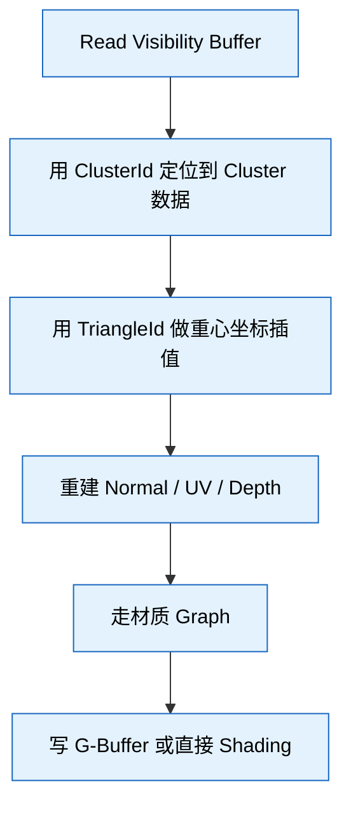
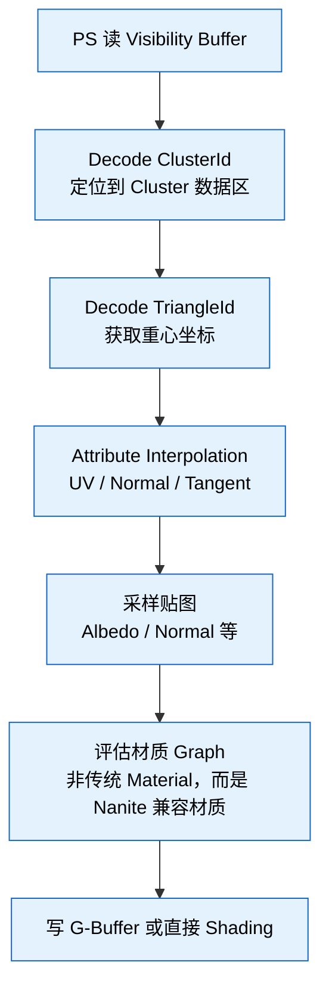
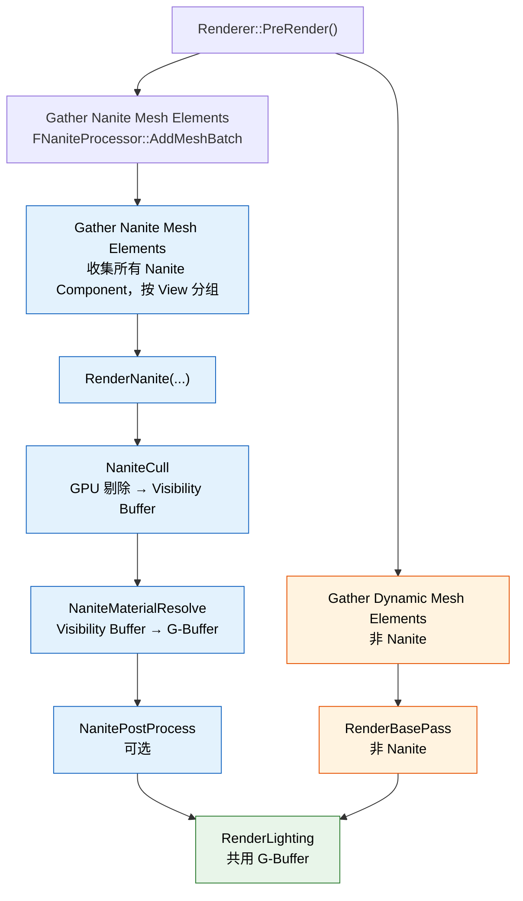
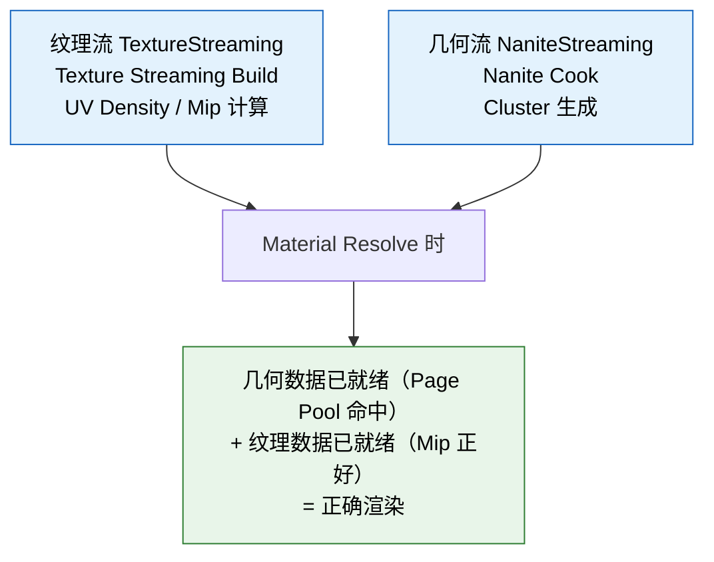

# Nanite 虚拟几何体系统 — UE 5.8 知识卡片

## 术语表

本文档中出现的 Nanite 特有术语：

| 术语 | 说明 |
|------|------|
| **Cluster** | 基本剔除 / 渲染单位，固定 128 个三角 |
| **Page** | 磁盘 / 显存传输单位，打包 1~N 个 Cluster |
| **Group** | LOD 选择逻辑单位，一个 Page 内的连续 Cluster 块 |
| **Visibility Buffer** | Nanite 替代传统 GBuffer 第一轮的核心数据结构，每像素存 ClusterId + TriangleId + Depth |
| **Material Resolve** | 从 Visibility Buffer 重建 G-Buffer 的第二遍绘制 |
| **Page Pool** | GPU 上驻留所有 Nanite 几何数据的环形缓冲区 |
| **Persistent LOD** | 每帧重新计算的 LOD 选择机制，非一次性选定 |

---

## 卡片 1：Nanite 核心架构 — Cluster / Page / Group 层级

Nanite 资产结构（从细到粗）：

- **Triangle（顶点）**
  - **Cluster（128 个三角 ≈ 一个 group 的原始粒度）**
    - **Page（N 个 Cluster，按空间 / 拓扑打包）**
      - **Group（一个 Page 内的连续 Cluster 块，用于 LOD 选择）**
        - **Component（实例化一个 Nanite 网格）**

**Cluster** — 基本剔除 / 渲染单位：
- 固定 128 个三角，预先计算好 **Persistent Cluster Culling** 数据（包围盒、法线锥、误差值等）
- 64 个顶点，索引用 **Group ID** 编码（非全局索引），支持局部索引缓冲
- 误差值（`Error`）决定该 Cluster 在哪个 LOD 层级可见

**Page** — 磁盘 / 显存传输单位：
- 打包 1~N 个 Cluster，大小约 128KB 对齐
- 每个 Page 对应磁盘上一个 `.nkp` 块（Nanite 专属压缩格式）
- 显存中 `PagePool` 以 Page 为粒度管理驻留

**Group** — LOD 选择逻辑单位：
- 一个 Page 可按空间连续性切成若干 Group
- Group 的 **Screen-Space Error (SSE)** 作为 LOD 决策依据
- 渲染时 Group 级别的 `Persistent LOD` 选择决定哪些 Cluster 进入剔除管线

**隐式 LOD 层级 — 无传统 LOD 0/1/2**：
- 无手工 LOD。原始的 Cluster 层级就是 LOD 0，Cluster 合并后形成 LOD 1+
- 合并算法：`Simplify` 在 Cook 阶段把 Cluster 合并为更大三角形，产生新 Cluster 层级
- 每个 Cluster 的 `Error` 值决定它何时被更高 LOD 的 Cluster 替换

---

## 卡片 2：Persistent Streaming LOD 选择机制

**核心思想**：每帧为每个 Nanite Component 在 CPU 上选一个 LOD 阈值，GPU 在此基础上做 Per-Cluster 精细剔除。

**CPU 端**（`NaniteStreaming.cpp` `FNaniteStreamingManager::UpdateLODs`）：

1. 计算每个 Component 的屏幕空间大小（Bounds x ViewProjection → 像素数）
2. 查预计算 LOD 层级表，获得该大小下的目标 Error 阈值
3. 选一个 Initial Group Index（LOD 层级）作为剔除起点
4. 把该层级信息写入 Constant Buffer，传 GPU

**GPU 端**（`NaniteCull.cpp`，CullKernel）：

1. 对该 Component 的每个 Cluster：
   - 计算 Cluster 的投影屏幕误差
   - 若误差 > 目标阈值 → 保留（需要更精细）
   - 若误差 < 目标阈值 → 跳过（用更高 LOD 的合并 Cluster 替代）
2. 硬件的 Persistent Thread Group 做 View-Frustum / Occlusion 剔除

**Persistent 的含义**：不是"一次性选完 LOD 层级就不管"——LOD 选择是 **每帧重新计算** 的，随相机距离、视野变化实时调整。

---

## 卡片 3：Visibility Buffer 工作原理

**Visibility Buffer 是 Nanite 替代传统 Deferred GBuffer 第一轮的核心数据结构**。

**传统流程**：

```
VS → 写 GBuffer (Albedo/Normal/Roughness/Metalness/Depth) → PS 读 GBuffer → Shading
```

**Nanite 流程**：

```
VS → 写 Visibility Buffer (Cluster ID + Triangle ID + Depth) → 第二遍 PS → 读 Visibility Buffer → 重建 G-Buffer → Shading
```

**Visibility Buffer 结构**：
- 每个像素存一个 **64-bit** 值：
  - `ClusterId`（32-bit）— 命中哪个 Cluster
  - `TriangleId`（32-bit）— 命中哪个三角形（准确重心坐标）
  - Depth 通过 `TriangleId` + 重心坐标在第二遍重建

**为什么多此一举**：

1. Nanite 的 VS 输出是 **Cluster 粒度**，不是 Mesh 粒度——每个顶点可能属于不同的 Cluster 组
2. **Visibility Buffer 解耦"可见性判定"与"材质计算"**：第一遍只关心谁可见，第二遍才读材质贴图
3. **Overdraw 消除**：第一遍用 `Early Z` 筛掉被遮挡的 Cluster，第二遍对每个可见像素恰好算一次

**第二遍（Material Resolve）**：



---

## 卡片 4：渲染流程 — VS 与 PS 处理

### VS 阶段（`NaniteRendering.cpp` `FNaniteVS`）

Nanite 的 VS **不是传统 VS**：

1. 解压顶点位置（量化的 16-bit → Float）
2. 做 DecodePosition（Cluster-local 偏移 → World Space）
3. 做 View-Projection 变换
4. 输出 SV_Position + 顶点属性（UV, Normal 等，压缩传递）

关键：**VS 不处理每个独立 Mesh——它处理的是 Cluster 批**。一个 DrawCall 可能对应上百个 Cluster，VS 通过 `SV_VertexID` 映射到具体 Cluster 内的顶点。

### PS 阶段

**Phase 1 — Visibility Buffer 写入**：

PS 几乎不做任何事：

```
PSOut.Visibility = Encode(ClusterId, TriangleId, Depth)
```

这也是为什么 Nanite 的 PS 在 Phase 1 极快——它不读贴图、不评估材质。

**Phase 2 — Material Resolve**：



---

## 卡片 5：Nanite 与 Deferred Shading 的混合

**Nanite 不完全替代 Deferred Shading——它替代的是 BasePass 的角色**。

传统 Deferred：

```
BasePass → G-Buffer(A/N/R/M/Depth) → Lighting → PostProcess
```

Nanite Deferred：

```
BasePass(Nanite) → Visibility Buffer → Material Resolve → G-Buffer → Lighting → PostProcess
```

非 Nanite Mesh 走传统 BasePass，两者在一个 G-Buffer 里共存。

**混合策略**：

| 类型 | 走哪条路径 |
|------|-----------|
| Nanite 网格 | Visibility Buffer Path → Material Resolve → G-Buffer |
| 非 Nanite 网格 | 传统 BasePass → G-Buffer |
| 半透明 Nanite | 回退到传统路径（Nanite 不支持半透明） |
| 动态物体 | 可选 Nanite（通过 `r.Nanite.AllowMovingNanite`） |

**G-Buffer 共存**：Nanite 的 Material Resolve 写入与传统 BasePass 写入的 G-Buffer 格式完全一致——后续的 Lighting Pass 不分来源。

**关键点**：`r.Nanite.MaterialResolve` 控制 Material Resolve 采用的策略：
- `0` — 禁用，Nanite 物体不可见（debug）
- `1` — 标准 Material Resolve（默认）
- `2` — 逐像素 Resolve

---

## 卡片 6：Nanite 的 BasePass 替代

**`FNaniteProcessor` 替代了传统 `FMeshPassProcessor` 的 BasePass 角色**：



**Nanite 的 BasePass 替代不是"替换掉全部"——而是并行处理**：
- Nanite 物体走 Visibility Buffer 路径
- 非 Nanite 物体走传统 BasePass
- 两类物体的 G-Buffer 在同一个 RenderTarget 里合并

**`r.Nanite.VisibilityBuffer`**：控制是否启用 Visibility Buffer 路径（默认 1）。

---

## 卡片 7：流式加载 — Page Streaming 策略

**Nanite 的 Streaming 比传统纹理流更激进**，因为它面对的是**几何数据**（不是 2D 贴图）。

**Streaming 调度的触发条件**：

每帧：

1. `FNaniteStreamingManager::UpdateStreaming()`
2. 遍历所有可见 Nanite Component
3. 计算每个 Page 的"重要性"评分：
   - 距离相机近 → 高优先级
   - 在视锥内 → 中优先级
   - 即将进入视锥（预测）→ 低优先级
4. 按评分排序，选最高的 N 个 Page 发起异步加载请求
5. 加载完成后，把 Page 数据写入 GPU PagePool

**Page 加载源**：
- 磁盘（`.nkp` 文件，Cook 时生成）
- 已 cache 在系统内存（`FNaniteStreamingManager::RootPageCache`）
- 已驻留 GPU（不需要重新加载）

**优先级策略**：

| 优先级 | 说明 |
|--------|------|
| Critical | 当前帧必须可见的 Page（直接进视锥） |
| Required | 下一帧可能需要的 Page（近距 + 即将进入） |
| Prefetch | 远景、不在视野但可能出现的 Page |
| Idle | 尚未被请求 |

**`r.Nanite.Streaming.Async`**：异步加载（默认 1），设为 0 则同步加载（调试用）。

---

## 卡片 8：显存管理 — Page Pool

**Page Pool 是 GPU 上驻留所有 Nanite 几何数据的环形缓冲区**。

**结构**：GPU Page Pool（环形缓冲区，大小由 `r.Nanite.PagePoolSize` 控制）中，每个 Page 存放 Cluster 数据（顶点 / 索引 / 包围盒）。驱逐策略为最近最少使用（LRU）。被驱逐的 Page 如果还在系统内存 cache 中，下次加载更快；如果不在 cache 中，需要从磁盘重新加载。

**关键参数**：
- `r.Nanite.PagePoolSize` — Page Pool 大小（MB，默认 2048）
- `r.Nanite.MaxPageCount` — 最大 Page 数（默认 65536）
- `r.Nanite.Streaming.PageSize` — 每个 Page 的目标大小（KB，默认 128）

**显存压力的表现**：
- Page thrashing（频繁换入换出）→ 帧率抖动
- 降低 `r.Nanite.Streaming.PoolSize` → 更积极驱逐
- 降低 `r.Nanite.Streaming.ResolutionScale` → 降低分辨率减少压力

---

## 卡片 9：与纹理流的协调

Nanite 的几何 Streaming 与 UE 的纹理流（`FTexture2DStream`）是**两个独立的系统**，但有一个关键耦合点：**Material Resolve 阶段需要纹理数据**。

**协调机制**：



**潜在问题**：
- 几何已加载但纹理尚未加载 → 材质显示低 Mip（模糊）
- 纹理已加载但几何尚未加载 → 该物体不可见（几何缺失）
- 双重 thrashing 风险：几何和纹理争抢显存

**调优参数**：
- `r.Streaming.PoolSize` — 纹理池大小
- `r.Nanite.PagePoolSize` — 几何池大小
- **两者之和不能超过 GPU 显存**，否则两者都会 thrashing

---

## 卡片 10：性能调优 — Overdraw 优化

**Nanite 最大的性能优势之一就是 Overdraw 消除**。

**传统 VS PS 的 Overdraw**：

传统渲染中，每个像素可能被多个三角形写入。远处山 + 近处草 → 草覆盖山 → 山的像素白写。透明物体需要排序，每个像素写多次。Overdraw 率 1.5x ~ 5x 很常见。

**Nanite 的解决办法**：

1. **Visibility Buffer + Early Z**：第一遍 VS 写 Visibility Buffer 时，Early Z 自动丢弃被遮挡的 Cluster。越是后面的 Cluster，Early Z 越容易拒绝 → Overdraw 趋近于 1.0x
2. **Hierarchical Z Buffer (Hi-Z) 剔除**：Nanite 用 Hi-Z Map 做 Cluster 级遮挡剔除。一个 Cluster 被前面的物体完全遮挡 → 整个 Cluster 跳过 → 零像素消耗
3. **Persistent Thread Group 的光栅化优化**：一个 Thread Group 处理多个 Cluster 的 VS 输出，光栅化阶段自动合并相邻的微小三角形

**结果**：Nanite 可以处理比传统渲染高 10x~100x 的三角形数量，Overdraw 接近 1.0x。

---

## 卡片 11：常见性能瓶颈

| 瓶颈位置 | 症状 | 定位工具 | 调优方向 |
|----------|------|----------|----------|
| **GPU 剔除 (CullKernel)** | GPU 管线的 Compute 阶段耗时 | `r.Nanite.ShowStats` | `r.Nanite.Culling` 调整剔除策略 |
| **Material Resolve** | PS 阶段耗时，高分辨率下明显 | `GPU Profiler` / `ProfileGPU` | 降低材质复杂度，用 `r.Nanite.MaterialResolve` 调整 |
| **Page 加载** | 帧率突然卡顿（hitches） | `r.Nanite.Streaming.Log` | 增大 `r.Nanite.Streaming.PageSize`，预加载 |
| **Page Pool 不足** | 帧率抖动，纹理模糊 | `r.Nanite.PagePoolStats` | 增大 `r.Nanite.PagePoolSize` |
| **CPU 端 LOD 选择** | 大批量 Component 更新 | `stat Nanite` | 减少 Nanite Component 数量 |
| **显存带宽** | 高分辨率下 Material Resolve 瓶颈 | `GPU Visualizer` | 降低分辨率，简化材质 |
| **Hi-Z 构建** | 多 View 场景（分屏） | `r.Nanite.HiZB` | 减少分屏数量 |

**`r.Nanite.ShowStats`** 是调试 Nanite 性能的第一入口——输出 GPU 各阶段耗时。

---

## 卡片 12：关键配置参数 — `r.Nanite.*`

| 参数 | 默认值 | 说明 |
|------|--------|------|
| `r.Nanite.VisibilityBuffer` | 1 | 启用 Nanite Visibility Buffer 路径 |
| `r.Nanite.MaterialResolve` | 1 | Material Resolve 策略 (0=禁用, 1=标准) |
| `r.Nanite.Culling` | 1 | 启用 Nanite GPU 剔除 |
| `r.Nanite.Streaming` | 1 | 启用 Nanite 流式加载 |
| `r.Nanite.Streaming.Async` | 1 | 异步加载 Page |
| `r.Nanite.Streaming.PageSize` | 128 | Page 目标大小 (KB) |
| `r.Nanite.PagePoolSize` | 2048 | GPU Page Pool 大小 (MB) |
| `r.Nanite.MaxPageCount` | 65536 | 最大 Page 数 |
| `r.Nanite.HiZB` | 1 | 启用 Hierarchical Z-Buffer |
| `r.Nanite.AllowMovingNanite` | 1 | 允许动态物体走 Nanite |
| `r.Nanite.FrustumCulling` | 1 | 启用视锥剔除 |
| `r.Nanite.OcclusionCulling` | 1 | 启用遮挡剔除 |
| `r.Nanite.OverdrawVisualization` | 0 | Overdraw 可视化调试 |
| `r.Nanite.ShowStats` | 0 | 显示 Nanite 性能统计 |

---

## 卡片 13：定制与扩展 — 自定义 Nanite 材质

**Nanite 材质限制**：

| 支持 | 不支持 |
|------|--------|
| 基础材质节点（Albedo, Normal, Roughness, Metallic, Emissive, OpacityMask） | World Position Offset |
| 纹理采样（Texture Sample） | Pixel Depth Offset |
| 材质函数（Material Functions） | 半透明（Translucent） |
| 材质实例（Material Instances） | 自定义 UV 通道（仅 UV0） |
| 顶点颜色（Vertex Color） | 双面渲染（Two-Sided） |
| 分层材质（Landscape, Foliage） | 延迟着色（Decal, Light Function） |
| 静态开关参数 | 自定义 Lighting Model |

**自定义扩展路径**：

1. **材质 Graph 内做**：在 `Material Editor` 里用标准节点，Nanite 自动编译兼容版
2. **自定义 Shader 层**：`Engine/Shaders/Nanite/MaterialResolve.ush` 是 Material Resolve 的入口，可修改 resolve 逻辑
3. **Custom Node**：材质编辑器里插 `Custom` 节点，写入 HLSL，但必须符合 Nanite 约束

**`r.Nanite.MaterialOverride`**：调试用，替换所有 Nanite 材质为指定材质（用于定位性能问题）。

---

## 卡片 14：定制与扩展 — 自定义 Pass 交互

**Nanite 与自定义 Pass 的交互方式**：

**方式 1 — 读 Visibility Buffer**：

```cpp
// 在自定义 Pass 中访问 Nanite 的 Visibility Buffer
FRDGBufferRef VisibilityBuffer = GraphBuilder.RegisterExternalBuffer(
    View.NaniteVisibilityBuffer, TEXT("CustomNaniteVisibility"));

// 在 Shader 中读取
// uint2 VisData = VisibilityBuffer[PixelIndex];
// uint ClusterId = VisData.x;
// uint TriangleId = VisData.y;
```

**方式 2 — 读 Nanite G-Buffer**：
- Nanite 的 Material Resolve 写入标准 G-Buffer
- 自定义 Pass 读 G-Buffer 时，Nanite 物体与非 Nanite 物体无区别

**方式 3 — 自定义 Nanite 剔除回调**：

```cpp
// 通过 Nanite::FProcessor 的 AddCallback 注册自定义剔除处理
// 在 Nanite 剔除管道中插入自定义 Compute Shader
```

**方式 4 — 使用 Nanite 渲染结果**：
- `NaniteRendering.cpp` 的 `RenderNanite()` 函数是整个入口
- 可在 `RenderNanite` 之前或之后插入自定义 Pass
- 通过 `FViewInfo` 的 `NaniteResources` 访问 Nanite 数据

---

## 卡片 15：已知限制

| 限制 | 原因 | 影响范围 | 工作区 |
|------|------|----------|--------|
| **不支持半透明** | Visibility Buffer 第一遍无法处理半透明排序 | 玻璃、水、UI 等 | 半透明物体回退到传统路径 |
| **不支持 World Position Offset** | Nanite 的 Cluster 预计算包围盒 / 剔除数据不随 WPO 变化 | 动画特效、植被弯曲 | 需要 WPO 的物体禁用 Nanite |
| **不支持 Custom UV** | Cluster 顶点格式固定，仅 UV0 | 需要多 UV 的材质（如 lightmap） | 材质层扩展受限 |
| **不支持 Decal 接收** | Decal 读 G-Buffer，但 Nanite 物体在 Resolve 前不在 G-Buffer | Decal 不覆盖 Nanite 物体 | 用材质层模拟 decal |
| **不支持 Nanite 实例化骨骼网格** | 非静态骨骼，Cluster 绑定在静态 LOD 层级 | 角色、动画物体 | 骨骼网格走传统渲染 |
| **不支持 Ray Tracing 的 Nanite 加速** | 需 Fallback 到传统几何 | RTX 场景 | 参考 `r.RayTracing.Nanite` |
| **不支持 Split Depth** | 与 VR 立体渲染的深度分裂冲突 | VR 项目 | 关闭 Nanite 或禁用 Split Depth |
| **不支持 Instance Culling 中剔除** | 非 Nanite 的 Instance Culling 与 Nanite 管线的交互不完整 | 大量实例化物体 | 用 Nanite 的 Component 实例化 |

---

## 卡片 16：关键源码文件索引

| 文件路径 | 核心职责 |
|----------|----------|
| `Engine/Source/Runtime/Engine/Public/NaniteDefinitions.h` | Nanite 数据结构定义（Cluster, Page, Group 等） |
| `Engine/Source/Runtime/Renderer/Private/Nanite/NaniteRendering.cpp` | Nanite 渲染主入口，`RenderNanite()` 函数，VS/PS 配置 |
| `Engine/Source/Runtime/Renderer/Private/Nanite/NaniteStreaming.cpp` | `FNaniteStreamingManager`，Page 加载/卸载/LOD 选择 |
| `Engine/Source/Runtime/Renderer/Private/Nanite/NaniteCull.cpp` | GPU 剔除 Kernel（视锥/遮挡/Hi-Z） |
| `Engine/Source/Runtime/Renderer/Private/Nanite/NaniteVisualize.cpp` | 可视化调试工具（Overdraw/LOD/Page 驻留） |
| `Engine/Source/Runtime/Renderer/Private/Nanite/NaniteMaterialResolve.cpp` | Visibility Buffer → G-Buffer 的 Material Resolve |
| `Engine/Source/Runtime/Renderer/Private/Nanite/NaniteCluster.cpp` | Cluster 创建/合并/压缩逻辑 |
| `Engine/Shaders/Nanite/NaniteCull.usf` | GPU 剔除的 Compute Shader |
| `Engine/Shaders/Nanite/NaniteMaterialResolve.ush` | Material Resolve 的 Shader 入口 |
| `Engine/Shaders/Nanite/NaniteVS.usf` | Nanite 的 Vertex Shader |
| `Engine/Shaders/Nanite/NanitePS.usf` | Nanite 的 Pixel Shader（Visibility Buffer 写入） |
| `Engine/Source/Runtime/Renderer/Private/Nanite/NaniteClusterCull.usf` | Cluster 级剔除的 Shader 变体 |
| `Engine/Source/Programs/NaniteCook/NaniteCook.cpp` | 离线 Cook 工具（Cluster 生成/压缩） |
| `Engine/Source/Runtime/Engine/Private/Nanite/NaniteResources.cpp` | 资源加载/序列化 |

**调试入口**：
- `r.Nanite.ShowStats 1` — 实时显示 Nanite 各阶段耗时
- `r.Nanite.Visualize 1` — 可视化 Nanite 剔除结果
- `r.Nanite.Streaming.Log 1` — 流式加载日志
- `r.Nanite.PagePoolLog 1` — Page Pool 状态日志

---

## 卡片 17：Nanite Cook 与构建管线

**Nanite 资产的构建流程**：

Static Mesh 源 → Nanite Cook（UE Cooker）→ 输出：

- `.ubulk`（Nanite Bulk Data）：Cluster 顶点 / 索引数据
- `.uptnl`（Nanite 可选数据）：预计算剔除数据
- `.nkp`（Nanite Page 数据）：按 Page 打包的 Cluster 压缩数据

**Cook 关键步骤**：

1. **Simplify** — 化简原始网格，生成 Cluster 层级
2. **Cluster 生成** — 128 三角一组，计算包围盒 / 法线锥 / 误差
3. **Page 打包** — 按空间局部性把 Cluster 打包进 Page
4. **压缩** — 顶点位置用 16-bit 量化，索引用 Group ID 编码
5. **LOD 层级表生成** — 预计算每个 SSE 阈值的 Cluster 可见性

**`r.Nanite.Cook.ForceSingle`**：强制单线程 Cook（调试用）。

---

## 卡片 18：Project Settings 中 Nanite 相关配置

| 设置路径 | 选项 | 默认值 |
|----------|------|--------|
| `Project Settings > Rendering > Nanite` | 启用 Nanite | True |
| | Adaptive Level of Detail | True |
| | Allow Async Compute | True |
| | Percentage of Triangles Allowed | 100% |
| `Mesh Settings > Nanite` | 启用 Nanite | True（可 per-mesh 关闭） |
| | Fallback LOD Mode | 回退到传统 LOD |
| | Position Precision | 16-bit / 32-bit |

**最佳实践**：
- 静态建筑 / 环境 → 全部启用 Nanite
- 角色 / 动画物体 → 走传统骨骼网格
- 植被 → 启用 Nanite（Foliage 有特别优化路径）
- 半透明 / Decal → 关闭 Nanite

---

以上知识卡片覆盖了 UE 5.8 Nanite 虚拟几何体系统的核心架构、渲染流程、流式加载、性能调优、定制扩展和关键源码文件。如需深入某个具体主题的详细分析，请告知。