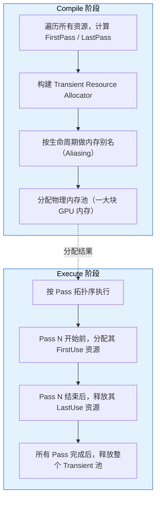
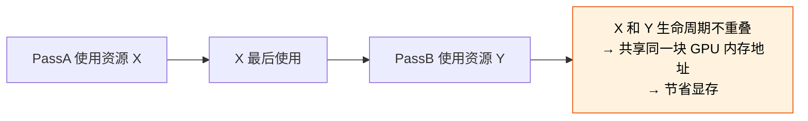
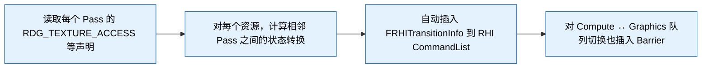
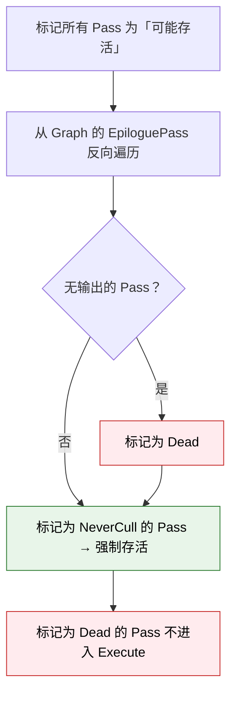
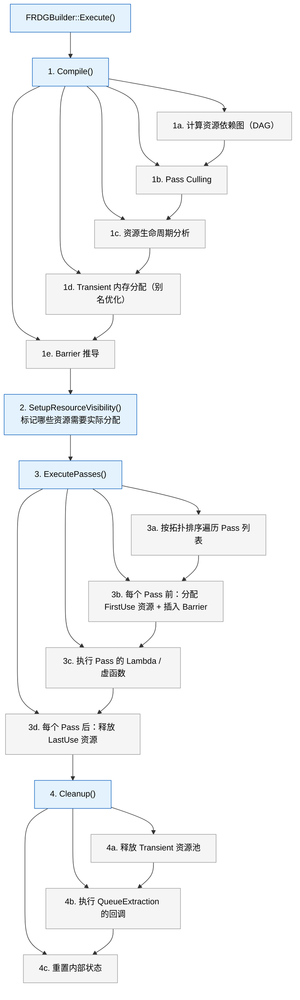
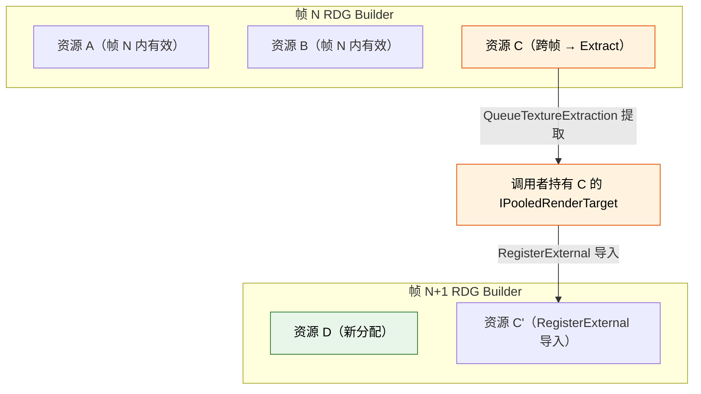
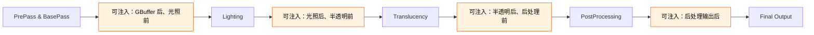

# UE 5.8 Render Graph (RDG) 知识卡片

## 术语说明

| 术语 | 说明 |
|------|------|
| Transient 资源 | 仅在一次 RDG Execution 内有效的临时资源，由 RDG 自动分配和回收 |
| Barrier | GPU 资源状态转换屏障，保证读写顺序正确 |
| Pass Culling | 编译阶段剔除无下游消费者的 Pass，减少无效 GPU 工作 |
| 资源别名（Aliasing） | 生命周期不重叠的多个 Transient 资源共享同一块 GPU 物理内存 |

---

## 1. RDG 核心概念

### FRDGBuilder 生命周期

```cpp
FRDGBuilder GraphBuilder(RHICmdList);   // 创建：绑定 RHI CommandList
// ... 注册 Pass、声明资源 ...
GraphBuilder.Execute();                   // 执行：编译 → 分配 → 调度 → 清理
// 析构时自动销毁所有 Transient 资源
```

**三阶段模型：**

| 阶段 | 行为 | 可做什么 |
|------|------|----------|
| **Setup**（构造后） | 仅注册 Pass 和资源声明，不分配 GPU 内存 | `CreateTexture` / `AddPass` / `RDG_TEXTURE_ACCESS` |
| **Compile**（Execute 入口） | 推导资源生命周期、裁剪无用 Pass、计算内存别名 | 不可干预 |
| **Execute**（Compile 后） | 分配 Transient 资源、按拓扑序执行 Pass、插入 Barrier、释放资源 | 只读访问已注册 Pass 的结果 |

### Pass 注册方式

**Lambda Pass（最常用，轻量）：**

```cpp
GraphBuilder.AddPass(
    RDG_EVENT_NAME("MyPass"),
    Inputs,
    ERDGPassFlags::Raster | ERDGPassFlags::NeverCull,
    [&](FRHICommandList& RHICmdList)
    {
        // 实际渲染指令
    });
```

**无参数 Pass（不依赖任何 RDG 资源）：**

```cpp
GraphBuilder.AddPass(
    RDG_EVENT_NAME("MyGlobalPass"),
    ERDGPassFlags::None,
    [](FRHICommandList& RHICmdList)
    {
        // 无 RDG 资源依赖的纯 RHI 操作
    });
```

**Dispatch Pass（并行录制多条 CommandList）：**

```cpp
GraphBuilder.AddDispatchPass(
    RDG_EVENT_NAME("MyDispatchPass"),
    Parameters,
    ERDGPassFlags::Compute,
    [](FRDGDispatchPassBuilder& Builder)
    {
        // 创建 CommandList 并录制命令
        FRHICommandList* CmdList = Builder.CreateCommandList();
        // ... 录制渲染命令 ...
        // 每个 CommandList 需要调用 FinishRecording()
    });
```

### 资源创建与注册（FRDGBuilder 成员函数）

| 函数 | 语义 | 生命周期 |
|------|--------|----------|
| `GraphBuilder.CreateTexture(Desc, Name, Flags)` | 创建 Transient Texture | 仅在此 RDG Execution 内有效 |
| `GraphBuilder.CreateBuffer(Desc, Name, Flags)` | 创建 Transient Buffer | 同上 |
| `GraphBuilder.RegisterExternalTexture(PooledRT, Name, Flags)` | 导入外部已有 Texture | 调用者管理生命周期 |
| `GraphBuilder.RegisterExternalBuffer(PooledBuffer, Name, Flags)` | 导入外部已有 Buffer | 同上 |

### 资源使用声明

每个 Pass 的参数结构体通过 `RDG_TEXTURE_ACCESS` / `RDG_BUFFER_ACCESS` 等宏声明资源的使用方式，RDG 据此推导 Barrier：

```cpp
BEGIN_SHADER_PARAMETER_STRUCT(FMyPassParameters, )
    RDG_TEXTURE_ACCESS(MyInput,  ERHIAccess::SRVGraphics)   // 只读输入
    RDG_TEXTURE_ACCESS(MyOutput, ERHIAccess::UAVGraphics)   // 可写输出
    RDG_BUFFER_ACCESS(MyBuffer,  ERHIAccess::IndirectArgs)  // Indirect 参数
    RDG_EVENT_SCOPE(EventScope)                              // GPU Profile 域
END_SHADER_PARAMETER_STRUCT()
```

### 资源生命周期推导机制

RDG 在 Compile 阶段对每个资源执行：

1. **首次使用** —— 资源创建（或从外部导入）
2. **最后使用** —— 资源可回收 / 销毁
3. **使用区间推导** —— 遍历所有 Pass 的依赖图，计算每个资源的 `FirstPass` 和 `LastPass`
4. **内存分配** —— Transient 资源共享同一块物理内存池，时间不重叠的别名资源复用同一块

---

## 2. Pass 类型

### Pass 类体系（5.8）

```
FRDGPass（基类）
├── TRDGLambdaPass<ParameterStructType, ExecuteLambdaType>  // Lambda Pass（最常用）
├── TRDGEmptyLambdaPass<ExecuteLambdaType>                   // 无参数 Pass
├── FRDGDispatchPass                                        // Dispatch Pass
│   └── TRDGDispatchPass<ParameterStructType, LaunchLambdaType>
└── FRDGSentinelPass                                        // Prologue / Epilogue Pass（框架内部）
```

UE 5.8 不再提供 `FRDGPipelineStatePass`、`FRDGAsyncComputePass`、`FRDGPostProcessPass` 等具名 Pass 基类。所有用户自定义 Pass 通过 `AddPass` / `AddDispatchPass` 模板函数以 Lambda 形式注册。

### Lambda Pass 的 RHI CommandList 类型

Lambda 参数类型决定 Pass 执行模式：

| Lambda 参数类型 | TaskMode | 执行方式 |
|----------------|----------|----------|
| `FRHICommandListImmediate&` | `Inline` | 渲染线程内联执行（默认） |
| `FRHICommandList&` | `Await` | 并行 Task 执行，Execute 末尾 await |
| `FRDGAsyncTask, FRHICommandList&` | `Async` | 并行 Task 执行，手动 await |

### Lambda Pass vs Dispatch Pass

| 维度 | Lambda Pass | Dispatch Pass |
|------|-------------|--------------|
| API | `AddPass` | `AddDispatchPass` |
| Lambda 参数 | `FRHICommandList&` | `FRDGDispatchPassBuilder&` |
| CommandList 数 | 单条 | 多条（`CreateCommandList` 创建） |
| 适用场景 | 通用 Pass | 并行录制多个 CommandList |
| 执行模式 | Inline / Await / Async | Async（框架内部管理） |

### ERDGPassFlags 完整列表

| Flag | 语义 |
|------|------|
| `None` | 无跟踪输入输出（仅参数缺失的 `AddPass`） |
| `Raster` | Graphics 管线上的光栅化 Pass |
| `Compute` | Graphics 管线上的 Compute Pass |
| `AsyncCompute` | 异步计算队列上的 Compute Pass |
| `Copy` | Graphics 管线上的 Copy Pass |
| `NeverCull` | 禁止裁剪（有副作用的 Pass 必须加） |
| `SkipRenderPass` | 跳过 RHI RenderPass begin/end，仅 `Raster` 可用 |
| `NeverMerge` | 禁止 RenderPass 合并 |
| `NeverParallel` | 强制在渲染线程执行，不进并行 Task |
| `Readback` | `Copy \| NeverCull`，用于回读到 Staging 资源 |

---

## 3. 资源管理细节

### 外部资源导入

```cpp
// 步骤 1: 注册外部资源
FRDGTextureRef ExternalRDG = GraphBuilder.RegisterExternalTexture(
    ExternalPooledRT,
    TEXT("ExternalTexture"));

// 步骤 2: 在 Pass 参数中引用
// 步骤 3: Execute 结束后，外部资源回到调用者手中
// 调用者负责 Release / 复用
```

**关键规则：**
- `RegisterExternalTexture` 不获取所有权，RDG 不负责销毁
- 外部资源在整个 RDG Execution 期间回到原始状态
- 常用于跨帧传递（从上一帧的 RDG 输出导入当前帧）

### Transient 资源的分配与回收



### 跨 RDG Execution 的持久化资源传递

```cpp
// 帧 N: 输出需要跨帧保留的资源
FRDGTextureRef Output = GraphBuilder.CreateTexture(Desc, TEXT("Persistent"));
// ... 在 Pass 中写入 Output ...
GraphBuilder.QueueTextureExtraction(Output, &OutExtractedTextureRef);
// Execute 后，OutExtractedTextureRef 持有 IPooledRenderTarget

// 帧 N+1: 导入上一帧保留的资源
FRDGTextureRef PrevFrameInput = GraphBuilder.RegisterExternalTexture(
    OutExtractedTextureRef, TEXT("PrevFrameInput"));
```

**`QueueTextureExtraction` / `QueueBufferExtraction`** 是跨帧传递的唯一通道。提取出的资源从 Transient 池迁移到调用者管理的生命周期。

### 资源别名（Aliasing）的内存复用

RDG 的 Transient Resource Allocator 的核心优化：生命周期不重叠的资源共享同一块 GPU 物理内存。



**实现：** `IRHITransientResourceAllocator` 在 Compile 阶段构建一个区间分配问题，求解最小内存峰值。一个分配块可以被多个资源的时间片复用。

### ERDGTextureFlags 完整列表

| Flag | 语义 |
|------|------|
| `None` | 默认 |
| `MultiFrame` | 标记跨帧存活（多 GPU 交替帧渲染） |
| `SkipTracking` | 跳过 RDG 状态跟踪，不自动插 Barrier（只读资源优化） |
| `ForceImmediateFirstBarrier` | 首次 Barrier 不做 split-transition，留在首次使用 Pass 前 |
| `MaintainCompression` | 阻止元数据解压缩 |

### ERDGBufferFlags 完整列表

| Flag | 语义 |
|------|------|
| `None` | 默认 |
| `MultiFrame` | 标记跨帧存活 |
| `SkipTracking` | 跳过 RDG 状态跟踪 |
| `ForceImmediateFirstBarrier` | 首次 Barrier 不做 split-transition |

---

## 4. Barrier 管理

### RDG 如何自动推导 Barrier



UE 5.8 RDG 使用 `FRDGTransitionInfo` 描述 Barrier 信息，在 Compile 阶段通过 `FRDGTransitionCreateQueue` 生成 `FRHITransition` 对象。Barrier 类型由 `ERHIAccess` 的 before/after 状态推导，不再使用 `ERHITransitionType::Translate` / `CrossQueue` 等旧枚举。

### 手动 Barrier 覆盖

```cpp
GraphBuilder.AddPass(
    RDG_EVENT_NAME("CustomPass"),
    Parameters,
    ERDGPassFlags::Raster | ERDGPassFlags::NeverCull,  // NeverCull 防止被裁剪
    [&](FRHICommandList& RHICmdList)
    {
        // 手动插入 Barrier 覆盖自动推导
        RHICmdList.Transition({
            FRHITransitionInfo(TextureRHI, ERHIAccess::Unknown, ERHIAccess::RTV)
        });
        // ... 自定义渲染 ...
    });
```

**`ERDGPassFlags::NeverCull` 的作用：**
- 防止 RDG 认为此 Pass 无输出而被裁剪
- 常用于有副作用的 Pass（写入外部资源、触发 Subpass 等）

### 跨 Pass Texture 状态转换

```
Pass 1: Write → RTV
    ↓ Barrier: RTV → SRVGraphics（自动）
Pass 2: Read  → SRVGraphics
    ↓ Barrier: SRVGraphics → UAVGraphics（自动）
Pass 3: Write → UAVGraphics
```

RDG 保证每个资源在 Pass 边界上的状态是确定的。如果一个资源被多个 Pass 以不同方式使用，RDG 在 Pass 之间插入正确的 Transition。

---

## 5. 裁剪与执行

### Pass Culling 机制



**裁剪条件：**
- Pass 的所有输出资源无下游消费者
- Pass 未标记 `NeverCull`
- 该 Pass 不是 Epilogue 的依赖

### Execute 阶段完整流程



### 多帧 RDG 资源生命周期管理



---

## 6. 自定义 Pass 注入实践

### 插入自定义 RDG Pass 的标准模式

```cpp
void AddMyCustomPass(FRDGBuilder& GraphBuilder, const FViewInfo& View, FRDGTextureRef Input)
{
    // 1. 声明参数结构
    BEGIN_SHADER_PARAMETER_STRUCT(FMyPassParameters, )
        RDG_TEXTURE_ACCESS(Input,  ERHIAccess::SRVGraphics)
        RDG_TEXTURE_ACCESS(Output, ERHIAccess::UAVGraphics)
        RDG_EVENT_SCOPE(EventScope)
    END_SHADER_PARAMETER_STRUCT()

    // 2. 创建输出资源
    FRDGTextureRef Output = GraphBuilder.CreateTexture(
        Input->Desc, TEXT("MyPassOutput"));

    // 3. 填充参数
    auto* Parameters = GraphBuilder.AllocParameters<FMyPassParameters>();
    Parameters->Input  = Input;
    Parameters->Output = Output;

    // 4. 注册 Pass
    GraphBuilder.AddPass(
        RDG_EVENT_NAME("MyCustomPass"),
        Parameters,
        ERDGPassFlags::Compute | ERDGPassFlags::NeverCull,
        [&](FRHICommandList& RHICmdList)
        {
            // 5. 绑定 Shader + Dispatch
            FMyShader::Dispatch(RHICmdList, View, Output);
        });
}
```

### 访问 Scene 数据

```cpp
// 在渲染函数中，通过 FSceneView / FViewInfo 获取：
const FViewInfo& View = *static_cast<const FViewInfo*>(InViews[0]);

// 访问 Scene：
FScene* Scene = View.Family->Scene;

// 访问 SceneTextures（5.8 替代 FSceneRenderTargets::Get()）：
FSceneTextures& SceneTextures = View.GetSceneTextures();

// 访问 View Uniform Buffer：
View.ViewUniformBuffer
```

### 常用 Hook 点

| Hook 点 | 源码位置 | 时机 | 可访问数据 |
|---------|---------|------|-----------|
| **GBuffer 之后** | `DeferredShadingRenderer.cpp` · `RenderBasePass` 后 | BasePass 刚完成 | GBuffer A/B/C/E、SceneDepth、PrePass |
| **PostProcessing 链** | `PostProcessing.cpp` · `AddPostProcessingPasses` | ToneMapping 前 | SceneColor、SeparateTranslucency、DistanceField 等 |
| **SSR 之后** | `ScreenSpaceReflections.cpp` | Reflections 完成后 | SSR 输出、SceneColor |
| **Translucency 之后** | `TranslucencyPass` 后 | 半透明渲染完成 | Translucency RT、SceneColor |
| **Lighting 之前** | `DeferredShadingRenderer.cpp` · `RenderLights` | 光照计算开始前 | GBuffer、Light Data |
| **自定义 Pass Hook** | `FPostProcessingInputs` 的 `OverrideOutput` | 可替换整个后处理链输出 | 所有后处理中间资源 |

**后处理链注入示例：**

```cpp
// 在 FPostProcessingInputs 初始化后注入
void AddCustomPostProcessPass(FRDGBuilder& GraphBuilder,
    const FPostProcessingInputs& Inputs)
{
    // 从 Inputs 中获取 SceneColor 等资源
    FRDGTextureRef SceneColor = Inputs.SceneColor;
    FRDGTextureRef SeparateTranslucency = Inputs.SeparateTranslucency;

    // 插入自定义 Pass
    AddMyCustomPass(GraphBuilder, *Inputs.View, SceneColor);
}
```

**场景渲染管线注入点：**



---

## 7. 5.8 新增 API

### AddSetupTask

在 Graph Compile 前启动并行 Task，不阻塞 Setup 阶段：

```cpp
GraphBuilder.AddSetupTask([&]()
{
    // 在并行 Task 中准备数据（如加载纹理、填充 Buffer）
    // 返回前保证数据就绪
});
```

支持指定 `ERDGSetupTaskWaitPoint`（`Compile` 或 `Execute`）控制同步时机，以及 `UE::Tasks::FPipe` 实现任务依赖。

### AddPassDependency

手动添加 Pass 间的依赖关系，用于精细控制 Async Compute 重叠：

```cpp
GraphBuilder.AddPassDependency(ProducerPass, ConsumerPass);
```

强制在 Producer 和 Consumer 之间插入同步点。

### SetPassWorkload

设置 Pass 的相对耗时，用于调度器优化并行执行：

```cpp
GraphBuilder.SetPassWorkload(Pass, WorkloadValue);
```

默认 Workload 为 1，推荐设为复杂 Draw / Dispatch 调用次数。

### FRDGBlackboard

Graph 生命周期内共享数据的黑板，通过 `FRDGBuilder::Blackboard` 访问：

```cpp
struct FMySharedData
{
    float SomeValue;
};

FMySharedData& Data = GraphBuilder.Blackboard.Create<FMySharedData>();
Data.SomeValue = 42.0f;

// 另一处读取
FMySharedData* Data = GraphBuilder.Blackboard.Find<FMySharedData>();
```

### FRDGResourceDumpContext

RDG 资源 dump 工具（`RDG_DUMP_RESOURCES` 启用时可用），用于调试时导出所有 RDG 资源的描述信息。

---

## 8. 关键源码文件

| 文件路径 | 内容 |
|----------|------|
| `Engine/Source/Runtime/RenderCore/Public/RenderGraphBuilder.h` | `FRDGBuilder` 主类：`AddPass`、`CreateTexture`、`Execute`、`QueueTextureExtraction`、`AddDispatchPass`、`AddSetupTask`、`AddPassDependency`、`SetPassWorkload` |
| `Engine/Source/Runtime/RenderCore/Public/RenderGraphResources.h` | `FRDGTextureRef`、`FRDGBufferRef`、`FRDGResource`、资源描述符、`ERDGTextureFlags`、`ERDGBufferFlags` |
| `Engine/Source/Runtime/RenderCore/Public/RenderGraphPass.h` | `FRDGPass`、`TRDGLambdaPass`、`FRDGDispatchPass`、`FRDGDispatchPassBuilder`、`ERDGPassFlags`、`ERDGPassTaskMode` |
| `Engine/Source/Runtime/RenderCore/Public/RenderGraphUtils.h` | 工具函数：`AddCopyTexturePass`、`AddClearUAVPass`、`FComputeShaderUtils::AddPass`、`AddReadbackTexturePass`、`FRDGExternalAccessQueue` |
| `Engine/Source/Runtime/RenderCore/Public/RenderGraphDefinitions.h` | `ERDGPassFlags`、`ERDGBufferFlags`、`ERDGTextureFlags`、`ERDGBuilderFlags`、`FRDGBlackboard` 前向声明 |
| `Engine/Source/Runtime/RenderCore/Public/RenderGraphBlackboard.h` | `FRDGBlackboard` 实现 |
| `Engine/Source/Runtime/RenderCore/Private/RenderGraph.cpp` | `FRDGBuilder::Execute`、Compile + Culling 实现 |
| `Engine/Source/Runtime/RenderCore/Private/RenderGraphAllocator.cpp` | Transient 资源分配器、别名优化 |
| `Engine/Source/Runtime/RenderCore/Private/RenderGraphValidation.cpp` | Debug 验证（`-rdgimmediate` 资源泄漏检测） |
| `Engine/Source/Runtime/Renderer/Private/PostProcessing/PostProcessing.cpp` | 后处理链 RDG 实现，`AddPostProcessingPasses` 入口 |
| `Engine/Source/Runtime/Renderer/Private/DeferredShadingRenderer.cpp` | `FDeferredShadingRenderer::Render` 完整渲染管线 |
| `Engine/Source/Runtime/Renderer/Private/SceneRendering.cpp` | `FRDGBuilder` 创建位置、`RenderGraph` 初始化 |
| `Engine/Source/Runtime/RHI/Public/RHICommandList.h` | `FRHICommandList`、`Transition` 等底层 Barrier |
| `Engine/Source/Runtime/RenderCore/Public/ShaderParameterMacros.h` | `BEGIN_SHADER_PARAMETER_STRUCT`、`RDG_TEXTURE_ACCESS` 等宏定义 |

### 推荐阅读顺序

1. `RenderGraphBuilder.h` —— 先读懂 `FRDGBuilder` 的公开 API
2. `RenderGraphResources.h` —— 理解资源描述符和生命周期
3. `RenderGraphPass.h` —— 了解 Pass 类型体系
4. `RenderGraphUtils.h` —— 常用工具函数
5. `PostProcessing.cpp` —— 看后处理链如何用 RDG 组合
6. `DeferredShadingRenderer.cpp` —— 看完整渲染管线如何编排 RDG
7. `RenderGraph.cpp` —— 深入 Compile / Execute 实现

---

## 附录：常见陷阱

| 陷阱 | 后果 | 修法 |
|------|------|------|
| 忘记 `RDG_EVENT_SCOPE` | GPU Profile 看不到此 Pass 耗时 | 每个 Pass 参数结构加 `RDG_EVENT_SCOPE` |
| 未声明 `NeverCull` 的副作用 Pass 被裁剪 | Pass 静默不执行 | 确认是否需要 `NeverCull` |
| 跨帧直接持有 `FRDGTextureRef` | 下一帧引用悬挂 | 用 `QueueTextureExtraction` 提取 + `RegisterExternalTexture` 导入 |
| Lambda 内捕获 `FRDGTextureRef` 而非 `FRHITexture*` | Execute 阶段访问已释放的 Transient 资源 | Lambda 内用 `GetRHI()` 获取 `FRHITexture*` |
| 在 `Execute` 之后调用 `CreateTexture` | 崩溃（Graph 已锁定） | 所有资源声明必须在 `Execute` 之前完成 |
| 多个 Pass 写入同一资源不加 UAV Barrier | 数据竞争、不可预测结果 | 使用 `ERDGPassFlags::NeverCull` 手动管理或依赖自动推导 |
| 用 `FRHICommandListImmediate&` 作为 Lambda 参数导致无法并行 | 强制 Inline 执行，失去并行加速 | 无 `Immediate` 需求时用 `FRHICommandList&` 或加 `FRDGAsyncTask` |
| 混淆 `RDG_GPU_MASK_SCOPE` 与旧宏 `RDG_GPU_MASK` | 编译错误 | 5.8 使用 `RDG_GPU_MASK_SCOPE(GraphBuilder, GPUMask)` |
| `FSceneRenderTargets::Get()` 编译报错 | 5.8 已移除旧 API | 改用 `View.GetSceneTextures()` 获取 `FSceneTextures` 引用 |
