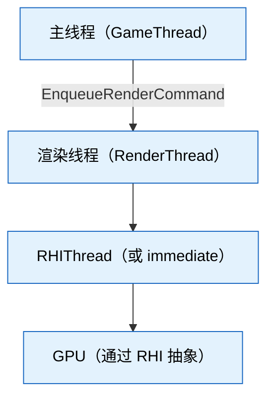
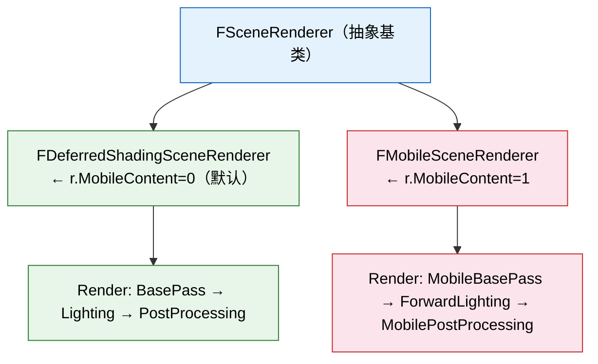
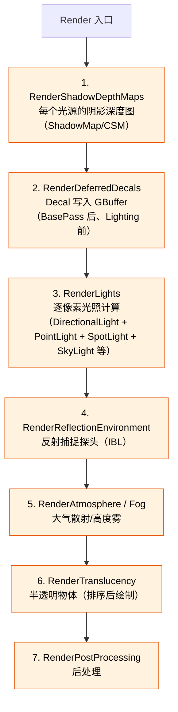
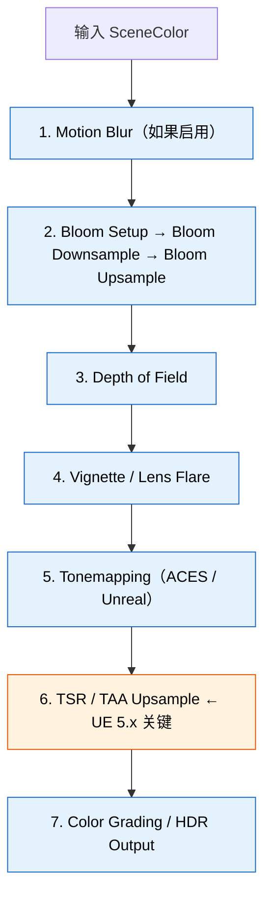
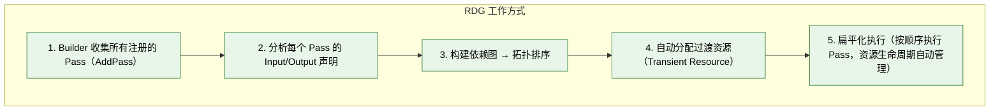
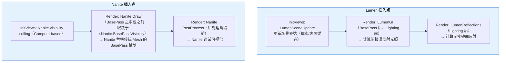

# UE 5.8 渲染管线架构 — 知识卡片

---

## 一、渲染线程架构

### 1. 三级流水线（Main → Render → RHI）

**概念名**：`3-Tier Rendering Pipeline`

**一句话定义**：UE 将一帧的渲染工作分散到三个线程，每一级生产下一级消费的 command batch，流水线并行。

**关键源码/类名**：
- `FRenderThread` — 启动于 `StartRenderingThread()`（`RenderingThread.cpp`）
- `RHI Thread` — 启动于 `RHIInit()`（`RHICommandList.cpp`）
- `FGraphEventRef` — Render → RHI 同步的原语
- `FRenderCommandFence` — 主线程等渲染线程完成

**关系**：



- 主线程：Gameplay tick、生成 `FSceneView`、`FSceneViewState`、调用 `FSceneRenderer::Draw` 入口
- 渲染线程：执行 `FSceneRenderer::Render`，构建 RDG，提交 RHI commands
- RHI 线程：从 `FRHICommandList` 中 pop 已烘焙的 command，转换为底层 API 调用

**常见坑**：
- 若 `r.RHIThread.Enable` 为 0，RHI 命令在渲染线程直接执行（immediate mode），排查同步问题时先确认这个 cvar。
- `FRenderCommandFence::Wait()` 会在主线程阻塞，不能频繁调用；`ENQUEUE_RENDER_COMMAND` 的 lambda 内不能持有主线程同步对象（死锁风险）。
- 渲染线程 crash 时常用 `r.RenderThread.Suspend` 冻结后 attach 调试器，或在 `RenderThread.cpp` 的 `FRenderingThread` 函数设断点。

---

### 2. FSceneRenderer 的 Tick 流程

**概念名**：`SceneRenderer Tick`

**一句话定义**：`FSceneRenderer::Draw` 是每帧渲染线程的入口，内部按固定顺序调用 PreRender → InitViews → Render → PostRender → ComputeAndMarkRelevantGPUQueries。

**关键源码/类名**：
- `FSceneRenderer::Draw` — `SceneRendering.cpp:Draw`
- `FSceneRenderer::PreRender` — `SceneRendering.cpp`
- `FSceneRenderer::InitViews` — `SceneVisibility.cpp`
- `FSceneRenderer::Render` — 虚函数，由子类实现
- `FSceneRenderer::PostRender` — `SceneRendering.cpp`
- `FSceneRenderer::ComputeAndMarkRelevantGPUQueries` — `SceneRendering.cpp`

**关系**：


**常见坑**：
- `PreRender` 里 `FScene::UpdateAllPrimitiveSceneInfos` 是 Primitive 增删改的延迟更新点。如果自定义 `FSceneRenderer` 子类跳过 `PreRender`，Primitive 变更不生效。
- `InitViews` 是渲染管线中 CPU 最重的阶段之一（可见性排序 + shadow map 分配），`r.ShadowQuality` 和 `r.ViewDistanceScale` 直接影响其耗时。
- 不要假设 `Render` 函数内访问 `FScene` 的 Primitive 列表是安全的——`InitViews` 已经做了可见性过滤，应使用 `FPrimitiveSceneInfo` 的 `Visible` 标记。

---

### 3. Deferred vs Mobile 分支

**概念名**：`Renderer Branch`

**一句话定义**：`FSceneRenderer::Render` 有两个主要子类实现，`FDeferredShadingSceneRenderer` 走延迟着色管线，`FMobileSceneRenderer` 走移动端前向着色管线。

**关键源码/类名**：
- `FDeferredShadingSceneRenderer::Render` — `DeferredShadingRenderer.cpp`
- `FMobileSceneRenderer::Render` — `MobileShadingRenderer.cpp`
- `FSceneRenderer::CreateSceneRenderer` — 工厂函数，根据 `r.MobileContent` 和 `ShaderPlatform` 选择分支

**关系**：



**常见坑**：
- 不是所有 Pass 都走分支——`InitViews` 在基类 `FSceneRenderer` 中，Deferred 和 Mobile 共享可见性计算。
- 自定义渲染功能若只改 `DeferredShadingRenderer.cpp`，移动端不生效；反之亦然。
- 新增渲染 Feature 时，确认 Feature Level（`ERHIFeatureLevel::SM5 / ES3_1`）判定是否在 `FSceneRenderer` 基类级做分支切换。

---

### 4. 渲染线程同步机制

**概念名**：`Render Sync Primitives`

**一句话定义**：UE 提供三种同步原语让主线程与渲染线程协同，按需选择阻塞/异步/延续。

**关键源码/类名**：
- `FRenderCommandFence` — `RenderingThread.h`
- `FGraphEventRef` — `Engine/Source/Runtime/Core/Public/Async/AsyncWork.h`
- `ENQUEUE_RENDER_COMMAND(Type)` — `RenderingThread.h`
- `FFrameNumber` + `FRHICommandListImmediate::Flush` — 低层级冲刷

**关系**：

| 同步方式 | 行为 | 适用场景 |
|---|---|---|
| `FRenderCommandFence::Wait()` | 主线程阻塞，直到 fence 之前所有渲染命令执行完毕 | 资源必须在渲染线程释放后才能安全销毁（如 `FRenderResource`） |
| `FGraphEventRef` + CompletionList | 非阻塞等待：主线程可继续执行，通过事件回调获知渲染线程完成 | 异步加载等不急需结果的场景 |
| `ENQUEUE_RENDER_COMMAND` | 异步提交，不等待 | 最常用模式，主线程将数据传给渲染线程 |

**常见坑**：
- `ENQUEUE_RENDER_COMMAND` 的 lambda **必须捕获 `FScene*` 或 `FRHIResource*` 的 shared ref**，不能裸指针 capture 后主线程释放了对象——渲染线程执行时读到 dangling pointer crash。
- `FRenderCommandFence` 调用太频繁（每帧多次）会严重降低主线程吞吐量，因为它强制了主→渲染线程的同步点。
- 调试时用 `r.RenderThread.Suspend=1` 和 `r.RHIThread.Enable=0` 可以让所有工作在渲染线程同步执行，简化 crash 排查。

---

## 二、核心渲染流程（Deferred Renderer）

### 5. InitViews — 可见性计算

**概念名**：`Visibility Culling`

**一句话定义**：`InitViews` 对场景中所有 Primitive 做视锥体裁剪、遮挡查询（Occlusion Culling）和移动性分类，产出 `FVisibleSceneView` 的 Primitive 可见数据。

**关键源码/类名**：
- `FSceneRenderer::InitViews` — `SceneVisibility.cpp`
- `FSceneRenderer::InitViewsForShadowView` — `SceneVisibility.cpp`（阴影专用视口）
- `FRelevancePacket` — `SceneVisibility.cpp` 内，并行处理 Primitive 相关性
- `FViewInfo::VisiblePrimitives` — 每 view 的可见 Primitive 位图
- `FSceneRenderer::ComputeAndMarkRelevanceForViewParallel` — 并行相关性计算

**关系**：InitViews 内部的子步骤（按顺序）：
1. 更新 Primitive 场景信息（`UpdateAllPrimitiveSceneInfos`）
2. 并行相关性计算（Relevance）—— 每个 Primitive 被哪些 view 可见？
3. 遮挡查询提交（Occlusion）—— 提交上一帧的遮挡查询结果
4. 阴影投影计算—— 决定哪些光源需要 shadow map，以及 map 分辨率
5. Lumen Scene 更新—— 把可见 Primitive 加入 Lumen 场景表示
6. 视口可见性后处理—— 编辑器 gizmo、调试可视化叠加

**常见坑**：
- `InitViews` 的耗时中，Primitive 数越多越慢（O(N^2) 的 worst-case 存在于 Parallel Relevance）。`r.MaxVisiblePrimitives` 可以限制，但会引入可见性漏。
- 自定义 Primitive 类型若未正确实现 `GetViewRelevance`，可能被错误裁剪或永远可见。
- 遮挡查询是异步的：当前帧提交的查询，结果在下一帧的 `InitViews` 才可用，第一帧所有物体视为可见。

---

### 6. BasePass — GBuffer 写入

**概念名**：`BasePass / GBuffer`

**一句话定义**：BasePass 将场景中所有可见的不透明 Mesh 绘制到多张 RT（GBuffer），记录 Albedo/Normal/Metallic/Roughness/Subsurface 等材质属性，供后续光照 Pass 消费。

**关键源码/类名**：
- `FDeferredShadingSceneRenderer::RenderBasePass` — `BasePassRendering.cpp`
- `FBasePassMeshProcessor` — `BasePassRendering.cpp`，Mesh draw 处理器
- `FGBufferInfo` — `GBufferInfo.h`，GBuffer 布局定义
- `FGBufferBinding` — 各 GBuffer 目标的 Shader binding
- `ESceneColorFormatType` — `SceneRendering.h`，GBuffer 格式选择（`SCF_Default`/`SCF_FloatRGBA` 等）

**关系**：BasePass 输出（GBuffer）：

| RT | 内容 | 格式 |
|---|---|---|
| RT0 | WorldNormal | A2BGR10 |
| RT1 | Metallic / Specular / Roughness / ShadingModelID | 各通道分配 |
| RT2 | BaseColor / SubsurfaceColor | BGRA8 |
| RT3 | CustomData / PrecomputedShadowFactors | 自定义 |
| Depth | SceneDepthZ | 与 DepthStencil 共享 |

消费方：Lighting Pass 读取 GBuffer 做逐像素光照计算。

**常见坑**：
- GBuffer 布局在 `r.GBufferFormat` 影响下变化，`1`=half / `5`=max，自定义 Shader 消费 GBuffer 时不能硬编码 format。
- `ShadingModelID` 存在 GBuffer 的某一个 channel 中，开发自定义 Shading Model 需要在此预留位。
- `FBasePassMeshProcessor` 在 `DrawRenderState` 中根据材质 Blend Mode 决定是否走 BasePass——`BLEND_Translucent` 不走 BasePass，走 `FTranslucencyPass`。
- 移动端 `FMobileSceneRenderer` 的 BasePass 写入不同的 GBuffer 布局（更少 RT），与 Deferred 不兼容。

---

### 7. Decal / Lighting / Shadow 各阶段

**概念名**：`Lighting Pass`

**一句话定义**：GBuffer 写完后的串行光照计算阶段，包括 Decal 写入、Shadow 渲染、Lighting 逐像素计算、自发光/反射环境等。

**关键源码/类名**：
- `FDeferredShadingSceneRenderer::RenderLights` — `LightRendering.cpp`
- `FDeferredShadingSceneRenderer::RenderDeferredDecals` — `DecalRendering.cpp`
- `FDeferredShadingSceneRenderer::RenderShadowDepthMaps` — `ShadowRendering.cpp`
- `FDeferredLightSceneInfo` — `LightSceneInfo.h`，光源场景信息
- `FProjectedShadowInfo` — `ShadowRendering.cpp`，阴影投影信息

**关系**：`FDeferredShadingSceneRenderer::Render` 内部子阶段顺序：



`RenderLights` 内部：
- 对每个光源，用 stencil 裁剪被它照射的像素（Light Grid / Tile）
- Shader 读 GBuffer 做逐像素光照计算 + 光源衰减
- 结果 Accumulate 到 SceneColor RT

**常见坑**：
- Decal 必须在 BasePass 之后、Lighting Pass 之前，因为 Decal 修改 GBuffer 的 Normal/Albedo，Lighting 消费改后的值。顺序错了结果不对。
- Shadow 渲染在 Decal 和 Lighting 之前，因为 Shadow Depth 不依赖 GBuffer。
- 半透明（Translucency）在 Lighting 之后，因为半透明走前向着色，不读 GBuffer。
- 非 Lightmap 的 Movable 光源每帧都渲染 Shadow Map，CPU 开销大（`InitViews` 中分配 Shadow Map 是最重的 CPU 阶段之一）。`r.Shadow.MaxResolution` 控制 Shadow Map 上限。

---

### 8. PostProcessing — 后处理管线

**概念名**：`PostProcessing`

**一句话定义**：在场景颜色渲染完后，对 SceneColor RT 做一系列后处理效果：Bloom、Tonemapping、Color Grading、TSR 上采样、Motion Blur、Depth of Field 等。

**关键源码/类名**：
- `FSceneRenderer::FinishRender` — 最终后处理入口
- `FPostProcessing::Process` — `PostProcessing.cpp`
- `FSceneViewState::BloomSetupData` — Bloom 中间数据
- `FTonemapperOutputs` — Tonemapping 输出
- `FSceneViewState::TemporalAASetup` — TSR 时序数据

**关系**：`FPostProcessing::Process` 内部管线：



**常见坑**：
- TSR 上采样输入的是 Half-Res 的 SceneColor，输出 Full-Res。如果自定义 Pass 需要在全分辨率上操作，必须在 TSR 之后挂接。
- PostProcessing 默认在 `r.PostProcessing.Enable=1` 时全部执行，`=0` 会跳过包括 Tonemapping 在内的所有后处理，输出 HDR LogLuv——这对调试 diag 有用，但画面看起来"灰白"。
- `r.BloomQuality` / `r.DepthOfFieldQuality` 等 cvar 可以单独关闭某个效果，但 `Process` 内部还是走通道，只是 shader 内跳过。
- 自定义后处理效果的正确挂接点是通过 `IPostProcessMaterial` 接口（`PostProcessMaterial.h`），不要直接修改 `PostProcessing.cpp`。

---

## 三、UE 5.x 新渲染架构

### 9. Render Graph (RDG) — Pass 管理

**概念名**：`RDG（Render Dependency Graph）`

**一句话定义**：RDG 是 UE 5.x 引入的声明式渲染 Pass 调度框架，自动推导 Pass 之间的资源依赖、生命周期和并行性，消除了手动管理 RT 池和同步的负担。

**关键源码/类名**：
- `FRDGBuilder` — `RenderGraphBuilder.h`，RDG 的核心 Builder
- `FRDGPass` — `RenderGraph.h`，单个 Pass 的抽象
- `FRDGTexture` / `FRDGBuffer` — `RenderGraphResources.h`，RDG 资源
- `FRDGEventName` — Debug 命名（在 RenderDoc 中可见）
- `AddPass` — `RenderGraphBuilder.h`，注册 Pass 的泛型函数

**关系**：



正向：不手动管理 RT 生命周期，不担心 RT 被提前覆盖。
反向：Pass 执行顺序由依赖图决定，无法强行指定"先画 A 再画 B"，除非声明依赖。

**常见坑**：
- RDG 的 Transient Resource 在 Pass 执行完自动释放。如果需要在 Pass 外部保留结果，必须用 `RegisterExternalTexture` 注册到 RDG 外部。
- `AddPass` 的 lambda 中**不能捕获 `FRHICommandListImmediate&` 的裸指针**供后续 Pass 使用——RDG 跨 Pass 的 command list 不保证连续。
- 调试 RDG 时用 `r.RDG.ImmediateMode=1` 让 Pass 在注册时立即执行（不重排），便于逐 Pass 分析。
- RDG 的 Resource Barrier 自动管理，但如果自定义 Pass 手动调了 `RHITransitionResources`，可能与 RDG 的自动 barrier 冲突。

---

### 10. RDG 迁移现状

**概念名**：`RDG Migration Status`

**一句话定义**：UE 5.8 中大部分核心渲染 Pass 已迁移到 RDG，但仍有少数 Pass 保留传统路径（`BeginRenderQuery`/`EndRenderQuery` 手动管理 RT）。

**关键源码/类名**：
- 已迁移：`BasePassRendering.cpp`、`LightRendering.cpp`、`PostProcessing.cpp`、`ShadowRendering.cpp`、`TranslucencyRendering.cpp`
- 保留传统路径：`HairRendering.cpp`（部分）、`CustomDepthRendering.cpp`（部分）
- `RDG_DEBUG` — 调试宏定义

**迁移状态（UE 5.8）**：

| 状态 | Pass |
|---|---|
| ✅ 已迁移到 RDG | BasePass、Lighting（Directional / Point / Spot / SkyLight）、Shadow Map（Depth rendering）、Translucency（Standard / Separate）、PostProcessing（全部子阶段）、Decal、Volumetric Fog、Lumen（Scene / Reflections / GI）、Nanite（Draw / PostProcess）、Subsurface Scattering、SSR（Screen Space Reflections） |
| ⚠️ 部分迁移/混合路径 | CustomDepth（仍使用 `FSceneRenderTargets`）、HairRendering（部分 RDG，部分传统）、GPUScene（数据更新，不涉及 RT 管理） |
| ❌ 保留传统路径（极少） | Editor 专用渲染（`FPreviewScene` 某些路径） |

**常见坑**：
- 新增自定义 Pass 时，**直接用 RDG 接口**，不要参考传统路径的 `FSceneRenderTargets` 用法，后者在 5.8 中已被标记 deprecated。
- 遗留的 `FSceneRenderTargets::Get()` 全局访问在迁移过程中行为可能不一致，不要依赖。
- 迁移到 RDG 的 Pass 中，`FRDGTextureRef` 替代了 `FSceneRenderTargetItem`，对应的 RHI 操作走 `FRDGTextureRef` 接口。

---

### 11. Lumen / Nanite 的插入点

**概念名**：`Lumen & Nanite in Pipeline`

**一句话定义**：Lumen 和 Nanite 作为 UE 5 的核心新渲染特性，以额外 Pass 的形式插入到 Deferred Renderer 的特定阶段，分别负责全局光照和极细粒度几何渲染。

**关键源码/类名**：
- Lumen：`LumenSceneRendering.cpp`、`LumenReflections.cpp`、`LumenDiffuseGI.cpp`、`LumenVisualize.cpp`
- Nanite：`NaniteRendering.cpp`、`NaniteDrawCommands.cpp`、`NaniteCullRaster.cpp`
- `FDeferredShadingSceneRenderer::RenderLumenScene` — 插入点
- `FDeferredShadingSceneRenderer::RenderNanite` — 插入点

**关系**：



`r.Nanite.BasePassVisibility=1` 时：Nanite 先绘制 Visibility Buffer，BasePass 再消费它。
`=0` 时：Nanite 直接写入 GBuffer（传统方式）。

**常见坑**：
- Lumen 需要场景表达（Surface Cache / Voxel），在 `InitViews` 中更新。如果 Primitive 在 `InitViews` 之后才加进场景，Lumen 无法感知它，直到下一帧。
- Nanite 运行时强制使用 Compute-based culling 和 rasterization，不经过传统 Vertex Shader 管线。自定义材质如果依赖 Vertex Shader 的特定运算（如 `VertexFactory` 的自定义），需确认在 Nanite 路径下是否生效。
- `r.Nanite.VisibilityBuffer` 和 `r.Nanite.BasePassVisibility` 影响 Nanite 的写入路径，调试 Nanite 问题时先检查这两个 cvar。
- Lumen 和 Nanite 的 GPU 开销在 `r.Lumen.DiffuseGI.Enable` 和 `r.Nanite.Enabled` 为 0 时可完全关闭，返回纯传统渲染管线。

---

## 四、关键源码文件定位

### 12. 渲染器入口文件

**概念名**：`Renderer Entry Points`

**一句话定义**：渲染器模块的入口和调度中心，`RendererModule.cpp` 负责模块加载，`SceneRendering.cpp` 负责 `FSceneRenderer` 的核心调度。

**关键源码/类名**：
- `RendererModule.cpp` — `ModuleRenderer::StartupModule`，注册渲染器模块
- `SceneRendering.cpp` — `FSceneRenderer::Draw` 入口，`PreRender` `PostRender` 等
- `DeferredShadingRenderer.cpp` — `FDeferredShadingSceneRenderer::Render` 主流程
- `MobileShadingRenderer.cpp` — `FMobileSceneRenderer::Render` 主流程
- `SceneVisibility.cpp` — `InitViews` 核心实现

**关系**：

```
Engine/Source/Runtime/Renderer/Private/
├── RendererModule.cpp           ← 模块入口：注册 IRendererModule 接口
├── SceneRendering.cpp           ← 核心调度：FSceneRenderer::Draw
├── DeferredShadingRenderer.cpp  ← 延迟着色主流程：Render → RenderBasePass → RenderLights → ...
├── MobileShadingRenderer.cpp    ← 移动端主流程
├── SceneVisibility.cpp          ← 可见性计算
├── BasePassRendering.cpp        ← BasePass 实现
├── LightRendering.cpp           ← Lighting Pass 实现
├── ShadowRendering.cpp          ← Shadow Map 实现
├── PostProcessing.cpp           ← 后处理管线
└── ...（各 Pass 文件）
```

**常见坑**：
- 渲染器模块逻辑在 `Runtime/Renderer` 下，**不在** `Runtime/Engine` 下。第一次找渲染代码的人容易先去 `Engine/Source/Runtime/Engine/` 翻。
- `SceneRendering.cpp` 中的 `FSceneRenderer::Draw` 是纯渲染线程函数，不要在内部调用 `GET_ACTIVE_VIEWPORT` 等主线程接口。
- 大量 Pass 以 `Rendering.cpp` 后缀存在于 `Runtime/Renderer/Private`，但 `Runtime/Renderer/Public` 只有接口声明。

---

### 13. RDG 核心文件

**概念名**：`RDG Core Files`

**一句话定义**：RDG 的核心实现在 `Runtime/RenderCore` 下，`RenderGraphBuilder.h` 是 Pass 注册入口，`RenderGraphResources.h` 是资源抽象。

**关键源码/类名**：
- `RenderGraphBuilder.h` — `FRDGBuilder`，`AddPass`，`CreateTexture`，`CreateBuffer`
- `RenderGraphResources.h` — `FRDGTexture`，`FRDGBuffer`，`FRDGResource`
- `RenderGraph.h` — `FRDGPass`，`FRDGEventName`
- `RenderGraphUtils.h` — 工具函数，`RDG_GPU_MASK_SCOPE` 等
- `RenderGraphValidation.h` — 调试验证，`RDG_EVENT_SCOPE`

**关系**：

```
Engine/Source/Runtime/RenderCore/
├── Private/
│   ├── RenderGraphBuilder.cpp        ← FRDGBuilder 实现
│   ├── RenderGraph.cpp                ← FRDGPass 生命周期管理
│   ├── RenderGraphResources.cpp       ← FRDGTexture/FRDGBuffer 资源管理
│   └── RenderGraphBlackboard.cpp      ← Pass 间数据传递
└── Public/
    ├── RenderGraphBuilder.h           ← 核心 public API
    ├── RenderGraphResources.h
    ├── RenderGraph.h
    ├── RenderGraphUtils.h
    └── RenderGraphValidation.h
```

**常见坑**：
- RDG 资源在 `FRDGBuilder::Execute` 前不可用（`Execute` 才分配实际 RHI 资源）。`AddPass` 的 lambda 在 `Execute` 时才被调用，lambda 内拿到的是 `FRHICommandListImmediate&` 和已分配的 `FRHITexture*`/`FRHIBuffer*`。
- `FRDGBuilder::RegisterExternalTexture` 的参数必须是之前通过 `Execute` 注册的或外部分配的 `FRHITexture*`，否则 assert 失败。
- 跨 Pass 共享数据用 `RDG_GPU_MASK_SCOPE` 和 `FRDGBlackboard`，不要用全局变量。

---

### 14. 各 Pass 实现文件分布规律

**概念名**：`Pass File Naming Convention`

**一句话定义**：UE 渲染器 Pass 的实现文件以 `<PassName>Rendering.cpp` 命名的规律分布在 `Runtime/Renderer/Private` 下，对应 `<PassName>Rendering.h` 在 `Runtime/Renderer/Public` 下。

**关键源码/类名**：
- `BasePassRendering.cpp` — BasePass
- `LightRendering.cpp` — Lighting
- `ShadowRendering.cpp` — Shadow Map
- `PostProcessing.cpp` — PostProcessing
- `TranslucencyRendering.cpp` — Translucency
- `DecalRendering.cpp` — Decal
- `VolumetricFogRendering.cpp` — Volumetric Fog
- `SubsurfaceRendering.cpp` — SSS
- `LumenSceneRendering.cpp` — Lumen
- `NaniteRendering.cpp` — Nanite
- `HairRendering.cpp` — Hair/Strand
- `CustomDepthRendering.cpp` — Custom Depth
- `DistanceFieldAmbientOcclusion.cpp` — DFAO
- `SkyAtmosphereRendering.cpp` — Sky Atmosphere
- `WaterRendering.cpp` — Water

**文件命名规律**：
1. `<功能>Rendering.cpp` — 渲染 Pass 实现（核心逻辑）
2. `<功能>Rendering.h` — 对应 Pass 的 public 接口
3. `<功能>Rendering.cpp` — 通常含一个同名 Render 函数
4. 异常：Lumen 是多个文件（`Lumen*Rendering.cpp`），PostProcessing 是单文件（`PostProcessing.cpp`）

**其他相关目录**：
- `Engine/Source/Runtime/RenderCore/` — RDG 核心、Shader 参数结构
- `Engine/Source/Runtime/Engine/Private/` — 渲染资源（FTexture、FMaterial）的创建
- `Engine/Source/Developer/ShaderCompileWorker/` — Shader 编译工作进程
- `Engine/Shaders/` — HLSL 源码（`.usf` / `.ush`）

**常见坑**：
- 修改渲染 Pass 时，Shader 代码（`.usf`）在 `Engine/Shaders/Private/` 或项目 `Shader/` 目录，C++ 逻辑在 `Rendering.cpp`，两头都要改。Shader 变更需要重新编译（`r.ShaderDevelopmentMode=1` 可跳过缓存）。
- 命名不严格一致：`SkyAtmosphere` 是 `SkyAtmosphereRendering.cpp`，`VolumetricCloud` 是 `VolumetricCloudRendering.cpp`，`Atmosphere` 是 `AtmosphereRendering.cpp`——三个不同文件。
- 调试时在 `PostProcessing.cpp` 设断点经常因为 RDG 的延迟执行而跨帧，`RDG_GPU_MASK_SCOPE` 和 `FRDGEventName` 中的名字在 RenderDoc 中可见。

---

## 附：快速定位表

| 你想找的 | 文件名 | 关键函数 |
|---|---|---|
| 渲染入口 | `SceneRendering.cpp` | `FSceneRenderer::Draw` |
| 延迟着色主流程 | `DeferredShadingRenderer.cpp` | `FDeferredShadingSceneRenderer::Render` |
| 移动端主流程 | `MobileShadingRenderer.cpp` | `FMobileSceneRenderer::Render` |
| 可见性裁剪 | `SceneVisibility.cpp` | `InitViews` |
| BasePass | `BasePassRendering.cpp` | `RenderBasePass` |
| Light Pass | `LightRendering.cpp` | `RenderLights` |
| Shadow Map | `ShadowRendering.cpp` | `RenderShadowDepthMaps` |
| PostProcessing | `PostProcessing.cpp` | `FPostProcessing::Process` |
| RDG 构建 | `RenderGraphBuilder.h` | `FRDGBuilder::AddPass` |
| RDG 资源 | `RenderGraphResources.h` | `FRDGTexture` / `FRDGBuffer` |
| Lumen | `LumenSceneRendering.cpp` | `RenderLumenScene` |
| Nanite | `NaniteRendering.cpp` | `RenderNanite` |
| 渲染线程控制 | `RenderingThread.cpp` | `StartRenderingThread` |
| RHI 命令列表 | `RHICommandList.cpp` | `FRHICommandListImmediate` |