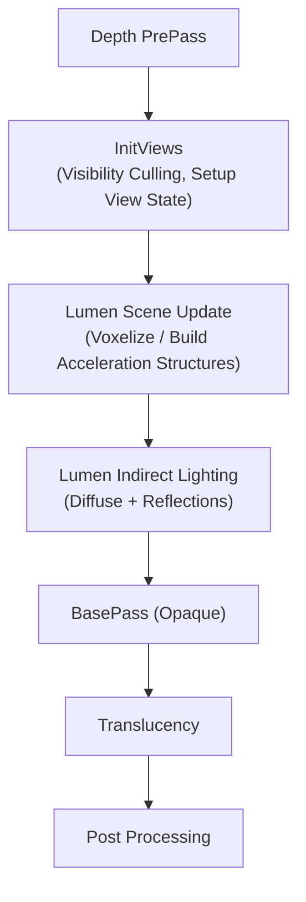
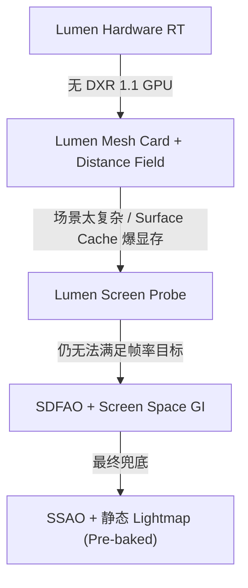

# Lumen 全局光照系统 —— 知识卡片

---

## 1. Lumen 概览

### 1.1 三种 GI 追踪模式

Lumen 在 UE 5.8 提供三种追踪后端，按实际选路优先级从高到低排列：

| 模式 | CVar 控制 | 硬件要求 | 核心机制 |
|---|---|---|---|
| **Hardware RT** | `r.Lumen.DiffuseIndirect.Method=2` | DXR 1.1 兼容 GPU | 直接使用硬件加速 Ray Tracing，调用 RayGen Shader 做光线追踪 |
| **Mesh Card** | `r.Lumen.DiffuseIndirect.Method=1` | 无特殊要求 | 将场景 Mesh 降采样为 Card 代理，在 Card 上渲染 Surface Cache，从 Cache 中采样光照 |
| **Screen Probe** | `r.Lumen.DiffuseIndirect.Method=0` | 无特殊要求 | 在屏幕空间分布 Probe，每个 Probe 向场景中有限步长追踪，收集间接光照 |

**选路逻辑**：Lumen 在 `LumenSceneRendering.cpp` 的 `ComputeLumenDiffuseIndirect(...)` 中根据 `LumenDiffuseIndirect::GetPixelFrequency()` 和当前平台能力自动选择。优先用 Hardware RT（可用时）；否则降级到 Mesh Card；再不行退到 Screen Probe。

### 1.2 在渲染管线中的位置

Lumen 在 **Deferred Renderer** 管线中插入的位置如下：

关键锚点：`LumenSceneRendering.cpp` 的 `RenderLumenScene(...)` 在 `InitViews` 之后、`BasePass` 之前执行。Lumen 的输入来自前一帧的场景数据加当前帧的 Depth Buffer，输出是间接光照缓冲区，供后续 BasePass 在 Shading 阶段使用。

### 1.3 输入与输出

| 方向 | 数据 | 来源/去向 |
|---|---|---|
| **输入** | Scene Geometry（Primitive ID、Transform） | InitViews 的可见性结果 |
| **输入** | GBuffer（Albedo、Normal、Depth、Roughness、Metallic） | 前一帧的 BasePass 输出 |
| **输入** | Voxel Representation（Clipmap） | Lumen 自建的场景体素化 |
| **输入** | Sky / 大气散射 | 场景中的 SkyLight / Atmosphere |
| **输出** | Indirect Diffuse Lighting（`FFinalPostProcessSettings::IndirectLightingColor`） | 被 BasePass 采样 |
| **输出** | Indirect Specular（Reflections） | 被 Reflection 合成 Pass 使用 |

---

## 2. Screen Probe 模式

### 2.1 生成与更新策略

核心文件：`LumenScreenProbe.h/.cpp`。

- **Probe 网格**：在屏幕空间生成一个规则的 Probe 网格，密度由 `r.Lumen.ScreenProbe.Distribution` 控制。
- **每帧重建**：每帧从零重建 Probe 网格（不跨帧保持），因为屏幕内容变化时 Probe 的位置需要重新计算。
- **每个像素选 Probe**：每个像素选取最近的 4-9 个 Probe，做加权插值。权重基于屏幕空间距离、深度差、法线差异。

### 2.2 重要性采样与 Probe 分布

- **分布策略**：Probe 的间隔在屏幕中心区域更密，边缘更疏。使用 `LumenScreenProbeGather()` 在 Compute Shader 里计算分布。
- **方向采样**：每个 Probe 沿多个方向（典型 32-64 条）发射追踪 Ray，方向选择基于 **Importance Sampling**——优先朝亮度贡献大的方向（朝向亮表面、光源方向）。
- **Adaptive Sampling**：`r.Lumen.ScreenProbe.NumRays`（默认 64）控制每条 Probe 的 Ray 数。在低差异区域 Ray 可减少。

### 2.3 时间积累与降噪

- **Temporal Accumulation**：Lumen 使用 **Temporal Reprojection**，将上一帧 Probe 的 GI 结果通过 Motion Vector 投影到当前帧。帧间累积提高信噪比。控制 CVar：`r.Lumen.TemporalFilter`。
- **Spatial Denoise**：跨帧积累后，再做一次空间降噪（Bilateral Filter / A-Trous Wavelet），在保持边缘的前提下平滑噪声。
- **History Validity**：出现遮挡变化、相机突然移动、新物体出现时，History 被标记为无效，需要重新积累。`r.Lumen.TemporalFilter.NumFrames` 控制最大积累帧数。

---

## 3. Mesh Card 模式

### 3.1 Mesh Card 的生成与管理

核心文件：`LumenMeshCards.cpp`。

- **Mesh Card 是什么**：每个 Primitive 被降采样为一张"卡片"（Card）——一个低面数代理网格，覆盖原始 Mesh 的大致范围。
- **生成时机**：Primitive 进入场景时，在 `LumenSceneCardBuild()` 中生成。Card 的生成是离线预处理（在 Mesh 导入时完成），运行时只做可见性判断。
- **管理结构**：`FLumenMeshCards` 类管理所有 Card。每个 Primitive 可能对应多张 Card（按材质/UV 区域拆分）。

### 3.2 Surface Cache

- **Surface Cache** 是一张巨大的 Atlas 纹理，存储所有可见 Mesh Card 的表面属性（Albedo、Normal、Emissive、Roughness、Metallic）。
- **更新策略**：每帧用 `LumenSceneRendering.cpp` 中的 `RasterizeLumenSceneCards()` 将可见 Card 的 GBuffer 属性渲染到 Cache Atlas 中。Cache 的分辨率受 `r.LumenScene.SurfaceCacheResolution` 控制。
- **采样方式**：Lumen 的追踪 Ray 命中某个 Card 后，从 Surface Cache 中采样该点的材质属性，避免走完整的 Shading 路径。

### 3.3 与 Distance Field 的关系

- Mesh Card 模式**依赖 Distance Field** 做 Ray Marching 步进。
- 当 Ray 追踪时，Lumen 先用 **Global Distance Field**（全局 SDF，由 `LumenSceneRendering.cpp` 的 `VoxelizeLumenScene()` 生成）做大步进，快速逼近表面。
- 逼近到表面附近后，用 **Mesh Signed Distance Field**（每个 Mesh 自身的 SDF）做精细步进，确定精确命中点。
- 命中点确定后，去 Surface Cache 中采样光照。
- `r.LumenScene.DistanceField` 控制 Distance Field 的分辨率。

---

## 4. Hardware Ray Tracing 模式

### 4.1 加速结构（BVH）的构建与更新

核心文件：`LumenHardwareRayTracing.cpp`。

- **底层结构**：Lumen 使用 DXR 的 **Bottom-Level Acceleration Structure（BLAS）** 和 **Top-Level Acceleration Structure（TLAS）**。
- **BLAS**：每个 Static Mesh 在加载时构建一次 BLAS（`BuildRayTracingGeometry`），存储在 `FRayTracingGeometry` 中。
- **TLAS**：每帧在 `InitViews` 阶段更新 TLAS，将当前可见的 Primitive Instance 注册进去。`LumenHardwareRayTracing.cpp` 中的 `BuildLumenHardwareRayTracingScene()` 处理 TLAS 的增量更新。
- **Lumen 专用 TLAS**：Lumen 维护**独立于 Path Tracer 的 TLAS**（`LumenHardwareRayTracingScene`），因为 Lumen 的追踪需求不同——不需要所有材质信息，只需要表面位置和法线。

### 4.2 Ray Gen Shader 的定制

- Lumen 的 Hardware RT 使用自定义的 **Ray Generation Shader**，位于 `Shaders/RayTracing/Lumen/LumenHardwareRayTracing.usf`。
- **Ray 类型**：使用 `RAYTRACING_SHADER_MODEL::RAYTRACING` 级别的 Ray Generation + Miss + ClosestHit Shader。
- **Hit Group**：Lumen 注册了专门的低开销 Hit Group，ClosestHit Shader 只返回 `HitPoint`（位置、法线、材质 ID），不执行完整的材质 Shading，以降低开销。
- **Miss Shader**：未被命中的 Ray 由环境光照（SkyLight / Atmosphere）贡献。

### 4.3 与 Path Tracer 的关系

| 项目 | Lumen Hardware RT | Path Tracer |
|---|---|---|
| **用途** | 实时 GI，每像素 1-2 条 Ray | 离线烘焙，每像素数千条 Ray |
| **BVH 复用** | 独立 TLAS（轻量级，仅位置+法线） | 共享场景 TLAS（完整材质描述） |
| **Denoising** | 强依赖 Temporal + Spatial Denoise | 几乎不需要（大量 Ray 已经收敛） |
| **弹射次数** | 1-2 次 Bounce | 无限 Bounce 直到能量收敛 |
| **共存** | 两者可以共存，但不会同时运行 |

---

## 5. Lumen Reflections

### 5.1 Probe / Trace 模式

Lumen Reflections 有两种追踪路径，与 Diffuse GI 的追踪模式对应：

| 模式 | 控制 | 说明 |
|---|---|---|
| **Probe 模式** | `r.Lumen.Reflections.Method=0` | 屏幕空间分布 Reflection Probe，用 Screen Probe 类似的策略做重要性采样 |
| **Trace 模式** | `r.Lumen.Reflections.Method=1` | 逐像素发射 Reflection Ray，走 Mesh Card / Hardware RT 追踪后端 |

核心文件：`LumenReflections.cpp`。

- **Probe 模式**：在屏幕空间分布稀疏的 Reflection Probe（32-64 个），每个 Probe 发射多条 Ray 采集反射环境，然后插值到每个像素。开销低，但镜面反射细节丢失。
- **Trace 模式**：对每个像素沿反射方向发射一条 Ray（或由 `r.Lumen.Reflections.NumRays` 控制多条），按 GGX 重要性采样方向写入 Roughness。开销大，但反射细节保留好。

### 5.2 Roughness 退化与 SSR 混合

Lumen Reflections 不是独立工作的——它根据材质的 **Roughness** 做退化/混合：

| Roughness 范围 | 主要反射策略 | 说明 |
|---|---|---|
| 0.0 - 0.1 | Lumen Trace（Mirror-like） | 高精度 Trace，Ray 沿完美反射方向 |
| 0.1 - 0.5 | Lumen Trace + SSR 混合 | Lumen 提供远距离模糊反射，SSR 补充近距离细节 |
| 0.5 - 0.8 | SSR 为主，Lumen 兜底 | SSR 有足够信息，Lumen 只在 SSR 缺失区域补漏 |
| 0.8 - 1.0 | 退化到 Diffuse GI | 几乎完全漫反射，反射贡献可忽略 |

**SSR 混合逻辑**：`LumenReflections.cpp` 中的 `CompositeLumenReflections()` 在 PostProcess 阶段合成。先运行 SSR（Screen Space Reflections），在 SSR 缺失（命中失败 / 屏幕外）的区域用 Lumen Reflection 填充。`r.Lumen.Reflections.ScreenSpaceReconstruction` 控制混合强度。

### 5.3 半透明反射的处理

Lumen 默认**不处理半透明表面的反射**。半透明物体：

- 走 `r.Translucency.VolumeRayTracing` 或 Standard Translucency 渲染路径。
- Lumen Reflection 只处理 Opaque GBuffer 中的像素。
- 半透明表面如果需要反射效果，需要手动将 `Roughness` 和 `Metallic` 写入 GBuffer，然后走 Screen Space Reflection 兜底。

---

## 6. 性能调优

### 6.1 主要性能开销

| 开销项 | 占比（典型场景） | 影响因素 |
|---|---|---|
| **Scene Voxelization** | 5-10% | 场景复杂度、`r.LumenScene.DetailVoxelSize` |
| **Mesh Card Rasterization** | 5-15% | 可见 Mesh 数量、Surface Cache 分辨率 |
| **Screen Probe 追踪** | 15-30% | Probe 数量、每条 Probe 的 Ray 数 |
| **Hardware RT 追踪** | 20-40% | Ray 数、BVH 复杂度、TLAS 更新频率 |
| **Denoising** | 10-15% | 降噪质量（A-Trous 迭代次数） |
| **Reflections** | 10-20% | 反射 Ray 数、是否开启 Trace 模式 |

### 6.2 关键配置项

| CVar | 默认值 | 说明 | 调优方向 |
|---|---|---|---|
| `r.Lumen.DiffuseIndirect.Method` | 1 | 0=ScreenProbe, 1=MeshCard, 2=HardwareRT | 无 RT 硬件时强制 0 或 1 |
| `r.Lumen.Reflections.Method` | 1 | 0=Probe, 1=Trace | 性能敏感场景用 0 |
| `r.Lumen.ScreenProbe.NumRays` | 64 | 每个 Probe 的 Ray 数 | 调到 32 省约 40% 开销 |
| `r.Lumen.Scene.RayIterations` | 4 | 追踪的最大步进次数 | 调到 2 省约 20% 开销 |
| `r.LumenScene.SurfaceCacheResolution` | 512 | Surface Cache Atlas 分辨率 | 低端设备调至 256 |
| `r.LumenScene.DetailVoxelSize` | 0.15 | 体素大小（世界单位） | 0.3 以上省约 30% |
| `r.Lumen.Reflections.NumRays` | 1 | 每像素反射 Ray 数 | 0 关闭反射 |
| `r.Lumen.TemporalFilter` | 1 | 时间降噪开关 | 0 关闭（画面噪声增加） |
| `r.Lumen.TemporalFilter.NumFrames` | 8 | 时间积累帧数 | 4 帧减少 Ghosting |

### 6.3 降级路径（Fallback）

当 Lumen 的某一层不可用或性能不足时，自动降级路径如下：

降级检查点位于 `LumenSceneRendering.cpp` 的 `ShouldRenderLumen()` 函数中，该函数检查：

1. `r.Lumen.DiffuseIndirect` 是否 > 0
2. 平台是否支持 Lumen 所需特性（SM6 / DXR）
3. 是否处于编辑器的某特定模式（如 Lightmass 烘焙模式）

---

## 7. 关键源码文件

| 文件 | 职责 | 关键类/函数 |
|---|---|---|
| **`LumenSceneRendering.cpp/.h`** | Lumen 场景数据管理、体素化、主渲染调度 | `RenderLumenScene()`, `VoxelizeLumenScene()`, `FLumenScene`, `ShouldRenderLumen()` |
| **`LumenReflections.cpp/.h`** | Lumen 反射的合成与降噪 | `CompositeLumenReflections()`, `FLumenReflections`, `RenderLumenReflections()` |
| **`LumenTracing.cpp/.h`** | 统一的追踪接口，抽象三种后端 | `TraceLumenRadiance()`, `FLumenTracing`, `TraceRay()` |
| **`LumenScreenProbe.cpp/.h`** | Screen Probe 的生成、采样、插值 | `LumenScreenProbeGather()`, `FLumenScreenProbe`, `ScreenProbePlacement()` |
| **`LumenMeshCards.cpp/.h`** | Mesh Card 的生成与管理 | `LumenSceneCardBuild()`, `FLumenMeshCards`, `CardRasterize()` |
| **`LumenHardwareRayTracing.cpp/.h`** | Hardware RT 加速结构 + RayGen | `BuildLumenHardwareRayTracingScene()`, `FLumenHardwareRayTracing`, `LumenRayGen()` |
| **`Shaders/RayTracing/Lumen/`** | Lumen 专用的 Ray Tracing Shader | `LumenHardwareRayTracing.usf`, `LumenScreenProbe.usf`, `LumenReflectionComposite.usf` |
| **`LumenVisualization.cpp`** | Lumen 调试可视化（ShowFlags） | `DrawLumenDebug()`, `LumenVisualizationMode` |

---

## 总结

Lumen 是一套**完全动态、无烘焙的实时全局光照系统**，通过 Screen Probe / Mesh Card / Hardware RT 三层追踪后端，在不同硬件能力上提供一致的 GI 效果。核心 trade-off 是 **Ray 数 vs 降噪质量**——Ray 越少，对 Denoiser 的依赖越强，静态场景的 Temporal Accumulation 越关键。