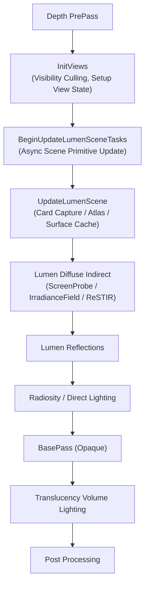
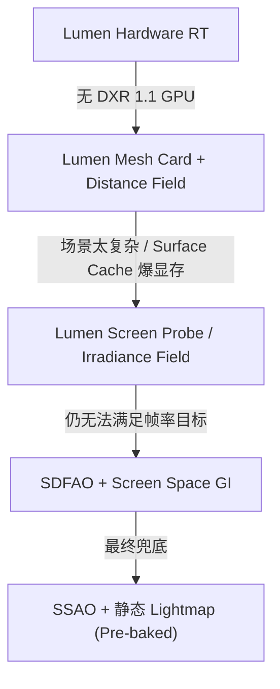

# Lumen 全局光照系统 —— 知识卡片

---

## 1. Lumen 概览

### 1.1 三种 Final Gather 方法

Lumen 在 UE 5.8 提供三种 Final Gather 方法，通过 `r.Lumen.FinalGatherMethod` 选择：

| 方法 | CVar 值 | 核心机制 | 适用场景 |
|---|---|---|---|
| **Irradiance Field Gather** | 0 | 在像素周围摆放世界空间 Radiance Cache probe，预计算辐照度，带 probe occlusion 插值到像素 | 中低端 PC、Switch 2，更快但质量较低 |
| **Screen Probe Gather** | 1（默认） | 从屏幕空间 Probe 出发追踪，自适应降采样 + 世界空间 Radiance Cache 补充远处光照 | 从主机到企业级 GPU 均可扩展，质量更高 |
| **ReSTIR Gather** | 自动（由 `UseReSTIRGather()` 判定） | 基于 ReSTIR（Reservoir-based Spatio-Temporal Importance Resampling）的 GI 采样，时序复用降噪 | 高质量场景，需要 Hardware RT 支持 |

**选路逻辑**：`Lumen::GetFinalGatherMethod()`（`Lumen.cpp`）根据 `Lumen::UseIrradianceFieldGather()`（检查 `r.Lumen.FinalGatherMethod == 0`）、`Lumen::UseReSTIRGather()`（检查平台和硬件能力）自动选择。若都不满足则回退到 ScreenProbeGather。

对应的枚举定义（`Lumen.h`）：

```cpp
enum class ELumenFinalGatherMethod
{
    ScreenProbeGather,
    IrradianceFieldGather,
    ReSTIRGather
};
```

### 1.2 追踪后端（Tracing Backend）

Lumen 的三种追踪后端**与 Final Gather 方法正交**——无论哪种 Gather 方法，都可以使用以下任一追踪后端：

| 后端 | 开关 | 硬件要求 | 核心机制 |
|---|---|---|---|
| **Hardware RT** | `r.Lumen.HardwareRayTracing` | DXR 1.1 兼容 GPU | 直接使用硬件加速 Ray Tracing，调用 RayGen Shader（或 Inline Ray Tracing） |
| **Mesh Card（软件追踪）** | 自动降级 | 无特殊要求 | 将场景 Mesh 降采样为 Card 代理，在 Card 上渲染 Surface Cache，从 Cache 中采样光照 |
| **Voxel（软件追踪）** | 自动降级 | 无特殊要求 | 使用 Global Distance Field（全局 SDF）做 Ray Marching 步进 |

<!-- verify:ignore-start -->
追踪后端的选择由 `Lumen::UseHardwareRayTracing()` 和 `Lumen::UseHardwareInlineRayTracing()` 等函数决定，不再使用 `r.Lumen.DiffuseIndirect.Method`（该 CVar 在 UE 5.8 已废弃）。
<!-- verify:ignore-end -->

### 1.3 EDiffuseIndirectMethod 枚举

`EDiffuseIndirectMethod` 定义在 `DeferredShadingRendererTypes.h`，是渲染管线级别的**漫反射间接光照方法选择**枚举，**不是** Lumen 内部 Gather 方法的选择：

```cpp
enum class EDiffuseIndirectMethod
{
    Disabled,
    SSGI,       // Screen Space Global Illumination
    Lumen,      // Lumen（内部再按 ELumenFinalGatherMethod 分流）
    Plugin      // 第三方插件
};
```

渲染管线中 `ViewPipelineState.DiffuseIndirectMethod == EDiffuseIndirectMethod::Lumen` 判断是否启用 Lumen GI。

### 1.4 在渲染管线中的位置

Lumen 在 **Deferred Renderer** 管线中插入的位置如下：



关键锚点：`FDeferredShadingSceneRenderer::UpdateLumenScene()`（`LumenSceneRendering.cpp`）在 `InitViews` 之后、`BasePass` 之前执行。Lumen 的输入来自前一帧的场景数据加当前帧的 Depth Buffer，输出是间接光照缓冲区，供后续 BasePass 在 Shading 阶段使用。

### 1.5 输入与输出

| 方向 | 数据 | 来源/去向 |
|---|---|---|
| **输入** | Scene Geometry（Primitive ID、Transform） | InitViews 的可见性结果 |
| **输入** | GBuffer（Albedo、Normal、Depth、Roughness、Metallic） | 前一帧的 BasePass 输出 |
| **输入** | Voxel Representation（Clipmap / Global Distance Field） | Lumen 自建的场景体素化 |
| **输入** | Sky / 大气散射 | 场景中的 SkyLight / Atmosphere |
| **输出** | Indirect Diffuse Lighting（`FFinalPostProcessSettings::IndirectLightingColor`） | 被 BasePass 采样 |
| **输出** | Indirect Specular（Reflections） | 被 Reflection 合成 Pass 使用 |

---

## 2. Screen Probe Gather 模式

### 2.1 生成与更新策略

核心文件：`Engine/Source/Runtime/Renderer/Private/Lumen/LumenScreenProbeGather.{cpp,h}`、`LumenScreenProbeTracing.cpp`、`LumenScreenProbeFiltering.cpp`、`LumenScreenProbeImportanceSampling.cpp`、`LumenScreenProbeGBuffer.cpp`、`LumenScreenProbeHardwareRayTracing.cpp`。

- **Probe 网格**：在屏幕空间生成一个规则的 Probe 网格，密度由 `r.Lumen.ScreenProbeGather.DownsampleFactor` 控制（值 = 一个 probe 覆盖的屏幕 tile 边长像素数）。
- **每帧重建**：每帧从零重建 Probe 网格（不跨帧保持），因为屏幕内容变化时 Probe 的位置需要重新计算。
- **每个像素选 Probe**：每个像素选取最近的 4-9 个 Probe，做加权插值。权重基于屏幕空间距离、深度差、法线差异。

### 2.2 重要性采样与 Probe 分布

- **分布策略**：Probe 的间隔在屏幕中心区域更密，边缘更疏。使用 `LumenScreenProbeGather()` 在 Compute Shader 里计算分布。
- **方向采样**：每个 Probe 沿多个方向（典型 32-64 条）发射追踪 Ray，方向选择基于 **Importance Sampling**——优先朝亮度贡献大的方向（朝向亮表面、光源方向）。
- **Adaptive Sampling**：每个 probe 的追踪方向数由 `r.Lumen.ScreenProbeGather.TracingOctahedronResolution` 决定（八面体分辨率，边长 N 对应 N² 个方向）。低差异区域方向数可减少。

### 2.3 时间积累与降噪

<!-- verify:ignore-start -->
- **Temporal Accumulation**：Lumen 使用 **Temporal Reprojection**，将上一帧 Probe 的 GI 结果通过 Motion Vector 投影到当前帧。帧间累积提高信噪比。控制 CVar：`r.Lumen.ScreenProbeGather.Temporal`（原调研稿的 `r.Lumen.TemporalFilter` 不存在）。旧文其余部分：`r.Lumen.TemporalFilter`。
<!-- verify:ignore-end -->
- **Spatial Denoise**：跨帧积累后，再做一次空间降噪（Bilateral Filter / A-Trous Wavelet），在保持边缘的前提下平滑噪声。
- **History Validity**：出现遮挡变化、相机突然移动、新物体出现时，History 被标记为无效，需要重新积累。`r.Lumen.ScreenProbeGather.Temporal` 是时间滤波总开关；历史丢弃的判据见 `r.Lumen.ScreenProbeGather.Temporal.DistanceThreshold`。

---

## 3. Irradiance Field Gather 模式

### 3.1 核心机制

核心文件：`LumenIrradianceFieldGather.cpp`。

- **世界空间 Radiance Cache Probe**：在像素周围的世界空间位置摆放 Probe，每个 Probe 预计算该位置的辐照度（Irradiance）。
- **Clipmap 层级**：使用多级 Clipmap 结构（默认 4 级），由 `r.Lumen.IrradianceFieldGather.NumClipmaps` 控制。第一级 Clipmap 范围由 `r.Lumen.IrradianceFieldGather.ClipmapWorldExtent`（默认 5000）控制，后续层级按 `ClipmapDistributionBase`（默认 2.0）指数增长。
- **Probe Occlusion**：插值时考虑 Probe 与像素之间的遮挡关系，避免光照"漏墙"。
- **性能优势**：比 ScreenProbeGather 更快，但 GI 质量较低。目标平台为中端 PC 和 Switch 2。

### 3.2 与 Radiance Cache 的关系

IrradianceFieldGather 依赖 `LumenRadianceCache` 系统存储和插值世界空间 Probe 的光照数据。Radiance Cache 的硬件光追加速由 `LumenRadianceCacheHardwareRayTracing.cpp` 提供。

---

## 4. ReSTIR Gather 模式

### 4.1 核心机制

核心文件：`Engine/Source/Runtime/Renderer/Private/Lumen/LumenReSTIRGather.{cpp,h}`。

- **ReSTIR（Reservoir-based Spatio-Temporal Importance Resampling）**：通过时序和空间的重要性重采样，从少量初始样本中高效收敛到高质量 GI。
- **Reservoir**：每个像素维护一个 Reservoir（候选样本池），在时间和空间上重采样，逐步逼近无偏估计。
- **Downsample Factor**：`r.Lumen.ReSTIRGather.DownsampleFactor`（默认 2）控制追踪和重采样的分辨率降采样系数，是主要性能控制参数。
- **硬件要求**：需要 Hardware RT 支持，适合高质量 GI 场景。

### 4.2 与 Temporal Accumulation 的区别

ReSTIR 的时序复用与 ScreenProbe 的 Temporal Accumulation 不同：

| 特性 | ScreenProbe Temporal | ReSTIR |
|---|---|---|
| **复用对象** | 上一帧的 Probe GI 结果（Motion Vector 投影） | 上一帧的 Reservoir（样本分布） |
| **收敛速度** | 需要多帧积累（8-16 帧） | 收敛更快（2-4 帧） |
| **运动处理** | Motion Vector 失效需重置 History | 通过时空重采样自然适应运动 |
| **实现复杂度** | 较低 | 较高 |

---

## 5. Mesh Card 模式（软件追踪）

### 5.1 Mesh Card 的生成与管理

核心文件：`Engine/Source/Runtime/Renderer/Private/Lumen/LumenMeshCards.{cpp,h}`。

- **Mesh Card 是什么**：每个 Primitive 被降采样为一张"卡片"（Card）——一个低面数代理网格，覆盖原始 Mesh 的大致范围。
- **生成时机**：Primitive 进入场景时，在 `LumenSceneCardBuild()` 中生成。Card 的生成是离线预处理（在 Mesh 导入时完成），运行时只做可见性判断。
- **管理结构**：`FLumenMeshCards` 类管理所有 Card。每个 Primitive 可能对应多张 Card（按材质/UV 区域拆分）。

### 5.2 Surface Cache

- **Surface Cache** 是一张巨大的 Atlas 纹理，存储所有可见 Mesh Card 的表面属性（Albedo、Normal、Emissive、Roughness、Metallic）。
<!-- verify:ignore-start -->
- **更新策略**：每帧用 `RasterizeLumenSceneCards()` 将可见 Card 的 GBuffer 属性渲染到 Cache Atlas 中。Cache 的图集尺寸受 `r.LumenScene.SurfaceCache.AtlasSize` 控制（原调研稿写的 `r.LumenScene.SurfaceCacheResolution` 控制。
<!-- verify:ignore-end -->
- **采样方式**：Lumen 的追踪 Ray 命中某个 Card 后，从 Surface Cache 中采样该点的材质属性，避免走完整的 Shading 路径。
- **Surface Cache Feedback**：`LumenSurfaceCacheFeedback.cpp` 管理 Cache 的反馈更新机制，确保高需求的页面优先更新。

### 5.3 与 Distance Field 的关系

- Mesh Card 模式**依赖 Distance Field** 做 Ray Marching 步进。
- 当 Ray 追踪时，Lumen 先用 **Global Distance Field**（全局 SDF，由 `VoxelizeLumenScene()` 生成）做大步进，快速逼近表面。
- 逼近到表面附近后，用 **Mesh Signed Distance Field**（每个 Mesh 自身的 SDF）做精细步进，确定精确命中点。
- 命中点确定后，去 Surface Cache 中采样光照。
- Mesh SDF 追踪由 `r.Lumen.TraceMeshSDFs` 控制，追踪距离是 `r.Lumen.TraceMeshSDFs.TraceDistance`；距离场本身的分辨率走 `r.DistanceFields.DefaultVoxelDensity`。

---

## 6. Hardware Ray Tracing 模式

### 6.1 加速结构（BVH）的构建与更新

核心文件：`Engine/Source/Runtime/Renderer/Private/Lumen/LumenHardwareRayTracingCommon.{cpp,h}`、`LumenHardwareRayTracingMaterials.cpp`。

UE 5.8 将 Hardware RT 的实现拆分为通用基类和多个域专用文件：

| 文件 | 职责 |
|---|---|
| **`Engine/Source/Runtime/Renderer/Private/Lumen/LumenHardwareRayTracingCommon.{cpp,h}`** | 通用基础设施：Lumen 专用 TLAS 管理、Hit Lighting 模式、Ray Tracing Scene Options |
| **`LumenHardwareRayTracingMaterials.cpp`** | 材质 Hit Group 处理 |
| **`LumenScreenProbeHardwareRayTracing.cpp`** | ScreenProbeGather 的硬件光追实现 |
| **`LumenReflectionHardwareRayTracing.cpp`** | Reflections 的硬件光追实现 |
| **`LumenRadianceCacheHardwareRayTracing.cpp`** | Radiance Cache 的硬件光追实现 |
| **`LumenSceneDirectLightingHardwareRayTracing.cpp`** | Direct Lighting 的硬件光追实现 |
| **`LumenTranslucencyVolumeHardwareRayTracing.cpp`** | Translucency Volume 的硬件光追实现 |
| **`LumenVisualizeHardwareRayTracing.cpp`** | 可视化调试的硬件光追实现 |
| **`LumenShortRangeAOHardwareRayTracing.cpp`** | Short Range AO 的硬件光追实现 |

- **底层结构**：Lumen 使用 DXR 的 **Bottom-Level Acceleration Structure（BLAS）** 和 **Top-Level Acceleration Structure（TLAS）**。
- **BLAS**：每个 Static Mesh 在加载时构建一次 BLAS（`BuildRayTracingGeometry`），存储在 `FRayTracingGeometry` 中。
- **TLAS**：每帧在 `InitViews` 阶段更新 TLAS，将当前可见的 Primitive Instance 注册进去。
- **Lumen 专用 TLAS**：Lumen 维护**独立于 Path Tracer 的 TLAS**（`LumenHardwareRayTracingScene`），因为 Lumen 的追踪需求不同——不需要所有材质信息，只需要表面位置和法线。

### 6.2 两种执行模式：RayGen 与 Inline

UE 5.8 的 Lumen 支持两种硬件光追执行模式：

| 模式 | 开关 | 机制 |
|---|---|---|
| **RayGen Shader** | `r.Lumen.HardwareRayTracing` + DXR 支持 | 使用独立的 Ray Generation Shader，有独立 Miss/ClosestHit Shader |
| **Inline Ray Tracing** | `r.Lumen.HardwareRayTracing.Inline` | 在 Compute Shader 内直接调用 `TraceRayInline`，无需独立 RayGen |

`Lumen::UseHardwareInlineRayTracing()` 优先检查是否可用，否则回退到 RayGen 模式。

### 6.3 Hit Lighting 模式

Lumen 的硬件光追支持多种 Hit Lighting 模式（`EHitLightingMode`），控制命中点如何处理光照：

- **HitLighting**：从 Surface Cache 采样材质属性并进行完整光照计算
- **HitLightingSurfaceCache**：仅从 Surface Cache 采样
- 通过 `LumenHardwareRayTracing::GetHitLightingMode()` 选择

### 6.4 与 Path Tracer 的关系

| 项目 | Lumen Hardware RT | Path Tracer |
|---|---|---|
| **用途** | 实时 GI，每像素 1-2 条 Ray | 离线烘焙，每像素数千条 Ray |
| **BVH 复用** | 独立 TLAS（轻量级，仅位置+法线） | 共享场景 TLAS（完整材质描述） |
| **Denoising** | 强依赖 Temporal + Spatial Denoise | 几乎不需要（大量 Ray 已经收敛） |
| **弹射次数** | 1-2 次 Bounce | 无限 Bounce 直到能量收敛 |
| **共存** | 两者可以共存，但不会同时运行 |

---

## 7. Radiance Cache 系统

### 7.1 核心机制

核心文件：`Engine/Source/Runtime/Renderer/Private/Lumen/LumenRadianceCache.{cpp,h}`、`LumenRadianceCacheInternal.h`、`LumenRadianceCacheInterpolation.h`、`LumenRadianceCacheHardwareRayTracing.cpp`。

Radiance Cache 是 Lumen 的**世界空间 Probe 缓存系统**，用于：

- 存储场景中**远距离**光照信息（超过 ScreenProbe 覆盖范围）
- 为 IrradianceFieldGather 提供 Probe 辐照度数据
- 为 ScreenProbeGather 的远距离部分提供补充
- 为 Translucency Volume Lighting 提供光照缓存

### 7.2 关键参数

- `r.Lumen.ScreenProbeGather.RadianceCache.NumProbesToTraceBudget`：每帧可更新的 probe 预算
- `r.Lumen.ScreenProbeGather.RadianceCache.NumClipmaps`：Clipmap 层级数
- `r.Lumen.ScreenProbeGather.RadianceCache.ClipmapWorldExtent`：第一层 clipmap 的世界空间范围

---

## 8. Radiosity 系统

### 8.1 核心机制

核心文件：`Engine/Source/Runtime/Renderer/Private/Lumen/LumenRadiosity.{cpp,h}`。

Radiosity 是 Lumen 的**多次反弹漫反射间接光照**系统：

- **从 Surface Cache 采集**：在 Surface Cache texel 上分布 Probe，从 Cache 中采样已有的间接光照，计算多次反弹。
- **Probe 间距**：`r.LumenScene.Radiosity.ProbeSpacing`（默认 4，单位：Surface Cache texel）控制 Probe 间距。
- **半球分辨率**：`r.LumenScene.Radiosity.HemisphereProbeResolution`（默认 4）控制沿半球探针布局一维的追踪数。
- **开关**：`r.LumenScene.Radiosity`（默认 1）控制是否启用。

### 8.2 与 Final Gather 的关系

Radiosity 在 Final Gather 之后运行，为 Surface Cache 的 texel 提供多 bounce 间接光照，下一帧的 Final Gather 采样这些 Cache 时就能得到多 bounce 效果。

---

## 9. Lumen Scene 更新管线

### 9.1 场景数据管理

核心文件：`LumenScene.cpp`、`LumenSceneData.h`、`LumenSceneRendering.cpp`。

Lumen Scene 更新由 `FDeferredShadingSceneRenderer` 驱动：

1. **`BeginUpdateLumenSceneTasks()`**：异步阶段，更新场景 Primitive 列表（`UpdateLumenScenePrimitives`），检查是否需要重新分配 Atlas
2. **`UpdateLumenScene()`**：同步阶段，执行 Card Capture、Surface Cache 更新、Atlas 重分配

核心函数：`ShouldRenderLumenDiffuseGI()`（`LumenDiffuseIndirect.cpp`）—— 替代旧版 `ShouldRenderLumen()`，检查：

1. `Lumen::IsLumenFeatureAllowedForView()` —— 平台、项目设置、view 状态
2. `View.FinalPostProcessSettings.DynamicGlobalIlluminationMethod == EDynamicGlobalIlluminationMethod::Lumen`
3. `r.Lumen.DiffuseIndirect.Allow` > 0
4. `EngineShowFlags.GlobalIllumination` 和 `LumenGlobalIllumination` 开启
5. 未启用 PathTracing 或 RayTracingDebug
6. 有可用的追踪数据（Hardware RT 或 Software RT）

### 9.2 GPU Driven Update

核心文件：`Engine/Source/Runtime/Renderer/Private/Lumen/LumenSceneGPUDrivenUpdate.{cpp,h}`。

UE 5.8 实验性支持 GPU 驱动的 Lumen Scene 更新：

- **控制**：`r.LumenScene.GPUDrivenUpdate`（默认 0，WIP 状态）
- **目标**：将场景 Primitive 管理、Card 可见性判断等计算从 CPU 迁移到 GPU
- **当前状态**：Work in progress，默认关闭

---

## 10. Lumen Reflections

### 10.1 追踪路径

核心文件：`Engine/Source/Runtime/Renderer/Private/Lumen/LumenReflections.{cpp,h}`、`LumenReflectionTracing.cpp`、`LumenReflectionHardwareRayTracing.cpp`。

Lumen Reflections 有两种追踪路径，与 Diffuse GI 的 Final Gather 方法正交：

| 模式 | 控制 | 说明 |
|---|---|---|
| **Probe 模式** | `r.Lumen.Reflections.Method=0` | 屏幕空间分布 Reflection Probe，用 Screen Probe 类似的策略做重要性采样 |
| **Trace 模式** | `r.Lumen.Reflections.Method=1` | 逐像素发射 Reflection Ray，走 Mesh Card / Hardware RT 追踪后端 |

- **Probe 模式**：在屏幕空间分布稀疏的 Reflection Probe（32-64 个），每个 Probe 发射多条 Ray 采集反射环境，然后插值到每个像素。开销低，但镜面反射细节丢失。
- **Trace 模式**：对每个像素沿反射方向发射一条 Ray（追踪分辨率由 `r.Lumen.Reflections.DownsampleFactor` 控制），按 GGX 重要性采样方向写入 Roughness。开销大，但反射细节保留好。

### 10.2 Roughness 退化与 SSR 混合

Lumen Reflections 不是独立工作的——它根据材质的 **Roughness** 做退化/混合：

| Roughness 范围 | 主要反射策略 | 说明 |
|---|---|---|
| 0.0 - 0.1 | Lumen Trace（Mirror-like） | 高精度 Trace，Ray 沿完美反射方向 |
| 0.1 - 0.5 | Lumen Trace + SSR 混合 | Lumen 提供远距离模糊反射，SSR 补充近距离细节 |
| 0.5 - 0.8 | SSR 为主，Lumen 兜底 | SSR 有足够信息，Lumen 只在 SSR 缺失区域补漏 |
| 0.8 - 1.0 | 退化到 Diffuse GI | 几乎完全漫反射，反射贡献可忽略 |

**SSR 混合逻辑**：`LumenReflections.cpp` 中的 `CompositeLumenReflections()` 在 PostProcess 阶段合成。先运行 SSR（Screen Space Reflections），在 SSR 缺失（命中失败 / 屏幕外）的区域用 Lumen Reflection 填充。`r.Lumen.Reflections.ScreenSpaceReconstruction` 控制混合强度。

### 10.3 半透明反射的处理

Lumen 默认**不处理半透明表面的反射**。半透明物体：

- 走 Lumen 半透明体积（`r.Lumen.TranslucencyVolume.Enable`）或 Standard Translucency 渲染路径。
- Lumen Reflection 只处理 Opaque GBuffer 中的像素。
- 半透明表面如果需要反射效果，需要手动将 `Roughness` 和 `Metallic` 写入 GBuffer，然后走 Screen Space Reflection 兜底。

---

## 11. Lumen Scene Direct Lighting

核心文件：`LumenSceneDirectLighting.cpp`、`LumenSceneDirectLightingHardwareRayTracing.cpp`、`LumenSceneDirectLightingStochastic.inl`。

Lumen 也处理场景中的**直接光照**（Sun Sky、反射光之外的直接光照贡献）：

- **开关**：`r.LumenScene.DirectLighting` —— 是否为 surface cache 计算直接光照
- **启用条件**：`ShouldRenderLumenDirectLighting()` 要求 `ShouldRenderLumenDiffuseGI()` 为 true 且非 IrradianceFieldGather 模式
- **作用**：在 Lumen 的间接光照计算中同时包含直接光照贡献，使 GI 更加完整

---

## 12. Lumen Translucency Volume Lighting

核心文件：`Engine/Source/Runtime/Renderer/Private/Lumen/LumenTranslucencyVolumeLighting.{cpp,h}`、`LumenTranslucencyVolumeHardwareRayTracing.cpp`、`LumenTranslucencyRadianceCache.cpp`。

Lumen 对**半透明体积**的间接光照支持：

- **开关**：`r.Lumen.TranslucencyVolume.Enable`（默认 1）
- **机制**：在场景中分布体积探针，从 Radiance Cache 中采样光照，插值到半透明物体
- **Trace From Volume**：`r.Lumen.TranslucencyVolume.TraceFromVolume` 控制是否从体积探针位置追踪（而非从屏幕空间）

---

## 13. 性能调优

### 13.1 主要性能开销

下表全部由 `scripts/ue-cvar-dump.py` 从 5.8 源码生成，作用说明取引擎自己的帮助文本。`r.Lumen.*` 家族在 5.8 有 396 个、`r.LumenScene.*` 有 137 个，这里只列常调项——完整清单用 `python scripts/ue-cvar-dump.py r.Lumen r.LumenScene --md` 现查。

| CVar | 作用 |
|---|---|
| `r.Lumen.DiffuseIndirect.Allow` | Whether to allow Lumen Global Illumination. Lumen GI is enabled in the project settings, this cvar can only disable it. |
| `r.Lumen.DiffuseIndirect.AsyncCompute` | Whether to run Lumen diffuse indirect passes on the compute pipe if possible. |
| `r.Lumen.FinalGatherMethod` | Lumen Final Gather Method 0 - Irradiance Field Gather - places World Space Radiance Cache probes around pixels, pre-calculates their irradiance, and interpolate… |
| `r.Lumen.ScreenProbeGather.DownsampleFactor` | Pixel size of the screen tile that a screen probe will be placed on. |
| `r.Lumen.ScreenProbeGather.TracingOctahedronResolution` | Resolution of the tracing octahedron. Determines how many traces are done per probe. |
| `r.Lumen.ScreenProbeGather.ScreenTraces` | Whether to trace against the screen before falling back to other tracing methods. |
| `r.Lumen.ScreenProbeGather.Temporal` | Whether to use a temporal filter |
| `r.Lumen.ScreenProbeGather.MaxRayIntensity` | Clamps the maximum ray lighting intensity (with PreExposure) to reduce fireflies. Lower values reduce noise, but also remove some interesting GI features. |
| `r.Lumen.ScreenProbeGather.RadianceCache.NumClipmaps` | Number of radiance cache clipmaps. |
| `r.Lumen.ScreenProbeGather.RadianceCache.ClipmapWorldExtent` | World space extent of the first clipmap |
| `r.Lumen.ScreenProbeGather.RadianceCache.NumProbesToTraceBudget` | Number of radiance cache probes that can be updated per frame. |
| `r.Lumen.Reflections.Allow` | Whether to allow Lumen Reflections. Lumen Reflections is enabled in the project settings, this cvar can only disable it. |
| `r.Lumen.Reflections.DownsampleFactor` | Downsample factor from the main viewport to trace rays. This is the main performance control for the tracing part of the reflections. |
| `r.Lumen.Reflections.MaxRoughnessToTrace` | Max roughness value for which Lumen still traces dedicated reflection rays. Overrides Post Process Volume settings when set to anything >= 0. |
| `r.Lumen.TraceMeshSDFs` | Whether Lumen should trace against Mesh Signed Distance fields. When enabled, Lumen's Software Tracing will be more accurate, but scenes with high instance dens… |
| `r.Lumen.TraceMeshSDFs.TraceDistance` | Max trace distance against Mesh Distance Fields and Heightfields. |
| `r.Lumen.HardwareRayTracing` | Uses Hardware Ray Tracing for Lumen features, when available. Lumen will fall back to Software Ray Tracing otherwise. Note: Hardware ray tracing has significant… |
| `r.Lumen.TranslucencyVolume.Enable` | — |
| `r.LumenScene.SurfaceCache.AtlasSize` | Surface cache card atlas size. |
| `r.LumenScene.DirectLighting` | Whether to compute direct ligshting for surface cache. |

### 13.3 降级路径（Fallback）

当 Lumen 的某一层不可用或性能不足时，自动降级路径如下：



降级检查点位于 `LumenDiffuseIndirect.cpp` 的 `ShouldRenderLumenDiffuseGI()` 函数中，该函数检查：

1. `Lumen::IsLumenFeatureAllowedForView()` —— 平台 + 项目设置
2. `DynamicGlobalIlluminationMethod == Lumen`
3. `r.Lumen.DiffuseIndirect.Allow` > 0
4. ShowFlags 中 GI 相关 flag 开启
5. 有可用的追踪后端（Hardware RT 或 Software RT）

---

## 14. 可视化调试

核心文件：`Engine/Source/Runtime/Renderer/Private/Lumen/LumenVisualize.{cpp,h}`、`LumenVisualizeHardwareRayTracing.cpp`、`LumenVisualizeRadianceCache.cpp`。

Lumen 提供可视化调试工具：

- **`LumenVisualize.cpp`**：Lumen 场景调试可视化（ShowFlags），函数 `AddVisualizeLumenScenePass()` 渲染调试画面
- **`LumenVisualizeHardwareRayTracing.cpp`**：硬件光追的可视化调试
- **`LumenVisualizeRadianceCache.cpp`**：Radiance Cache 状态的可视化

---

## 15. 关键源码文件

| 文件 | 职责 | 关键类/函数 |
|---|---|---|
| **`LumenSceneRendering.cpp`** | Lumen 场景数据管理、主渲染调度 | `UpdateLumenScene()`, `BeginUpdateLumenSceneTasks()`, `VoxelizeLumenScene()`, `FLumenScene` |
| **`LumenScene.cpp`** | Lumen 场景 Primitive 管理 | `UpdateLumenScenePrimitives()`, `Lumen::ShouldUpdateLumenSceneViewOrigin()` |
| **`LumenSceneData.h`** | Lumen 场景数据结构 | `FLumenSceneData` |
| **`Engine/Source/Runtime/Renderer/Private/Lumen/Lumen.{cpp,h}`** | Lumen 全局工具函数、枚举定义 | `GetFinalGatherMethod()`, `ShouldRenderLumenDiffuseGI()`（声明）, `UseHardwareRayTracing()`, `ELumenFinalGatherMethod` |
| **`LumenDiffuseIndirect.cpp`** | 间接光照渲染入口 | `ShouldRenderLumenDiffuseGI()`（定义）, `SetupLumenDiffuseTracingParameters()` |
| **`Engine/Source/Runtime/Renderer/Private/Lumen/LumenReflections.{cpp,h}`** | Lumen 反射的合成与降噪 | `CompositeLumenReflections()`, `FLumenReflections`, `RenderLumenReflections()` |
| **`LumenReflectionTracing.cpp`** | Lumen 反射追踪 | `TraceLumenReflections()` |
| **`LumenReflectionHardwareRayTracing.cpp`** | 反射的硬件光追实现 | `LumenReflections::UseHitLighting()` |
| **`Engine/Source/Runtime/Renderer/Private/Lumen/LumenTracingUtils.{cpp,h}`** | 统一的追踪接口 | `TraceLumenRadiance()`, `FLumenTracing`, `TraceRay()` |
| **`Engine/Source/Runtime/Renderer/Private/Lumen/LumenScreenProbeGather.{cpp,h}`** | Screen Probe 的生成、采样、插值 | `LumenScreenProbeGather()`, `FLumenScreenProbe`, `ScreenProbePlacement()` |
| **`LumenScreenProbeTracing.cpp`** | Screen Probe 的追踪实现 | ScreenProbe 的 Ray 追踪 |
| **`LumenScreenProbeFiltering.cpp`** | Screen Probe 的降噪过滤 | ScreenProbe 的 Spatial/Temporal 过滤 |
| **`LumenScreenProbeImportanceSampling.cpp`** | Screen Probe 的重要性采样 | ScreenProbe 的方向分布 |
| **`LumenScreenProbeGBuffer.cpp`** | Screen Probe 的 GBuffer 采样 | 从 GBuffer 读取材质属性 |
| **`LumenScreenProbeHardwareRayTracing.cpp`** | Screen Probe 的硬件光追 | `LumenScreenProbeGather::UseHitLighting()` |
| **`LumenIrradianceFieldGather.cpp`** | Irradiance Field Gather 方法 | Clipmap 管理、Probe occlusion |
| **`Engine/Source/Runtime/Renderer/Private/Lumen/LumenReSTIRGather.{cpp,h}`** | ReSTIR Gather 方法 | `Lumen::UseReSTIRGather()`, Reservoir 管理 |
| **`Engine/Source/Runtime/Renderer/Private/Lumen/LumenMeshCards.{cpp,h}`** | Mesh Card 的生成与管理 | `LumenSceneCardBuild()`, `FLumenMeshCards`, `CardRasterize()` |
| **`Engine/Source/Runtime/Renderer/Private/Lumen/LumenHardwareRayTracingCommon.{cpp,h}`** | Hardware RT 通用基础设施 | `BuildLumenHardwareRayTracingScene()`, `FLumenHardwareRayTracing`, `GetHitLightingMode()` |
| **`LumenHardwareRayTracingMaterials.cpp`** | Hardware RT 材质 Hit Group | 材质命中处理 |
| **`Engine/Source/Runtime/Renderer/Private/Lumen/LumenRadianceCache.{cpp,h}`** | Radiance Cache 系统 | Probe 管理、插值 |
| **`LumenRadianceCacheHardwareRayTracing.cpp`** | Radiance Cache 硬件光追 | `LumenRadianceCache::UseHitLighting()` |
| **`Engine/Source/Runtime/Renderer/Private/Lumen/LumenRadiosity.{cpp,h}`** | Radiosity 多 bounce 系统 | `LumenRadiosity::IsEnabled()`, `ShouldRenderRadiosityHardwareRayTracing()` |
| **`LumenSceneDirectLighting.cpp`** | Lumen 场景直接光照 | `ShouldRenderLumenDirectLighting()` |
| **`LumenSceneDirectLightingHardwareRayTracing.cpp`** | 直接光照硬件光追 | 直接光照的 Ray Tracing 实现 |
| **`Engine/Source/Runtime/Renderer/Private/Lumen/LumenSceneGPUDrivenUpdate.{cpp,h}`** | GPU 驱动的场景更新（实验性） | `r.LumenScene.GPUDrivenUpdate` |
| **`Engine/Source/Runtime/Renderer/Private/Lumen/LumenTranslucencyVolumeLighting.{cpp,h}`** | 半透明体积间接光照 | `r.Lumen.TranslucencyVolume.Enable` |
| **`LumenTranslucencyVolumeHardwareRayTracing.cpp`** | 半透明体积硬件光追 | Translucency 的 Ray Tracing 实现 |
| **`LumenTranslucencyRadianceCache.cpp`** | 半透明体积 Radiance Cache | Translucency 的 Cache 采样 |
| **`LumenSurfaceCache.cpp`** | Surface Cache 管理 | Atlas 分配、更新 |
| **`Engine/Source/Runtime/Renderer/Private/Lumen/LumenSurfaceCacheFeedback.{cpp,h}`** | Surface Cache 反馈更新 | 高需求页面优先更新 |
| **`Engine/Source/Runtime/Renderer/Private/Lumen/LumenSceneCardCapture.{cpp,h}`** | Card Capture 渲染 | Card 页面渲染到 Atlas |
| **`Engine/Source/Runtime/Renderer/Private/Lumen/LumenSceneLighting.{cpp,h}`** | 场景光照管理 | `UseHardwareRayTracedSceneLighting()` |
| **`Engine/Source/Runtime/Renderer/Private/Lumen/LumenVisualize.{cpp,h}`** | Lumen 调试可视化（ShowFlags） | `AddVisualizeLumenScenePass()`, `LumenVisualizationMode` |
| **`LumenVisualizeHardwareRayTracing.cpp`** | 硬件光追可视化 | 调试硬件光追状态 |
| **`LumenVisualizeRadianceCache.cpp`** | Radiance Cache 可视化 | 调试 Cache 状态 |
| **`LumenShortRangeAO.h`** | Short Range AO 管理 | Lumen 短距离环境光遮蔽 |
| **`LumenShortRangeAOHardwareRayTracing.cpp`** | Short Range AO 硬件光追 | AO 的 Ray Tracing 实现 |
| **`Engine/Source/Runtime/Renderer/Private/Lumen/LumenHeightfields.{cpp,h}`** | Heightfield 支持 | 地形/植被的 Lumen 支持 |
| **`LumenMeshSDFCulling.cpp`** | Mesh SDF 裁剪 | 距离场视锥裁剪 |
| **`LumenScreenSpaceBentNormal.cpp`** | 屏幕空间 Bent Normal | 法线可见性计算 |
| **`LumenViewState.h`** | Lumen View 状态 | View 级 Lumen 状态管理 |
| **`LumenIndirect.h`** | 异步间接光照输出 | `FAsyncLumenIndirectLightingOutputs` |
| **`Shaders/RayTracing/Lumen/`** | Lumen 专用的 Ray Tracing Shader | `LumenHardwareRayTracing.usf`, `LumenScreenProbe.usf`, `LumenReflectionComposite.usf` |

---

## 总结

Lumen 是一套**完全动态、无烘焙的实时全局光照系统**，通过 ScreenProbeGather / IrradianceFieldGather / ReSTIRGather 三种 Final Gather 方法 + Hardware RT / Mesh Card / Voxel 三种追踪后端，在不同硬件能力上提供一致的 GI 效果。核心 trade-off 是 **Ray 数 vs 降噪质量**——Ray 越少，对 Denoiser 的依赖越强，静态场景的 Temporal Accumulation 越关键。

UE 5.8 的主要架构变化：

- **方法选择**：追踪方法选择用 `r.Lumen.FinalGatherMethod`，三种方法：IrradianceFieldGather(0)、ScreenProbeGather(1)、ReSTIRGather（自动）
- **函数名**：`ShouldRenderLumen()` 改为 `ShouldRenderLumenDiffuseGI()`，`RenderLumenScene()` 改为 `UpdateLumenScene()`
- **新增系统**：Radiance Cache、Radiosity（多 bounce）、GPU Driven Update（实验性）、ReSTIR Gather
- **文件拆分**：Hardware RT 拆分为通用基类（`LumenHardwareRayTracingCommon`）+ 8 个域专用文件，Screen Probe 主文件从 `LumenScreenProbe` 更名为 `LumenScreenProbeGather`，关联 5 个专用文件