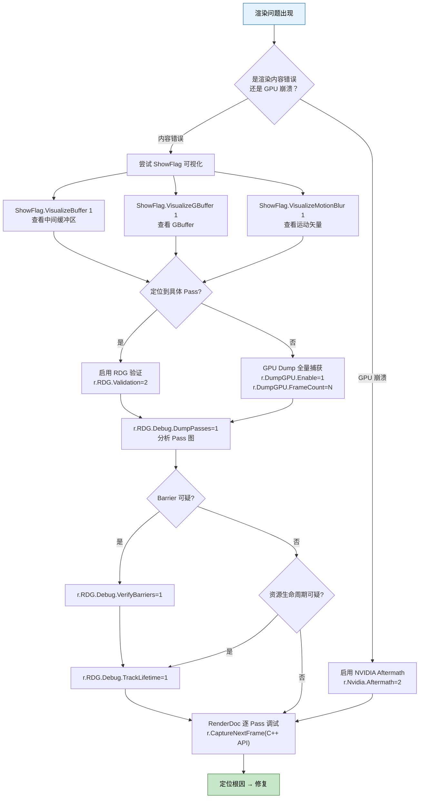

# UE 5.8 RDG 调试诊断指南

文档基于 UE 5.8 源码（`RenderGraphBuilder.h`、`RenderGraphPass.h`、`RenderGraphDefinitions.h`、`RenderGraphResources.h`、`RenderGraphBlackboard.h`、`RenderGraphBuilder.inl`、`DumpGPU.cpp` 等）编写。

---

## 1. RDG 验证层 (Validation Layer)

UE 5.8 将早期版本的 `r.RDG.Validate` 系列重构为两层：**全局验证开关 `r.RDG.Validation`** + **细粒度调试开关 `r.RDG.Debug.*`**。

### 1.1 r.RDG.Validation — 全局验证开关

```ini
r.RDG.Validation [0, 1, 2, 3]
```

| 级别 | 行为 | 性能影响 |
|------|------|---------|
| 0 | 关闭（默认） | 无 |
| 1 | 基础验证：资源追踪、断言错误、生命周期检查 | 低 |
| 2 | 扩展验证：资源状态跟踪、texture/buffer 访问模式校验 | 中 |
| 3 | 详细验证：全量日志输出，含每个 Pass 的资源绑定信息 | 高 |

`r.RDG.Validation` 是关卡式开关：级别越高，覆盖的检查项越多。每个级别包含其下所有级别的检查。

### 1.2 r.RDG.Debug.* 系列 — 细粒度调试开关

UE 5.8 将以往耦合在 `r.RDG.Validate` 中的独立调试功能拆成 `r.RDG.Debug.*` 前缀的独立 CVar，可单独开关：

```ini
r.RDG.Debug.VerifyResources    [0/1]  验证资源状态一致性
r.RDG.Debug.DumpPasses         [0/1]  将 Pass 图 dump 为文件（JSON/Graphviz 格式）
r.RDG.Debug.DumpResources      [0/1]  将资源分配与生命周期 dump 为文件
r.RDG.Debug.VerifyDispatch     [0/1]  验证 DispatchPass 的线程组参数
r.RDG.Debug.VerifyBarriers     [0/1]  验证 Barrier 正确性
r.RDG.Debug.LogPassFlags       [0/1]  记录每个 Pass 的 ERDGPassFlags 信息
r.RDG.Debug.TrackLifetime      [0/1]  追踪每个资源的创建/销毁/提取时间线
r.RDG.Debug.ValidateBuffer     [0/1]  对 Buffer 资源进行额外验证
r.RDG.Debug.ValidateTexture    [0/1]  对 Texture 资源进行额外验证
```

**5.8 改版要点**：

- `r.RDG.Validation` 替代了 5.7 及之前的 `r.RDG.Validate`（注意拼写差异：`ion` vs `e`）
- `r.RDG.Debug.*` 系列替代了 `r.RDG.Validate` 的子开关（如 `r.RDG.ValidateVerifyResources` → `r.RDG.Debug.VerifyResources`）
- 两者独立运作：`r.RDG.Validation=1` 开启内置检查集，`r.RDG.Debug.*` 按需追加额外检查

### 1.3 验证输出格式

启用验证后，RDG 在控制台输出格式如：

```
[RDG] Validation: Pass 'PostProcessing' (0x0000021A3B400000) 
  Read: SceneColor(Texture), SceneDepth(Texture)
  Write: OutputColor(Texture UAV)
  Barriers: 3 transitions
[RDG] Validation: OK - all resource states consistent
```

---

## 2. GPU Dump 系统

UE 5.8 的 GPU Dump 系统用于捕获单帧的 RDG 资源状态，输出为 JSON 文件供离线分析。

### 2.1 基础控制

```ini
r.DumpGPU.Enable          [0/1]       启用/禁用 GPU Dump 系统
r.DumpGPU.FrameCount      [N]         捕获第 N 帧（从 0 开始计数）
r.DumpGPU.OutputDir       [path]      输出目录，默认 `ProjectSavedDir/DumpGPU/`
r.DumpGPU.Verbose         [0/1]       输出详细信息
r.DumpGPU.Compress        [0/1]       压缩输出 JSON (GZip)
```

**5.8 修正**：`r.DumpGPU.FrameCount` 替代了早期版本的 `r.DumpGPU.Frame`。注意后缀 `Count`。

### 2.2 资源过滤

```ini
r.DumpGPU.Texture         [name]      按名称包含特定 Texture（支持通配符）
r.DumpGPU.Buffer          [name]      按名称包含特定 Buffer（支持通配符）
```

**5.8 重构**：`r.DumpGPU.Texture` 和 `r.DumpGPU.Buffer` 替代了早期版本的 `r.DumpGPU.DumpResources`（单一开关）。新设计允许按资源名称精确控制 dump 范围，避免全量 dump 带来的性能开销和文件体积。

使用示例：

```ini
; 捕获第 5 帧，只 dump 名称包含 "SceneColor" 的 Texture
r.DumpGPU.Enable=1
r.DumpGPU.FrameCount=5
r.DumpGPU.Texture=SceneColor

; 捕获第 10 帧，dump 所有 Texture 和名为 "StructuredBuffer_A" 的 Buffer
r.DumpGPU.Enable=1
r.DumpGPU.FrameCount=10
r.DumpGPU.Texture=*
r.DumpGPU.Buffer=StructuredBuffer_A
```

### 2.3 FRDGResourceDumpContext（5.8 新增）

UE 5.8 新增 `FRDGResourceDumpContext` 类，提供 C++ 层面的资源 dump 编程接口：

```cpp
// RenderGraphDefinitions.h (UE 5.8)
class FRDGResourceDumpContext
{
public:
    // 设置 dump 过滤条件
    void SetTextureFilter(const TArray<FString>& InTextureNames);
    void SetBufferFilter(const TArray<FString>& InBufferNames);

    // 执行 dump
    bool DumpToFile(const FString& OutputPath);

    // 获取 dump 数据
    const FRDGResourceDumpData& GetDumpData() const;
};
```

该接口允许在代码中按需触发资源 dump，不依赖 CVar 的帧级捕获。

### 2.4 Dump 输出结构

Dump 生成的 JSON 包含以下层级：

```json
{
  "Frame": 5,
  "Passes": [
    {
      "Name": "PostProcessing",
      "Flags": "Raster | AsyncCompute",
      "Reads": [
        {"Name": "SceneColor", "Type": "Texture", "Access": "SRV"}
      ],
      "Writes": [
        {"Name": "OutputColor", "Type": "Texture", "Access": "UAV"}
      ],
      "Barriers": [...]
    }
  ],
  "Resources": [
    {
      "Name": "SceneColor",
      "Type": "Texture",
      "Format": "PF_FloatRGBA",
      "Extent": [1920, 1080],
      "Lifetime": {"FirstPass": "SceneRendering", "LastPass": "PostProcessing"},
      "Transient": true
    }
  ]
}
```

---

## 3. GPU 捕获与渲染调试

### 3.1 r.CaptureNextFrame — C++ 函数调用

`r.CaptureNextFrame` 在 UE 5.8 中**不是**控制台变量（CVar），而是通过 C++ API 触发的函数调用。推荐使用以下方式：

**方式一：通过 `IRenderCaptureProvider` 接口**

```cpp
// 获取渲染捕获提供者
IRenderCaptureProvider* CaptureProvider = IRenderCaptureProvider::Get();
if (CaptureProvider)
{
    // 捕获下一帧
    CaptureProvider->CaptureNextFrame();
}
```

`IRenderCaptureProvider` 是 UE 5.8 的渲染捕获抽象接口，支持 RenderDoc、NVIDIA Nsight 等后端。引擎初始化时自动注册，无需手动配置。

**方式二：通过 `FDebugTool` 辅助函数**

```cpp
// 在 GameThread 或 RenderThread 调用
FDebugTool::CaptureNextFrame();
```

`FDebugTool` 是 UE 5.8 提供的调试辅助类，封装了 `IRenderCaptureProvider` 的调用，并提供额外的错误处理。

**方式三：通过控制台命令**

```cpp
// 注册为控制台命令（引擎内部实现）
FAutoConsoleCommand CaptureCmd(
    TEXT("r.CaptureNextFrame"),
    TEXT("Capture the next frame using the active render capture interface"),
    FConsoleCommandDelegate::CreateLambda([]()
    {
        IRenderCaptureProvider* Capture = IRenderCaptureProvider::Get();
        if (Capture)
        {
            Capture->CaptureNextFrame();
        }
    })
);
```

虽然用户可以通过控制台输入 `r.CaptureNextFrame` 触发，但其底层实现是 C++ 函数调用，**不是 CVar**——这意味着不能通过 `ConsoleVariables.ini` 预设值，也不能通过 `GetValueOnGameThread()` 读取。它是一条一次性命令，执行后即完成。

### 3.2 RenderDoc 集成

UE 5.8 原生支持 RenderDoc 作为 GPU 调试器：

```ini
; 启用 RenderDoc 插件
r.RenderDoc.Enable=1

; 设置 RenderDoc 捕获输出目录
r.RenderDoc.OutputPath=<path>
```

RenderDoc 捕获也可以通过 `IRenderCaptureProvider` 统一触发，无需区分后端。

### 3.3 Shader 调试

```ini
r.ShaderDevelopmentMode    [0/1]      启用着色器开发模式（保留调试信息）
r.Shaders.Optimize         [0/1]      着色器优化开关（调试时关闭获得更清晰代码）
r.Shaders.Validation       [0/1]      对着色器进行额外验证
r.Shaders.Dump             [0/1]      Dump 编译后的着色器代码到文件
r.DumpShaderDebugInfo      [0/1]      Dump 着色器调试信息（含预处理后的源码）
```

### 3.4 渲染管线状态调试

```ini
r.DrawEvents               [0/1]      启用/禁用 GPU 绘制事件标记（影响 profiler 捕获）
r.AMD.EnableTM             [0/1]      AMD GPU 的线程标记支持
r.Nvidia.Aftermath         [0/1/2]    NVIDIA Aftermath GPU 崩溃诊断
                                         0: 关闭
                                         1: 仅标记（低开销）
                                         2: 全量资源跟踪（高开销，用于定位 GPU 崩溃时的资源状态）
```

---

## 4. 可视化调试 (ShowFlags)

UE 5.8 的渲染可视化调试主要通过 `ShowFlags` 系统控制，而不是 CVar int。

### 4.1 运动模糊可视化

`VisualizeMotionBlur` 在 UE 5.8 中是 **ShowFlag bool**，不是 CVar int。

**控制台命令**：

```
ShowFlag.VisualizeMotionBlur 1     启用运动模糊可视化
ShowFlag.VisualizeMotionBlur 0     关闭
```

**C++ API**：

```cpp
// 获取 View 的 ShowFlags
FEngineShowFlags& ShowFlags = View.Family->EngineShowFlags;

// 设置运动模糊可视化
ShowFlags.SetVisualizeMotionBlur(true);   // 启用
ShowFlags.SetVisualizeMotionBlur(false);  // 关闭

// 查询状态
bool bVisualizeMotionBlur = ShowFlags.VisualizeMotionBlur;
```

**`ShowFlag.VisualizeMotionBlur` 的作用**：启用后，屏幕上的运动矢量（Motion Vector）以颜色编码方式可视化显示。不同颜色代表不同方向和速度的运动，用于排查运动模糊伪影、TAA 重投影问题等。

### 4.2 其他常用调试 ShowFlags

| ShowFlag | 命令 | 用途 |
|----------|------|------|
| `VisualizeMotionBlur` | `ShowFlag.VisualizeMotionBlur` | 可视化运动矢量（颜色编码） |
| `VisualizeGBuffer` | `ShowFlag.VisualizeGBuffer` | 可视化 GBuffer 各通道内容 |
| `VisualizeHDR` | `ShowFlag.VisualizeHDR` | 可视化 HDR 亮度分布 |
| `VisualizeShadingModel` | `ShowFlag.VisualizeShadingModel` | 可视化着色模型分布 |
| `VisualizeLPV` | `ShowFlag.VisualizeLPV` | 可视化光照传播体积 |
| `VisualizeSSR` | `ShowFlag.VisualizeSSR` | 可视化屏幕空间反射 |
| `VisualizeSSAO` | `ShowFlag.VisualizeSSAO` | 可视化环境光遮蔽 |
| `VisualizeDistanceField` | `ShowFlag.VisualizeDistanceField` | 可视化距离场 |
| `VisualizeHLOD` | `ShowFlag.VisualizeHLOD` | 可视化 HLOD 层级 |
| `VisualizeOutOfBounds` | `ShowFlag.VisualizeOutOfBounds` | 可视化越界像素 |
| `VisualizeBuffer` | `ShowFlag.VisualizeBuffer` | 可视化各类渲染缓冲区 |
| `VisualizeNanite` | `ShowFlag.VisualizeNanite` | 可视化 Nanite 网格着色 |
| `VisualizeLumen` | `ShowFlag.VisualizeLumen` | 可视化 Lumen 光照 |
| `VisualizeVirtualShadowMap` | `ShowFlag.VisualizeVirtualShadowMap` | 可视化虚拟阴影贴图 |
| `AntiAliasing` | `ShowFlag.AntiAliasing` | 切换抗锯齿 |
| `MotionBlur` | `ShowFlag.MotionBlur` | 切换运动模糊 |
| `Bloom` | `ShowFlag.Bloom` | 切换 Bloom |
| `Tonemapper` | `ShowFlag.Tonemapper` | 切换 Tone Curve 应用 |
| `EyeAdaptation` | `ShowFlag.EyeAdaptation` | 切换人眼适应 |
| `LightFunctions` | `ShowFlag.LightFunctions` | 切换光照函数 |
| `LightShafts` | `ShowFlag.LightShafts` | 切换光柱 |

### 4.3 ShowFlag 与 CVar 的差异

| 维度 | ShowFlag (bool) | CVar (int/float) |
|------|----------------|------------------|
| 作用域 | 逐 View（每个 View 可独立设置） | 全局（所有 View 共享） |
| 持久化 | 不持久化（默认值为 C++ 常量） | 可通过 `ConsoleVariables.ini` 持久化 |
| 用途 | 功能开关/可视化模式 | 配置参数/调试开关 |
| 典型命令 | `ShowFlag.X 0/1` | `r.X N` |

**判据**：涉及"是否可视化某类渲染数据"的开关，优先查 ShowFlags 系统，不要假设为 CVar int。

---

## 5. RDG 内部诊断工具

### 5.1 Pass 依赖图可视化

```ini
r.RDG.Debug.DumpPasses=1
```

启用后，在 `ProjectSavedDir/RDG/` 下生成 Pass 依赖图的可视化文件：

- `RDG_PassGraph_<Frame>.json` — JSON 格式的 Pass 图数据
- `RDG_PassGraph_<Frame>.gv` — Graphviz DOT 格式，可用 `dot` 工具渲染为 PNG/SVG

### 5.2 资源生命周期追踪

```ini
r.RDG.Debug.TrackLifetime=1
```

追踪每个 RDG 资源的创建、首次使用、末次使用和销毁时间点，输出到日志：

```
[RDG] Lifetime: Texture 'SceneColor' created at Pass 'SceneRendering'
[RDG] Lifetime: Texture 'SceneColor' first used by Pass 'DeferredLighting' (Read)
[RDG] Lifetime: Texture 'SceneColor' last used by Pass 'PostProcessing' (Write)
[RDG] Lifetime: Texture 'SceneColor' destroyed after Pass 'PostProcessing'
```

### 5.3 Barrier 验证

```ini
r.RDG.Debug.VerifyBarriers=1
```

启用后，RDG 在编译阶段验证 Barrier 的正确性：

- 检查是否有遗漏的 Barrier（资源状态转换未记录）
- 检查是否有冗余的 Barrier（资源状态未改变但插入了 Barrier）
- 检查 Barrier 的位置是否正确（`ERDGBarrierLocation` 是否匹配）

### 5.4 并行执行诊断

```ini
r.RDG.AsyncCompute            [0/1]  启用 RDG 异步计算
r.RDG.ParallelPassExecution   [0/1]  启用 Pass 并行执行
```

当遇到 RDG 并行执行相关的问题时，可以关闭这些开关逐个排查：

```
r.RDG.AsyncCompute=0
r.RDG.ParallelPassExecution=0
```

---

## 6. 诊断 CVars 速查表

### 6.1 RDG 调试

| CVar | 值范围 | 说明 |
|------|--------|------|
| `r.RDG.Validation` | 0-3 | 全局验证级别（0=关, 1=基础, 2=扩展, 3=详细） |
| `r.RDG.Debug.VerifyResources` | 0/1 | 验证资源状态一致性 |
| `r.RDG.Debug.DumpPasses` | 0/1 | 将 Pass 图 dump 为文件 |
| `r.RDG.Debug.DumpResources` | 0/1 | 将资源分配 dump 为文件 |
| `r.RDG.Debug.VerifyDispatch` | 0/1 | 验证 Dispatch 参数 |
| `r.RDG.Debug.VerifyBarriers` | 0/1 | 验证 Barrier 正确性 |
| `r.RDG.Debug.LogPassFlags` | 0/1 | 记录 Pass 标志 |
| `r.RDG.Debug.TrackLifetime` | 0/1 | 追踪资源生命周期 |
| `r.RDG.Debug.ValidateBuffer` | 0/1 | 额外验证 Buffer |
| `r.RDG.Debug.ValidateTexture` | 0/1 | 额外验证 Texture |
| `r.RDG.AsyncCompute` | 0/1 | 启用异步计算 |
| `r.RDG.ParallelPassExecution` | 0/1 | 启用 Pass 并行执行 |

### 6.2 GPU Dump

| CVar | 值范围 | 说明 |
|------|--------|------|
| `r.DumpGPU.Enable` | 0/1 | 启用 GPU Dump |
| `r.DumpGPU.FrameCount` | N | 捕获第 N 帧 |
| `r.DumpGPU.Texture` | name | 按名称包含 Texture（支持通配符） |
| `r.DumpGPU.Buffer` | name | 按名称包含 Buffer（支持通配符） |
| `r.DumpGPU.OutputDir` | path | 输出目录 |
| `r.DumpGPU.Verbose` | 0/1 | 详细输出 |
| `r.DumpGPU.Compress` | 0/1 | 压缩输出 (GZip) |

### 6.3 Shader 调试

| CVar | 值范围 | 说明 |
|------|--------|------|
| `r.ShaderDevelopmentMode` | 0/1 | 着色器开发模式 |
| `r.Shaders.Optimize` | 0/1 | 着色器优化 |
| `r.Shaders.Validation` | 0/1 | 着色器验证 |
| `r.Shaders.Dump` | 0/1 | Dump 着色器代码 |
| `r.DumpShaderDebugInfo` | 0/1 | Dump 着色器调试信息 |

### 6.4 GPU 诊断

| CVar | 值范围 | 说明 |
|------|--------|------|
| `r.DrawEvents` | 0/1 | GPU 绘制事件标记 |
| `r.AMD.EnableTM` | 0/1 | AMD 线程标记 |
| `r.Nvidia.Aftermath` | 0/1/2 | NVIDIA Aftermath 崩溃诊断 |

### 6.5 渲染功能调试

| CVar / ShowFlag | 类型 | 说明 |
|-----------------|------|------|
| `ShowFlag.VisualizeMotionBlur` | ShowFlag bool | 运动模糊可视化 |
| `ShowFlag.VisualizeGBuffer` | ShowFlag bool | GBuffer 可视化 |
| `ShowFlag.VisualizeHDR` | ShowFlag bool | HDR 可视化 |
| `ShowFlag.VisualizeShadingModel` | ShowFlag bool | 着色模型可视化 |
| `ShowFlag.VisualizeBuffer` | ShowFlag bool | 缓冲区可视化 |
| `ShowFlag.VisualizeNanite` | ShowFlag bool | Nanite 可视化 |
| `ShowFlag.VisualizeLumen` | ShowFlag bool | Lumen 可视化 |
| `ShowFlag.VisualizeVirtualShadowMap` | ShowFlag bool | 虚拟阴影贴图可视化 |
| `ShowFlag.VisualizeSSR` | ShowFlag bool | SSR 可视化 |
| `ShowFlag.VisualizeSSAO` | ShowFlag bool | SSAO 可视化 |
| `ShowFlag.VisualizeDistanceField` | ShowFlag bool | 距离场可视化 |
| `ShowFlag.VisualizeLPV` | ShowFlag bool | LPV 可视化 |
| `ShowFlag.VisualizeOutOfBounds` | ShowFlag bool | 越界像素可视化 |
| `ShowFlag.VisualizeHLOD` | ShowFlag bool | HLOD 可视化 |
| `r.VisibilityBuffer` | 0/1 | 可见性缓冲区调试 |

---

## 7. 常见调试工作流

### 7.1 排查 RDG 资源错误

```
1. 启用基础验证
   r.RDG.Validation=1

2. 如果错误仍然出现，升级到扩展验证
   r.RDG.Validation=2

3. 同时启用资源追踪
   r.RDG.Debug.VerifyResources=1
   r.RDG.Debug.TrackLifetime=1

4. 查看日志中的 [RDG] 标记输出，定位问题 Pass 和资源

5. 针对特定资源类型启用额外验证
   r.RDG.Debug.ValidateTexture=1
   或
   r.RDG.Debug.ValidateBuffer=1
```

### 7.2 排查 Barrier 问题

```
1. 启用 Barrier 验证
   r.RDG.Debug.VerifyBarriers=1

2. 启用 Pass 图 dump 分析依赖关系
   r.RDG.Debug.DumpPasses=1

3. 如果怀疑并行执行导致 Barrier 遗漏，关闭并行逐步排查
   r.RDG.AsyncCompute=0
   r.RDG.ParallelPassExecution=0
```

### 7.3 排查渲染内容异常

```
1. 用 ShowFlag 可视化中间数据
   ShowFlag.VisualizeMotionBlur 1    — 检查运动矢量
   ShowFlag.VisualizeGBuffer 1       — 检查 GBuffer
   ShowFlag.VisualizeBuffer 1        — 检查缓冲区内容

2. 用 GPU Dump 捕获单帧资源状态
   r.DumpGPU.Enable=1
   r.DumpGPU.FrameCount=<问题帧号>
   r.DumpGPU.Texture=*
   r.DumpGPU.Buffer=*

3. 用 RenderDoc 逐 Pass 调试
   r.CaptureNextFrame                — 在控制台执行（C++ 函数调用）
```

### 7.4 排查 GPU 崩溃

```
1. 启用 NVIDIA Aftermath（NVIDIA GPU）
   r.Nvidia.Aftermath=2

2. 启用着色器开发模式保留调试信息
   r.ShaderDevelopmentMode=1
   r.DumpShaderDebugInfo=1

3. 关闭着色器优化获得更清晰的调用栈
   r.Shaders.Optimize=0

4. 启用 RDG 验证
   r.RDG.Validation=2
   r.RDG.Debug.VerifyBarriers=1
```

### 7.5 排查渲染性能问题

```
1. 启用 GPU 绘制事件
   r.DrawEvents=1

2. 用 GPU Profiler 捕获帧数据
   （使用平台 GPU Profiler 或 RenderDoc 的时间戳功能）

3. 分析 Pass 图依赖判断并行度
   r.RDG.Debug.DumpPasses=1
   （检查生成的 JSON/DOT 文件中 Pass 的串行依赖链）
```

---

## 8. 关键源码文件索引

| 文件路径 | 内容 |
|----------|------|
| `Engine/Source/Runtime/RenderCore/Public/RenderGraphBuilder.h` | FRDGBuilder 主类声明，AddPass/AddDispatchPass 等 |
| `Engine/Source/Runtime/RenderCore/Public/RenderGraphPass.h` | FRDGPass、FRDGDispatchPass 声明 |
| `Engine/Source/Runtime/RenderCore/Public/RenderGraphDefinitions.h` | 核心类型定义、FRDGResourceDumpContext |
| `Engine/Source/Runtime/RenderCore/Public/RenderGraphResources.h` | FRDGTexture、FRDGBuffer 等资源类 |
| `Engine/Source/Runtime/RenderCore/Public/RenderGraphBlackboard.h` | FRDGBlackboard 声明 |
| `Engine/Source/Runtime/RenderCore/Public/RenderGraphUtils.h` | RDG 工具函数 |
| `Engine/Source/Runtime/RenderCore/Public/RenderGraphValidation.h` | RDG 验证层实现 |
| `Engine/Source/Runtime/RenderCore/Private/RenderGraphBuilder.inl` | FRDGBuilder 模板实现 |
| `Engine/Source/Runtime/RenderCore/Private/DumpGPU.cpp` | GPU Dump 实现 |
| `Engine/Source/Runtime/RenderCore/Private/RenderGraphValidation.cpp` | 验证层实现 |
| `Engine/Source/Runtime/RenderCore/Private/RenderGraphPass.cpp` | Pass 管理实现 |
| `Engine/Source/Runtime/RenderCore/Private/RenderGraphResource.cpp` | 资源管理实现 |
| `Engine/Source/Runtime/RenderCore/Private/GenerateRDGDebugDump.cpp` | 调试 Dump 生成 |

---

## 附录 A：RDG 调试 CVar 变更速查（UE 5.7 → 5.8）

| 5.7 及之前 | 5.8 | 变更类型 |
|-----------|-----|---------|
| `r.RDG.Validate` | `r.RDG.Validation` | 重命名 |
| `r.RDG.Validate*` 子开关 | `r.RDG.Debug.*` 系列 | 重构为独立 CVar 族 |
| `r.DumpGPU.Frame` | `r.DumpGPU.FrameCount` | 重命名 |
| `r.DumpGPU.DumpResources` | `r.DumpGPU.Texture` + `r.DumpGPU.Buffer` | 拆分为名称过滤 |
| `r.CaptureNextFrame` (CVar) | `r.CaptureNextFrame` (C++ 函数调用) | 从 CVar 改为 API |
| `VisualizeMotionBlur` (CVar int) | `ShowFlag.VisualizeMotionBlur` (bool) | 从 CVar 改为 ShowFlag |
| `r.VisualizeLighting` | 已删除 | 移除 |
| `r.VisualizeBloom` | 已删除 | 移除 |
| `r.DumpRDGResources` | 已删除 | 移除 |
| `r.GPUCrashDebugging` | 已删除 | 移除 |
| `r.GPUTimeout` | 已删除 | 移除 |

---

## 附录 B：调试工作流决策树



---

## 附录 C：RDG 参数宏清单

| 宏 | 用途 |
|----|------|
| `RDG_REGISTER_BLACKBOARD_STRUCT(StructType)` | 注册黑板结构（5.8 新增） |
| `RDG_GPU_MASK_SCOPE(Mask)` | 设置 GPU 掩码作用域 |
| `RDG_EVENT_SCOPE(CaptureName)` | 设置 RDG 事件作用域 |
| `RDG_RECORD_AND_TRACK_RESOURCE(Resource)` | 记录并追踪资源 |
| `RDG_DEBUG_MARKER(Text)` | RDG 调试标记 |
| `RDG_CPU_SCOPE(Name)` | 设置 CPU 分析作用域 |
| `RDG_GPU_SCOPE(Name)` | 设置 GPU 分析作用域 |
| `RDG_RHI_EVENT_SCOPE(Name)` | 设置 RHI 事件作用域 |