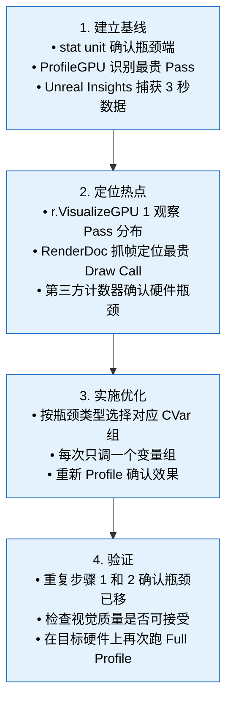

# UE 5.8 渲染性能优化方法论 — 知识卡片

---

## 1. 性能分析工具

### 1.1 Unreal Insights — GPU Profiling 与 Frame 分析

Unreal Insights 是 UE 5 的首选性能分析平台。5.8 中，其 GPU 追踪能力已与 Timeline Wheel 视图深度集成。

| 功能 | 启用方式 | 用途 |
|------|----------|------|
| GPU Timing 追踪 | Insights 启动时勾选 `GPU` 追踪通道 | 捕获 GPU 各 Pass 耗时（Base Pass、Post Processing、Shadow、Lumen 等） |
| Timeline Wheel | 选中帧后切换至 GPU 视图 | 帧内各 Pass 的并发/串行关系可视化，识别 GPU 空闲间隙 |
| 关联 stat 数据 | 追踪时启用 `Stats` 通道 | 将帧内 stat 快照与 GPU 时间线对齐，定位 CVar 开销源头 |
| 内存追踪 | 追踪时启用 `Memory` 通道 | 排查 Render Target 分配与显存压力 |

**最佳实践：**
- 收集追踪数据时在目标设备执行 `Insights.Trace.BufferSizeMB=256` 扩大缓冲区，避免丢帧
- 捕获 3-5 秒（约 180-300 帧）数据，选取帧时间最长的 1% 帧分析
- Timeline Wheel 中关注 `GPU Wait` 与 `GPU Idle` 段——它们是 Stall 与同步瓶颈的直接证据

### 1.2 GPU Visualizer（r.VisualizeGPU）

```
r.VisualizeGPU 1
```

在视口右上角叠加实时 GPU 各 Pass 时间条，颜色编码表示不同 Pass 类型（BasePass 红色、Shadow 蓝色、PostProcess 绿色等）。

**适合场景：**
- 快速确认"哪个 Pass 最贵"——不需要 Insights 级深入
- 对比不同 CVar 组合下的 Pass 时间分布变化
- CI 自动化测试中截取画面验证 GPU 时间分布是否符合预期

**局限性：** 不提供 GPU 内部 Stall 信息，仅显示表面时间。

### 1.3 ProfileGPU / stat GPU

```
ProfileGPU        ← 单帧抓取，输出到日志和控制台
stat GPU          ← 实时行模式，显示每帧各 Pass 平均耗时
```

**ProfileGPU** 对开发期迭代最实用：执行后在下一次 Present 前 dump 出完整的 GPU Pass 树，包含每个 Pass 的耗时、Draw Call 计数、Dispatch 次数。适合跑一遍场景就确认瓶颈在哪个 Pass。

**stat GPU** 适合持续监测：实时更新各 Pass 的帧时间占比。Debug 模式下可配合 `stat unit` 一起看，区分 Game Thread / Render Thread / GPU 哪端是瓶颈。

### 1.4 RenderDoc 集成

UE 5.8 保留了 RenderDoc 内嵌插件，位于 `Plugins/Editor/RenderDocPlugin`。启用后，编辑器工具栏出现 RenderDoc 按钮，一键捕获当前帧。

**典型工作流：**
1. `r.RenderDocument 1`——允许 RenderDoc 劫持 Present
2. 点击工具栏 RenderDoc 按钮捕获单帧
3. 在 RenderDoc 中分析：Draw Call 的事件列表、Shader 反汇编、Texture 与 Buffer 内容、Pipeline State

**关键切入点：**
- 在 RenderDoc 的 Event Browser 中按 GPU 耗时排序，找到最贵的 Draw Call，反查其 Shader 与资源绑定
- 使用 Mesh Viewer 验证顶点/索引数据是否正确
- 检查 Texture 查看器确认 Mip 级别是否正确（带宽浪费常因 Mip 没设对）

### 1.5 第三方 GPU 计数器

| 工具 | 集成方式 | 特长 |
|------|----------|------|
| **NVIDIA Nsight Graphics** | 独立运行，attach UE 进程 | 深度 GPU 性能计数（SM 占用率、内存带宽、L1/L2 命中率） |
| **AMD Radeon GPU Profiler (RGP)** | 独立运行，attach UE 进程 | 异步计算管线、Wave 占用率、Shader 指令级 Stall |
| **Intel GPA** | 独立运行 | 适用于 Intel GPU 的帧分析 |
| **PIX** (Windows) | 独立运行 | DirectX 12 底层调试，D3D12 资源生命周期追踪 |

**适用场景：** 当 ProfileGPU/Unreal Insights 指出某个 Pass 贵，但无法解释"为什么贵"时——第三方计数器的 SM 吞吐率、cache 命中率、寄存器压力等指标能给出硬件级答案。

---

## 2. 常见性能瓶颈

### 2.1 Draw Call 数量与 Instancing

**判断指标：** `stat GPU` 中 `Draw Calls` 数值，或 `ProfileGPU` 中每个 Pass 的 Draw Call 计数。

**瓶颈特征：**
- 单帧 Draw Call 超过 3000-5000（视 GPU 架构不同）
- BasePass 中 Draw Call 数远高于预期（网格未合并、未被 Nanite 接管）

**根因链：**


**应对：**
- Nanite 自动合并网格，减少 Draw Call 数量
- 未走 Nanite 的静态网格使用 `StaticMesh` + 自动 Instancing（`r.InstanceCulling` 控制）
- 草地/粒子使用 GPU Instance Culling（Niagara 内置）

### 2.2 Overdraw 与半透明排序

**判断指标：** `ProfileGPU` 中 `BasePass` 内像素着色器执行时间异常高，或 RenderDoc 中 Pixel History 显示同一像素被多次着色。

**半透明排序瓶颈：** 半透明物体按距离排序成本高，多 Pass 混合导致每像素被写入多次。

**应对：**
- 半透明材质标记为 `Translucency Sort Priority` 分组排序
- 使用 `r.SeparateTranslucency` 分离半透明 Pass
- 考虑用 Ordered Independent Transparency (OIT) 替代传统排序（5.8 实验性支持）
- 减少半透明物体覆盖面积，或改用不透明材质 + 透明纹理作假透明

### 2.3 带宽瓶颈

**判断指标：** (a) 第三方计数器的 VRAM 带宽利用率 > 80%；(b) `ProfileGPU` 中 `Copy` 操作耗时异常；(c) Render Target 过多导致显存带宽饱和。

**常见带宽消耗源：**

| 源 | 消耗等级 | 影响 |
|----|----------|------|
| TAA/Upsampling Pass | 中 | 每帧读写场景颜色缓冲区 |
| Lumen 光照缓存 | 高 | 多帧积累的探针更新 + 帧间 Mix |
| Shadow Map 渲染 | 高 | 多张 Shadow Map 写入 + 采样 |
| Post Processing 链 | 中-高 | Bloom、Tone Mapping、Vignette 等连续 RT 读写 |
| 高分辨率 RT 采样 | 高 | 如 4K 下 BasePass 纹理采样 |

**应对：**
- 降低渲染分辨率（`r.ScreenPercentage`）—— 带宽最直接的缓解手段
- 减少不必要的 RT 分配（`r.SceneRenderTargetsResizeMethod` 控制分配策略）
- TSR 配合低分辨率渲染 + 高质量 Upsample

### 2.4 Shader 复杂度

**判断指标：** RenderDoc 中 Shader 消耗的指令数、寄存器压力，或 `ProfileGPU` 中 `PS` / `VS` 耗时占比异常。

**高复杂度 Shader 的典型表现：**
- BasePass PS 耗时 > 0.5ms
- Shader 占用大量 VGPR（向量寄存器）导致 Wave 占用率下降
- 编译后指令数 > 500 条 ALU 指令

**应对：**
- 材质复杂度限流：`r.MaterialQualityLevel` 切换（低/中/高）
- 开启 `r.OptimizeShaders` 让 UE 编译期做 Shader 优化
- 减少材质中 `WorldPositionOffset`、`Subsurface`、`Clear Coat` 等昂贵节点
- 使用 `ProfileGPU` 定位具体材质，对该材质降级

### 2.5 PSO 变更与状态切换

**判断指标：** `stat rhi` 中 `PSO Change` 计数，或 `ProfileGPU` 中 Pipeline State 切换耗时。

**影响：** 每次 PSO 切换（Blend Mode、Rasterizer State、Depth Stencil 变化）触发 GPU 内部管线刷新，导致 10-100μs 级空闲。

**应对：**
- 按 PSO 排序渲染——UE 5.8 的 Renderer 会自动按 PSO 分组，但非标准材质（如 `Translucent` 混合模式过多）会打乱排序
- 使用 `r.rhicmd.Bypass=0` 关闭 RHI 命令旁路以利调试，但生产环境保持 `1`
- 减少透明材质使用独特的 Blend Mode / Rasterizer State
- 对 Shader 相同的材质使用 `Material Instance Constant` 而非 `MIC` 参数化

### 2.6 GPU 同步与 Stall

**判断指标：** Unreal Insights Timeline Wheel 中 `GPU Wait` 条目，或 `stat rhi` 中 `Wait` 时间。

**根因：**
- Render Thread 等待 GPU 完成上一帧的 Fence
- 跨线程资源的 Readback 未及时完成
- 异步计算提交的 Barrier 等待

**应对：**
- 调整 `rhi.SyncInterval` 控制同步间隔
- 使用 `r.GPUFenceFrameCount` 减少 Fence 数量
- 确保异步计算提交的 Barrier 是最小粒度（`D3D12_BARRIER_SYNC_NONE` 等级别）
- 检查 `r.RHICmdBypass` 关闭时的命令缓冲区提交策略

---

## 3. 优化策略

### 3.1 渲染分辨率缩放

| CVar | 值 | 效果 |
|------|------|------|
| `r.ScreenPercentage` | 50-200 | 直接控制渲染分辨率百分比。100 为原生 |
| `r.TSR.OverrideScreenPercentage` | 50-200 | 仅覆盖 TSR Upsample 阶段的输出分辨率 |
| `r.TemporalAA.Upsampling` | 0/1 | 在 TAA 阶段做 Upsample（比独立 Upsample Pass 更高效） |

**TSR 策略：**
- 对 4K 输出目标，将 `r.ScreenPercentage` 设为 66.7（约 1440p 渲染），由 TSR 上采样到 4K
- 对 1440p 输出目标，设为 77.8（约 1120p 渲染）
- 质量控制：`r.TSR.ShadingRejectionThreshold` 缩放越大，该阈值应越低（默认 0.7，缩放至 50% 时建议 0.3-0.4）

### 3.2 Lumen 降级

Lumen 是 UE 5 中开销最大的子系统之一。降级组合：

```
# 方案 A：关闭 Lumen GI，保留反射
r.Lumen.DiffuseIndirect.Allow 0
r.Lumen.Reflections.Allow 1

# 方案 B：关闭整套 Lumen
r.Lumen.DiffuseIndirect.Allow 0
r.Lumen.Reflections.Allow 0

# 方案 C：降级 Lumen 质量
r.Lumen.AsyncCompute 1                     ← 异步计算分摊成本
r.Lumen.DiffuseIndirect.NumMeshCards 128   ← 减少 Mesh Card 数量（默认 256）
r.Lumen.DiffuseIndirect.NumProbes 4        ← 减少探针数（默认 8）
r.Lumen.Scene.LightingCache.RadianceCache.RadianceProbeClipmapResolution 64  ← 降低缓存分辨率
r.Lumen.Reflections.MaxRayIntensity 0.5    ← 限制反射射线长度
```

**性能影响参考：** 关闭 Lumen GI 可节省 2-4ms 帧时间（视场景复杂度），代价是 GI 退回到 Static Lighting 或 Voxel Lightmap 方案。

### 3.3 Nanite 裁剪

```
r.Nanite.MaxPixelsPerEdge 8               ← 默认 4，增大则减少 Nanite 簇数，降低 GPU 负载
r.Nanite.ImposterMaxPixelsPerEdge 16      ← 为 Imposter 设置更激进的裁剪阈值
r.Nanite.FilterOutSmallObjects 1          ← 自动剔除屏幕投影过小的物体
r.Nanite.ViewDistance 0.5                 ← 缩小 Nanite 渲染距离，超距离回退到 LOD 0
```

**副作用：** 增大 `MaxPixelsPerEdge` 会使远处物体几何细节减少，可能出现可见的 LOD 跳跃。`FilterOutSmallObjects` 可能让远处细小物体消失。

### 3.4 Shadow 优化

```
# 阴影分辨率
r.Shadow.MaxResolution 1024               ← 最大阴影贴图分辨率（默认 2048）
r.Shadow.MaxCSMResolution 1024            ← 级联阴影贴图分辨率
r.Shadow.CSM.MaxCascades 2                ← 级联数（默认 4）

# 动态阴影距离
r.Shadow.RadiusThreshold 0.03             ← 阴影距离阈值（越大越激进，远处阴影消失）
r.Shadow.DistanceScale 0.5                ← 阴影距离缩放

# 接触阴影（Contact Shadow）
r.ContactShadows 0                        ← 关闭接触阴影（开销高）
```

**优先级：** 先调 `r.Shadow.MaxCSMResolution` 和 `r.Shadow.CSM.MaxCascades`，这两个对帧时间影响最大。接触阴影对性能影响显著，移动端建议关闭。

### 3.5 Post Processing 裁剪

```
r.BloomQuality 0                          ← 关闭 Bloom
r.MotionBlurQuality 0                     ← 关闭运动模糊
r.LensFlareQuality 0                      ← 关闭镜头光晕
r.DepthOfFieldQuality 0                   ← 关闭景深
r.Vignette 0                              ← 关闭暗角
r.Tonemapper.GrainQuantization 0          ← 关闭颗粒噪声
r.EyeAdaptation 0                         ← 关闭人眼适应
r.SceneColorFringeQuality 0               ← 关闭色差
```

**性能影响：** 关闭全部 Post Processing 可节省 1-3ms，但画面质量明显下降。建议分场景控制：游戏运行时保留 Bloom + Tone Mapping，编辑器中可全关。

### 3.6 Feature Level 降级（SM5 vs SM6）

```
r.FeatureLevel 4                          ← 4 = SM5（ES 3.1），5 = SM6（5.0+）
r.VirtualTextures 0                       ← 关闭虚拟纹理（SM5 下不支持）
r.AllowStaticLighting 0                   ← SM6 下可关闭以节省开销
```

**权衡：**

| Feature Level | 优势 | 劣势 |
|------------|------|------|
| SM6 (5.0+) | 完整的 UE 5 特性（Nanite、Lumen、Virtual Shadow Maps） | GPU 开销更高 |
| SM5 (4.0) | 兼容性广、GPU 开销低 | 无 Nanite/Lumen、无 Virtual Texture、部分透明功能受限 |

**适用场景：** 移动端或低端 PC 显卡（GTX 1060 级别及以下）建议使用 SM5 路径。

---

## 4. 移动端优化

### 4.1 Mobile Renderer / Forward Renderer

UE 5.8 的移动端渲染路径：

```
r.MobileHDR 0                             ← 关闭 HDR 渲染（降低带宽和精度）
r.Mobile.DisableVertexFog 1               ← 关闭顶点雾
r.Mobile.SkyLightPermutation 0            ← 简化天光计算
r.Mobile.UsePreprocessedShaders 1         ← 使用预编译 Shader（减少运行期编译卡顿）
r.Mobile.EnableStaticAndCSMShadowReceivers 0  ← 减少阴影接收开销
```

**Forward Renderer 特定：** 移动端 `ForwardShading` 路径下，光照计算在 BasePass 内完成，不需要 Deferred Pass。但多光源场景中，每个光照都需要对每个像素重新执行 Shader，开销随光源数量线性增长。

```
r.ForwardShading 1                        ← 启用 Forward Shading
r.ForwardLighting.MaxDynamicPointLights 4 ← 限制动态点光源数量
r.ForwardLightingNumberOfDynamicLocalLights 4
```

### 4.2 Vulkan Mobile 优化策略

```
r.Vulkan.EnableValidation 0               ← 关闭验证层（生产环境）
r.Vulkan.PrefillPools 1                   ← 预填充命令池
r.Vulkan.UseRealUBs 1                     ← 使用真实 Uniform Buffer 而非 Push Constant 模拟
r.Vulkan.DeferredUB 0                     ← 关闭延迟 UB 更新
r.Vulkan.SubmitOnRenderThread 0           ← 允许渲染线程异步提交，减少主线程等待
```

**Vulkan Mobile 特有坑：**
- 部分 Android 设备 Vulkan 驱动对 `StorageBuffer` 支持有限，降级到 `UniformBuffer` 更稳定
- 使用 `r.Vulkan.StripGlslSource` 移除 Shader 源码，减小包体积
- 对 Mali GPU，`r.Vulkan.SubmitOnRenderThread 0` 显著减少帧时间波动

### 4.3 发热与降频控制

```
r.ThermalThrottling.Enabled 1             ← 启用热降频
r.ThermalThrottling.PerformanceLevel 2    ← 降频等级（0=最高性能，1=中，2=低）
r.ThermalThrottling.TargetFPS 30          ← 降频目标帧率
r.FrameRateLimit 30.0                     ← 硬限制帧率
```

**策略：** 移动设备上，优先限制帧率到 30fps，然后在稳定帧率下逐步提升渲染质量。热降频机制应搭配 `r.ScreenPercentage` 动态缩放——当设备温度超过阈值时自动降低渲染分辨率。

---

## 5. Console 优化

### 5.1 ESRAM 管理（Xbox One / 早期 Xbox）

ESRAM 是 Xbox One 家族的 32MB 高速嵌入式 SRAM，显存带宽显著高于主存（DDR3）。UE 5.8 的 ESRAM 分配策略：

```
r.ESRAM.Enable 1                          ← 启用 ESRAM 分配
r.ESRAM.Capacity 32                       ← 指定 ESRAM 容量（MB）
r.ESRAM.Auto 1                            ← 让渲染器自动分配关键 RT 到 ESRAM
```

**手动分配策略：** 将最频繁读写的 RT（Scene Color、Depth Buffer、Shadow Map 中间结果）分配到 ESRAM，减少 DDR3 带宽压力。Xbox Series X|S 已统一为 GDDR6，无 ESRAM 需求。

### 5.2 异步计算优化

```
r.AsyncCompute.Enabled 1                  ← 启用异步计算
r.AsyncCompute.MaxConcurrency 2           ← 最大并发异步计算队列
r.AsyncCompute.KickDelay 0                ← 立即提交
r.AsyncCompute.MinimumPriorityLevel 0     ← 优先级阈值
```

**适用场景：** 异步计算对 GPU 有空闲计算单元的 Console（Xbox Series X、PS5）最有效。将后处理（如 TAA）、Lumen 探针更新、粒子模拟等非渲染依赖的任务移到异步队列，与主渲染管线并行执行。

**最佳实践：**
- Lumen 的异步计算路径：`r.Lumen.AsyncCompute 1`（默认开启）
- 后处理异步计算：`r.PostProcessing.AsyncCompute 1`
- 评价异步计算收益的方法：Unreal Insights 中对比 `GPU Time` 与 `Render Time`——如果异步计算启用后 `GPU Time` 未降，说明异步队列与主队列争用相同计算单元，没有真实收益

### 5.3 固定分辨率策略

Console 上输出分辨率固定（如 4K TV 输出 3840x2160），但渲染分辨率可以动态调整。

```
r.DynamicRes.OperationMode 1              ← 1=固定帧率下动态分辨率，2=固定分辨率下动态帧率
r.DynamicRes.MinScreenPercentage 50.0
r.DynamicRes.MaxScreenPercentage 100.0
r.DynamicRes.TargetFrameTime 33.33        ← 30fps 目标
r.DynamicRes.TriggerThreshold 0.9         ← 帧时间达到 90% 目标时触发降分辨率
```

**PS5 / Xbox Series X 推荐配置：**
- 目标帧率：30fps（重度游戏）或 60fps（竞技类）
- 渲染分辨率基值：约 1440p-1800p，由 TSR 上采样到 4K
- 动态分辨率范围：50% - 100%
- TSR 质量：`r.TSR.History.Snap 0` 避免历史帧闪烁

---

## 6. 关键 CVar 列表

### 6.1 渲染管线控制

| CVar | 默认值 | 优化值 | 效果 | 副作用 |
|------|--------|--------|------|--------|
| `r.ScreenPercentage` | 100 | 50-80 | 降低渲染分辨率 | 画面模糊，需 TSR 补偿 |
| `r.MaterialQualityLevel` | 1 | 0 | 降级材质质量（0=低，1=中，2=高） | 材质效果降低 |
| `r.PostProcessAAQuality` | 6 | 3-4 | 降低抗锯齿质量 | 边缘锯齿增加 |
| `r.DefaultFeature.AntiAliasing` | 2 (TAA) | 0/1 | 切换 AA 方法（0=None, 1=FXAA, 2=TAA, 3=MSAA） | TAA 切换为 FXAA 性能提升但画面闪烁 |
| `r.VertexFoggingForOpaque` | 1 | 0 | 关闭不透明物体顶点雾 | 雾效消失 |
| `r.SimpleDynamicLighting` | 0 | 1 | 降级动态光照为简单模式 | 光照质量下降严重 |

### 6.2 阴影 CVar

| CVar | 默认值 | 优化值 | 效果 | 副作用 |
|------|--------|--------|------|--------|
| `r.Shadow.MaxResolution` | 2048 | 512-1024 | 降低阴影贴图分辨率 | 阴影边缘锯齿 |
| `r.Shadow.CSM.MaxCascades` | 4 | 2-3 | 减少级联阴影级数 | 远距离阴影消失或切换可见 |
| `r.Shadow.RadiusThreshold` | 0.01 | 0.03-0.05 | 增大阴影剔除半径 | 远处阴影缺失 |
| `r.Shadow.DistanceScale` | 1.0 | 0.3-0.7 | 缩小阴影距离 | 阴影截止距离缩短 |
| `r.ContactShadows` | 1 | 0 | 关闭接触阴影 | 物体接触面阴影消失 |
| `r.Shadow.Virtual.Enable` | 1 | 0 | 关闭 Virtual Shadow Map | 退回到传统阴影贴图 |
| `r.Shadow.CacheInvalidate` | 0 | 1 | 强制刷新阴影缓存 | 帧时间短暂增加 |

### 6.3 Lumen CVar

| CVar | 默认值 | 优化值 | 效果 | 副作用 |
|------|--------|--------|------|--------|
| `r.Lumen.DiffuseIndirect.Allow` | 1 | 0 | 关闭 Lumen 漫反射间接光照 | GI 退回到 Static Lighting |
| `r.Lumen.Reflections.Allow` | 1 | 0 | 关闭 Lumen 反射 | 反射退回到 Screen Space Reflections |
| `r.Lumen.DiffuseIndirect.NumMeshCards` | 256 | 64-128 | 减少 Mesh Card 数量 | GI 精度下降 |
| `r.Lumen.DiffuseIndirect.NumProbes` | 8 | 4 | 减少探针数 | 光照过渡更粗糙 |
| `r.Lumen.Scene.LightingCache.RadianceCache.RadianceProbeClipmapResolution` | 128 | 64 | 降低缓存分辨率 | 缓存精度下降 |
| `r.Lumen.FarField` | 1 | 0 | 关闭远场 GI | 远处物体 GI 消失 |
| `r.Lumen.AsyncCompute` | 1 | 1（保持） | 异步计算分摊 Lumen 成本 | 需 GPU 支持异步计算 |

### 6.4 Nanite CVar

| CVar | 默认值 | 优化值 | 效果 | 副作用 |
|------|--------|--------|------|--------|
| `r.Nanite.MaxPixelsPerEdge` | 4 | 8-16 | 增大裁剪阈值，降低 GPU 负载 | 几何细节减少 |
| `r.Nanite.ImposterMaxPixelsPerEdge` | 8 | 16-32 | Imposter 的裁剪阈值 | Imposter 质量下降 |
| `r.Nanite.FilterOutSmallObjects` | 0 | 1 | 剔除小物体 | 细小物体消失 |
| `r.Nanite.ViewDistance` | 1.0 | 0.3-0.7 | 缩小 Nanite 渲染距离 | 超距离物体回退 LOD 0 |
| `r.Nanite.ClusterCulling` | 1 | 1（保持） | 启用簇裁剪 | 不可关闭，关闭后性能大幅下降 |
| `r.Nanite.Streaming` | 1 | 1（保持） | 启用 Nanite 流送 | 关闭后内存占用增加 |

### 6.5 Post Processing CVar

| CVar | 默认值 | 优化值 | 效果 | 副作用 |
|------|--------|--------|------|--------|
| `r.BloomQuality` | 5 | 0-3 | 降低/关闭 Bloom | 泛光效果减弱或消失 |
| `r.MotionBlurQuality` | 4 | 0 | 关闭运动模糊 | 运动画面无模糊 |
| `r.DepthOfFieldQuality` | 2 | 0 | 关闭景深 | 远近景无模糊 |
| `r.LensFlareQuality` | 2 | 0 | 关闭镜头光晕 | 光晕效果消失 |
| `r.Tonemapper.GrainQuantization` | 1 | 0 | 关闭颗粒噪声 | 画面无颗粒 |
| `r.SceneColorFringeQuality` | 1 | 0 | 关闭色差 | 无紫边效果 |
| `r.EyeAdaptation` | 1 | 0 | 关闭人眼适应 | 亮度过渡消失 |
| `r.Vignette` | 1 | 0 | 关闭暗角 | 画面四角无暗角 |
| `r.TemporalAASamples` | 8 | 4 | 减少 TAA 采样数 | 抗锯齿质量下降 |

### 6.6 调试与诊断 CVar

| CVar | 用途 |
|------|------|
| `r.VisualizeGPU 1` | 实时 GPU Pass 时间条 |
| `r.VisualizeLightCulling 1` | 可视化光照裁剪 |
| `r.VisualizeOcclusionQueries 1` | 可视化遮挡查询 |
| `r.ShaderComplexity 1` | 以颜色编码显示 Shader 复杂度（红=贵） |
| `r.ShaderComplexity.Accumulate 1` | 累积模式 |
| `r.LODDebug 1` | 显示 LOD 切换状态 |
| `r.Nanite.Debug 1` | Nanite 调试可视化 |
| `r.Lumen.Visualize 1` | Lumen 可视化 |
| `r.StreamingPool 1` | 纹理流送池可视化 |
| `r.DumpMaterials 1` | 将当前帧材质 dump 到日志（用于排查材质开销） |

### 6.7 性能调优组合推荐

**低端 PC（GTX 1060 / RX 580 级别，目标 60fps @ 1080p）：**
```
r.ScreenPercentage 77.8
r.MaterialQualityLevel 0
r.Shadow.MaxResolution 512
r.Shadow.CSM.MaxCascades 2
r.ContactShadows 0
r.Lumen.DiffuseIndirect.Allow 0
r.Lumen.Reflections.Allow 0
r.Nanite.MaxPixelsPerEdge 8
r.BloomQuality 0
r.MotionBlurQuality 0
r.DepthOfFieldQuality 0
r.PostProcessAAQuality 3
```

**高端 PC（RTX 4080+，目标 60fps @ 4K）：**
```
r.ScreenPercentage 66.7
r.TSR.OverrideScreenPercentage 100
r.MaterialQualityLevel 2
r.Shadow.MaxResolution 2048
r.Shadow.CSM.MaxCascades 4
r.ContactShadows 1
r.Lumen.DiffuseIndirect.Allow 1
r.Lumen.Reflections.Allow 1
r.Lumen.DiffuseIndirect.NumMeshCards 128
r.Nanite.MaxPixelsPerEdge 4
r.BloomQuality 5
r.MotionBlurQuality 4
```

**移动端（目标 30fps）：**
```
r.MobileHDR 0
r.ScreenPercentage 66.7
r.MaterialQualityLevel 0
r.ForwardShading 1
r.ForwardLighting.MaxDynamicPointLights 2
r.Shadow.MaxResolution 256
r.Shadow.CSM.MaxCascades 1
r.ContactShadows 0
r.BloomQuality 0
r.MotionBlurQuality 0
r.DefaultFeature.AntiAliasing 1
r.FrameRateLimit 30.0
r.PostProcessAAQuality 0
```

---

## 7. 性能调优工作流概要



---

*注：本知识卡片基于 UE 5.8 公开信息与引擎源码分析整理。CVar 默认值、优化效果及副作用可能因引擎版本、驱动版本、目标硬件架构不同而变化。实际调优应在目标设备上实测验证。*