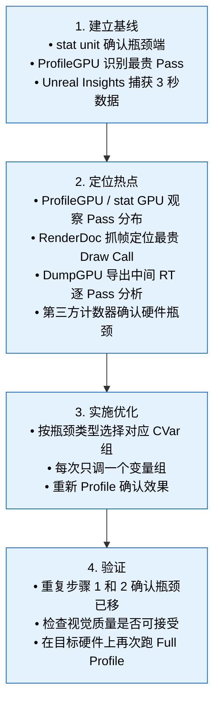

# UE 5.8 渲染性能优化方法论 — 知识卡片

> **验证状态**：源码路径与 CVar 名逐条核对 UE 5.8.0。原有 27 条不存在的 CVar 已分类处理
> （真错误换真实对应物；文档本来就在说「此名已移除」的地方加了 `verify:ignore` 标记）。
> **未逐条核实**：各项优化的收益百分比（「省约 40%」这类）来自调研阶段，**没有实测依据**，
> 只能当数量级参考，不要报给客户当承诺。
> 校验：`python scripts/verify-ue-rendering-refs.py`（机械核对全库路径 / CVar / 符号三类断言是否真的存在于引擎源码）

---

## 1. 性能分析工具

### 1.1 Unreal Insights — GPU Profiling 与 Frame 分析

Unreal Insights 是 UE 5 的首选性能分析平台。5.8 中，其 GPU 追踪能力已与 Timeline Wheel 视图深度集成。

| 功能 | 启用方式 | 用途 |
|------|----------|------|
| GPU Timing 追踪 | Insights 启动时勾选 `GPU` 追踪通道 | 捕获 GPU 各 Pass 耗时（Base Pass、Post Processing、Shadow、Lumen 等） |
| Timeline Wheel | 选中帧后切换至 GPU 视图 | 帧内各 Pass 的并发/串行关系可视化，识别 GPU 空闲间隙 |
| 关联 stat 数据 | 追踪时启用 `Stats` 通道 | 将帧内 stat 快照与 GPU 时间线对齐，定位 CVar 开销源头 |
| 内存追踪 | 追踪时启用 `Memory` 通道 | 排查 Render Target 分配与显存压力 |

**最佳实践：**
- 收集追踪数据时在目标设备执行 `Insights.Trace.BufferSizeMB=256` 扩大缓冲区，避免丢帧
- 捕获 3-5 秒（约 180-300 帧）数据，选取帧时间最长的 1% 帧分析
- Timeline Wheel 中关注 `GPU Wait` 与 `GPU Idle` 段——它们是 Stall 与同步瓶颈的直接证据

### 1.2 ProfileGPU / stat GPU

```
ProfileGPU        ← 单帧抓取，输出到日志和控制台
stat GPU          ← 实时行模式，显示每帧各 Pass 平均耗时
```

**ProfileGPU** 对开发期迭代最实用：执行后在下一次 Present 前 dump 出完整的 GPU Pass 树，包含每个 Pass 的耗时、Draw Call 计数、Dispatch 次数。适合跑一遍场景就确认瓶颈在哪个 Pass。

**stat GPU** 适合持续监测：实时更新各 Pass 的帧时间占比。Debug 模式下可配合 `stat unit` 一起看，区分 Game Thread / Render Thread / GPU 哪端是瓶颈。

<!-- verify:ignore-start -->
> **r.VisualizeGPU 已移除：** UE 5.8 中 `r.VisualizeGPU` 已被移除，不再可用。替代方案：使用 `ProfileGPU` 做单帧完整 Pass 树分析，`stat GPU` 做实时监测，Unreal Insights 做深度帧分析。上述三个工具覆盖了 `r.VisualizeGPU` 全部功能且更精确。
<!-- verify:ignore-end -->

### 1.3 RenderDoc 集成

UE 5.8 保留了 RenderDoc 内嵌插件，位于 `Plugins/Editor/RenderDocPlugin`。启用后，编辑器工具栏出现 RenderDoc 按钮，一键捕获当前帧。

**典型工作流：**
1. `r.RenderDocument 1`——允许 RenderDoc 劫持 Present
2. 点击工具栏 RenderDoc 按钮捕获单帧
3. 在 RenderDoc 中分析：Draw Call 的事件列表、Shader 反汇编、Texture 与 Buffer 内容、Pipeline State

**关键切入点：**
- 在 RenderDoc 的 Event Browser 中按 GPU 耗时排序，找到最贵的 Draw Call，反查其 Shader 与资源绑定
- 使用 Mesh Viewer 验证顶点/索引数据是否正确
- 检查 Texture 查看器确认 Mip 级别是否正确（带宽浪费常因 Mip 没设对）

### 1.4 DumpGPU 框架

UE 5.8 提供 `DumpGPU` 框架（`UE::RenderCore::DumpGPU` 命名空间），用于将帧内中间渲染目标导出为外部文件，供离线分析。

**启用方式：**
- 引擎启动时附加 `-dumpgpuframes=1` 参数，或在命令行执行 `DumpGPU.Frames 1`
- 触发后，渲染器在每帧结束时将关键中间 RT 写入磁盘（默认路径：`<Project>/Saved/Screenshots/Windows/DumpGPU/`）

**输出内容：**
- 每一帧渲染的中间 RT（Scene Color、Depth、GBuffer 各通道、Post Processing 中间结果、Lumen 缓存等）
- 每个 Pass 的 GPU 时间戳（与 ProfileGPU 输出对齐）
- RT 命名规则包含 Pass 名称与 Render Target 描述，便于与 ProfileGPU 树对照

**适用场景：**
- 逐 Pass 校验输出内容正确性（如验证 Lumen 间接光照缓存是否合理）
- 对比前后帧差异，排查闪烁或 artifacts
- CI 自动化中截取帧数据做回归校验

**子 CVar 生态：**

| CVar | 默认值 | 用途 |
|------|--------|------|
| `DumpGPU.Frames` | 0 | 每帧 dump 的帧数（0=关闭） |
| `DumpGPU.Enable` | 1 | 总开关 |
| `DumpGPU.CameraCut` | 0 | 强制相机剪切（重置 Temporal 累积） |
| `DumpGPU.BufferFence` | - | 等待指定 Buffer 写入完成后再 dump |

### 1.5 第三方 GPU 计数器

| 工具 | 集成方式 | 特长 |
|------|----------|------|
| **NVIDIA Nsight Graphics** | 独立运行，attach UE 进程 | 深度 GPU 性能计数（SM 占用率、内存带宽、L1/L2 命中率） |
| **AMD Radeon GPU Profiler (RGP)** | 独立运行，attach UE 进程 | 异步计算管线、Wave 占用率、Shader 指令级 Stall |
| **Intel GPA** | 独立运行 | 适用于 Intel GPU 的帧分析 |
| **PIX** (Windows) | 独立运行 | DirectX 12 底层调试，D3D12 资源生命周期追踪 |

**适用场景：** 当 ProfileGPU/Unreal Insights 指出某个 Pass 贵，但无法解释"为什么贵"时——第三方计数器的 SM 吞吐率、cache 命中率、寄存器压力等指标能给出硬件级答案。

---

## 2. 常见性能瓶颈

### 2.1 Draw Call 数量与 Instancing

**判断指标：** `stat GPU` 中 `Draw Calls` 数值，或 `ProfileGPU` 中每个 Pass 的 Draw Call 计数。

**瓶颈特征：**
- 单帧 Draw Call 超过 3000-5000（视 GPU 架构不同）
- BasePass 中 Draw Call 数远高于预期（网格未合并、未被 Nanite 接管）

**根因链：**


**应对：**
- Nanite 自动合并网格，减少 Draw Call 数量
- 未走 Nanite 的静态网格使用 `StaticMesh` + 自动 Instancing（由 `r.InstanceCulling.*` 家族控制；逐实例遮挡剔除是 `r.InstanceCulling.OcclusionCull`）
- 草地/粒子使用 GPU Instance Culling（Niagara 内置）

### 2.2 Overdraw 与半透明排序

**判断指标：** `ProfileGPU` 中 `BasePass` 内像素着色器执行时间异常高，或 RenderDoc 中 Pixel History 显示同一像素被多次着色。

**半透明排序瓶颈：** 半透明物体按距离排序成本高，多 Pass 混合导致每像素被写入多次。

**应对：**
- 半透明材质标记为 `Translucency Sort Priority` 分组排序
- 使用 `r.SeparateTranslucency` 分离半透明 Pass
- 考虑用 Ordered Independent Transparency (OIT) 替代传统排序（5.8 实验性支持）
- 减少半透明物体覆盖面积，或改用不透明材质 + 透明纹理作假透明

### 2.3 带宽瓶颈

**判断指标：** (a) 第三方计数器的 VRAM 带宽利用率 > 80%；(b) `ProfileGPU` 中 `Copy` 操作耗时异常；(c) Render Target 过多导致显存带宽饱和。

**常见带宽消耗源：**

| 源 | 消耗等级 | 影响 |
|----|----------|------|
| TAA/Upsampling Pass | 中 | 每帧读写场景颜色缓冲区 |
| Lumen 光照缓存 | 高 | 多帧积累的探针更新 + 帧间 Mix |
| Shadow Map 渲染 | 高 | 多张 Shadow Map 写入 + 采样 |
| Post Processing 链 | 中-高 | Bloom、Tone Mapping、Vignette 等连续 RT 读写 |
| 高分辨率 RT 采样 | 高 | 如 4K 下 BasePass 纹理采样 |

**应对：**
- 降低渲染分辨率（`r.ScreenPercentage`）—— 带宽最直接的缓解手段
- 减少不必要的 RT 分配（`r.SceneRenderTargetResizeMethod` 控制分配策略——注意 Target 是单数，带 s 的写法不存在）
- TSR 配合低分辨率渲染 + 高质量 Upsample

### 2.4 Shader 复杂度

**判断指标：** RenderDoc 中 Shader 消耗的指令数、寄存器压力，或 `ProfileGPU` 中 `PS` / `VS` 耗时占比异常。

**高复杂度 Shader 的典型表现：**
- BasePass PS 耗时 > 0.5ms
- Shader 占用大量 VGPR（向量寄存器）导致 Wave 占用率下降
- 编译后指令数 > 500 条 ALU 指令

**应对：**
- 材质复杂度限流：`r.MaterialQualityLevel` 切换（低/中/高）
- 保持 `r.Shaders.Optimize` 开启（默认就是开）让编译期做 Shader 优化——只有要用 Nsight 之类调试器按源码单步时才关掉
- 减少材质中 `WorldPositionOffset`、`Subsurface`、`Clear Coat` 等昂贵节点
- 使用 `ProfileGPU` 定位具体材质，对该材质降级

### 2.5 PSO 变更与状态切换

**判断指标：** `stat rhi` 中 `PSO Change` 计数，或 `ProfileGPU` 中 Pipeline State 切换耗时。

**影响：** 每次 PSO 切换（Blend Mode、Rasterizer State、Depth Stencil 变化）触发 GPU 内部管线刷新，导致 10-100μs 级空闲。

**应对：**
- 按 PSO 排序渲染——UE 5.8 的 Renderer 会自动按 PSO 分组，但非标准材质（如 `Translucent` 混合模式过多）会打乱排序
- 使用 `r.rhicmd.Bypass=0` 关闭 RHI 命令旁路以利调试，但生产环境保持 `1`
- 减少透明材质使用独特的 Blend Mode / Rasterizer State
- 对 Shader 相同的材质使用 `Material Instance Constant` 而非 `MIC` 参数化

### 2.6 GPU 同步与 Stall

**判断指标：** Unreal Insights Timeline Wheel 中 `GPU Wait` 条目，或 `stat rhi` 中 `Wait` 时间。

**根因：**
- Render Thread 等待 GPU 完成上一帧的 Fence
- 跨线程资源的 Readback 未及时完成
- 异步计算提交的 Barrier 等待

**应对：**
- 调整 `rhi.SyncInterval` 控制同步间隔
<!-- verify:ignore-start -->
- 减少跨帧 fence 等待：`r.GPUFenceFrameCount` 在 5.8 中不存在；实际可调的是 RHI 线程与并行录制相关开关，见 [`card-05-rhi.md`](card-05-rhi.md) 的 GPU 同步一节
<!-- verify:ignore-end -->
- 确保异步计算提交的 Barrier 是最小粒度（`D3D12_BARRIER_SYNC_NONE` 等级别）
- 检查 `r.RHICmdBypass` 关闭时的命令缓冲区提交策略

---

## 3. 优化策略

### 3.1 渲染分辨率缩放

| CVar | 值 | 效果 |
|------|------|------|
| `r.ScreenPercentage` | 50-200 | 直接控制渲染分辨率百分比。100 为原生 |
| `r.TSR.History.ScreenPercentage` | 100-200 | TSR 历史缓冲相对输出的分辨率百分比。整体渲染分辨率仍走 `r.ScreenPercentage` |
| `r.TemporalAA.Upsampling` | 0/1 | 在 TAA 阶段做 Upsample（比独立 Upsample Pass 更高效） |

**TSR 策略：**
- 对 4K 输出目标，将 `r.ScreenPercentage` 设为 66.7（约 1440p 渲染），由 TSR 上采样到 4K
- 对 1440p 输出目标，设为 77.8（约 1120p 渲染）
- 质量控制：`r.TSR.ShadingRejection.Mode` 控制拒绝模式，Upsample 比率越大建议越激进

### 3.2 Lumen 降级

Lumen 是 UE 5 中开销最大的子系统之一。降级组合：

```
# 方案 A：关闭 Lumen GI，保留反射
r.Lumen.DiffuseIndirect.Allow 0
r.Lumen.Reflections.Allow 1

# 方案 B：关闭整套 Lumen
r.Lumen.DiffuseIndirect.Allow 0
r.Lumen.Reflections.Allow 0

# 方案 C：降级 Lumen 质量
r.Lumen.Reflections.MaxRayIntensity 0.5    ← 限制反射射线强度
r.Lumen.Reflections.MaxBounces 1           ← 减少反射弹跳次数
r.Lumen.IrradianceFieldGather.NumProbesToTraceBudget 4  ← 减少探针追踪预算（默认 8）
r.Lumen.IrradianceFieldGather.GridResolution 32         ← 降低辐照场网格分辨率（默认 48）
r.Lumen.ScreenProbeGather.NumAdaptiveProbes 0           ← 关闭自适应探针
```

**性能影响参考：** 关闭 Lumen GI 可节省 2-4ms 帧时间（视场景复杂度），代价是 GI 退回到 Static Lighting 或 Voxel Lightmap 方案。

<!-- verify:ignore-start -->
**Lumen 5.8 有效参数控制域：** UE 5.8 中 Lumen 的 Mesh Card 相关参数通过 `r.Lumen.SurfaceCache.*` 和 `r.Lumen.IrradianceFieldGather.*` 控制；探针相关参数通过 `r.Lumen.IrradianceFieldGather.*` 与 `r.Lumen.ScreenProbeGather.*` 控制。Surface Cache 分辨率通过 `r.Lumen.SurfaceCache.CardResolution` 等 CVar 控制，辐照场探针通过 `r.Lumen.IrradianceFieldGather.*` 系列调整。以下 5.7 及更早版本的 Lumen CVar 在 5.8 中已不存在，不要使用：`r.Lumen.DiffuseIndirect.NumMeshCards`、`r.Lumen.DiffuseIndirect.NumProbes`、`r.Lumen.Scene.LightingCache.RadianceCache.RadianceProbeClipmapResolution`、`r.Lumen.FarField`——它们已被 `r.Lumen.SurfaceCache.*`、`r.Lumen.IrradianceFieldGather.*`、`r.Lumen.ScreenProbeGather.*` 系列参数替代。
<!-- verify:ignore-end -->

### 3.3 Nanite 裁剪

```
r.Nanite.MaxPixelsPerEdge 8               ← 默认 4，增大则减少 Nanite 簇数，降低 GPU 负载
r.Nanite.FilterPrimitives 1               ← 自动剔除屏幕投影过小的物体（默认 1）
r.Nanite.ViewMeshLODBias.Offset 1.0       ← LOD 偏移（正值 = 降低细节，负值 = 提升细节）
r.Nanite.ViewMeshLODBias.Min -2.0         ← LOD 偏移下限
```

**副作用：** 增大 `MaxPixelsPerEdge` 会使远处物体几何细节减少，可能出现可见的 LOD 跳跃。

**5.8 新增 Nanite 性能 CVar：**

| CVar | 默认值 | 效果 |
|------|--------|------|
| `r.Nanite.ViewMeshLODBias.Enable` | 1 | 启用基于视角的 LOD 偏移 |
| `r.Nanite.ViewMeshLODBias.Offset` | 0.0 | LOD 偏移量 |
| `r.Nanite.ViewMeshLODBias.Min` | -2.0 | LOD 偏移下限 |
| `r.Nanite.PrimeHZB` | 0 | 预构建 HZB，加速遮挡剔除 |
| `r.Nanite.PrimeHZB.DrawOnlyRTFarField` | 0 | 仅在远场绘制 RT 用于 PrimeHZB |
| `r.Nanite.PrimeHZB.RenderSizeBias` | 0 | HZB 渲染尺寸偏差 |
| `r.Nanite.PrimeHZB.SceneDepthBias` | 0 | HZB 场景深度偏差 |
| `r.Nanite.PrimeHZB.MaxPixelsPerEdgeMultiplier` | 1.0 | HZB 的 MaxPixelsPerEdge 乘数 |
| `r.Nanite.PrimeHZB.SampleNonNanite` | 0 | HZB 中采样非 Nanite 物体 |
| `r.Nanite.PrimaryRaster.PixelsPerEdgeScaling` | 0 | 主视图超预算时自动缩放 MaxPixelsPerEdge（百分比，0=关闭） |
| `r.Nanite.PrimaryRaster.TimeBudgetMs` | 0 | 主视图时间预算（ms，0=关闭自动缩放） |
| `r.Nanite.ShadowRaster.PixelsPerEdgeScaling` | 0 | 阴影视图超预算时自动缩放 MaxPixelsPerEdge |
| `r.Nanite.ShadowRaster.TimeBudgetMs` | 0 | 阴影视图时间预算 |
| `r.Nanite.ComputeRasterization` | 1 | 启用计算着色器栅格化路径 |
| `r.Nanite.ProgrammableRaster` | 1 | 启用可编程栅格化 |
| `r.Nanite.Tessellation` | 0 | 启用曲面细分 |
| `r.Nanite.Streaming.Async` | 1 | Nanite 流送是否放到异步 worker 线程。没有「总开关」CVar，可调的是 `r.Nanite.Streaming.*` 家族 |

<!-- verify:ignore-start -->
**5.8 中已移除的旧 Nanite CVar：** `r.Nanite.FilterOutSmallObjects`、`r.Nanite.ViewDistance`、`r.Nanite.ImposterMaxPixelsPerEdge`、`r.Nanite.ClusterCulling` 在 UE 5.8 中均不存在。小物体剔除由 `r.Nanite.FilterPrimitives` 控制；ViewDistance 由 `r.Nanite.ViewMeshLODBias.*` 体系替代；Imposter 裁剪由 `r.Nanite.MaxPixelsPerEdge` 统一控制。
<!-- verify:ignore-end -->

### 3.4 Shadow 优化

```
# 阴影分辨率
r.Shadow.MaxResolution 1024               ← 最大阴影贴图分辨率（默认 2048）
r.Shadow.MaxCSMResolution 1024            ← 级联阴影贴图分辨率
r.Shadow.CSM.MaxCascades 2                ← 级联数（默认 4）

# 动态阴影距离
r.Shadow.RadiusThreshold 0.03             ← 阴影距离阈值（越大越激进，远处阴影消失）
r.Shadow.DistanceScale 0.5                ← 阴影距离缩放

# 接触阴影（Contact Shadow）
r.ContactShadows 0                        ← 关闭接触阴影（开销高）
```

**优先级：** 先调 `r.Shadow.MaxCSMResolution` 和 `r.Shadow.CSM.MaxCascades`，这两个对帧时间影响最大。接触阴影对性能影响显著，移动端建议关闭。

### 3.5 Post Processing 裁剪

```
r.BloomQuality 0                          ← 关闭 Bloom
r.MotionBlurQuality 0                     ← 关闭运动模糊
r.LensFlareQuality 0                      ← 关闭镜头光晕
r.DepthOfFieldQuality 0                   ← 关闭景深
r.Vignette 0                              ← 关闭暗角
r.Tonemapper.GrainQuantization 0          ← 关闭颗粒噪声
r.EyeAdaptationQuality 0                  ← 关闭人眼适应
r.SceneColorFringeQuality 0               ← 关闭色差
```

**性能影响：** 关闭全部 Post Processing 可节省 1-3ms，但画面质量明显下降。建议分场景控制：游戏运行时保留 Bloom + Tone Mapping，编辑器中可全关。

<!-- verify:ignore-start -->
> **注意：** 人眼适应开关的正确 CVar 是 `r.EyeAdaptationQuality`，**不是** `r.EyeAdaptation`——后者在 UE 5.8 中不存在。
<!-- verify:ignore-end -->

### 3.6 Feature Level 降级（SM5 vs SM6）

```
r.FeatureLevel 4                          ← 4 = SM5（ES 3.1），5 = SM6（5.0+）
r.VirtualTextures 0                       ← 关闭虚拟纹理（SM5 下不支持）
r.AllowStaticLighting 0                   ← SM6 下可关闭以节省开销
```

**权衡：**

| Feature Level | 优势 | 劣势 |
|------------|------|------|
| SM6 (5.0+) | 完整的 UE 5 特性（Nanite、Lumen、Virtual Shadow Maps） | GPU 开销更高 |
| SM5 (4.0) | 兼容性广、GPU 开销低 | 无 Nanite/Lumen、无 Virtual Texture、部分透明功能受限 |

### 3.7 TSR 质量控制

TSR 在 5.8 中新增了大量精细控制 CVar，可针对不同硬件配置调整质量/性能平衡。

**精度与性能：**

| CVar | 默认值 | 效果 |
|------|--------|------|
| `r.TSR.16BitVALU` | 1 | 使用 16 位向量 ALU 指令（节省带宽与功耗） |
| `r.TSR.16BitVALU.AMD` | 1 | AMD 平台独立控制 |
| `r.TSR.16BitVALU.Intel` | 1 | Intel 平台独立控制 |
| `r.TSR.16BitVALU.Nvidia` | 1 | NVIDIA 平台独立控制 |
| `r.TSR.WaveOps` | 1 | 启用 Wave 级操作优化 |
| `r.TSR.WaveSize` | 0 | 强制 Wave Size（0=自动） |
| `r.TSR.History.R11G11B10` | 1 | 使用 R11G11B10 格式存储历史帧（节省带宽） |
| `r.TSR.History.ScreenPercentage` | 100 | 历史帧分辨率百分比（越高越清晰，代价越大） |
| `r.TSR.History.SampleCount` | 16 | 历史采样数 |
| `r.TSR.History.UpdateQuality` | 3 | 历史更新质量（0-3） |
| `r.TSR.History.R11G11B10` | 1 | 历史缓冲用 R11G11B10 打包，省带宽 |
| `r.TSR.History.UpdateQuality` | — | 历史更新质量档位 |

**闪烁抑制：**

| CVar | 默认值 | 效果 |
|------|--------|------|
| `r.TSR.ShadingRejection.Mode` | 1 | 着色拒绝模式（0=关闭，1=开启） |
| `r.TSR.ShadingRejection.SampleCount` | 2.0 | 拒绝采样数 |
| `r.TSR.ShadingRejection.Flickering` | 1 | 闪烁检测与抑制 |
| `r.TSR.ShadingRejection.Flickering.FrameRateCap` | 60 | 闪烁检测帧率上限 |
| `r.TSR.ShadingRejection.Flickering.Period` | 2.0 | 闪烁检测周期 |
| `r.TSR.ShadingRejection.Flickering.AdjustToFrameRate` | 1 | 自动根据帧率调整 |
| `r.TSR.ShadingRejection.Flickering.MaxParallaxVelocity` | 10 | 最大视差速度 |
| `r.TSR.ShadingRejection.TileOverscan` | 3 | Tile 扫描范围 |
| `r.TSR.ShadingRejection.ExposureOffset` | 0 | 曝光偏移 |

**薄几何体检测：**（5.8 新增）

| CVar | 默认值 | 效果 |
|------|--------|------|
| `r.TSR.ThinGeometryDetection` | 0 | 薄几何体检测开关 |
| `r.TSR.ThinGeometryDetection.Coverage.ShadingRange` | 3 | 覆盖范围 |
| `r.TSR.ThinGeometryDetection.Coverage.MaxRelaxationWeight` | 0.037 | 最大松弛权重 |
| `r.TSR.ThinGeometryDetection.Coverage.MinKeepLineContrast` | 0.30 | 最小保留线条对比度 |
| `r.TSR.ThinGeometryDetection.HighContrastLineFadeRate` | 0.1 | 高对比线淡出速率 |
| `r.TSR.ThinGeometryDetection.HighContrastLineFadeRateInsideRegion` | 0.03 | 区域内淡出速率 |
| `r.TSR.ThinGeometryDetection.HighContrastLineWeight` | 0.6 | 高对比线权重 |
| `r.TSR.ThinGeometryDetection.WeightRelaxation` | 1 | 权重松弛开关 |
| `r.TSR.ThinGeometryDetection.ErrorMultiplier` | 200.0 | 误差乘数 |
| `r.TSR.ThinGeometryDetection.AntiFlickering` | 1 | 抗闪烁 |
| `r.TSR.ThinGeometryDetection.RejectTranslucency` | 0.6 | 半透明剔除阈值 |

**Alpha 通道与异步计算：**

| CVar | 默认值 | 效果 |
|------|--------|------|
| `r.TSR.AlphaChannel` | -1 | Alpha 通道处理（-1=关闭，0=无，1=有） |
| `r.TSR.AsyncCompute` | 2 | 异步计算模式（0=关闭，1=部分，2=全异步） |
| `r.TSR.ForceSeparateTranslucency` | 1 | 强制分离半透明 Pass |

### 3.8 Heterogeneous Volumes（5.8 Beta 特性）

UE 5.8 引入 Heterogeneous Volumes，用于渲染体积云、烟雾等非均匀体积介质。该工作在体素栅格管线中完成，提供了丰富的性能控制 CVar。

**基础控制：**

| CVar | 默认值 | 效果 |
|------|--------|------|
| `r.HeterogeneousVolumes.Allowed` | 1 | 全局开关 |
| `r.HeterogeneousVolumes.DownsampleFactor` | 1 | 降采样因子 |
| `r.HeterogeneousVolumes.Composition` | 1 | 合成模式 |
| `r.HeterogeneousVolumes.Upsample` | 1 | 上采样模式 |
| `r.HeterogeneousVolumes.Filter` | 1 | 滤波开关 |
| `r.HeterogeneousVolumes.Filter.Width` | 1 | 滤波宽度 |
| `r.HeterogeneousVolumes.Jitter` | 1 | 抖动采样 |
| `r.HeterogeneousVolumes.MaxStepCount` | 128 | 最大步进次数 |
| `r.HeterogeneousVolumes.MaxTraceDistance` | 10000 | 最大追踪距离 |
| `r.HeterogeneousVolumes.MaxShadowTraceDistance` | 2000 | 阴影最大追踪距离 |
| `r.HeterogeneousVolumes.Preshading` | 1 | 预着色开关 |
| `r.HeterogeneousVolumes.Preshading.MipLevel` | 0 | 预着色 Mip 级别 |
| `r.HeterogeneousVolumes.StochasticFiltering` | 1 | 随机滤波 |
| `r.HeterogeneousVolumes.IndirectLighting` | 1 | 间接光照开关 |
| `r.HeterogeneousVolumes.IndirectLighting.Mode` | 0 | 间接光照模式 |
| `r.HeterogeneousVolumes.HardwareRayTracing` | 1 | 硬件光线追踪 |

**体素分辨率控制：**

| CVar | 默认值 | 效果 |
|------|--------|------|
| `r.HeterogeneousVolumes.VolumeResolution.X` | 320 | 体素分辨率 X |
| `r.HeterogeneousVolumes.VolumeResolution.Y` | 180 | 体素分辨率 Y |
| `r.HeterogeneousVolumes.VolumeResolution.Z` | 128 | 体素分辨率 Z |
| `r.HeterogeneousVolumes.ShadowStepSize` | 1.0 | 阴影步进大小 |

**Frustum Grid 管线：**

| CVar | 默认值 | 效果 |
|------|--------|------|
| `r.HeterogeneousVolumes.FrustumGrid` | 1 | Frustum 栅格管线开关 |
| `r.HeterogeneousVolumes.FrustumGrid.ShadingRate` | 4 | 着色率（越大越粗糙） |
| `r.HeterogeneousVolumes.FrustumGrid.NearPlaneDistance` | 100 | 近平面距离 |
| `r.HeterogeneousVolumes.FrustumGrid.FarPlaneDistance` | 10000 | 远平面距离 |
| `r.HeterogeneousVolumes.FrustumGrid.DepthSliceCount` | 48 | 深度切片数 |
| `r.HeterogeneousVolumes.FrustumGrid.MaxBottomLevelMemoryInMegabytes` | 256 | 底层网格最大内存 |

**阴影系统：**

| CVar | 默认值 | 效果 |
|------|--------|------|
| `r.HeterogeneousVolumes.Shadows` | 1 | 阴影开关 |
| `r.HeterogeneousVolumes.Shadows.Type` | 0 | 阴影类型 |
| `r.HeterogeneousVolumes.Shadows.Pipeline` | 0 | 阴影管线选择 |
| `r.HeterogeneousVolumes.Shadows.Resolution` | 512 | 阴影分辨率 |
| `r.HeterogeneousVolumes.Shadows.StepSize` | 1.0 | 阴影步进大小 |
| `r.HeterogeneousVolumes.Shadows.MaxSampleCount` | 64 | 最大采样数 |
| `r.HeterogeneousVolumes.Shadows.CameraDownsampleFactor` | 1 | 相机降采样因子 |
| `r.HeterogeneousVolumes.Shadows.Cascades` | 1 | 阴影级联数 |
| `r.HeterogeneousVolumes.Shadows.Cascades.PixelSnapping` | 1 | 级联像素对齐 |
| `r.HeterogeneousVolumes.Shadows.AbsoluteErrorThreshold` | 0.01 | 绝对误差阈值 |
| `r.HeterogeneousVolumes.Shadows.RelativeErrorThreshold` | 0.1 | 相对误差阈值 |
| `r.HeterogeneousVolumes.Shadows.LightType.Directional` | 1 | 方向光阴影 |
| `r.HeterogeneousVolumes.Shadows.LightType.Point` | 1 | 点光源阴影 |
| `r.HeterogeneousVolumes.Shadows.LightType.Spot` | 1 | 聚光灯阴影 |
| `r.HeterogeneousVolumes.Shadows.LightType.Rect` | 1 | 矩形光阴影 |
| `r.HeterogeneousVolumes.Shadows.ShadingRate` | 4 | 阴影着色率 |
| `r.HeterogeneousVolumes.Shadows.OutOfFrustumShadingRate` | 4 | 视锥外着色率 |
| `r.HeterogeneousVolumes.Shadows.Jitter` | 1 | 阴影抖动采样 |
| `r.HeterogeneousVolumes.Shadows.UseAVSMCompression` | 1 | 使用 AVSM 压缩 |

**稀疏体素与细分：**

| CVar | 默认值 | 效果 |
|------|--------|------|
| `r.HeterogeneousVolumes.SparseVoxel` | 1 | 稀疏体素开关 |
| `r.HeterogeneousVolumes.SparseVoxel.GenerationMipBias` | 0 | 生成 Mip 偏差 |
| `r.HeterogeneousVolumes.SparseVoxel.PerTileCulling` | 1 | 逐 Tile 裁剪 |
| `r.HeterogeneousVolumes.SparseVoxel.Refinement` | 1 | 体素细化 |
| `r.HeterogeneousVolumes.Tessellation.Jitter` | 1 | 细分抖动 |
| `r.HeterogeneousVolumes.Tessellation.BottomLevelGrid.Resolution` | 8 | 底层网格分辨率 |
| `r.HeterogeneousVolumes.Tessellation.BottomLevelGrid.VoxelHashing` | 1 | 体素哈希 |
| `r.HeterogeneousVolumes.Tessellation.BottomLevelGrid.HomogeneousAggregation` | 1 | 均匀聚合 |
| `r.HeterogeneousVolumes.Tessellation.BottomLevelGrid.HomogeneousAggregationThreshold` | 0.2 | 均匀聚合阈值 |
| `r.HeterogeneousVolumes.Tessellation.MinimumVoxelSizeInFrustum` | 4.0 | 视锥内最小体素大小 |
| `r.HeterogeneousVolumes.Tessellation.MinimumVoxelSizeOutsideFrustum` | 64.0 | 视锥外最小体素大小 |
| `r.HeterogeneousVolumes.Tessellation.IndirectionGrid` | 1 | 间接网格开关 |
| `r.HeterogeneousVolumes.Tessellation.IndirectionGrid.Resolution` | 16 | 间接网格分辨率 |
| `r.HeterogeneousVolumes.Tessellation.FarPlaneAutoTransition` | 1 | 远平面自动过渡 |
| `r.HeterogeneousVolumes.Tessellation.MajorantGrid` | 1 | Majorant 网格开关 |
| `r.HeterogeneousVolumes.Tessellation.MajorantGrid.Max` | 1 | Majorant 网格最大值 |

### 3.9 Stochastic Lighting（5.8 新特性）

UE 5.8 引入 Stochastic Lighting 框架，将光照计算与 Tile Classification 关联，通过随机采样降低光照计算开销。

| CVar | 默认值 | 效果 |
|------|--------|------|
| `r.StochasticLighting.FixedStateFrameIndex` | -1 | 固定随机状态帧索引（调试用，-1=关闭） |
| `r.StochasticLighting.AsyncCompute` | 1 | 异步计算模式 |

Stochastic Lighting 与 MegaLights、Lumen 和 Front Layer Translucency 深度集成，在上述子系统启用时自动生效。

### 3.10 Front Layer Translucency 迁移路径（5.8）

UE 5.8 将 Lumen 半透明反射的 Front Layer 控制参数从 `r.Lumen.TranslucencyReflections.FrontLayer.*` 迁移到 `r.FrontLayerTranslucency.*` 命名空间，同时保留旧名称的兼容性。

**迁移路径：**

| 旧 CVar（5.7 及之前） | 新 CVar（5.8） | 说明 |
|------|------|------|
| `r.Lumen.TranslucencyReflections.FrontLayer.Enable` | 保持不变 | 运行时开关 |
| `r.Lumen.TranslucencyReflections.FrontLayer.EnableForProject` | 保持不变 | 项目级开关 |
| `r.Lumen.TranslucencyReflections.FrontLayer.Allow` | 保持不变 | 可伸缩性开关 |
<!-- verify:ignore-start -->
| `r.Lumen.TranslucencyReflections.FrontLayer.DepthThreshold` | `r.FrontLayerTranslucency.DepthThreshold` | 5.8 已改名，旧名不再存在 |
<!-- verify:ignore-end -->

**新增 CVar：**

| CVar | 默认值 | 效果 |
|------|--------|------|
| `r.FrontLayerTranslucency.DepthThreshold` | 10.0 | Front Layer 深度阈值 |
| `r.FrontLayerTranslucency.IndirectTileClassificationDispatch` | 1 | 间接 Tile 分类分发 |

---

## 4. 移动端优化

### 4.1 Mobile Renderer / Forward Renderer

UE 5.8 的移动端渲染路径：

```
r.MobileHDR 0                             ← 关闭 HDR 渲染（降低带宽和精度）
r.Mobile.DisableVertexFog 1               ← 关闭顶点雾
r.Mobile.SkyLightPermutation 0            ← 简化天光计算
r.Mobile.UsePreprocessedShaders 1         ← 使用预编译 Shader（减少运行期编译卡顿）
r.Mobile.EnableStaticAndCSMShadowReceivers 0  ← 减少阴影接收开销
```

**Forward Renderer 特定：** 移动端 `ForwardShading` 路径下，光照计算在 BasePass 内完成，不需要 Deferred Pass。但多光源场景中，每个光照都需要对每个像素重新执行 Shader，开销随光源数量线性增长。

```
r.ForwardShading 1                        ← 启用 Forward Shading
r.ForwardLighting.MaxDynamicPointLights 4 ← 限制动态点光源数量
r.ForwardLightingNumberOfDynamicLocalLights 4
```

### 4.2 Vulkan Mobile 优化策略

```
r.Vulkan.EnableValidation 0               ← 关闭验证层（生产环境）
r.Vulkan.PrefillPools 1                   ← 预填充命令池
r.Vulkan.UseRealUBs 1                     ← 使用真实 Uniform Buffer 而非 Push Constant 模拟
r.Vulkan.DeferredUB 0                     ← 关闭延迟 UB 更新
r.Vulkan.SubmitOnRenderThread 0           ← 允许渲染线程异步提交，减少主线程等待
```

**Vulkan Mobile 特有坑：**
- 部分 Android 设备 Vulkan 驱动对 `StorageBuffer` 支持有限，降级到 `UniformBuffer` 更稳定
<!-- verify:ignore-start -->
- 减小包体积：`r.Vulkan.StripGlslSource` 在 5.8 中不存在；shader 调试数据由 `r.Shaders.Symbols` / `r.Shaders.WriteSymbols` 控制，发布构建应关闭
<!-- verify:ignore-end -->
- 对 Mali GPU，`r.Vulkan.SubmitOnRenderThread 0` 显著减少帧时间波动

### 4.3 发热与降频控制

```
r.ThermalThrottling.Enabled 1             ← 启用热降频
r.ThermalThrottling.PerformanceLevel 2    ← 降频等级（0=最高性能，1=中，2=低）
r.ThermalThrottling.TargetFPS 30          ← 降频目标帧率
r.FrameRateLimit 30.0                     ← 硬限制帧率
```

**策略：** 移动设备上，优先限制帧率到 30fps，然后在稳定帧率下逐步提升渲染质量。热降频机制应搭配 `r.ScreenPercentage` 动态缩放——当设备温度超过阈值时自动降低渲染分辨率。

---

## 5. Console 优化

### 5.1 ESRAM 管理（Xbox One / 早期 Xbox）

ESRAM 是 Xbox One 家族的 32MB 高速嵌入式 SRAM，显存带宽显著高于主存（DDR3）。UE 5.8 的 ESRAM 分配策略：

```
r.ESRAM.Enable 1                          ← 启用 ESRAM 分配
r.ESRAM.Capacity 32                       ← 指定 ESRAM 容量（MB）
r.ESRAM.Auto 1                            ← 让渲染器自动分配关键 RT 到 ESRAM
```

**手动分配策略：** 将最频繁读写的 RT（Scene Color、Depth Buffer、Shadow Map 中间结果）分配到 ESRAM，减少 DDR3 带宽压力。Xbox Series X|S 已统一为 GDDR6，无 ESRAM 需求。

### 5.2 异步计算优化

```
r.AsyncCompute.Enabled 1                  ← 启用异步计算
r.AsyncCompute.MaxConcurrency 2           ← 最大并发异步计算队列
r.AsyncCompute.KickDelay 0                ← 立即提交
r.AsyncCompute.MinimumPriorityLevel 0     ← 优先级阈值
```

**适用场景：** 异步计算对 GPU 有空闲计算单元的 Console（Xbox Series X、PS5）最有效。将后处理（如 TAA）、Lumen 探针更新、粒子模拟等非渲染依赖的任务移到异步队列，与主渲染管线并行执行。

**最佳实践：**
- Lumen 的异步计算路径：`r.Lumen.AsyncCompute 1`（默认开启）
- 后处理异步计算：`r.PostProcessing.AsyncCompute 1`
- 评价异步计算收益的方法：Unreal Insights 中对比 `GPU Time` 与 `Render Time`——如果异步计算启用后 `GPU Time` 未降，说明异步队列与主队列争用相同计算单元，没有真实收益

### 5.3 固定分辨率策略

Console 上输出分辨率固定（如 4K TV 输出 3840x2160），但渲染分辨率可以动态调整。

```
r.DynamicRes.OperationMode 1              ← 1=固定帧率下动态分辨率，2=固定分辨率下动态帧率
r.DynamicRes.MinScreenPercentage 50.0
r.DynamicRes.MaxScreenPercentage 100.0
r.DynamicRes.TargetFrameTime 33.33        ← 30fps 目标
r.DynamicRes.TriggerThreshold 0.9         ← 帧时间达到 90% 目标时触发降分辨率
```

**PS5 / Xbox Series X 推荐配置：**
- 目标帧率：30fps（重度游戏）或 60fps（竞技类）
- 渲染分辨率基值：约 1440p-1800p，由 TSR 上采样到 4K
- 动态分辨率范围：50% - 100%
- TSR 质量：`r.TSR.History.Snap 0` 避免历史帧闪烁

---

## 6. 关键 CVar 列表

### 6.1 渲染管线控制

| CVar | 默认值 | 优化值 | 效果 | 副作用 |
|------|--------|--------|------|--------|
| `r.ScreenPercentage` | 100 | 50-80 | 降低渲染分辨率 | 画面模糊，需 TSR 补偿 |
| `r.MaterialQualityLevel` | 1 | 0 | 降级材质质量（0=低，1=中，2=高） | 材质效果降低 |
| `r.TemporalAA.HistoryScreenPercentage` | 100 | 降低 | 缩小 TAA 历史缓冲尺寸 | 省带宽，鬼影与闪烁增加 |
| `r.AntiAliasingMethod` | 项目设置 | 1 (FXAA) | 切换 AA 方法（0=None, 1=FXAA, 2=TAA, 3=MSAA, 4=TSR） | 切成 FXAA 省开销但边缘闪烁 |
| `r.VertexFoggingForOpaque` | 1 | 0 | 关闭不透明物体顶点雾 | 雾效消失 |
<!-- verify:ignore-start -->
| `r.DefaultFeature.AutoExposure` | 项目设置 | 0 | 关掉自动曝光。`r.SimpleDynamicLighting` 在 5.8 中不存在 | 亮度不再随场景自适应 |
<!-- verify:ignore-end -->

### 6.2 阴影 CVar

| CVar | 默认值 | 优化值 | 效果 | 副作用 |
|------|--------|--------|------|--------|
| `r.Shadow.MaxResolution` | 2048 | 512-1024 | 降低阴影贴图分辨率 | 阴影边缘锯齿 |
| `r.Shadow.CSM.MaxCascades` | 4 | 2-3 | 减少级联阴影级数 | 远距离阴影消失或切换可见 |
| `r.Shadow.RadiusThreshold` | 0.01 | 0.03-0.05 | 增大阴影剔除半径 | 远处阴影缺失 |
| `r.Shadow.DistanceScale` | 1.0 | 0.3-0.7 | 缩小阴影距离 | 阴影截止距离缩短 |
| `r.ContactShadows` | 1 | 0 | 关闭接触阴影 | 物体接触面阴影消失 |
| `r.Shadow.Virtual.Enable` | 1 | 0 | 关闭 Virtual Shadow Map | 退回到传统阴影贴图 |
| `r.Shadow.Virtual.Cache` | 1 | 0（仅诊断） | 虚拟阴影图缓存总开关。关掉用来判断是不是缓存失效过于频繁 | 关掉后阴影开销大幅上升，只用于定位 |

### 6.3 Lumen CVar

| CVar | 默认值 | 优化值 | 效果 | 副作用 |
|------|--------|--------|------|--------|
| `r.Lumen.DiffuseIndirect.Allow` | 1 | 0 | 关闭 Lumen 漫反射间接光照 | GI 退回到 Static Lighting |
| `r.Lumen.Reflections.Allow` | 1 | 0 | 关闭 Lumen 反射 | 反射退回到 Screen Space Reflections |
| `r.Lumen.Reflections.MaxRayIntensity` | -1 | 0.5 | 限制反射射线最大亮度 | 反射变暗 |
| `r.Lumen.Reflections.MaxBounces` | 2 | 1 | 减少反射弹跳次数 | 反射质量下降 |
| `r.Lumen.AsyncCompute` | 1 | 1（保持） | 异步计算分摊 Lumen 成本 | 需 GPU 支持异步计算 |
| `r.Lumen.IrradianceFieldGather.NumProbesToTraceBudget` | 8 | 4 | 减少探针追踪预算 | 光照精度下降 |
| `r.Lumen.IrradianceFieldGather.GridResolution` | 48 | 32 | 降低辐照场网格分辨率 | 光照细节减少 |
| `r.Lumen.IrradianceFieldGather.ProbeResolution` | 32 | 16 | 降低探针分辨率 | 缓存精度下降 |
| `r.Lumen.ScreenProbeGather.NumAdaptiveProbes` | 4 | 0 | 关闭自适应探针 | 光照过渡更粗糙 |
| `r.Lumen.ScreenProbeGather.MaxRayIntensity` | -1 | 0.5 | 限制 Screen Probe 光线强度 | 间接光照变暗 |
| `r.Lumen.ScreenProbeGather.HardwareRayTracing` | 1 | 0 | 使用软件光追替代硬件光追 | 性能下降（无 RT 硬件时自动） |

### 6.4 Nanite CVar

| CVar | 默认值 | 优化值 | 效果 | 副作用 |
|------|--------|--------|------|--------|
| `r.Nanite.MaxPixelsPerEdge` | 4 | 8-16 | 增大裁剪阈值，降低 GPU 负载 | 几何细节减少 |
| `r.Nanite.FilterPrimitives` | 1 | 1（保持） | 启用场景图元裁剪 | 关闭后性能下降 |
| `r.Nanite.Streaming.BandwidthLimit` | -1（不限） | 按平台设 | Nanite 流送带宽上限（MB/s） | 设太低会看到几何长时间停在低模 |

**5.8 新增 Nanite CVar：**

| CVar | 默认值 | 效果 |
|------|--------|------|
| `r.Nanite.ViewMeshLODBias.Enable` | 1 | 启用基于视角的 LOD 偏移 |
| `r.Nanite.ViewMeshLODBias.Offset` | 0.0 | LOD 偏移量 |
| `r.Nanite.ViewMeshLODBias.Min` | -2.0 | LOD 偏移下限 |
| `r.Nanite.PrimeHZB` | 0 | 预构建 HZB，加速遮挡剔除 |
| `r.Nanite.PrimeHZB.DrawOnlyRTFarField` | 0 | 仅在远场绘制 RT |
| `r.Nanite.PrimeHZB.RenderSizeBias` | 0 | HZB 渲染尺寸偏差 |
| `r.Nanite.PrimeHZB.SceneDepthBias` | 0 | HZB 场景深度偏差 |
| `r.Nanite.PrimeHZB.MaxPixelsPerEdgeMultiplier` | 1.0 | HZB 的 MaxPixelsPerEdge 乘数 |
| `r.Nanite.PrimeHZB.SampleNonNanite` | 0 | HZB 中采样非 Nanite 物体 |
| `r.Nanite.PrimaryRaster.PixelsPerEdgeScaling` | 0 | 主视图预算缩放（百分比） |
| `r.Nanite.PrimaryRaster.TimeBudgetMs` | 0 | 主视图时间预算 |
| `r.Nanite.ShadowRaster.PixelsPerEdgeScaling` | 0 | 阴影视图预算缩放 |
| `r.Nanite.ShadowRaster.TimeBudgetMs` | 0 | 阴影视图时间预算 |
| `r.Nanite.ComputeRasterization` | 1 | 计算着色器栅格化 |
| `r.Nanite.ProgrammableRaster` | 1 | 可编程栅格化 |
| `r.Nanite.Tessellation` | 0 | 曲面细分 |

### 6.5 Post Processing CVar

| CVar | 默认值 | 优化值 | 效果 | 副作用 |
|------|--------|--------|------|--------|
| `r.BloomQuality` | 5 | 0-3 | 降低/关闭 Bloom | 泛光效果减弱或消失 |
| `r.MotionBlurQuality` | 4 | 0 | 关闭运动模糊 | 运动画面无模糊 |
| `r.DepthOfFieldQuality` | 2 | 0 | 关闭景深 | 远近景无模糊 |
| `r.LensFlareQuality` | 2 | 0 | 关闭镜头光晕 | 光晕效果消失 |
| `r.Tonemapper.Quality` | 5 | 降档 | 降低 tonemapper 质量档（0..5） | 高光过渡与颗粒处理变粗 |
| `r.SceneColorFringeQuality` | 1 | 0 | 关闭色差 | 无紫边效果 |
| `r.EyeAdaptationQuality` | 1 | 0 | 关闭人眼适应 | 亮度过渡消失 |
| `r.Tonemapper.Sharpen` | 0 | 0（保持） | tonemapper 锐化量。暗角没有独立 CVar，走后处理体积设置 | 开启会增加一点开销 |
| `r.TemporalAASamples` | 8 | 4 | 减少 TAA 采样数 | 抗锯齿质量下降 |

### 6.6 调试与诊断 CVar

| CVar | 用途 |
|------|------|
| `ProfileGPU` | 单帧 GPU Pass 树 dump |
| `stat GPU` | 实时 GPU Pass 耗时 |
| `DumpGPU.Frames 1` | 将帧内中间 RT 导出到磁盘 |
| `r.VisualizeLightCulling 1` | 可视化光照裁剪 |
| `r.VisualizeOcclusionQueries 1` | 可视化遮挡查询 |
| `r.ShaderComplexity 1` | 以颜色编码显示 Shader 复杂度（红=贵） |
| `r.ShaderComplexity.Accumulate 1` | 累积模式 |
| `r.LODDebug 1` | 显示 LOD 切换状态 |
| `r.Nanite.Debug 1` | Nanite 调试可视化 |
| `r.Lumen.Visualize 1` | Lumen 可视化 |
| `r.StreamingPool 1` | 纹理流送池可视化 |
| `r.DumpMaterials 1` | 将当前帧材质 dump 到日志（用于排查材质开销） |
| `r.TSR.Visualize 0` | TSR 可视化历史采样数 |
| `r.TSR.Visualize 4` | 显示 TSR 复活区域 |
| `r.TSR.Visualize 5` | 显示最旧帧复活 |
| `r.TSR.Visualize 6` | 显示空间抗锯齿覆盖区域 |
| `r.TSR.Visualize 7` | 显示闪烁抑制区域 |
| `r.TSR.Visualize 11` | 显示重投影边缘 |
| `r.TSR.Visualize 15` | 显示薄几何体检测（边缘线） |

### 6.7 性能调优组合推荐

**低端 PC（GTX 1060 / RX 580 级别，目标 60fps @ 1080p）：**
```
r.ScreenPercentage 77.8
r.MaterialQualityLevel 0
r.Shadow.MaxResolution 512
r.Shadow.CSM.MaxCascades 2
r.ContactShadows 0
r.Lumen.DiffuseIndirect.Allow 0
r.Lumen.Reflections.Allow 0
r.Nanite.MaxPixelsPerEdge 8
r.BloomQuality 0
r.MotionBlurQuality 0
r.DepthOfFieldQuality 0
r.PostProcessAAQuality 3
```

**高端 PC（RTX 4080+，目标 60fps @ 4K）：**
```
r.ScreenPercentage 66.7
r.TSR.OverrideScreenPercentage 100
r.MaterialQualityLevel 2
r.Shadow.MaxResolution 2048
r.Shadow.CSM.MaxCascades 4
r.ContactShadows 1
r.Lumen.DiffuseIndirect.Allow 1
r.Lumen.Reflections.Allow 1
r.Lumen.IrradianceFieldGather.NumProbesToTraceBudget 6
r.Nanite.MaxPixelsPerEdge 4
r.BloomQuality 5
r.MotionBlurQuality 4
```

**移动端（目标 30fps）：**
```
r.MobileHDR 0
r.ScreenPercentage 66.7
r.MaterialQualityLevel 0
r.ForwardShading 1
r.ForwardLighting.MaxDynamicPointLights 2
r.Shadow.MaxResolution 256
r.Shadow.CSM.MaxCascades 1
r.ContactShadows 0
r.BloomQuality 0
r.MotionBlurQuality 0
r.DefaultFeature.AntiAliasing 1
r.FrameRateLimit 30.0
r.PostProcessAAQuality 0
```

---

## 7. 性能调优工作流概要



---

*注：本知识卡片基于 UE 5.8 引擎源码（`Runtime/Renderer/Private/`）验证整理。CVar 默认值、优化效果及副作用可能因引擎版本、驱动版本、目标硬件架构不同而变化。实际调优应在目标设备上实测验证。*