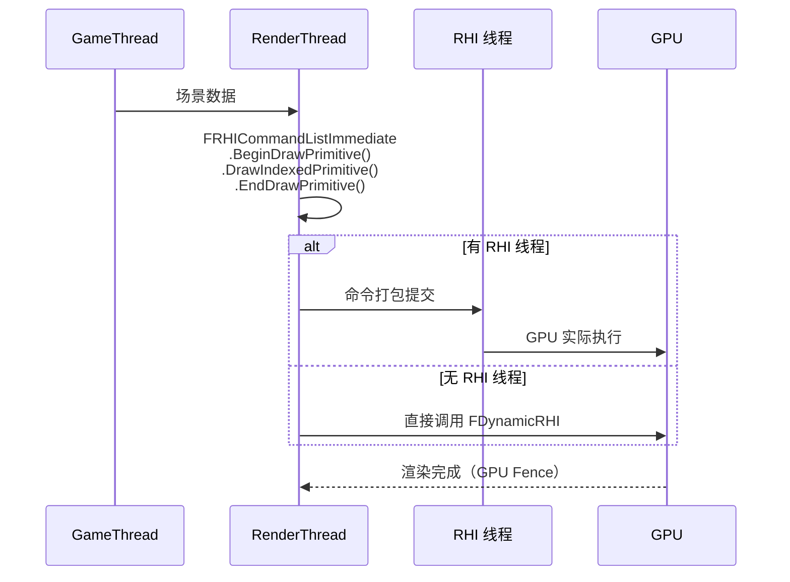
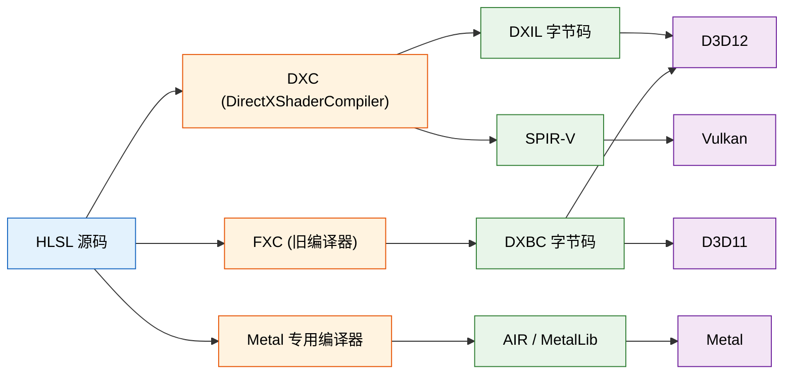

# UE RHI（Render Hardware Interface）架构知识卡片

---

## 核心结论

UE RHI 层是一个**平台无关的 GPU 抽象层**，核心设计围绕"命令录制 → 延迟/立即提交 → GPU 执行"的三段式流水线展开。`FRHICommandList` 负责录制，`FRHICommandListImmediate` 提供立即执行路径，`FDynamicRHI` 是各平台实现需要继承的抽象基类。UE 5.x 最重要的演进包括：显式 Barrier API（`FRHIBarrier`）取代隐式状态管理、`FRHIGraphicsPipelineState` 取代旧的 `FRHIBoundShaderState`、以及更完善的 GPU 读回（`FRHIGPUTextureReadback`）和数据上传路径。

---

## 1. RHI 抽象层设计

### 1.1 三层命令体系

- **FRHICommandList**：延迟命令列表（Record-only）
  - **FRHICommandListImmediate**：立即执行命令列表（可 Flush）
    - **FRHIImmediateContext**：兼容旧接口的包装层（UE 5.x 逐渐淡化）

**FRHICommandList**

- 核心用途：**录制** GPU 命令，不立即提交
- 内部维护 `FRHICommandListBase` 作为基类，存储命令 arena（`FMemStack` 分配的环形缓冲区）
- 命令以 `FRHICommand` 派生类形式序列化到 arena 中，每个 command 包含 `ExecuteAndDestruct` 虚函数
- 典型调用链：`RHICmdList.DrawPrimitive(...)` → 向 list 追加一个 `FRHICommandDrawPrimitive` 命令对象
- 线程安全：**非线程安全**，单线程录制，由调用方保证串行

**FRHICommandListImmediate**

- 继承自 `FRHICommandList`，**加立即执行路径**
- 当 RHI 线程未启用时，`Immediate` 命令直接调用平台实现（`FDynamicRHI::DrawPrimitive` 等）
- 当 RHI 线程启用时，`Immediate` 命令被提交到 RHI 线程队列，渲染线程继续前进
- 关键方法：`Flush()`、`ImmediateFlush()`、`SubmitCommandsAndFlushGPU()`
- `FParallelCommandListSet` 支持并行录制多个 `FRHICommandList`，最后合并到 Immediate

**FRHIImmediateContext**

- UE 4.x 遗留层，在 UE 5.x 中逐渐被 `FRHICommandListImmediate&` 替代
- 实质是 `FRHICommandListImmediate` 的引用包装，提供 `RHISetStreamSource`、`RHIDrawIndexedPrimitive` 等原有接口
- 源码位置：`RHICommandList.h` 中 `FRHIImmediateContext` 类定义，内部 `Context` 成员指向 `FRHICommandListImmediate`

### 1.2 RHI 线程模型



**关键设计点**：

- **双缓冲 / 三缓冲**：渲染线程算一帧、RHI 线程提交一帧、GPU 执行一帧，最多三级流水
- **bRHIThreadEnabled**：由 `GRHIThreadEnabled` 全局变量控制，可在 `BaseEngine.ini` 中配置
- **无 RHI 线程模式**：渲染线程直接调用 `FDynamicRHI` 接口，相当于单线程推送，适用于低延迟场景
- **有 RHI 线程模式**：渲染线程构造命令列表，`FRHICommandListImmediate` 在 `SUBMIT` 时将命令跨线程提交到 RHI 线程
- **跨线程提交**通过 `FRHICommandList::Submit` 内部使用 `FScopedEvent` 和线程安全队列（`TQueue<FRHICommandBase*>`）实现

### 1.3 RHI 命令录制与提交

**命令录制机制**：
- 每个 `FRHICommand` 子类实现 `ExecuteAndDestruct(FRHICommandListBase& CmdList)` 方法
- 构造时通过 `new (CmdList.AllocCommand<FRHICommandFoo>()) FRHICommandFoo(params)` 在 arena 上分配
- 宏辅助：`FRHI_COMMAND_DECL` / `FRHI_COMMAND_DEFINE` 简化声明
- 示例：`FRHICommandDrawPrimitive` 保存 `EPrimitiveType`、`BaseVertexIndex`、`NumPrimitives` 等参数

**提交与执行**：
- `FRHICommandList::Execute()` —— 遍历 arena 中所有命令，逐个调用 `ExecuteAndDestruct`
- `FRHICommandListImmediate::Flush()` —— 将当前命令列表提交并执行（阻塞直到完成）
- 非 Immediate 的 `FRHICommandList` 由 `FParallelCommandListSet` 在并行录制后合并到 Immediate 再提交

**多帧资源管理**：
- `BeginUpdateMultiFrameResource(FRHITexture*)` —— 标记资源跨多帧使用（如 VR 双屏渲染），防止 RHI 线程提前回收
- `EndUpdateMultiFrameResource(FRHITexture*)` —— 解除标记
- 内部维护引用计数，确保资源在 RHI 线程完成使用前不被销毁

---

## 2. 核心资源类型

### 2.1 FRHIBuffer 系

- **FRHIBuffer**（抽象基类）
  - **FRHIVertexBuffer** —— 顶点缓冲
  - **FRHIIndexBuffer** —— 索引缓冲
  - **FRHIStructuredBuffer** —— 结构化缓冲（可被 SRV/UAV 绑定）
  - **FRHIIndirectBuffer** —— 间接绘制参数缓冲

**关键属性**：
- `GetSize()` —— 缓冲大小（字节）
- `GetStride()` —— 元素跨度（结构化缓冲）
- `GetUsage()` —— `BUF_*` 标志位组合：`BUF_Static` / `BUF_Dynamic` / `BUF_UnorderedAccess` / `BUF_ByteAddressBuffer` / `BUF_DrawIndirect` 等
- `GetFlags()` —— 平台特定 flag

**内部实现（D3D12 示例）**：
- `FD3D12Buffer` 内含 `TRefCountPtr<ID3D12Resource>`、`FD3D12ResourceLocation`（指向 heap 分配的子区域）
- 通过 `FD3D12Adapter::CreateBuffer` 分配，大缓冲走 `FD3D12Heap` 管理的 committed / placed resource

### 2.2 FRHITexture 系

- **FRHITexture**（抽象基类）
  - **FRHITexture2D** —— 2D 纹理（含 backbuffer、render target）
  - **FRHITexture3D** —— 3D 纹理（体积纹理）
  - **FRHITextureCube** —— Cube Map
  - **FRHITexture2DArray** —— 2D 纹理数组
  - **FRHITextureCubeArray** —— Cube 纹理数组
  - **FRHITextureReference** —— 纹理引用（别名/重定向）

**关键属性**：
- `GetSizeX()` / `GetSizeY()` / `GetSizeZ()` —— 尺寸
- `GetFormat()` —— `EPixelFormat` 枚举（`PF_R8G8B8A8`、`PF_D24`、`PF_FloatRGBA` 等）
- `GetNumMips()` —— Mip 层级数
- `GetNumSamples()` —— MSAA 采样数
- `GetFlags()` —— `TexCreate_*` 标志：`TexCreate_RenderTargetable` / `TexCreate_DepthStencilTargetable` / `TexCreate_ShaderResource` / `TexCreate_UAV` / `TexCreate_ResolveTargetable` 等
- `GetClearColor()` / `GetClearValue()` —— 优化 clear 值（用于 render pass 的 load-op 优化）

**FRHITextureReference**：
- 用于纹理别名/重定向场景，不拥有实际 GPU 资源，仅持有对另一个纹理的引用
- `SetReferencedTexture(FRHITexture*)` 动态修改指向
- 典型用途：`FSceneRenderTargets` 的临时 RT 别名

### 2.3 FRHIShaderResourceView / FRHIUnorderedAccessView

**FRHIShaderResourceView (SRV)**：
- 将缓冲/纹理包装为 shader 可读形式
- 创建：`RHICreateShaderResourceView(FRHITexture*, uint32 MipLevel)` 或 `RHICreateShaderResourceView(FRHIBuffer*, uint32 Stride, uint8 Format)`
- 关键属性：底层资源指针、格式、mip 范围、数组范围

**FRHIUnorderedAccessView (UAV)**：
- 将缓冲/纹理包装为 shader 可读写形式
- 创建：`RHICreateUnorderedAccessView(FRHITexture*, uint32 MipLevel)` 或 `RHICreateUnorderedAccessView(FRHIBuffer*, bool bUseUAVCounter, bool bAppendBuffer)`
- 支持原子操作（Append/Consume/Counter）
- 内部：`GetResource()` 返回底层资源，`GetUAVFlags()` 返回创建标志

### 2.4 FRHIRenderQuery

- 用途：GPU 查询（时间戳、遮挡、流水线统计）
- 类型：`ERenderQueryType::RQT_Occlusion` / `RQT_AbsoluteTime` / `RQT_NumGpuPrimitivesSubmitted`
- 创建：`RHICreateRenderQuery(RQT_Occlusion)`
- 使用：`RHIBeginRenderQuery(Query)` → `RHIEndRenderQuery(Query)` → `RHIGetRenderQueryResult(Query, bWait)` 读取结果
- 内部：D3D12 下对应 `ID3D12QueryHeap`，Vulkan 下对应 `VkQueryPool`

### 2.5 FRHIVertexDeclaration / FRHIBoundShaderState

**FRHIVertexDeclaration**：
- 描述顶点输入布局：`FVertexElement` 数组，每个元素指定 stream index、offset、format、semantic
- 创建：`RHICreateVertexDeclaration(FVertexDeclarationElementList&)`
- 内部实现为平台特定 layout 对象（D3D12 `D3D12_INPUT_LAYOUT_DESC`，Vulkan `VkPipelineVertexInputStateCreateInfo`）

**FRHIBoundShaderState**：
- 封装完整的 pipeline state（VS + PS + GS + DS + HS 组合）
- 包含：各 stage shader 指针 + 顶点声明 + 光栅化状态
- UE 5.x 中逐步被 `FRHIGraphicsPipelineState` 替代，后者更接近现代 API 的 PSO 概念

---

## 3. 资源生命周期

### 3.1 创建

```cpp
// 顶点缓冲
FRHIVertexBuffer* Buffer = RHICreateVertexBuffer(
    SizeInBytes,               // 大小
    BUF_Static | BUF_UnorderedAccess,  // 用途
    InitData,                  // 可选初始数据（nullptr 则分配未初始化）
    ERHIAccess::VertexOrIndexBuffer   // 初始访问状态
);

// 纹理 2D
FRHITexture2D* Texture = RHICreateTexture2D(
    Width, Height,
    PF_R8G8B8A8,
    NumMips, NumSamples,
    TexCreate_RenderTargetable | TexCreate_ShaderResource,
    CreateInfo    // 包含 clear value、扩展数据等
);

// 创建流程（D3D12）：
// RHICreateVertexBuffer → FD3D12DynamicRHI::RHICreateVertexBuffer
//   → FD3D12Adapter::CreateBuffer → 分配 D3D12_HEAP_TYPE_UPLOAD/DEFAULT/READBACK heap
//   → 创建 ID3D12Resource → 包装为 FD3D12Buffer
//   → 若 InitData 非空，执行 upload（upload heap 临时拷贝 + GPU copy 到 default heap）
```

**关键创建函数**（`DynamicRHI.h` 声明）：
- `RHICreateVertexBuffer(uint32 Size, uint32 Usage, FRHIResourceCreateInfo& CreateInfo)`
- `RHICreateIndexBuffer(uint32 Stride, uint32 Size, uint32 Usage, FRHIResourceCreateInfo& CreateInfo)`
- `RHICreateStructuredBuffer(uint32 Stride, uint32 Size, uint32 Usage, FRHIResourceCreateInfo& CreateInfo)`
- `RHICreateTexture2D(uint32 SizeX, uint32 SizeY, uint8 Format, uint32 NumMips, uint32 NumSamples, uint32 Flags, FRHIResourceCreateInfo& CreateInfo)`
- `RHICreateTexture3D(...)` / `RHICreateTextureCube(...)` / `RHICreateTexture2DArray(...)`
- `RHICreateShaderResourceView(...)` / `RHICreateUnorderedAccessView(...)`

### 3.2 数据上传

**Lock/Unlock 模式（传统路径）**：
```cpp
void* Data = RHILockVertexBuffer(Buffer, Offset, Size, RLM_WriteOnly);
// 写入 Data
RHIUnlockVertexBuffer(Buffer);
```
- `RLM_WriteOnly` —— 不关心旧内容，驱动可以选 upload heap 避免 GPU readback
- `RLM_ReadOnly` —— 从 GPU 读回（少见，需要暂存资源）
- `RLM_Num` —— 仅用于迭代
- 内部：D3D12 下先 map upload heap 的影子区域，`Unlock` 时通过 `CopyBufferRegion` 提交到 default heap

**UpdateTexture2D 路径**：
```cpp
RHIUpdateTexture2D(Texture, MipIndex, UpdateRegion, SourceData, SourcePitch);
```
- 用于 CPU 逐帧更新小纹理（如 HUD 纹理、动态图标）
- 内部：创建暂存纹理 → `CopyTextureRegion` 到目标
- 性能：每次调用产生一次 copy，频繁更新用 Lock/Unlock 或 UAV 路径更优

**Staging Buffer 路径（UE 5.x 推荐）**：
```cpp
FRHIGPUTextureReadback Readback(Texture);  // 构造时发起 GPU→CPU copy
// ... 若干帧后 ...
Readback.Map(OutData, OutRowPitch);        // 读回 CPU 可见内存
Readback.Unmap();
```

### 3.3 删除与延迟释放

**RHI 资源释放机制**：
- 所有 `FRHIResource` 继承自 `FRefCountedObject`，使用**引用计数**管理生命周期
- `SafeRelease()` —— 递减引用计数，计数归零时删除资源
- 删除**不是立即的**：`FRHIResource` 析构函数会调用 `PlatformSpecificDestructor`，但实际 GPU 资源通过 `FD3D12Adapter::DeferredDelete` 延迟释放

**延迟释放路径**：
```cpp
FRHIResource::~FRHIResource() → FD3D12Resource::DoDestroy()
  → FD3D12Adapter::DeferredDelete(Resource)  // 放入延迟删除队列
  → 下一帧 RHI 线程执行完所有依赖命令后，真正 Release COM 对象
```

**跨线程安全**：
- `FReferenceCollector` —— GC 系统的引用收集器，用于确保 `FRHIResource` 在垃圾回收期间不被释放
- `BeginUpdateMultiFrameResource` / `EndUpdateMultiFrameResource` —— 见 1.3 节，确保跨帧资源不被回收
- `FRHICommandList::SafeReleaseResource` —— 在命令列表提交后安全释放资源，避免渲染线程和 RHI 线程竞争

---

## 4. GPU 同步

### 4.1 FGPUFence

- `FGPUFence` 继承自 `FRHIResource`，代表一个 GPU 侧的信号量
- 创建：`RHICreateGPUFence(const FName& Name)`
- 使用：
  - `WriteCmd(FRHICommandList& CmdList)` —— 向命令列表插入 fence 写入命令
  - `Poll()` —— 非阻塞查询 fence 是否已到达
  - `Wait(uint32 TimeoutMs)` —— 阻塞等待，返回是否成功
- 内部：D3D12 下对应 `ID3D12Fence`，Vulkan 下对应 `VkSemaphore`
- 典型用途：`WaitForRHIThreadFence`、`FRenderTargetPool` 的跨帧资源可用性判断

### 4.2 FRHIBarrier（UE 5.x 新 Barrier API）

**背景**：UE 5.x 引入显式 Barrier API，取代旧的 `EResourceTransitionPipeline` + `EResourceTransitionAccess` 隐式管理。

**核心类型**：
- `FRHITransitionInfo` —— 描述单个资源的状态转换：
  - `Resource` —— 目标资源指针
  - `Type` —— `ETransitionType::EResource` / `EUAV` / `EAliased` 等
  - `AccessBefore` / `AccessAfter` —— `ERHIAccess` 枚举（见下）
  - `Pipeline` —— `ERHIPipeline::Graphics` / `Compute` / `All`
  - `CreateTransition` —— 可选：`FRHIBarrier::ETransitionCreateFlags` 控制

- `ERHIAccess` 枚举（UE 5.x 扩展）：
  - `RTV` —— 渲染目标写入
  - `DSV` —— 深度/模板写入
  - `SRVGraphics` / `SRVCompute` —— Shader 读取（区分图形/计算管线）
  - `UAVGraphics` / `UAVCompute` —— UAV 读写
  - `CopySrc` / `CopyDest` —— 拷贝源/目标
  - `ResolveSrc` / `ResolveDest` —— 解析源/目标
  - `Present` —— 弹窗
  - `IndirectArgs` —— 间接绘制参数
  - `VertexOrIndexBuffer` —— 顶点/索引缓冲

**屏障提交**：
```cpp
FRHIBarrier Barrier = FRHIBarrier::Transition(Texture, ERHIAccess::RTV, ERHIAccess::SRVGraphics);
RHICmdList.Transition(Barrier);
// 批量：
RHICmdList.Transition(MakeArrayView<FRHITransitionInfo>(Transitions));
```

**UE 5.x 与旧版对比**：

| 版本 | 方式 | 方法 |
|------|------|------|
| UE 4.x | 隐式屏障 | `RHICmdList.SetRenderTargets` 内部自动 transition |
| UE 5.0-5.3 | 显式 Barrier | `RHICmdList.TransitionResource` 等 |
| UE 5.4+ | 统一的 FRHIBarrier | `RHICmdList.Transition(FRHIBarrier)` |

### 4.3 FRHISubmitGroup / FRHISubmitHint

**FRHISubmitGroup**：
- 用于将多个命令列表分组提交到 GPU，允许 GPU 并行执行
- `FRHISubmitGroup::AddCommandList(FRHICommandList& CmdList)` —— 添加并行命令列表
- 内部：D3D12 下对应 `ExecuteCommandLists` 的多个 list，Vulkan 下对应 `vkQueueSubmit` 多个 command buffer

**FRHISubmitHint**：
- 向 RHI 层提供提交优化提示
- `FRHISubmitHint::SubmitToGPU(FRHICommandListImmediate& CmdList)` —— 提示 RHI 可以立即提交到 GPU
- 典型用于 VR 和低延迟渲染场景

### 4.4 Transition 与 Layout 管理

**D3D12 实现**：
- `FD3D12StateCache` 跟踪每个资源的当前状态
- `FD3D12CommandContext::RHITransitionResources` 调用 `FD3D12DynamicRHI::TransitionResource` 生成 `D3D12_RESOURCE_BARRIER`
- 屏障类型：`Transition`（状态转换）、`Aliasing`（placed resource 别名重映射）、`UAV`（UAV 依赖屏障）

**Vulkan 实现**：
- `FVulkanCommandListContext::RHITransitionResources` 调用 `VulkanRHI::TransitionResource`
- 跟踪 `VkImageLayout` 和 `VkAccessFlags`
- 通过 `VkPipelineBarrier` 或 `VkImageMemoryBarrier` 提交屏障
- 注意：Vulkan 的隐含 layout 转换比 D3D12 更严格，`VK_IMAGE_LAYOUT_UNDEFINED` 会丢弃内容

---

## 5. 平台差异

### 5.1 D3D12 vs Vulkan 在 RHI 层的差异

| 维度 | D3D12 | Vulkan |
|------|-------|--------|
| 资源创建 | `ID3D12Device::CreateCommittedResource` / `CreatePlacedResource` | `vkCreateImage` + `vkAllocateMemory` + `vkBindImageMemory` |
| 资源放置 | 支持 placed resource + heap tier 1/2 | 支持 `VK_KHR_dedicated_allocation` + `VK_KHR_bind_memory2` |
| 命令列表 | `ID3D12GraphicsCommandList`（bundles 支持有限） | `VkCommandBuffer`（secondary command buffer 原生支持） |
| 屏障 | `D3D12_RESOURCE_BARRIER`（Transition/Aliasing/UAV） | `VkPipelineBarrier` / `VkImageMemoryBarrier` / `VkBufferMemoryBarrier` |
| 描述符 | Descriptor heap（CBV_SRV_UAV / RTV / DSV / Sampler） | Descriptor set + Descriptor pool（layout 预先定义） |
| PSO | `ID3D12PipelineState`（`CreateGraphicsPipelineState`） | `VkPipeline`（编译耗时长，需缓存 `VkPipelineCache`） |
| Root Signature | `ID3D12RootSignature`（静态） | `VkPipelineLayout`（类似概念） |
| 查询 | `ID3D12QueryHeap` | `VkQueryPool` |
| Fence | `ID3D12Fence`（monotonically increasing UINT64） | `VkSemaphore` / `VkFence` |
| 交换链 | `IDXGISwapChain`（`Present` 1/0 控制 vsync） | `VkSwapchainKHR`（acquire → present 显式三步） |

**Vulkan 特有的 RHI 适配层**：
- `FVulkanShaderFactory` —— SPIR-V 反射 + 自动生成 descriptor set layout
- `FVulkanPipelineStateCache` —— 完整的 PSO 缓存（`VkPipelineCache` + 基于 hash 的 LRU）
- `FVulkanQueue` —— 管理图形/计算/传输队列族，`VkQueue` 封装
- `FVulkanCommandListContext` —— 每个 command buffer 的上下文，含 `FVulkanStateCache`（类似 D3D12 的 state cache）

### 5.2 Feature Level 检测

**D3D 路径**：
```cpp
// 检测入口
D3D12_FEATURE_DATA_FEATURE_LEVELS FeatureLevels;
FeatureLevels.NumLevels = 4;
FeatureLevels.pFeatureLevelsRequested = LevelArray;  // 12_2, 12_1, 12_0, 11_0
HRESULT Hr = Adapter->CheckFeatureSupport(D3D12_FEATURE_FEATURE_LEVELS, &FeatureLevels, sizeof(FeatureLevels));

// 映射到 UE 能力
ERHIFeatureLevel::SM5   → D3D_FEATURE_LEVEL_11_0
ERHIFeatureLevel::SM6   → D3D_FEATURE_LEVEL_12_0 (Shader Model 6.0+)
```

**Vulkan 路径**：
```cpp
// 通过 vkGetPhysicalDeviceFeatures 和 vkGetPhysicalDeviceProperties
VkPhysicalDeviceProperties Props;
vkGetPhysicalDeviceProperties(PhysicalDevice, &Props);
// 根据 Props.apiVersion、Props.limits、Props.sparseProperties 等判断

// 扩展检测
uint32_t ExtensionCount;
vkEnumerateDeviceExtensionProperties(PhysicalDevice, nullptr, &ExtensionCount, nullptr);
// 查 VK_KHR_ray_tracing_pipeline、VK_KHR_acceleration_structure 等
```

**UE 能力分级**：
- `ERHIFeatureLevel::ES3_1` —— 最低（移动端）
- `ERHIFeatureLevel::SM5` —— DX11 级别（Shader Model 5）
- `ERHIFeatureLevel::SM6` —— DX12/Vulkan 级别（Shader Model 6，Wave Intrinsics 等）
- `ERHIFeatureLevel::SM6_1` —— UE 5.x 扩展（Ray Tracing、Mesh Shader 等）

各平台支持的 Feature Level 在 `RHIGetFeatureLevel()` 中判断，通过 `GRHIFeatureLevel` 全局变量访问。

### 5.3 Shader 格式

| 平台 | Shader 格式 | 说明 |
|------|-------------|------|
| D3D11 | **DXBC** | 字节码，`FShaderCodeReader` 包装 |
| D3D12 | **DXIL**（默认）/**DXBC**（回退） | DXIL 是 DXC 编译器的 LLVM 字节码格式 |
| Vulkan (Windows) | **SPIR-V** | 通过 `VkShaderModule` 创建 |
| Vulkan (Android) | **SPIR-V** | 同，部分移动 GPU 用 `VK_KHR_spirv_1_4` |
| Metal | **MetalLib** / **AIR** | Metal 着色器二进制 |
| Switch | **NVN** 二进制 | 平台专用格式 |

**Shader 编译链**：



**UE Shader 格式管道**：
- `FShaderCode` 包含 `FShaderCodePackedResourceCounts`、`FShaderCodeBindings` 等元数据
- `FShaderResourceTable` 描述资源绑定布局
- `ShaderFormatD3D` / `ShaderFormatVulkan` / `ShaderFormatHeader` 等模块负责编译和打包
- `SHADER_FORMAT_*` 宏控制编译路径

---

## 6. 关键源码文件

### 6.1 核心头文件（`Engine/Source/Runtime/RHI/Public/`）

| 文件 | 内容 |
|------|------|
| `RHI.h` | RHI 全局函数声明（`RHICreateVertexBuffer` 等）、`ERHIFeatureLevel`、`EPixelFormat` 等枚举 |
| `RHICommandList.h` | `FRHICommandList`、`FRHICommandListImmediate`、`FRHIImmediateContext` 定义 |
| `DynamicRHI.h` | `FDynamicRHI` 抽象基类（所有平台实现的接口） |
| `RHIAccess.h` | `ERHIAccess` 枚举、`FRHITransitionInfo`、`FRHIBarrier` 定义 |
| `RHIBuffer.h` | `FRHIBuffer`、`FRHIVertexBuffer`、`FRHIIndexBuffer` 等 |
| `RHITexture.h` | `FRHITexture`、`FRHITexture2D`、`FRHITextureCube` 等 |
| `RHIShader.h` | `FRHIShader`、`FRHIVertexShader`、`FRHIPixelShader` 等 |
| `RHIView.h` | `FRHIShaderResourceView`、`FRHIUnorderedAccessView` 定义 |
| `RHIResources.h` | `FRHIResource` 基类（`FRefCountedObject` 派生） |
| `RHIGPUReadback.h` | `FRHIGPUTextureReadback`、`FRHIGPUBufferReadback` |
| `RHIValidation.h` | RHI 验证层（debug 模式） |
| `RHIProfiler.h` | GPU 事件/统计 API |

### 6.2 各平台实现目录

| 平台 | 目录路径 | 关键文件 |
|------|---------|---------|
| D3D12 | `Engine/Source/Runtime/D3D12RHI/` | `D3D12Device.h`/`.cpp`（设备管理）、`D3D12CommandContext.h`（命令上下文）、`D3D12StateCache.h`（状态缓存）、`D3D12Adapter.h`（适配器，跨设备管理） |
| Vulkan | `Engine/Source/Runtime/VulkanRHI/` | `VulkanDevice.h`/`.cpp`、`VulkanCommandList.h`/`.cpp`、`VulkanPipelineState.h`（PSO 缓存）、`VulkanShaderResources.h`（SPIR-V 反射） |
| Metal | `Engine/Source/Runtime/MetalRHI/` | `MetalDevice.h`、`MetalCommandList.h`、`MetalShaderResources.h` |
| Null | `Engine/Source/Runtime/NullRHI/` | 空 RHI 实现（headless/CI 测试） |
| Switch | `Engine/Source/Runtime/SwitchRHI/` | 任天堂 Switch 平台实现 |

### 6.3 关键数据结构定义

```cpp
// RHICommandList.h 核心结构
struct FRHICommandListBase {
    FMemStackBase           CommandArena;       // 命令内存池
    FRHICommandListBase*    NextCommandList;     // 链表下一个
    ERHIPipeline            Pipeline;            // 所属管线
    // ...
};

class FRHICommandList : public FRHICommandListBase {
    // 录制接口
    void DrawPrimitive(EPrimitiveType, int32, int32);
    void SetShaderParameter(FRHIVertexShader*, ...);
    // 提交
    void Execute();
};

class FRHICommandListImmediate : public FRHICommandList {
    // 立即执行接口
    void Flush();
    void ImmediateFlush(EImmediateFlushType);
    // 直接调用 FDynamicRHI 的转发
    void DrawPrimitive(EPrimitiveType, int32, int32);
};
```

```cpp
// DynamicRHI.h 核心接口
class FDynamicRHI {
    virtual FRHIVertexBuffer*  RHICreateVertexBuffer(...) = 0;
    virtual FRHITexture2D*     RHICreateTexture2D(...) = 0;
    virtual void               RHIDrawPrimitive(...) = 0;
    virtual void               RHITransitionResources(...) = 0;
    // ... 数百个纯虚函数
};
```

---

## 参考源码路径

| 内容 | 推荐文件 |
|------|---------|
| RHI 接口声明 | `Engine/Source/Runtime/RHI/Public/DynamicRHI.h` |
| 命令列表实现 | `Engine/Source/Runtime/RHI/Private/RHICommandList.cpp` |
| Barrier/Transition 定义 | `Engine/Source/Runtime/RHI/Public/RHIAccess.h` |
| D3D12 命令上下文 | `Engine/Source/Runtime/D3D12RHI/Private/D3D12CommandContext.cpp` |
| D3D12 资源管理 | `Engine/Source/Runtime/D3D12RHI/Private/D3D12Resources.cpp` |
| D3D12 屏障生成 | `Engine/Source/Runtime/D3D12RHI/Private/D3D12CommandContext.cpp` → `RHITransitionResources` |
| Vulkan 命令列表 | `Engine/Source/Runtime/VulkanRHI/Private/VulkanCommands.cpp` |
| Vulkan 屏障 | `Engine/Source/Runtime/VulkanRHI/Private/VulkanCommands.cpp` → `RHITransitionResources` |
| Vulkan 状态缓存 | `Engine/Source/Runtime/VulkanRHI/Private/VulkanState.h`（管线状态见 `VulkanPipelineState.h`） |
| Shader 格式 | `Engine/Source/Runtime/RenderCore/Public/ShaderCore.h` |
| GPU Fence | `Engine/Source/Runtime/RHI/Public/RHIResources.h`（`FRHIGPUFence` 声明处） |