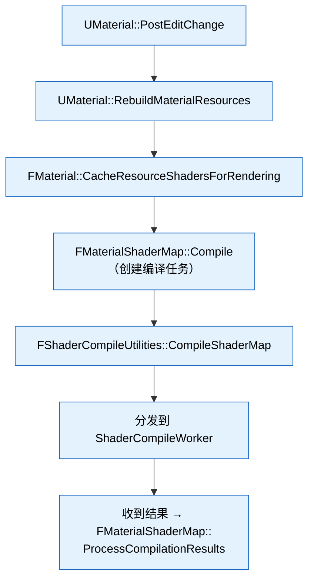
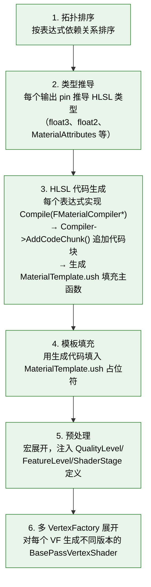
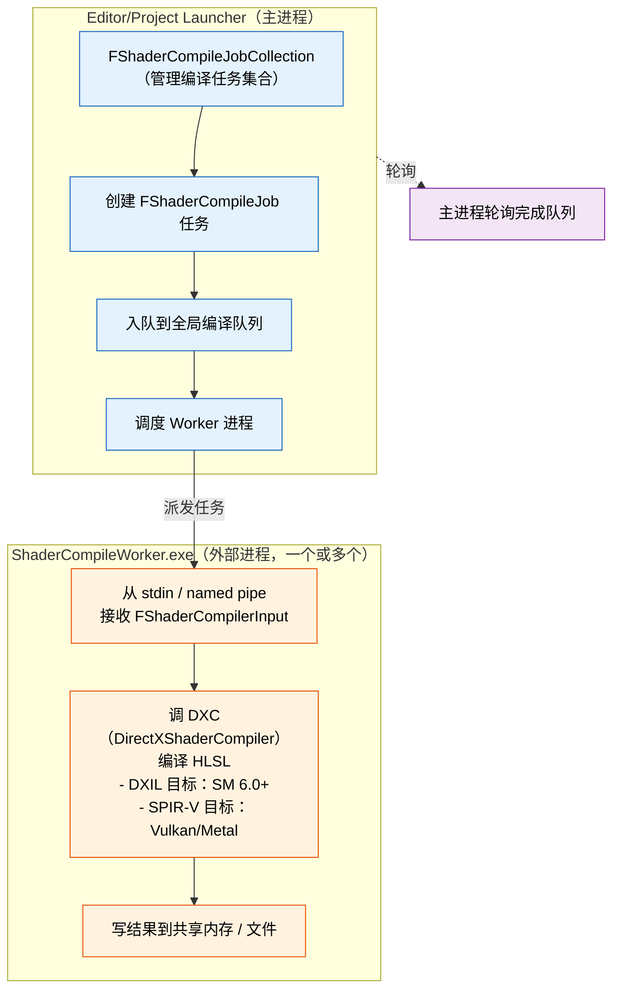

# UE 5.8 Shader 编译管线与材质系统 — 知识卡片

> 以下内容基于 UE 5.5–5.8 稳定跨版本的核心引擎源码架构知识整理。

---

## 1. 材质系统架构链条

### Material → MaterialResource → MaterialShaderMap → FShader

```
- UMaterial（资产）
  - FMaterialResource（编译期表示，每个 QualityLevel + FeatureLevel 一个实例）
    - FMaterialShaderMap（持有该材质的所有已编译 Shader 变体）
      - FMeshMaterialShaderMap（Mesh 相关 Shader：BasePass、DepthOnly、Velocity 等）
      - 每个 VertexFactory 一份 Shader 变体
        - FShader（最终编译结果，含 ShaderCode + 反射参数）
```

### 关键关系

| 角色 | 职责 | 生命周期 |
|------|------|----------|
| `UMaterial` / `UMaterialInstance` | 资产层，存编辑器提交的表达式节点、参数值 | 持久化 |
| `FMaterial` | 编译期抽象接口，定义 `GetMaterialId()`、`GetShaderMap()` | 瞬态，编译时创建 |
| `FMaterialResource` | `FMaterial` 具体实现，每个 Quality/Feature 组合一个实例 | 编辑时/烹饪时存在 |
| `FMaterialShaderMap` | 持有 `TMap<FShaderId, FShader*>` 的完整编译结果容器 | 序列化到 `.ushaderbytecode` |
| `FShader` | 编译好的 GPU 二进制 + 反射元数据 | 缓存在内存和磁盘 |

### 核心源码文件

- `Engine/Source/Runtime/Engine/Public/MaterialShared.h` — `FMaterial`、`FMaterialResource`、`FMaterialShaderMap` 核心声明（含完整定义、编译/序列化/查找）
- `Engine/Source/Runtime/Engine/Public/Materials/Material.h` — `UMaterial` 资产 UObject 定义
- `Engine/Source/Runtime/Engine/Private/MaterialShaderMap.cpp` — ShaderMap 编译调度

### 编译触发链



---

## 2. HLSL 生成机制

### 表达式编译

`UMaterial` 内部是一个**表达式节点图**（`UMaterialExpression` 子类构成的 DAG）。

HLSL 生成流程：



### 关键源码

- `Engine/Shaders/Private/MaterialTemplate.ush` — 材质模板，含 `#if` 分支处理各 ShaderStage
- `Engine/Source/Runtime/Engine/Private/HLSLMaterialTranslator.cpp` — `FMaterialCompiler` 实现，核心 HLSL 生成器
- `Engine/Source/Runtime/Engine/Classes/Materials/HLSLMaterialTranslator.h`

### 编译产物

```
完整 HLSL 源串 = 模板 + 表达式代码 + 预处理宏
  → FShaderCompileUtilities::PreprocessShaderSource 预处理
  → 序列化到 FShaderCompilerInput 传给 SCW
  → SCW 调 DXC / FXC 编译
  → 返回 FShaderCompilerOutput（DXIL/SPIR-V + 反射信息）
```

---

## 3. Shader 编译管线 — 调度与外部进程模型

### FShaderCompileWorker（SCW）外部进程模型



### 关键设计

| 方面 | 细节 |
|------|------|
| **进程模型** | SCW 是独立 EXE，不加载 Editor DLL，编译时 Editor 不会 OOM |
| **并行度** | 默认 `(CPU 核心数 - 1)` 个 SCW 进程，可配置 `r.ShaderCompileWorker.NumWorkers` |
| **通信方式** | 命名管道（Windows）/ 文件映射（跨平台）— 见 `ShaderCompilerCommon.cpp` |
| **分布式编译** | 5.4+ 支持 `ShaderCompilerServer` — 局域网多机器共享编译队列 |
| **编译优先级** | `FShaderCompileJob` 有优先级（`EShaderCompileJobPriority::High/Normal/Low/None`），影响出队顺序 |
| **异步加载** | Cooking 阶段 `-ShaderCompile` 产出 `.ushaderbytecode`；运行时 `SerializeShaderMap` 加载 |

### 编译缓存

| 缓存层 | 位置 | 失效条件 |
|--------|------|----------|
| **ShaderCache**（`ShaderWorkingDir`） | `DerivedDataCache` | Shader 输入哈希变化 |
| **ShaderCodeLibrary** | `Content/ShaderCode/` | Cooking 时打包，确保运行时无编译 |
| **DDC（DerivedDataCache）** | 本地/共享 | 全局，跨项目共享已编译二进制 |
| **r.ShaderDevelopmentMode** | 运行时开关 | 跳过缓存强制重新编译（调试用） |

### 关键源码

- `Engine/Source/Runtime/Engine/Public/ShaderCompiler.h` — `FShaderCompileJob`、`FShaderCompileJobCollection`
- `Engine/Source/Programs/ShaderCompileWorker/ShaderCompileWorker.cpp` — 外部进程入口
- `Engine/Source/Runtime/Engine/Private/ShaderCompiler.cpp` — 主进程编译调度
- `Engine/Source/Developer/ShaderFormatOpenGL/` — 各平台 Shader 编译后端

---

## 4. Shader Permutation — 爆炸原因与裁剪

### 爆炸根源

每个材质 + 每个 VertexFactory + 每个 ShaderStage + 每个 FeatureLevel + 每个 QualityLevel + 每个静态开关的组合 → 组合爆炸。

### 典型 Permutation 维度

| 维度 | 来源 | 典型取值数 |
|------|------|-----------|
| **VertexFactory** | `FLocalVertexFactory`、`FGPUVertexFactory`、`FNiagaraVFXFactory` 等 | 5–15 |
| **ShaderStage** | VS、PS、GS、DS、HS、CS | 3–6 |
| **FeatureLevel** | SM5、SM6、ES31、VulkanSM5、MetalSM5 | 3–5 |
| **QualityLevel** | Low、Medium、High、Epic、Cinematic | 3–5 |
| **静态开关** | `ALLOW_STATIC_LIGHTING`、`bUsedWithSkeletalMesh`、`MATERIAL_SHADING_MODEL_LIT` 等 | 100+ |
| **材质属性** | ShadingModel、BlendMode、DecalResponse 等 | 10+ |

> 实际爆炸远小于笛卡尔积，因为很多组合语义上互斥（如 `bUsedWithSkeletalMesh=false` 时 LocalVertexFactory 的 Skeletal VF 分支被裁剪）。

### 裁剪机制

| 机制 | 原理 | 代码位置 |
|------|------|----------|
| **`bUsedWith*` 开关** | `UMaterial` 的 `bUsedWithSkeletalMesh` 等 bool 字段，未启用时对应 VF 的 Permutation 不编译 | `Material.cpp` `SetMaterialUsage` |
| **`AllowStaticLighting`** | `ALLOW_STATIC_LIGHTING` 宏控制光照贴图相关代码，不开启则裁剪 | `MaterialShared.h` |
| **`QualityLevel`** | `MATERIAL_QUALITY_LEVEL` 宏，影响品质相关代码分支 | `ShaderCore.h` |
| **`FeatureLevel`** | `PLATFORM_MAX_FEATURE_LEVEL` 决定支持的 SM 级别 | 平台文件 |
| **`ShaderPermutationBool`** | 编译期 `bool` 模板参数，`FShaderPermutationBool` 控制是否编译 | `ShaderPermutation.h` |
| **`SHADER_PERMUTATION_BOOL`** | 在 Shader 类声明中定义 bool 型 Permutation 维度，对应 HLSL 宏 | `Shader.h` 等 |
| **`SHADER_PERMUTATION_INT`** | 在 Shader 类声明中定义 int 型 Permutation 维度，指定枚举范围 | `Shader.h` 等 |

### 自定义 Permutation 域

```cpp
// 定义 Permutation 维度（SHADER_PERMUTATION_BOOL / SHADER_PERMUTATION_INT 写法）
class FMyCustomShader : public FGlobalShader
{
    DECLARE_EXPORTED_SHADER_TYPE(FMyCustomShader, Global, MYMODULE_API);
    
    // 使用 SHADER_PERMUTATION_BOOL/INT 宏定义维度
    class FMyBoolDim : SHADER_PERMUTATION_BOOL("MY_BOOL_FLAG");
    class FMyIntDim  : SHADER_PERMUTATION_INT("MY_INT_FLAG", 4);
    
    using FPermutationDomain = TShaderPermutationDomain<FMyBoolDim, FMyIntDim>;
    
    // 构造函数中接收 PermutationId
    FMyCustomShader(const ShaderMetaType::FCompiledShaderInitializerType& Initializer)
        : FGlobalShader(Initializer) { }
    
    // 编译时根据 Permutation 注入不同代码
    static void ModifyCompilationEnvironment(const FShaderPermutationParameters& Parameters, FShaderCompilerEnvironment& OutEnvironment)
    {
        const FPermutationDomain PermutationDomain(Parameters.PermutationId);
        // 自动设置 HLSL 宏定义，无需手动 SetDefine
        PermutationDomain.ModifyCompilationEnvironment(Parameters.PermutationId, OutEnvironment);
    }
};
```

### 关键源码

- `Engine/Source/Runtime/Engine/Public/ShaderPermutation.h` — `FShaderPermutationBool`、`TShaderPermutationDomain`、`SHADER_PERMUTATION_BOOL`、`SHADER_PERMUTATION_INT`
- `Engine/Source/Runtime/Engine/Public/MaterialShared.h` — 材质相关的 Permutation 定义
- `Engine/Source/Runtime/Engine/Private/Shader.cpp` — Shader 序列化、缓存、Permutation 调度

---

## 5. Substrate 材质系统

### 设计目标

Substrate（原代号 Strata）是 UE 5.x 引入的**多层 BSDF 材质框架**，目标是：

| 目标 | 说明 |
|------|------|
| **物理正确** | 能量守恒的多层 BSDF 叠加，不再靠 Blinn-Phong 等经验模型拼凑 |
| **视觉多样性** | 单层 BSDF 无法表达的车漆（ClearCoat + BaseColor + 金属微片）、多层薄膜干涉、虹彩 |
| **统一渲染路径** | 一套 Substrate 管线取代旧版材质的多个 ShadingModel 分支 |
| **可扩展性** | 材质节点可自由组合 BSDF 层（Diffuse + GGX + ClearCoat + 任意），无需引擎硬编码新 ShadingModel |

### 5.8 新增特性

| 特性 | 说明 |
|------|------|
| **Glint（几何微闪）** | 基于法线贴图过滤的实时几何微闪效果，在粗糙表面上模拟金属微片的闪烁。由 `SUBSTRATE_GLINTS_ALLOWED` / `SUBSTRATE_GLINTS_ENABLED` 宏控制，通过 `Substrate_D_Glint()` / `EvaluateGlintRect()` 函数实现 Glint 到 GGX 的平滑过渡 |
| **Toon（卡通着色）** | 支持 Toon BSDF 材质类型（`SUBSTRATE_MATERIAL_TYPE_TOON = 11`），通过 `SubstrateToonBSDF.ush` 实现卡通着色，包含 `PackToonCustomData` / `UnpackToonCustomData` 打包自定义数据，及 `SubstrateToonEvaluateCommon` 评估函数 |
| **Stochastic Lighting（随机化光照）** | 由 `r.Substrate.StochasticLighting`（`RenderCore/Private/RenderUtils.cpp`）控制，通过随机化采样降低多层 BSDF 的着色开销，启用时 `Substrate::IsStochasticLightingEnabled()` 返回 true。运行时可通过 `r.Substrate.StochasticLighting.Active` 开关调试 |
| **Async Classification（异步材质分类）** | 由 `r.Substrate.AsyncClassification`（`Renderer/Private/Substrate/Substrate.cpp`）控制，将材质分类（前向/延迟/DBuffer 等）阶段异步化，减少主线程等待 |

### 现状（5.8）

| 方面 | 状态 |
|------|------|
| **默认启用** | 5.3+ 新项目默认启用 Substrate；旧项目可在 Project Settings 开关 |
| **与旧版共存** | `r.Substrate` 控制开关，0=旧版，1=Substrate（默认）。两套管线在引擎层共存 |
| **材质编辑器** | Substrate 材质用 `SubstrateMaterial` 节点取代 `MaterialAttributes` 输出 |
| **Deferred 路径** | Substrate 在 Deferred 路径用 G-buffer 编码多层 BSDF 参数（多个 GBuffer 目标）|
| **移动端** | 5.5+ Substrate 支持移动端，但禁用部分多层组合 |
| **性能开销** | 相比旧版材质，约 10–30% G-buffer 带宽增加 + 约 5–15% 着色开销 |

### 与旧版材质的共存

```
r.Substrate 0 → 完全走旧版管线（MeshDrawPipeline 用 FMeshMaterialShaderMap）
r.Substrate 1 → 完全走 Substrate 管线（MeshDrawPipeline 用 FSubstrateMeshMaterialShaderMap）

共存策略：
- 两套材质互不兼容：Substrate 材质在旧版模式下渲染为默认 Lit
- 引擎内部：EShaderPlatform 有 Substrate 相关的 FeatureFlag
- 编码：Substrate Shader 在 HLSL 中用 #if SUBSTRATE 宏分支
```

### BSDF 特征枚举

`ESubstrateBsdfFeature` 枚举定义了各 BSDF 层的特征位（`SubstrateMaterialShared.h`）：

| 特征 | 位 |
|------|-----|
| Glint | `1u<<6u` |
| Toon | `1u<<12u` |

### 对性能的影响

| 层面 | 影响 |
|------|------|
| **G-buffer** | Substrate 占用更多 GBuffer 目标（约 8–12 个 8-bit 通道 vs 旧版 4–6）|
| **着色** | 多层 BSDF 评估比单层重，尤其在 ClearCoat + 多层叠加 |
| **Permutation** | Substrate 减少一部分 ShadingModel 分支，但增加 BSDF 组合分支 |
| **内存** | GBuffer 带宽增加，显存带宽敏感场景下降明显 |
| **编译时间** | Substrate Shader 文件更大，编译时间略增 |

### 关键源码

- `Engine/Shaders/Private/Substrate/SubstrateTree.ush` — Substrate 材质树数据结构定义
- `Engine/Shaders/Private/Substrate/SubstrateEvaluation.ush` — BSDF 评估计算（含 Glint 支持）
- `Engine/Shaders/Private/Substrate/SubstrateToonBSDF.ush` — 卡通着色 BSDF
- `Engine/Shaders/Private/Substrate/Glint/GlintThirdParty.ush` — 几何微闪实现
- `Engine/Shaders/Private/Substrate/SubstrateDeferredShading.ush` — Deferred 路径
- `Engine/Source/Runtime/Engine/Public/Rendering/SubstrateMaterialShared.h` — C++ 端 Substrate 材质类型定义
- `Engine/Source/Runtime/Engine/Private/ShaderCompiler/ShaderCompiler.cpp` — Glint 平台宏定义注入
- `Engine/Source/Runtime/Renderer/Private/Substrate/Substrate.cpp` — AsyncClassification 等 CVar 定义

### 调试可视化

Substrate 提供 `FSubstrateVisualizationData` 调试可视化系统，通过以下方式查看材质内部状态：

| 命令 | 说明 |
|------|------|
| `r.Substrate.ViewMode <N>` | 设置视图模式，取值见下 |
| `r.Substrate.Debug.AdvancedVisualizationShaders` | 启用高级调试着色器 |

通过 `r.Substrate.ViewMode` 可切换的可视化模式（`FSubstrateViewMode` 枚举）：

| 模式 | 值 | 说明 |
|------|-----|------|
| `MaterialProperties` | 1 | 鼠标悬停处显示材质属性 |
| `MaterialCount` | 2 | 每像素材质层数 |
| `MaterialByteCount` | 3 | 每像素材质字节占用 |
| `SubstrateInfo` | 4 | Substrate 系统信息 |
| `AdvancedMaterialProperties` | 5 | 高级材质属性（需启用 `r.Substrate.Debug.AdvancedVisualizationShaders`）|
| `MaterialClassification` | 6 | 材质分类可视化 |
| `RoughRefractionClassification` | 7 | 粗糙折射分类（需启用 `r.Substrate.OpaqueMaterialRoughRefraction`）|
| `DecalClassification` | 8 | Decal 分类（仅调试用，默认不开放）|

核心源码：

- `Engine/Source/Runtime/Engine/Public/SubstrateVisualizationData.h` — `FSubstrateVisualizationData` 类、`FSubstrateViewMode` 枚举
- `Engine/Source/Runtime/Engine/Private/SubstrateVisualizationData.cpp` — 模式注册、`Initialize()` 实现
- `Engine/Shaders/Private/Substrate/SubstrateVisualize.usf` — 可视化着色器
- `Engine/Shaders/Private/Substrate/SubstrateVisualizeCommon.ush` — 可视化公共函数

---

## 6. Global Shader 与自定义 Shader 编写

### FGlobalShader 注册与使用

1. **声明 Shader 类型**：

```cpp
class FMyShader : public FGlobalShader
{
    DECLARE_EXPORTED_SHADER_TYPE(FMyShader, Global, MYMODULE_API);
    
    // 声明 Uniform Buffer 参数
    SHADER_USE_PARAMETER_STRUCT(FMyShader, FGlobalShader);
    
    BEGIN_SHADER_PARAMETER_STRUCT(FParameters, )
        SHADER_PARAMETER(float, MyValue)
        SHADER_PARAMETER_TEXTURE(Texture2D, MyTexture)
        SHADER_PARAMETER_SAMPLER(SamplerState, MySampler)
        SHADER_PARAMETER_RDG_TEXTURE(FRDGTexture, OutputTexture)
        SHADER_PARAMETER_RDG_BUFFER_SRV(StructuredBuffer<float>, InputData)
    END_SHADER_PARAMETER_STRUCT()
    
    static void ModifyCompilationEnvironment(...) { }
    
    static bool ShouldCompilePermutation(const FShaderPermutationParameters& Parameters)
    {
        // 控制哪些平台编译这个 Shader
        return IsFeatureLevelSupported(Parameters.Platform, ERHIFeatureLevel::SM5);
    }
};
```

2. **IMPLEMENT Shader 类型**：

```cpp
IMPLEMENT_GLOBAL_SHADER(FMyShader, "/Engine/Private/MyShader.usf", "MainCS", SF_Compute);
```

3. **在 RDG Pass 中使用**：

```cpp
void ExecuteMyPass(FRDGBuilder& GraphBuilder, ...)
{
    FMyShader::FParameters* PassParameters = GraphBuilder.AllocParameters<FMyShader::FParameters>();
    PassParameters->MyValue = 1.0f;
    PassParameters->OutputTexture = GraphBuilder.CreateUAV(OutputRDG);
    
    FGlobalShaderMap* ShaderMap = GetGlobalShaderMap(FeatureLevel);
    TShaderMapRef<FMyShader> ComputeShader(ShaderMap);
    
    FComputeShaderUtils::AddPass(
        GraphBuilder,
        RDG_EVENT_NAME("MyComputePass"),
        ComputeShader,
        PassParameters,
        FIntVector(GroupCountX, GroupCountY, 1)
    );
}
```

### 自定义 Shader 的 USF 文件

```
/Engine/Private/MyShader.usf

#include "/Engine/Public/ShaderCommon.ush"
#include "/Engine/Public/Platform.ush"

// 参数结构自动映射到 C++ FParameters
// 通过 SHADER_PARAMETER_STRUCT 反射

void MainCS(
    uint3 GroupId : SV_GroupID,
    uint3 GroupThreadId : SV_GroupThreadID,
    uint3 DispatchThreadId : SV_DispatchThreadID
)
{
    float Value = LoadInputFloat(InputData, DispatchThreadId.x);
    // ... 计算逻辑 ...
    OutputTexture[DispatchThreadId.xy] = Value;
}
```

### 与 RDG Pass 的配合模式

| 模式 | 方法 | 适用场景 |
|------|------|----------|
| Compute Pass | `FComputeShaderUtils::AddPass` | 通用 GPU 计算 |
| Raster Pass | `FRenderTargetParameters` + `AddDrawEventPass` | 自定义渲染管线 |
| Copy Pass | `AddCopyTexturePass` | 纹理拷贝 |
| Full Screen Pass | `FRDGExternalAccessQueue` | 后处理全屏效果 |

### 关键源码

- `Engine/Source/Runtime/RenderCore/Public/GlobalShader.h` — `FGlobalShader` 基类 + `IMPLEMENT_GLOBAL_SHADER` 宏
- `Engine/Source/Runtime/Renderer/Public/ShaderParameters.h` — `BEGIN_SHADER_PARAMETER_STRUCT` 宏系统
- `Engine/Source/Runtime/Renderer/Private/RDG/` — RDG 框架

---

## 7. Shader 调试

### 查看生成的 HLSL

| 方法 | 命令 | 说明 |
|------|------|------|
| **Shader Development Mode** | `r.ShaderDevelopmentMode=1` | 保留编译中间产物 |
| **保存 HLSL** | 环境变量 `UE_SaveShaderDebugInfo=1` | 每次编译保存 `.hlsl` 到 `ShaderDebugInfo/` |
| **查看实时 HLSL** | `r.DumpShaderDebugInfo=1` | 运行时 Dump 当前 Shader 到日志 |
| **VS 输出窗口** | `r.ShaderPrint=1` | 在屏幕输出 Shader 调试信息 |
| **Shader 缓存查看** | `r.ShaderCompiler.ShowShaderJobs=1` | 查看编译队列状态 |

### Shader 优化

| 方向 | 工具/方法 | 说明 |
|------|-----------|------|
| **指令数** | `r.ShaderPrint=1` + `r.ShaderPrintStats=1` | 显示指令数、寄存器数 |
| **寄存器压力** | `r.Shaders.Optimize=1` | 启用优化（默认开启）|
| **Wave 占用率** | GPU 厂商工具（PIX、RenderDoc、NSight） | 分析 Wave 占用率瓶颈 |
| **LOD 降级** | `r.Shaders.Optimize=0` | 禁用优化便于调试（性能大幅下降）|
| **Shader 复杂度视图** | `r.ShaderComplexity=1` | 屏幕热力图显示 Shader 复杂度 |
| **Quad Overdraw** | `r.ShaderComplexity=2` | 显示 Quad Overdraw |
| **ProfileGPU** | `ProfileGPU` 命令 | 捕获帧 GPU 耗时 |

### 常见 Shader 编译错误

| 错误信息 | 根因 | 排查方向 |
|----------|------|----------|
| `FShaderRecompiler: Failed to compile shader` | HLSL 语法错误 | 开 `UE_SaveShaderDebugInfo` 查看生成的 HLSL |
| `Error: X3501: 'main': entrypoint not found` | 入口点与 C++ 声明不一致 | 检查 `IMPLEMENT_GLOBAL_SHADER` 的入口点参数 |
| `Error: X3000: syntax error: unexpected token '}'` | HLSL 宏展开错误 | 检查模板文件中的 `#if`/`#endif` 匹配 |
| `FShaderCompilerOutput: Compiled with errors` | 参数类型不匹配 | 检查 `C++ FParameters` 与 `.usf` 参数声明 |
| `ERROR: Invalid binding for resource` | RDG 资源绑定错误 | 检查 `RDG_*` 参数是否在正确 Pass 中声明 |
| `FShaderCache: Serialize failed` | Shader 缓存损坏 | 删除 `DerivedDataCache` 或禁用缓存 |
| `FShaderCompileJob: Timeout` | SCW 进程卡死 | 检查 `r.ShaderCompileWorker.NumWorkers` 配置 |
| `Sony: shader took too long to compile` | 编译时间超限（PS5 平台） | 简化 Shader 复杂度 |

### 关键源码

- `Engine/Source/Runtime/Engine/Public/ShaderCore.h` — `SHADER_PARAMETER_STRUCT` 反射系统
- `Engine/Source/Developer/ShaderCompilerCommon` — 跨平台 Shader 编译公共逻辑
- `Engine/Source/Runtime/Engine/Private/Shader.cpp` — Shader 序列化、缓存、Permutation 调度

---

## 8. 关键源码文件索引

| 文件 | 路径 | 内容 |
|------|------|------|
| `Material.h` | `Engine/Source/Runtime/Engine/Public/Materials/` | UMaterial UObject 定义，MaterialExpression 接口 |
| `MaterialShared.h` | `Engine/Source/Runtime/Engine/Public/` | FMaterial、FMaterialResource、FMaterialShaderMap 完整定义，材质编译接口 |
| `ShaderCompiler.h` | `Engine/Source/Runtime/Engine/Public/` | FShaderCompileJob、FShaderCompileJobCollection，编译队列，Worker 调度 |
| `ShaderCompileWorker.cpp` | `Engine/Source/Programs/ShaderCompileWorker/` | SCW 外部进程入口 |
| `ShaderCore.h` | `Engine/Source/Runtime/Engine/Public/` | FShader、FShaderType、SHADER_PARAMETER 宏 |
| `GlobalShader.h` | `Engine/Source/Runtime/RenderCore/Public/` | FGlobalShader 基类，IMPLEMENT_GLOBAL_SHADER |
| `ShaderPermutation.h` | `Engine/Source/Runtime/Engine/Public/` | Permutation 域定义，裁剪机制，SHADER_PERMUTATION_BOOL/INT |
| `ShaderParameters.h` | `Engine/Source/Runtime/Renderer/Public/` | SHADER_PARAMETER_STRUCT 反射系统 |
| `HLSLMaterialTranslator.cpp` | `Engine/Source/Runtime/Engine/Private/` | 材质表达式 → HLSL 生成 |
| `MaterialTemplate.ush` | `Engine/Shaders/Private/` | 材质模板 USF |
| `SubstrateTree.ush` | `Engine/Shaders/Private/Substrate/` | Substrate 材质树数据结构 |
| `SubstrateEvaluation.ush` | `Engine/Shaders/Private/Substrate/` | Substrate BSDF 评估（含 Glint） |
| `SubstrateToonBSDF.ush` | `Engine/Shaders/Private/Substrate/` | Substrate 卡通着色 BSDF |
| `SubstrateDeferredShading.ush` | `Engine/Shaders/Private/Substrate/` | Substrate Deferred 路径 |
| `SubstrateVisualizationData.h` | `Engine/Source/Runtime/Engine/Public/` | Substrate 调试可视化系统 |
| `SubstrateMaterialShared.h` | `Engine/Source/Runtime/Engine/Public/Rendering/` | Substrate BSDF 特征枚举、材质类型常量 |

---

## 小结

UE 5.8 的 Shader 编译管线已经是一个非常成熟的工业化系统：

1. **材质系统** — 表达式节点图 → HLSL 生成 → 多 VF 展开 → 模板填充的流水线非常稳定
2. **编译管线** — SCW 外部进程模型避免 Editor OOM，DDC 多级缓存大幅减少重复编译
3. **Permutation 系统** — 组合爆炸是现实约束，但通过 `bUsedWith*`、`QualityLevel`、`ShaderPermutationBool`、`SHADER_PERMUTATION_BOOL/INT` 等机制裁剪控制
4. **Substrate** — 5.x 的重点方向，5.8 新增 Glint 微闪、Toon 卡通着色、Stochastic Lighting 随机化光照、Async Classification 异步材质分类等特性
5. **自定义 Shader** — `FGlobalShader` + `SHADER_PARAMETER_STRUCT` + RDG `AddPass` 模式清晰，模板化编写
6. **调试** — 工具链完善（`r.ShaderDevelopmentMode`、`UE_SaveShaderDebugInfo`、`ProfileGPU`、`r.Substrate.ViewMode`）
