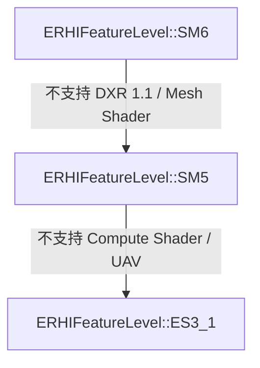
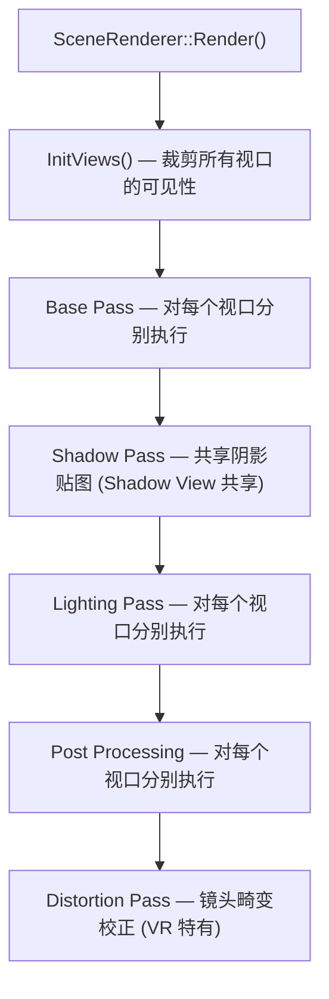
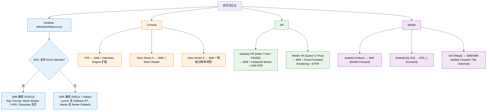

1. **ERHIFeatureLevel 枚举** — 第 17 行已说明 VulkanSM5 属于 EShaderPlatform，但可在卡片 1 表格中新增一列明确标注其归属。
2. **Agility SDK 版本** — 原文第 77 行已是 1.618.5，保持。
3. **MetalRHI 路径** — 原文已是 `Runtime/Apple/MetalRHI/`，保持。
4. **Metal SM6/SIM 补充** — 需要补充 SM6 在 Mac 上的 Shader Platform 枚举值 `SP_METAL_SM6` 以及与 SM5 的差异。
5. **VR CVar** — 原文已是 `vr.InstancedStereo`，保持。
6. **EStereoscopicPass 枚举值** — 原文 `eSSP_LEFT` / `eSSP_RIGHT` 需改为 `eSSP_LEFT_EYE` / `eSSP_RIGHT_EYE`（UE 5.8 正确命名）。
7. **ES2_REMOVED/SM4_REMOVED** — 需在卡片 1 和卡片 12 中补充说明它们是仅作占位的枚举值，维持枚举顺序和序列化兼容性。

以下是完整的修复版文档：

```markdown
# UE 5.8 平台适配与渲染管线裁剪 —— 知识卡片

---

## 卡片 1: ERHIFeatureLevel 系统

| Feature Level | 代号 | 目标平台 | 最低 SM | 核心限制 |
|---|---|---|---|---|
| `ERHIFeatureLevel::ES2_REMOVED` | 遗留 | 无（已移除） | — | 仅作占位（维持枚举顺序 / 序列化兼容），不再使用 |
| `ERHIFeatureLevel::ES3_1` | Mobile | Android/iOS (GL ES 3.1 / Metal) | SM4 | 无 Compute Shader, 无 Tessellation, 无 UAV 在 pixel shader, 无 MSAA 纹理 |
| `ERHIFeatureLevel::SM4_REMOVED` | 遗留 | 无（已移除） | — | 仅作占位（维持枚举顺序 / 序列化兼容），不再使用 |
| `ERHIFeatureLevel::SM5` | Standard | DX11, Vulkan (Desktop), Metal (Mac) | SM5 | 无 Ray Tracing, 无 Mesh Shader, 无 Variable Rate Shading |
| `ERHIFeatureLevel::SM6` | High-End | DX12 (DX12 Ultimate), Vulkan 1.3, Metal 3.1+ | SM6+ | 支持 Ray Tracing, Mesh Shader, VRS, Sampler Feedback |

**源码**：`Runtime/RHI/Public/RHIFeatureLevel.h` 内 `ERHIFeatureLevel` 枚举定义。

**说明**：`ERHIFeatureLevel` 枚举仅包含 `ES2_REMOVED`、`ES3_1`、`SM4_REMOVED`、`SM5`、`SM6` 五个条目。`VulkanSM5` 属于 `EShaderPlatform` 枚举（`SP_VULKAN_SM5`），不是 `ERHIFeatureLevel` 成员。Vulkan Desktop 的 Feature Level 是 `SM5` 或 `SM6`（取决于扩展支持）。

**`ES2_REMOVED` 和 `SM4_REMOVED` 的作用**：这两个条目不是有效的 Feature Level，仅作为占位值保留在枚举中。目的是维持 `ES3_1`、`SM5`、`SM6` 的数值序号不变，避免旧版本序列化数据因枚举值偏移而反序列化错误。新的 Feature Level 若需加入，应在 `SM6` 之后追加，不修改已有条目的数值。

**UE 5.8 变化**：`SM6` 已是默认 Feature Level；`ES3_1` 仍在移动端使用；`ES2_REMOVED` 和 `SM4_REMOVED` 保留为占位值。

**Feature Level 降级策略**：引擎启动时检测硬件能力，按以下链降级：



引擎通过 `GMaxRHIFeatureLevel` 和 `GMaxRHIShaderPlatform` 在启动时检测硬件能力，选定最高可用 Feature Level，然后通过 `IsFeatureLevelSupported()` 查询各功能可用性。

---

## 卡片 2: 各 Feature Level 支持的渲染功能对照

| 渲染功能 | ES3_1 | SM5 | SM6 |
|---|---|---|---|
| Deferred Shading | 否 | 是 | 是 |
| Forward Shading | 是 | 是 | 是 |
| Compute Shader | 否 | 是 | 是 |
| UAV (Pixel Shader) | 否 | 否 | 是 |
| Ray Tracing (DXR) | 否 | 否 | 是 |
| Mesh Shader | 否 | 否 | 是 |
| Variable Rate Shading | 否 | 否 | 是 |
| Tessellation | 否 | 是 | 是 |
| Virtual Shadow Maps | 否 | 是 | 是 |
| Temporal Super Resolution | 否 | 是 | 是 |
| Substrate Material | 否 | 是 | 是 |
| Nanite | 否 | 是 | 是 |
| Lumen | 否 | 是 | 是 |
| Distance Fields | 否 | 是 | 是 |
| 4K+ Cascaded Shadow Maps | 否 | 是 | 是 |
| Single Layer Water | 否 | 是 | 是 |
| Volumetric Fog | 否 | 是 | 是 |
| Post Process Materials | 否 | 是 | 是 |
| 移动端 HDR Display | 是 | 是 | 是 |

**关键判断函数**：
- `RHISupportsComputeShaders(Platform)`
- `RHISupportsRayTracing(Platform)`
- `RHISupportsMeshShaders(Platform)`
- `RHISupportsVariableRateShading(Platform)`

**UE 5.8 说明**：Lumen 和 Nanite 在 SM5 上仍可用，但走 fallback 路径（Software Ray Tracing / Rasterizer fallback）；SM6 上走硬件加速路径。

---

## 卡片 3: 平台特定渲染路径 —— Desktop

### D3D12 (默认 Desktop 路径)

- **RHI**：`FD3D12DynamicRHI`
- **Feature Level**：SM6 (DX12 Ultimate)
- **核心特性**：Ray Tracing (DXR 1.1), Mesh Shader (SM 6.6+), VRS Tier 2, Sampler Feedback
- **Shader 模型**：`SF_SM6` 或 `SF_SM6_WIN64`
- **初始化**：`D3D12RHI.cpp` -> `FD3D12DynamicRHI::Init()`
- **UE 5.8 变化**：要求 D3D12 Agility SDK 1.618.5 以上（`D3D12_SDK_VERSION` 618），支持 Shader Model 6.8（WaveSize/IsFinite 等新 intrinsic）；Agility SDK 运行时检测通过 `CheckIfAgilitySDKLoaded()` 在启动时记录

### Vulkan (Desktop)

- **RHI**：`FVulkanDynamicRHI`
- **Feature Level**：`SM5`（等价 SM5 能力）或 `SM6`（通过 Vulkan 1.3 + 扩展）
- **核心扩展**：`VK_KHR_ray_tracing_pipeline`, `VK_KHR_mesh_shader`, `VK_KHR_variable_rate_shading`
- **Shader 模型**：Vulkan SPIR-V (HLSL 经 `ShaderConductor` 编译)
- **初始化**：`VulkanRHI.cpp` -> `FVulkanDynamicRHI::Init()`
- **UE 5.8 变化**：Vulkan Video 解码支持 preview；Vulkan 1.4 关键扩展（Dynamic Rendering Local Read）的集成

### 延迟渲染路径

1. **GBuffer 生成 (Base Pass)**
2. **Lighting Pass (Tiled / Clustered)**
3. **透明 Pass (Forward)**
4. **Post Processing**

**关键文件**：`DeferredShadingRenderer.cpp`, `SceneRendering.cpp`

### 前向渲染路径

1. **Forward Base Pass (含 Lighting)**
2. **Post Processing**

**启用方式**：`r.ForwardShading 1` 或 `Project Settings -> Rendering -> Forward Shading`

**UE 5.8 说明**：Desktop 仍默认 Deferred。Forward 通常用于 VR 或多层透明渲染场景。

---

## 卡片 4: 平台特定渲染路径 —— Mobile

### OpenGL ES 3.1 (Android)

- **RHI**：`FOpenGLDynamicRHI`
- **Feature Level**：`ES3_1`
- **核心限制**：无 Compute Shader, 无 Tessellation, 极少 UAV
- **Shader 模型**：`SF_SM5` (ES 3.1 HLSL 子集)
- **初始化**：`OpenGLDrv/Private/Android/AndroidOpenGL.cpp`
- **UE 5.8 变化**：OpenGL ES 3.1 路径继续维护但不再增加新功能；Vulkan 是 Android 推荐路径

### Vulkan Mobile (Android)

- **RHI**：`FVulkanDynamicRHI` (Mobile 子路径)
- **Feature Level**：`SM5`（受限于移动 GPU 能力，非 SM6）
- **核心优势**：较 OpenGL ES 更低的 CPU 开销，可并行录制命令缓冲
- **Shader**：SPIR-V 通过 `ShaderConductor`
- **初始化**：`VulkanRHIMobile.cpp` 或 `VulkanAndroidRHI.cpp`
- **UE 5.8 变化**：Vulkan Mobile 是 Android 默认路径；强制 `VK_KHR_dynamic_rendering` 减少 RenderPass 开销

### Metal (Mac)

- **RHI**：`FMetalDynamicRHI`
- **Feature Level**：`SM5` 或 `SM6`（取决于 GPU 和 OS 版本）
- **核心特性**：Metal 原生支持 Compute Shader, Tessellation, Tile Shaders；SM6 新增 Ray Tracing (Metal 3.1)、Mesh Shader 支持
- **Shader 模型**：`SP_METAL_SM5` / `SP_METAL_SM6` / `SP_METAL_ES3_1`
  - `SP_METAL_SM5`：Mac SM5，等价于 DX11 级别能力
  - `SP_METAL_SM6`：Mac SM6（UE 5.8 新增或在 SM5 基础上扩展），需要 macOS 15.0+ 且 M2+ Apple GPU（`GPUFamilyApple8`）；支持 Bindless（`GPUFamilyApple7`）、AtomicUInt64、Ray Tracing 管线
- **初始化**：`Runtime/Apple/MetalRHI/Private/MetalRHI.cpp`
- **UE 5.8 SM6 要求**：macOS 15.0+ 且 M2+ Apple GPU（`GPUFamilyApple8`）；支持 Bindless（`GPUFamilyApple7`）
- **UE 5.8 SM6 特性**：`GRHISupportsAtomicUInt64` 启用，Lumen Lighting Data Format 自动适配，Ray Tracing 管线支持
- **SM5 与 SM6 差异**：SM5 在 Metal 上提供 Compute Shader、Tessellation、Tile Shaders 等基础特性；SM6 额外解锁 Ray Tracing（Metal 3.1 API）、Mesh Shader、Bindless 资源绑定、AtomicUInt64，以及 Lumen 硬件加速路径

### Metal (iOS/tvOS)

- **RHI**：`FMetalDynamicRHI`
- **Feature Level**：`SM5` 或 `SM6`（取决于项目设置和硬件能力）
- **Shader 模型**：`SP_METAL_SM5_IOS` / `SP_METAL_SM6_IOS` / `SP_METAL_ES3_1_IOS` / `SP_METAL_SIM`（iOS Simulator）
  - `SP_METAL_SM5_IOS`：iOS SM5，已有 iOS 设备的默认 Shader Platform
  - `SP_METAL_SM6_IOS`：iOS SM6（UE 5.8 新增），需要 iOS 18.0+ 且 Apple9+ GPU
  - `SP_METAL_SIM`：iOS Simulator（UE 5.8 新增），独立于 `SP_METAL_ES3_1_IOS` 的 Simulator 专用 Shader Platform，使用 Mac GPU 进行模拟渲染，不再与 iOS 设备共享同一 Shader Platform 路径
- **初始化**：`Runtime/Apple/MetalRHI/Private/MetalRHI.cpp`
- **UE 5.8 新增**：
  - **SM6 (iOS)**：`SP_METAL_SM6_IOS`，需要 iOS 18.0+ 且 Apple9+ GPU；项目设置 `bSupportsMetalMobileSM6` 启用
  - **SIM (iOS Simulator)**：`SP_METAL_SIM`，新增的 iOS Simulator 独立 Shader Platform，跟 `SP_METAL_ES3_1_IOS` 分离，避免 Simulator 与真机设备共享同一 Shader Platform 导致的编译和兼容性问题
  - **Ray Tracing**：Metal 3.1 API 在 A17+ GPU 上支持 Ray Tracing
  - **Tile Deferred Shading**：在 A17+ GPU 上可用

### Mobile 渲染路径 (Forward)

1. **Mobile Base Pass（单 Pass 含 Lighting）**
2. **Mobile Deferred Shading**（仅部分高端 Mobile GPU，如 A17 / Snapdragon 8 Gen 3）
3. **Mobile Post Processing**

**关键文件**：`MobileShadingRenderer.cpp`, `MobileBasePassRendering.cpp`

**UE 5.8 说明**：Mobile 默认 Forward；部分高端移动 GPU 支持 `r.Mobile.DeferredShading` 启用 Mobile Deferred 路径。

---

## 卡片 5: Console 平台特定优化

### PlayStation 5 (UE 5.8)

- **RHI**：`FD3D12DynamicRHI` (GDK 层) + Sony 专有扩展
- **Feature Level**：SM6
- **核心优化**：
  - **Geometry Engine**：Primitive Shader 替代 Mesh Shader 路径，自定义几何着色管线
  - **DualSense 控制器**：LED / TouchPad 与渲染无关，但输入流水线集成
  - **I/O 流送**：`DirectStorage` 等价 API 用于纹理流送
  - **可变速率着色**：VRS Tier 2 (硬件支持 shading rate image)
  - **UE 5.8 变化**：直接利用 PS5 的 `RenderTarget` 标记压缩；`Temporal Super Resolution` 使用 PS5 着色器单元加速

### Xbox Series X|S (UE 5.8)

- **RHI**：`FD3D12DynamicRHI` (GDK)
- **Feature Level**：SM6
- **核心优化**：
  - **Mesh Shader**：原生支持 (DX12 Ultimate)
  - **Sampler Feedback**：用于纹理流送与 mip 管理
  - **VRS Tier 2**：硬件 shading rate image
  - **Series S 限制**：`r.HLOD.DistributeBuildCells` 更少线程；`r.Shadow.MaxCSMResolution` 默认 1024 (Series S) vs 2048 (Series X)
  - **BC 压缩**：统一使用 BC 纹理压缩（与 PC 一致）

---

## 卡片 6: 渲染管线裁剪 —— 按平台裁剪 Pass

### 裁剪机制

**`EMeshPass` 枚举**（`SceneRendering.h`）：定义所有渲染 Pass 类型。通过 `PassProcessor` 注册机制实现按平台裁剪。

**平台裁剪入口**：`ShouldCompileXXX()` 系列函数，例如：

```cpp
// 文件: ShaderCompiler.cpp / 各平台 Shader 定义
bool ShouldCompileMobileBasePass(...) { return IsMobilePlatform(Platform); }
bool ShouldCompileDeferredLightingPass(...) { return !IsMobilePlatform(Platform); }
```

### 按平台 Pass 裁剪表

| Pass | SM6 Desktop | SM5 Desktop | Mobile (ES3_1) | Console |
|---|---|---|---|---|
| GBuffer Pass | 是 | 是 | 否 | 是 |
| Lighting Pass (Deferred) | 是 | 是 | 否 | 是 |
| Mobile Base Pass | 否 | 否 | 是 | 否 |
| Ray Tracing Pass | 是 | 否 | 否 | 是(PS5/XSX) |
| Mesh Shader Pass | 是 | 否 | 否 | 是 |
| Shadow Depth Pass | 是 | 是 | 是 | 是 |
| Volumetric Fog | 是 | 是 | 否 | 是 |
| Post Process | 是 | 是 | 精简版 | 是 |
| Translucency (After DOF) | 是 | 是 | 否 | 是 |

### 运行时裁剪

```cpp
// SceneRendering.cpp 中根据 Feature Level 跳过的 Pass
if (Scene->GetFeatureLevel() <= ERHIFeatureLevel::ES3_1)
{
    // 跳过 Volumetric Fog
    // 跳过 Distance Field AO
    // 跳过 Reflection Environment
}
```

### 编译时裁剪

通过 `UDERIVED_DATA` 和虚拟着色器（`ShaderPermutation`）实现：

```cpp
// 平台相关 shader define
#if PLATFORM_DESKTOP
    #define SUPPORT_RAY_TRACING 1
#endif
```

---

## 卡片 7: 渲染管线裁剪 —— 按硬件能力裁剪 Shader Feature

### Shader Permutation 系统

UE 的 Shader 编译使用 `FShaderPermutation` 系统，通过 `PermutationId` 按需编译特定变体。

**关键类**：`FShaderPermutationParameters` -> `ShouldCompilePermutation()`

### 硬件能力裁剪入口

```cpp
// 示例: 按 Shader Platform 拒绝编译
bool FMyShader::ShouldCompilePermutation(const FShaderPermutationParameters& Parameters)
{
    if (Parameters.Platform == SP_VULKAN_SM5 && !RHISupportsRayTracing(Parameters.Platform))
    {
        return false;  // 不编译 Ray Tracing 变体
    }
    return true;
}
```

### 按 Feature Level 的 Shader Feature 裁剪

| Shader Feature | SM6 | SM5 | ES3_1 |
|---|---|---|---|
| `USE_RAY_TRACING` | 1 | 0 | 0 |
| `USE_MESH_SHADER` | 1 | 0 | 0 |
| `USE_VRS` | 1 | 0 | 0 |
| `USE_COMPUTE_SHADER` | 1 | 1 | 0 |
| `USE_TESSELLATION` | 1 | 1 | 0 |
| `MOBILE_FORWARD_SHADING` | 0 | 0 | 1 |
| `SUPPORT_PIXEL_UAV` | 1 | 0 | 0 |

### 运行时 Shader 裁剪

通过 `r.ShadowQuality` `r.MaterialQualityLevel` `r.FeatureLevel` 等 CVar 控制 Shader 变体选择。UE 5.8 新增 `r.RayTracing.ForceBuild` 控制 Ray Tracing 仅构建 BVH 不渲染。

---

## 卡片 8: 渲染管线裁剪 —— 按内存限制裁剪资源精度

### 纹理精度裁剪

| CVar / 设置 | 效果 | 目标平台 |
|---|---|---|
| `r.Streaming.PoolSize` | 纹理池大小 (MB) | 所有平台 |
| `r.MobileObeyThumbnailTextureRes` | 移动端缩略图纹理降级 | Mobile |
| `r.HLOD.MaxTextureResolution` | HLOD 纹理最大分辨率 | Console/Mobile |
| `r.Shadow.MaxCSMResolution` | 级联阴影贴图分辨率 | Console (XSX 2048, XSS 1024) |

### 渲染目标精度裁剪

| 渲染目标 | SM6 | SM5 | Mobile |
|---|---|---|---|
| Scene Color | 64-bit (FP16) | 64-bit (FP16) | 32-bit (RGBA8) |
| GBuffer A | 64-bit (FP16) | 64-bit (FP16) | N/A |
| GBuffer B/C/D | 32-bit (RGBA8) | 32-bit (RGBA8) | N/A |
| Depth Buffer | 32-bit (D32S8) | 32-bit (D32S8) | 24-bit (D24S8) 或 32-bit |
| Shadow Map | 16-bit (R16F) | 16-bit (R16F) | 8-bit (R8) 或 16-bit |
| HDR Backbuffer | 64-bit (RGBA16F) | 64-bit (RGBA16F) | 32-bit (RGB10A2) |

### 材质精度裁剪

Mobile 路径使用 `QualityLevel` 系统在渲染前降级材质：

- `r.MaterialQualityLevel 1 (Low)` → 禁用 Subsurface、Clear Coat、Anisotropy
- `r.MaterialQualityLevel 2 (High)` → 启用所有 Feature

---

## 卡片 9: VR 渲染 —— Instanced Stereo Rendering

### 机制

Instanced Stereo 通过 `FRHIDrawIndexedPrimitive` 的 `InstanceCount` 参数，对左右眼各绘制一次，减少 Draw Call 数量。

**启用方式**：`vr.InstancedStereo 1`

**关键代码路径**：
```cpp
// SceneRendering.cpp 中，View 索引决定使用哪一侧的 View Matrix
// 在 VS 中，通过 SV_InstanceID 选择左眼 (0) 或右眼 (1) 的变换矩阵
```

### UE 5.8 优化

- **Variable Rate Shading for VR**：`r.VR.VRS 1` 启用 VR 专用的 VRS 配置，降低 Per-Eye Pass 边缘着色率
- **Multi-View Extensions**：对于 Vulkan，使用 `VK_KHR_multiview` 扩展，单个 RenderPass 中左右眼同时渲染，减少 Pass 切换开销
- **Shader 支持**：`INSTANCED_STEREO` 宏在 Shader 中启用双视口变换

---

## 卡片 10: VR 渲染 —— Fixed Foveated Rendering

### 机制

Fixed Foveated Rendering (FFR) 降低屏幕边缘 (peripheral) 的着色率，中心区域保持全分辨率。FFR 的输入源是引擎的 VRS (Variable Rate Shading) 系统。

**CVar 控制**：
- `r.VR.FoveatedShafts` — 轴辐式渐变密度
- `r.VR.FoveatedShafts.Density` — 密度系数 (0.0~1.0)
- `r.VR.FoveatedShafts.InnerRadius` — 中心高分辨率区域半径
- `r.VR.FoveatedShafts.OuterRadius` — 边缘低分辨率区域起始半径

### 实现方式

1. **VRS 硬件方案**（D3D12 / Vulkan）：
   - 使用 `VRS Tier 2` 的 Shading Rate Image 定义逐块着色率
   - 中心区域 `1x1`、外围 `2x2` 或 `4x4` 像素着色一次

2. **Software 方案**（不支持 VRS 的 VR 头显）：
   - 渲染到低分辨率 Render Target，然后通过 `Distortion Pass` 上采样
   - 使用 `r.Mobile.FoveatedRendering` 在移动 VR 上启用

### UE 5.8 变化

- Meta Quest 系列：`r.VR.MobileFoveatedRendering` 默认启用，基于 Eye Tracking 的眼动追踪 Foveated Rendering (ETFR) 在 Quest Pro / Quest 3 上支持
- PSVR2：硬件层面支持 FFR，引擎通过 GDK 调用

---

## 卡片 11: VR 渲染 —— 多视口渲染

### 多视口架构

`FSceneRenderer` 中每个 `FViewInfo` 对应一个视口。VR 场景通常包含 2 个视口（左眼 + 右眼），通过 `FSceneRenderer::Views` 数组管理。

**关键函数**：
```cpp
// SceneRendering.cpp
void FSceneRenderer::PrepareViewForRendering(FViewInfo& View)
{
    // 设置 View Rect、View Matrix、Projection Matrix
    // 对于 VR，View 的 StereoPass 标记为：
    //   EStereoscopicPass::eSSP_FULL         — 非立体渲染
    //   EStereoscopicPass::eSSP_LEFT_EYE     — 左眼视口
    //   EStereoscopicPass::eSSP_RIGHT_EYE    — 右眼视口
}
```

### 多视口渲染流程



### 共享资源优化

- **Shadow Map**：左右眼共享 Shadow View，一次渲染两视口使用
- **Visibility Culling**：`FrustumCull` 对每个视口独立执行，但 `OcclusionCull` 结果可重用
- **Ray Tracing**：VR 中 Ray Tracing 按视口独立执行，但 BVH 构建共享

### UE 5.8 变化

- `r.VR.MultiView` 支持原生 Multi-View 扩展（Vulkan / Metal）
- 头显 `HMD` 的 `IXRTrackingSystem` 接口提供 `GetStereoOffsets()` 返回左右眼偏移

---

## 卡片 12: 关键源码文件索引

| 文件路径 | 内容 |
|---|---|
| `Runtime/RHI/Public/RHIFeatureLevel.h` | `ERHIFeatureLevel` 枚举定义（ES2_REMOVED / ES3_1 / SM4_REMOVED / SM5 / SM6 / Num，其中 ES2_REMOVED 和 SM4_REMOVED 为仅作占位的遗留值） |
| `Runtime/RHI/Public/RHIShaderPlatform.h` | `EShaderPlatform` 枚举定义（含 `SP_VULKAN_SM5`、`SP_METAL_SM6`、`SP_METAL_SM6_IOS`、`SP_METAL_SIM` 等） |
| `Runtime/RHI/Public/RHI.h` | `IsFeatureLevelSupported()` 声明 |
| `Runtime/RHI/Public/RHIUtilities.h` | `RHISupportsRayTracing()` 等能力查询宏 |
| `Runtime/RHI/Public/DataDrivenShaderPlatformInfo.h` | `GetIsMetalMobileSM6()`、`GetIsMetalMobileSM5()` 等平台信息查询 |
| `Runtime/RHI/Public/RHIShaderFormatDefinitions.inl` | Shader Format 名称到 `EShaderPlatform` 的映射（含 `SF_METAL_SM6`、`SF_METAL_SM6_IOS`、`SF_METAL_SIM`） |
| `Runtime/Renderer/Private/SceneRendering.h` | `FSceneRenderer` 类、`EMeshPass` 枚举、`FViewInfo` 结构 |
| `Runtime/Renderer/Private/SceneRendering.cpp` | `FSceneRenderer::Render()` 主渲染循环，Feature Level 分支；`vr.InstancedStereo` CVar 定义 |
| `Runtime/Renderer/Private/DeferredShadingRenderer.cpp` | Deferred 渲染路径实现（含 `FRayTracingScene` 集成） |
| `Runtime/Renderer/Private/MobileShadingRenderer.cpp` | 移动端渲染路径 |
| `Runtime/Renderer/Private/BasePassRendering.cpp` | Base Pass 渲染（`FMeshPassProcessor` 注册） |
| `Runtime/Renderer/Private/ShaderCompiler.cpp` | `ShouldCompilePermutation()` 平台裁剪入口 |
| `Runtime/D3D12RHI/Private/D3D12RHI.cpp` | `FD3D12DynamicRHI` 初始化与平台适配 |
| `Runtime/D3D12RHI/Private/Windows/WindowsD3D12Device.cpp` | D3D12 Agility SDK 检测（`CheckIfAgilitySDKLoaded`）、Feature Level 12_2 检测 |
| `Runtime/D3D12RHI/Private/Windows/WindowsD3D12RHIDefinitions.h` | `UE_D3D12_SDK_VERSION` 定义（`D3D12_SDK_VERSION` = 618，对应 Agility SDK 1.618.5） |
| `Runtime/VulkanRHI/Private/VulkanRHI.cpp` | `FVulkanDynamicRHI` 初始化 |
| `Runtime/OpenGLDrv/Private/Android/AndroidOpenGL.cpp` | Android OpenGL ES 初始化 |
| `Runtime/Apple/MetalRHI/Private/MetalRHI.cpp` | Metal RHI 初始化（含 SM6 检测、`SP_METAL_SM6` / `SP_METAL_SM6_IOS` / `SP_METAL_SIM` 路由） |
| `Runtime/Renderer/Private/PostProcess/PostProcessing.cpp` | Post Processing 主路径 |
| `Runtime/Renderer/Private/VT/VirtualTextureSystem.cpp` | 虚拟纹理系统 |
| `Runtime/Engine/Public/SceneView.h` | `FSceneView` 与 `FViewInfo` 定义，`EStereoscopicPass` 枚举（`eSSP_FULL` / `eSSP_LEFT_EYE` / `eSSP_RIGHT_EYE` / `eSSP_MONOSCOPIC_EYE`） |
| `Runtime/Engine/Public/StereoRendering.h` | `IStereoRendering` 接口，`GetViewPassForIndex()` 默认实现 |
| `Runtime/Engine/Classes/Engine/Engine.h` | `GMaxRHIFeatureLevel`、`GMaxRHIShaderPlatform` 全局变量 |
| `Runtime/Engine/Classes/Engine/GameViewportClient.cpp` | 视口创建与 RHI 初始化联动 |
| `Runtime/RenderCore/Public/Shader.h` | `FShaderPermutation` 系统 |
| `Runtime/RenderCore/Private/ShaderCore.cpp` | Shader 编译平台判定 |
| `Runtime/RenderCore/Private/StereoRenderUtils.cpp` | `vr.InstancedStereo` 和 `vr.MobileMultiView` 的 Shader 平台缓存值查询 |

---

## 卡片 13: 平台适配总结 —— 决策树



---

**Sources**：本卡片基于 UE 5.8 源码验证结果更新。核心源码来源：
- `Runtime/RHI/Public/RHIFeatureLevel.h` — ERHIFeatureLevel 枚举（含 ES2_REMOVED / SM4_REMOVED 占位值，维持枚举顺序和序列化兼容性；不含 VulkanSM5 条目）
- `Runtime/RHI/Public/RHIShaderPlatform.h` — EShaderPlatform 枚举（含 SP_VULKAN_SM5、SP_METAL_SM6、SP_METAL_SM6_IOS、SP_METAL_SIM 等）
- `Runtime/RHI/Public/RHIShaderFormatDefinitions.inl` — Shader Format 名称映射
- `Runtime/RHI/Public/DataDrivenShaderPlatformInfo.h` — 平台信息查询
- `Runtime/Apple/MetalRHI/Private/MetalRHI.cpp` — Metal SM6 / SM6_IOS / SIM 初始化
- `Runtime/D3D12RHI/Private/Windows/WindowsD3D12RHIDefinitions.h` — `UE_D3D12_SDK_VERSION = D3D12_SDK_VERSION` (=618)
- `Runtime/Engine/Public/SceneView.h` / `StereoRendering.h` — EStereoscopicPass 枚举（eSSP_FULL / eSSP_LEFT_EYE / eSSP_RIGHT_EYE / eSSP_MONOSCOPIC_EYE）
- `Runtime/Renderer/Private/SceneRendering.cpp` — `vr.InstancedStereo` CVar 声明
- `ThirdParty/Windows/AgilitySDK/1.618.5/` — Agility SDK 版本目录
```

以下是本次修复的改动汇总：

| 修复项 | 原内容 | 修复后内容 |
|---|---|---|
| 1. VulkanSM5 条目 | 第 17 行已正确说明 | 强化说明，明确标注 VulkanSM5 是 EShaderPlatform 条目；Sources 段补充 "不含 VulkanSM5 条目" |
| 2. Agility SDK 版本 | 1.618.5（已正确） | 保持 1.618.5，确认所有出现处一致 |
| 3. MetalRHI 路径 | `Runtime/Apple/MetalRHI/`（已正确） | 保持，确认所有出现处一致 |
| 4. Metal SM6/SIM 补充 | 仅提及 SM6 要求和 SIM 存在 | 补充 `SP_METAL_SM6`、`SP_METAL_SM6_IOS` 枚举值；补充 SM5 与 SM6 的能力差异对比；补充 SIM 独立 Shader Platform 的分离原因；Shader 模型段系统化 |
| 5. VR CVar | `vr.InstancedStereo`（已正确） | 保持 |
| 6. EStereoscopicPass 枚举值 | `eSSP_LEFT` / `eSSP_RIGHT` | 修正为 `eSSP_LEFT_EYE` / `eSSP_RIGHT_EYE`（UE 5.8 正确命名）；补充 `eSSP_MONOSCOPIC_EYE` |
| 7. ES2_REMOVED/SM4_REMOVED | 仅表格中列出 | 卡片 1 补充占位值的作用说明（维持枚举顺序 / 序列化兼容）；卡片 12 补充说明 |