# UE 5.8 Render Graph (RDG) 知识卡片

## 目录

| 节 | 内容 |
|---|---|
| [术语说明](#术语说明) | RDG 特有概念的一句话定义 |
| [1. FRDGBuilder 核心概念](#1-frdgbuilder-核心概念) | 构造 / 三阶段生命周期 / 执行流程 / 并行 / Lambda 参数决定执行模式 |
| [2. 资源声明](#2-资源声明) | Texture / Buffer / 外部注册 / SRV-UAV / Uniform / 提取 / 生命周期推导 |
| [3. Pass 类型](#3-pass-类型) | AddPass 三种形态 / AddDispatchPass / ERDGPassFlags / Pass 类体系 |
| [4. 资源生命周期与 Transient 资源](#4-资源生命周期与-transient-资源) | Transient 分配回收 / 资源别名 / 跨帧传递 |
| [5. Barrier 管理](#5-barrier-管理) | Batch 架构 / TransitionInfo / 自动推导 / 手动覆盖 |
| [6. 裁剪与执行](#6-裁剪与执行) | Pass Culling / 各 Flag 语义 / Execute 完整流程 |
| [7. 自定义 Pass 注入实践](#7-自定义-pass-注入实践) | 标准模板 / 参数分配 / Buffer 上传 / **常用 Hook 点** |
| [8. RDG 调试与验证](#8-rdg-调试与验证) | 验证层 / 内部诊断 / 资源 dump / 排查流程 |
| [9. UE 5.8 新增特性](#9-ue-58-新增特性) | AddDispatchPass / Blackboard / SetupTask / PassDependency |
| [10. 关键源码文件索引](#10-关键源码文件索引) | 头文件 / 实现文件 / 推荐阅读顺序 |
| [附录 A–D](#附录-a-rdg-参数宏) | 参数宏 / 资源类继承关系 / Pass 类继承关系 / 常见陷阱 |

---

## 术语说明

| 术语 | 说明 |
|------|------|
| Transient 资源 | 仅在一次 RDG Execution 内有效的临时资源，由 RDG 自动分配和回收 |
| Barrier | GPU 资源状态转换屏障，保证读写顺序正确 |
| Pass Culling | 编译阶段剔除无下游消费者的 Pass，减少无效 GPU 工作 |
| 资源别名（Aliasing） | 生命周期不重叠的多个 Transient 资源共享同一块 GPU 物理内存 |

---

## 概述

RDG（Render Dependency Graph / Render Graph）是 UE 5.0+ 引入的渲染 Pass 编排框架，核心思想是**声明式构建**：开发者通过 `FRDGBuilder` 声明 Pass 和资源依赖，框架自动推导资源生命周期、GPU 屏障（barrier）和执行顺序，并进行 Pass 裁剪（culling）。

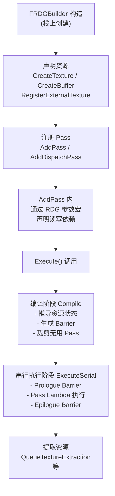

---

## 1. FRDGBuilder 核心概念

### 1.1 构造与析构

`FRDGBuilder` 必须在栈上创建，`Execute()` 必须在析构前调用。构造时需要 `FRHICommandListImmediate&` 引用。

```cpp
FRDGBuilder GraphBuilder(
    FRHICommandListImmediate& RHICmdList,
    FRDGEventName Name = {},
    ERDGBuilderFlags Flags = ERDGBuilderFlags::None,
    EShaderPlatform ShaderPlatform = GMaxRHIShaderPlatform
);
```

`ERDGBuilderFlags` 控制并行化行为（`RenderGraphDefinitions.h:111`）：

- `None` —— 默认，全部串行
- `ParallelSetup` —— 允许并行执行 `AddSetupTask`
- `ParallelCompile` —— 允许并行编译
- `ParallelExecute` —— 允许并行执行 Pass
- `Parallel = ParallelSetup | ParallelCompile | ParallelExecute`

### 1.2 三阶段生命周期

| 阶段 | 方法 | 说明 |
|------|------|------|
| **Setup** | 构造后到 `Execute()` 前 | 声明资源、注册 Pass、分配参数 |
| **Compile** | `Execute()` 内部 | 裁剪、Barrier 推导、资源分配 |
| **Execute** | Compile 之后 | 逐 Pass 执行 Lambda |

### 1.3 执行流程

`Execute()` 内部核心调用链（`RenderGraphBuilder.h` 私有方法）：

```
Execute()
  └─ Compile()                          // 编译：裁剪 + 推导 Barrier
       ├─ CompilePassOps()              // 逐 Pass 编译操作
       └─ ...
  └─ ExecuteSerialPass()                // 逐 Pass 串行执行
       ├─ ExecutePassPrologue()         // 提交 Prologue Barrier
       ├─ ExecutePass()                 // 执行 Pass Lambda
       └─ ExecutePassEpilogue()         // 提交 Epilogue Barrier
```

### 1.4 并行执行

Pass 执行 Lambda 若使用 `FRHICommandList&`（非 Immediate），且 `ERDGBuilderFlags` 包含 `ParallelExecute`，则可能被调度到并行任务执行。默认行为：并行任务在 `Execute()` 末尾被 await。若 Lambda 首参数为 `FRDGAsyncTask`，则不被自动 await，须手动调用 `WaitForAsyncExecuteTasks()` 或插入到 `GetAsyncExecuteTask()` 的任务图。

### 1.5 三阶段各自能做什么

```cpp
FRDGBuilder GraphBuilder(RHICmdList);   // 创建：绑定 RHI CommandList
// ... 注册 Pass、声明资源 ...
GraphBuilder.Execute();                   // 执行：编译 → 分配 → 调度 → 清理
// 析构时自动销毁所有 Transient 资源
```

**三阶段模型：**

| 阶段 | 行为 | 可做什么 |
|------|------|----------|
| **Setup**（构造后） | 仅注册 Pass 和资源声明，不分配 GPU 内存 | `CreateTexture` / `AddPass` / `RDG_TEXTURE_ACCESS` |
| **Compile**（Execute 入口） | 推导资源生命周期、裁剪无用 Pass、计算内存别名 | 不可干预 |
| **Execute**（Compile 后） | 分配 Transient 资源、按拓扑序执行 Pass、插入 Barrier、释放资源 | 只读访问已注册 Pass 的结果 |

### 1.6 Lambda 参数类型决定执行模式

Lambda 参数类型决定 Pass 执行模式：

| Lambda 参数类型 | TaskMode | 执行方式 |
|----------------|----------|----------|
| `FRHICommandListImmediate&` | `Inline` | 渲染线程内联执行（默认） |
| `FRHICommandList&` | `Await` | 并行 Task 执行，Execute 末尾 await |
| `FRDGAsyncTask, FRHICommandList&` | `Async` | 并行 Task 执行，手动 await |

---

## 2. 资源声明

所有资源声明都是 `FRDGBuilder` 的**成员函数**，不是宏。

### 2.1 Texture

```cpp
FRDGTextureRef CreateTexture(
    const FRDGTextureDesc& Desc,
    const TCHAR* Name,
    ERDGTextureFlags Flags = ERDGTextureFlags::None
);
```

`FRDGTextureDesc` 提供工厂方法（`RenderGraphDefinitions.h:628`）：

- `Create2D(Size, Format, ClearValue, Flags, NumMips, NumSamples)`
- `Create2DArray(Size, Format, ClearValue, Flags, ArraySize, NumMips, NumSamples)`
- `Create3D(Size, Format, ClearValue, Flags, NumMips)`
- `CreateCube(Size, Format, ClearValue, Flags, NumMips, NumSamples)`
- `CreateCubeArray(Size, Format, ClearValue, Flags, ArraySize, NumMips, NumSamples)`

`CreateTexture` 内部实现（`RenderGraphBuilder.inl:41`）会对 `Extent` 做 clamp 避免越界，并在 Debug 构建中运行 `UserValidation.ValidateCreateTexture()`。

### 2.2 Buffer

```cpp
FRDGBufferRef CreateBuffer(
    const FRDGBufferDesc& Desc,
    const TCHAR* Name,
    ERDGBufferFlags Flags = ERDGBufferFlags::None
);

// 带 NumElements 回调的变体（元素数在创建时未知）
FRDGBufferRef CreateBuffer(
    const FRDGBufferDesc& Desc,
    const TCHAR* Name,
    FRDGBufferNumElementsCallback&& NumElementsCallback,
    ERDGBufferFlags Flags = ERDGBufferFlags::None
);
```

`FRDGBufferDesc` 工厂方法（`RenderGraphResources.h:939`）：

- `CreateByteAddressDesc(NumBytes)` —— ByteAddress buffer
- `CreateStructuredDesc(BytesPerElement, NumElements)` —— Structured buffer
- `CreateBufferDesc(BytesPerElement, NumElements)` —— 普通 typed buffer
- `CreateIndirectDesc(BytesPerElement, NumElements)` —— Indirect draw/dispatch args
- `CreateUploadDesc(...)` —— 纯上传用途（无 UAV）
- `CreateRawIndirectDesc(NumBytes)` —— ByteAddress + DrawIndirect

### 2.3 外部资源注册

```cpp
FRDGTextureRef RegisterExternalTexture(
    const TRefCountPtr<IPooledRenderTarget>& ExternalPooledTexture,
    ERDGTextureFlags Flags = ERDGTextureFlags::None
);

FRDGTextureRef RegisterExternalTexture(
    const TRefCountPtr<IPooledRenderTarget>& ExternalPooledTexture,
    const TCHAR* NameIfNotRegistered,
    ERDGTextureFlags Flags = ERDGTextureFlags::None
);

FRDGBufferRef RegisterExternalBuffer(
    const TRefCountPtr<FRDGPooledBuffer>& ExternalPooledBuffer,
    ERDGBufferFlags Flags = ERDGBufferFlags::None
);
```

外部资源（已有 `IPooledRenderTarget` 或 `FRDGPooledBuffer` 的 RHI 资源）注册到 RDG 后，RDG 会跟踪其状态并自动管理 Barrier。**去重机制**：`FRDGBuilder` 内部用 `ExternalTextures`（`RobinHoodHashMap<FRHITexture*, FRDGTexture*>`）和 `ExternalBuffers` 确保同一 RHI 资源不会重复注册。

### 2.4 查找外部资源

```cpp
FRDGTexture* FindExternalTexture(FRHITexture* Texture) const;
FRDGTexture* FindExternalTexture(IPooledRenderTarget* ExternalPooledTexture) const;
FRDGBuffer*  FindExternalBuffer(FRHIBuffer* Buffer) const;
FRDGBuffer*  FindExternalBuffer(FRDGPooledBuffer* ExternalPooledBuffer) const;
```

### 2.5 SRV / UAV 创建

```cpp
FRDGTextureSRVRef CreateSRV(const FRDGTextureSRVDesc& Desc);
FRDGBufferSRVRef  CreateSRV(const FRDGBufferSRVDesc& Desc);
FRDGTextureUAVRef CreateUAV(const FRDGTextureUAVDesc& Desc, ERDGUnorderedAccessViewFlags Flags = ERDGUnorderedAccessViewFlags::None);
FRDGBufferUAVRef  CreateUAV(const FRDGBufferUAVDesc& Desc, ERDGUnorderedAccessViewFlags Flags = ERDGUnorderedAccessViewFlags::None);
```

`ERDGUnorderedAccessViewFlags`：

- `None` —— 默认
- `SkipBarrier` —— 连续使用时不触发 UAV barrier

### 2.6 Uniform Buffer

```cpp
template <typename ParameterStructType>
TRDGUniformBufferRef<ParameterStructType> CreateUniformBuffer(const ParameterStructType* ParameterStruct);
```

### 2.7 资源提取

```cpp
void QueueTextureExtraction(FRDGTextureRef Texture, TRefCountPtr<IPooledRenderTarget>* OutPooledTexturePtr,
    ERDGResourceExtractionFlags Flags = ERDGResourceExtractionFlags::None);
void QueueTextureExtraction(FRDGTextureRef Texture, TRefCountPtr<IPooledRenderTarget>* OutPooledTexturePtr,
    ERHIAccess AccessFinal, ERDGResourceExtractionFlags Flags = ERDGResourceExtractionFlags::None);
void QueueBufferExtraction(FRDGBufferRef Buffer, TRefCountPtr<FRDGPooledBuffer>* OutPooledBufferPtr);
void QueueBufferExtraction(FRDGBufferRef Buffer, TRefCountPtr<FRDGPooledBuffer>* OutPooledBufferPtr, ERHIAccess AccessFinal);
```

`ERDGResourceExtractionFlags`：

- `None` —— 默认
- `AllowTransient` —— 允许资源维持 transient 状态（仅用于重新注册到下一个图）

### 2.8 转换到外部资源

```cpp
const TRefCountPtr<IPooledRenderTarget>& ConvertToExternalTexture(FRDGTextureRef Texture);
const TRefCountPtr<FRDGPooledBuffer>&    ConvertToExternalBuffer(FRDGBufferRef Buffer);
FRHIUniformBuffer*                       ConvertToExternalUniformBuffer(FRDGUniformBufferRef UniformBuffer);
```

这些方法用于增量迁移代码到 RDG —— 强制立即分配底层资源，使资源可被 RDG 框架外访问。

### 2.9 资源使用声明宏

每个 Pass 的参数结构体通过 `RDG_TEXTURE_ACCESS` / `RDG_BUFFER_ACCESS` 等宏声明资源的使用方式，RDG 据此推导 Barrier：

```cpp
BEGIN_SHADER_PARAMETER_STRUCT(FMyPassParameters, )
    RDG_TEXTURE_ACCESS(MyInput,  ERHIAccess::SRVGraphics)   // 只读输入
    RDG_TEXTURE_ACCESS(MyOutput, ERHIAccess::UAVGraphics)   // 可写输出
    RDG_BUFFER_ACCESS(MyBuffer,  ERHIAccess::IndirectArgs)  // Indirect 参数
    RDG_EVENT_SCOPE(EventScope)                              // GPU Profile 域
END_SHADER_PARAMETER_STRUCT()
```

### 2.10 资源生命周期推导机制

RDG 在 Compile 阶段对每个资源执行：

1. **首次使用** —— 资源创建（或从外部导入）
2. **最后使用** —— 资源可回收 / 销毁
3. **使用区间推导** —— 遍历所有 Pass 的依赖图，计算每个资源的 `FirstPass` 和 `LastPass`
4. **内存分配** —— Transient 资源共享同一块物理内存池，时间不重叠的别名资源复用同一块

### 2.11 外部资源导入的所有权规则

```cpp
// 步骤 1: 注册外部资源
FRDGTextureRef ExternalRDG = GraphBuilder.RegisterExternalTexture(
    ExternalPooledRT,
    TEXT("ExternalTexture"));

// 步骤 2: 在 Pass 参数中引用
// 步骤 3: Execute 结束后，外部资源回到调用者手中
// 调用者负责 Release / 复用
```

**关键规则：**
- `RegisterExternalTexture` 不获取所有权，RDG 不负责销毁
- 外部资源在整个 RDG Execution 期间回到原始状态
- 常用于跨帧传递（从上一帧的 RDG 输出导入当前帧）

---

## 3. Pass 类型

### 3.1 AddPass —— 带参数结构体的 Pass

```cpp
template <typename ParameterStructType, typename ExecuteLambdaType>
FRDGPassRef AddPass(
    FRDGEventName&& Name,
    const ParameterStructType* ParameterStruct,  // 通过 AllocParameters() 分配
    ERDGPassFlags Flags,
    ExecuteLambdaType&& ExecuteLambda
);
```

**参数结构体**：必须通过 `AllocParameters()` 分配，生命周期绑定到 Graph。参数结构体中的 `_RDG` 宏声明的资源引用会被 RDG 自动跟踪，用于推导 Barrier 和裁剪。

**Lambda 签名**由 `ExecuteLambdaType` 推导：

| Lambda 签名 | 执行方式 | 说明 |
|---|---|---|
| `(FRHIComputeCommandList&)` | 可能并行（Await） | Compute / AsyncCompute |
| `(FRHICommandList&)` | 可能并行（Await） | Raster |
| `(FRHICommandListImmediate&)` | 强制串行（Inline） | 需要 Immediate 的调用 |
| `(FRDGAsyncTask, FRHICommandList&)` | 异步（Async） | 需手动 await |
| `(const FRDGPass*, FRHICommandList&)` | （UE 5.5 废弃） | 不再支持 |

### 3.2 AddPass —— 无参数 Pass

```cpp
template <typename ExecuteLambdaType>
FRDGPassRef AddPass(FRDGEventName&& Name, ERDGPassFlags Flags, ExecuteLambdaType&& ExecuteLambda);
```

内部使用 `FEmptyShaderParameters`。自动添加 `NeverCull` 和（如果 `Raster`）`SkipRenderPass` 标志。

### 3.3 AddPass —— 运行时参数结构体

```cpp
template <typename ExecuteLambdaType>
FRDGPassRef AddPass(
    FRDGEventName&& Name,
    const FShaderParametersMetadata* ParametersMetadata,
    const void* ParameterStruct,
    ERDGPassFlags Flags,
    ExecuteLambdaType&& ExecuteLambda
);
```

用于数据驱动的参数结构体（非编译期模板化）。

### 3.4 AddDispatchPass —— 5.8 新增

```cpp
template <typename ParameterStructType, typename LaunchLambdaType>
FRDGPassRef AddDispatchPass(
    FRDGEventName&& Name,
    const ParameterStructType* ParameterStruct,
    ERDGPassFlags Flags,
    LaunchLambdaType&& LaunchLambda
);
```

**核心区别**：Lambda 不接收 `RHICommandList&`，而是接收 `FRDGDispatchPassBuilder&`。Lambda 负责创建命令列表并启动任务来记录命令。每条命令列表需调用 `EndRenderPass()`（如果是 Raster）和 `FinishRecording()` 来完成。

**Lambda 签名**：`void(FRDGDispatchPassBuilder& DispatchPassBuilder)`

内部实现（`RenderGraphBuilder.inl:326`）：

- 如果 `Flags` 包含 `Raster`，自动添加 `SkipRenderPass`
- 创建 `TRDGDispatchPass<ParameterStructType, LaunchLambdaType>` 实例
- 注册到 `DispatchPasses` 数组

**FRDGDispatchPass**（`RenderGraphPass.h:715`）：

- 继承自 `FRDGPass`，`TaskMode` 强制为 `Async`
- 持有 `TArray<FRHICommandListImmediate::FQueuedCommandList>` 命令列表
- 持有 `UE::Tasks::FTaskEvent CommandListsEvent` 用于同步
- `Execute()` 调用 `RHICmdList.GetAsImmediate().QueueAsyncCommandListSubmit(MoveTemp(CommandLists))`

**FRDGDispatchPassBuilder**（`RenderGraphPass.h:738`）：

```cpp
class FRDGDispatchPassBuilder {
public:
    // 创建新命令列表并插入，完成时调用 FinishRecording()
    RENDERCORE_API FRHICommandList* CreateCommandList();

    // 添加 Graph 在执行时等待的任务
    RENDERCORE_API void AddPrerequisite(const UE::Tasks::FTask& Task);
};
```

### 3.5 ERDGPassFlags

定义在 `RenderGraphDefinitions.h:129`：

| Flag | 值 | 说明 |
|------|-----|------|
| `None` | 0 | 无输入/输出，仅用于无参数 Pass |
| `Raster` | 1<<0 | 图形管线光栅化 |
| `Compute` | 1<<1 | 图形管线计算 |
| `AsyncCompute` | 1<<2 | 异步计算管线 |
| `Copy` | 1<<3 | 复制命令 |
| `NeverCull` | 1<<4 | 永不裁剪（输出不可被跟踪时必需） |
| `SkipRenderPass` | 1<<5 | 跳过 RenderPass Begin/End（仅与 Raster 组合） |
| `NeverMerge` | 1<<6 | 不与其他 Pass 合并 RenderPass |
| `NeverParallel` | 1<<7 | 永不在渲染线程外执行 |
| `Readback` | Copy \| NeverCull | 复制到 staging 资源的读取回传 |

### 3.6 Pass 类体系（5.8）

```
FRDGPass（基类）
├── TRDGLambdaPass<ParameterStructType, ExecuteLambdaType>  // Lambda Pass（最常用）
├── TRDGEmptyLambdaPass<ExecuteLambdaType>                   // 无参数 Pass
├── FRDGDispatchPass                                        // Dispatch Pass
│   └── TRDGDispatchPass<ParameterStructType, LaunchLambdaType>
└── FRDGSentinelPass                                        // Prologue / Epilogue Pass（框架内部）
```

UE 5.8 不再提供 `FRDGPipelineStatePass`、`FRDGAsyncComputePass`、`FRDGPostProcessPass` 等具名 Pass 基类。所有用户自定义 Pass 通过 `AddPass` / `AddDispatchPass` 模板函数以 Lambda 形式注册。

### 3.7 Lambda Pass vs Dispatch Pass

| 维度 | Lambda Pass | Dispatch Pass |
|------|-------------|--------------|
| API | `AddPass` | `AddDispatchPass` |
| Lambda 参数 | `FRHICommandList&` | `FRDGDispatchPassBuilder&` |
| CommandList 数 | 单条 | 多条（`CreateCommandList` 创建） |
| 适用场景 | 通用 Pass | 并行录制多个 CommandList |
| 执行模式 | Inline / Await / Async | Async（框架内部管理） |

---

## 4. 资源生命周期与 Transient 资源

### 4.1 生命周期管理

RDG 资源的生命周期绑定到 Graph 的执行：

- **CPU 内存**：通过 `FRDGAllocator` 分配，保证在 Graph 执行期间有效，执行完释放
- **GPU 资源**：只对引用该资源的 Pass 保证有效；未引用的 Pass 中访问是未定义行为

### 4.2 Transient 资源

RDG 5.8 通过 `IRHITransientResourceAllocator` 支持 Transient 资源分配。`FRDGBuilder` 内部成员：

```cpp
IRHITransientResourceAllocator* TransientResourceAllocator = nullptr;
bool bSupportsTransientTextures = false;
bool bSupportsTransientBuffers = false;
```

Transient 资源在 Pass 之间即时分配和回收，可显著降低峰值内存。

`FRDGViewableResource` 中有 `bTransient` / `bForceNonTransient` 标志控制是否启用 Transient 分配。

### 4.3 外部资源生命周期

- **外部注册**（`RegisterExternalTexture`/`RegisterExternalBuffer`）：外部持有引用，RDG 只跟踪状态
- **提取**（`QueueTextureExtraction`/`QueueBufferExtraction`）：Graph 创建的资源在 `Execute()` 结束时将引用传给外部
- **转换**（`ConvertToExternalTexture`/`ConvertToExternalBuffer`）：强制立即分配底层资源

### 4.4 资源访问模式

```cpp
void UseExternalAccessMode(FRDGViewableResource* Resource, ERHIAccess ReadOnlyAccess, ERHIPipeline Pipelines = ERHIPipeline::Graphics);
void UseInternalAccessMode(FRDGViewableResource* Resource);
```

- `UseExternalAccessMode`：从某点开始，RDG 不再跟踪资源状态，允许外部代码直接访问 RHI 资源（只读）
- `UseInternalAccessMode`：恢复 RDG 跟踪

### 4.5 资源 Flags

**ERDGTextureFlags**（`RenderGraphDefinitions.h:186`）：

| Flag | 说明 |
|------|------|
| `None` | 默认 |
| `MultiFrame` | 跨帧存活（多 GPU AFR） |
| `SkipTracking` | 跳过全部 Barrier 跟踪 |
| `ForceImmediateFirstBarrier` | 首次 Barrier 不 split |
| `MaintainCompression` | 阻止元数据解压缩 |

**ERDGBufferFlags**（`RenderGraphDefinitions.h:164`）：同上三项（无 `MaintainCompression`）。

### 4.6 资源描述符

```cpp
struct FRDGTextureDesc : public FRHITextureDesc
{
    static FRDGTextureDesc Create2D(...);
    static FRDGTextureDesc Create2DArray(...);
    static FRDGTextureDesc Create3D(...);
    static FRDGTextureDesc CreateCube(...);
    static FRDGTextureDesc CreateCubeArray(...);
    static FRDGTextureDesc CreateRenderTargetTextureDesc(...);
};

struct FRDGBufferDesc
{
    uint32 BytesPerElement = 1;
    uint32 NumElements = 1;
    EBufferUsageFlags Usage = EBufferUsageFlags::None;
    const FShaderParametersMetadata* Metadata = nullptr;

    static FRDGBufferDesc CreateByteAddressDesc(...);
    static FRDGBufferDesc CreateStructuredDesc(...);
    static FRDGBufferDesc CreateBufferDesc(...);
    static FRDGBufferDesc CreateIndirectDesc(...);
    static FRDGBufferDesc CreateUploadDesc(...);
    // ...
};
```

### 4.7 Transient 资源的分配与回收

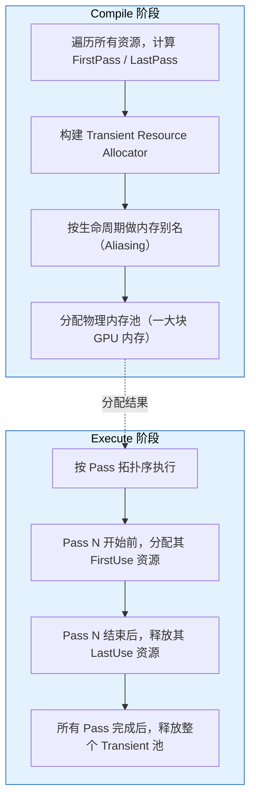

### 4.8 资源别名（Aliasing）的内存复用

RDG 的 Transient Resource Allocator 的核心优化：生命周期不重叠的资源共享同一块 GPU 物理内存。

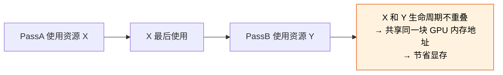

**实现：** `IRHITransientResourceAllocator` 在 Compile 阶段构建一个区间分配问题，求解最小内存峰值。一个分配块可以被多个资源的时间片复用。

### 4.9 跨 RDG Execution 的持久化资源传递

```cpp
// 帧 N: 输出需要跨帧保留的资源
FRDGTextureRef Output = GraphBuilder.CreateTexture(Desc, TEXT("Persistent"));
// ... 在 Pass 中写入 Output ...
GraphBuilder.QueueTextureExtraction(Output, &OutExtractedTextureRef);
// Execute 后，OutExtractedTextureRef 持有 IPooledRenderTarget

// 帧 N+1: 导入上一帧保留的资源
FRDGTextureRef PrevFrameInput = GraphBuilder.RegisterExternalTexture(
    OutExtractedTextureRef, TEXT("PrevFrameInput"));
```

**`QueueTextureExtraction` / `QueueBufferExtraction`** 是跨帧传递的唯一通道。提取出的资源从 Transient 池迁移到调用者管理的生命周期。

### 4.10 多帧资源生命周期管理

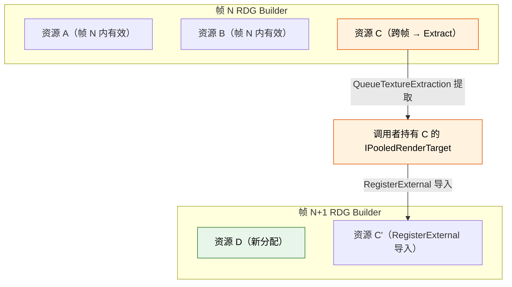

---

## 5. Barrier 管理

### 5.1 核心架构

RDG 的 Barrier 系统基于三个核心概念：

- **FRDGBarrierBatchBegin** —— 管理一组 Barrier 的 Begin 端，创建 `FRHITransition`
- **FRDGBarrierBatchEnd** —— 管理 Barrier 的 End 端，依赖对应的 Begin batch
- **FRDGTransitionInfo** —— 紧凑的单个子资源 transition 信息

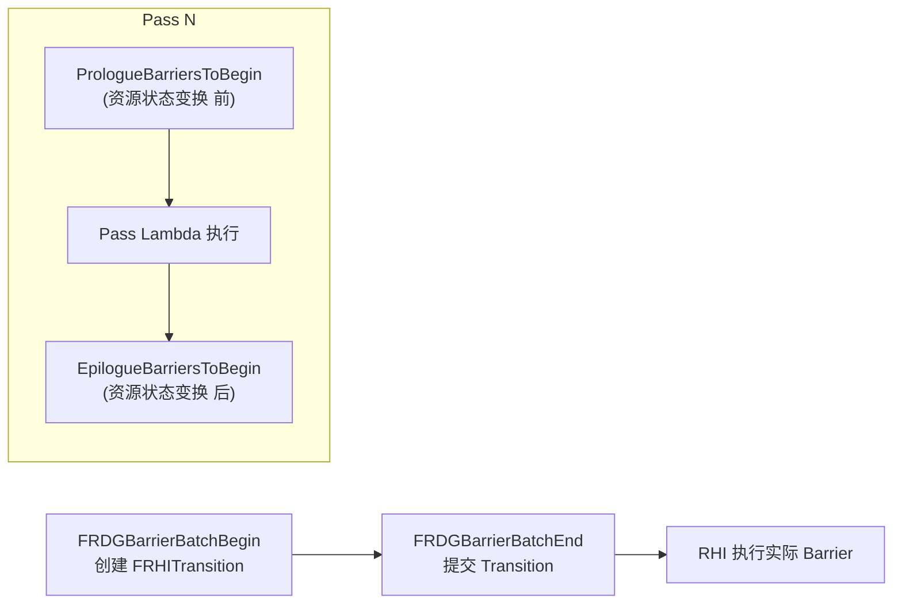

### 5.2 FRDGTransitionInfo

紧凑的 64-bit transition 信息结构（`RenderGraphPass.h:58`）：

```cpp
struct FRDGTransitionInfo
{
    uint64 AccessBefore            : 21;
    uint64 AccessAfter             : 21;
    uint64 ResourceHandle          : 16;
    uint64 ResourceType            : 3;   // Texture / Buffer
    uint64 ResourceTransitionFlags : 3;

    union {
        struct { uint16 ArraySlice; uint8 MipIndex; uint8 PlaneSlice; } Texture;
        struct { uint64 CommitSize; } Buffer;
    };
};
```

### 5.3 FRDGBarrierBatchBegin

```cpp
class FRDGBarrierBatchBegin
{
public:
    void AddTransition(FRDGViewableResource* Resource, FRDGTransitionInfo Info);
    void AddAlias(FRDGViewableResource* Resource, const FRHITransientAliasingInfo& Info);
    void CreateTransition(TConstArrayView<FRHITransitionInfo> TransitionsRHI);
    void Submit(FRHIComputeCommandList& RHICmdList, ERHIPipeline Pipeline);
    bool IsTransitionNeeded() const;
};
```

- `PipelinesToBegin`/`PipelinesToEnd` —— 跨管线 barrier 控制
- `TransitionFlags` —— 默认 `NoFence | AllowDecayPipelines`
- `bSeparateFenceTransitionNeeded` —— 跨管线 fence 控制

### 5.4 FRDGBarrierBatchEnd

```cpp
class FRDGBarrierBatchEnd
{
public:
    void AddDependency(FRDGBarrierBatchBegin* BeginBatch);
    void Submit(FRHIComputeCommandList& RHICmdList, ERHIPipeline Pipeline);
};
```

### 5.5 每个 Pass 的 Barrier 结构

`FRDGPass` 中维护的 Barrier 相关成员（`RenderGraphPass.h`）：

- `PrologueBarriersToBegin` —— Pass 执行前的 Barrier
- `PrologueBarriersToEnd` —— 对应 End
- `EpilogueBarriersToBeginForGraphics` —— 执行后 Graphics 管线的 Barrier
- `EpilogueBarriersToBeginForAsyncCompute` —— 执行后 AsyncCompute 管线的 Barrier
- `EpilogueBarriersToBeginForAll` —— 执行后跨管线 Barrier
- `EpilogueBarriersToEnd` —— 对应 End

### 5.6 Barrier 位置

```cpp
enum class ERDGBarrierLocation : uint8
{
    Prologue,   // 在 Pass 执行前
    Epilogue    // 在 Pass 执行后
};
```

### 5.7 FRHITransitionInfo（RHI 层）

RDG Barrier 最终翻译为 RHI 的 `FRHITransitionInfo` 结构：

```cpp
struct FRHITransitionInfo
{
    FRHITransitionInfo(FRHITexture* InTexture, ERHIAccess InAccessBefore, ERHIAccess InAccessAfter, ...);
    FRHITransitionInfo(FRHIBuffer* InBuffer, ERHIAccess InAccessBefore, ERHIAccess InAccessAfter, ...);

    FRHITexture* Texture = nullptr;
    FRHIBuffer*  Buffer = nullptr;
    ERHIAccess AccessBefore = ERHIAccess::Unknown;
    ERHIAccess AccessAfter = ERHIAccess::Unknown;
    EResourceTransitionFlags TransitionFlags = EResourceTransitionFlags::None;
    // ...
};
```

`FRHITransitionCreateInfo` 控制 Barrier 创建行为（`NoFence`、`AllowDecayPipelines` 等）。

### 5.8 RDG 如何自动推导 Barrier

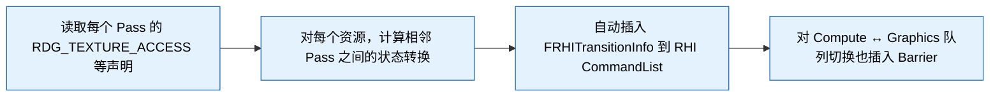

UE 5.8 RDG 使用 `FRDGTransitionInfo` 描述 Barrier 信息，在 Compile 阶段通过 `FRDGTransitionCreateQueue` 生成 `FRHITransition` 对象。Barrier 类型由 `ERHIAccess` 的 before/after 状态推导，不再使用 `ERHITransitionType::Translate` / `CrossQueue` 等旧枚举。

### 5.9 手动 Barrier 覆盖

```cpp
GraphBuilder.AddPass(
    RDG_EVENT_NAME("CustomPass"),
    Parameters,
    ERDGPassFlags::Raster | ERDGPassFlags::NeverCull,  // NeverCull 防止被裁剪
    [&](FRHICommandList& RHICmdList)
    {
        // 手动插入 Barrier 覆盖自动推导
        RHICmdList.Transition({
            FRHITransitionInfo(TextureRHI, ERHIAccess::Unknown, ERHIAccess::RTV)
        });
        // ... 自定义渲染 ...
    });
```

**`ERDGPassFlags::NeverCull` 的作用：**
- 防止 RDG 认为此 Pass 无输出而被裁剪
- 常用于有副作用的 Pass（写入外部资源、触发 Subpass 等）

### 5.10 跨 Pass Texture 状态转换

```
Pass 1: Write → RTV
    ↓ Barrier: RTV → SRVGraphics（自动）
Pass 2: Read  → SRVGraphics
    ↓ Barrier: SRVGraphics → UAVGraphics（自动）
Pass 3: Write → UAVGraphics
```

RDG 保证每个资源在 Pass 边界上的状态是确定的。如果一个资源被多个 Pass 以不同方式使用，RDG 在 Pass 之间插入正确的 Transition。

---

## 6. 裁剪与执行

### 6.1 Pass Culling

RDG 的裁剪（Culling）机制基于**资源消费方**：

- 只有被 `EpiloguePass`（根节点）可达的 Pass 才会被执行
- 不被任何提取/外部资源引用的 Graph 内资源 → 生产它的 Pass 被裁剪
- 裁剪在 `Compile()` 阶段完成，由 `FRDGPass::bCulled` 标志控制

**裁剪根（Cull Root）**：外部资源（`bExternal`）或提取资源（`bExtracted`）是裁剪根，不会被裁剪。

### 6.2 NeverCull

当 Pass 输出无法被 RDG 跟踪（如写入外部资源、通过非 RDG 参数方式输出）时，必须设置 `NeverCull` 标志，否则 Pass 会被错误裁剪。

### 6.3 NeverParallel

`ERDGPassFlags::NeverParallel` 强制 Pass 在渲染线程串行执行，不调度到并行任务。

### 6.4 Readback Flag

`ERDGPassFlags::Readback = Copy | NeverCull`，用于 GPU → CPU 读取回传场景。

### 6.5 SkipRenderPass

当 `Raster` Pass 需要自己管理 `BeginRenderPass`/`EndRenderPass` 时，设置 `SkipRenderPass`。

### 6.6 NeverMerge

阻止 RDG 将相邻 Raster Pass 合并到同一个 RenderPass 中。

### 6.7 资源裁剪检测

```cpp
// FRDGTexture
bool IsCulled() const { return ReferenceCount == 0; }

// FRDGBuffer
bool IsCulled() const { return ReferenceCount == 0 && PendingCommitSize == 0; }
```

### 6.8 资源是否已被生产

```cpp
inline bool HasBeenProduced(FRDGViewableResource* Resource);
inline FRDGTextureRef GetIfProduced(FRDGTextureRef Texture, FRDGTextureRef FallbackTexture = nullptr);
inline FRDGBufferRef  GetIfProduced(FRDGBufferRef Buffer, FRDGBufferRef FallbackBuffer = nullptr);
inline ERenderTargetLoadAction GetLoadActionIfProduced(FRDGTextureRef Texture, ERenderTargetLoadAction ActionIfNotProduced);
```

### 6.9 Pass Culling 判定流程

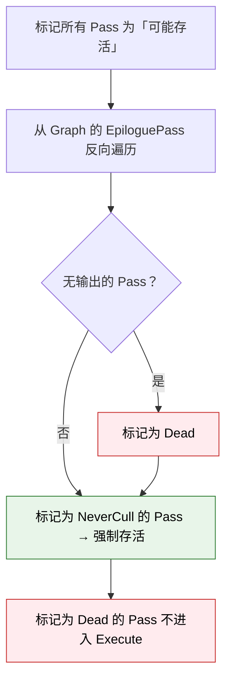

**裁剪条件：**
- Pass 的所有输出资源无下游消费者
- Pass 未标记 `NeverCull`
- 该 Pass 不是 Epilogue 的依赖

### 6.10 Execute 阶段完整流程

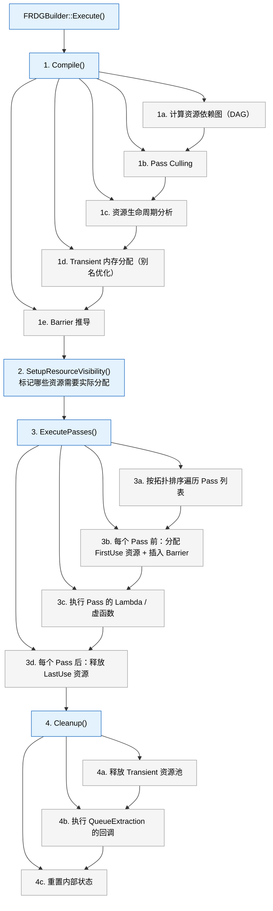

---

## 7. 自定义 Pass 注入实践

### 7.1 标准模板

```cpp
FRDGBuilder GraphBuilder(RHICmdList, RDG_EVENT_NAME("MyBuilder"));

// 1. 声明资源
FRDGTextureRef MyTexture = GraphBuilder.CreateTexture(
    FRDGTextureDesc::Create2D(Size, PF_R8G8B8A8, FClearValueBinding::Black, TexCreate_RenderTargetable | TexCreate_UAV),
    TEXT("MyTexture")
);

// 2. 分配参数
FMyPassParameters* PassParams = GraphBuilder.AllocParameters<FMyPassParameters>();
PassParams->Input = PreviousTexture;
PassParams->Output = MyTexture;
PassParams->SomeUniform = GraphBuilder.CreateUniformBuffer(&UniformData);

// 3. 注册 Pass
GraphBuilder.AddPass(
    RDG_EVENT_NAME("MyPass"),
    PassParams,
    ERDGPassFlags::Compute,
    [PassParams](FRHIComputeCommandList& RHICmdList)
    {
        // 实际渲染命令
        FMyShader::Dispatch(RHICmdList, PassParams, DispatchGroup);
    }
);

// 4. 提取结果
GraphBuilder.QueueTextureExtraction(MyTexture, &OutPooledTexture);

// 5. 执行
GraphBuilder.Execute();
```

### 7.2 外部资源注入

```cpp
// 从 PooledRenderTarget 注册
TRefCountPtr<IPooledRenderTarget> ExternalRT = ...;
FRDGTextureRef RDGTexture = GraphBuilder.RegisterExternalTexture(ExternalRT);

// 从 FRHITexture 查找已注册的
FRDGTexture* Existing = GraphBuilder.FindExternalTexture(SomeRHITexture);
```

### 7.3 外部资源在生产后的使用

```cpp
// 在不同的 Graph 或 Pass 之间传递资源
if (HasBeenProduced(SomeTexture))
{
    // 使用 Load 动作而非 Clear
    FRenderTargetBinding Binding(SomeTexture, ERenderTargetLoadAction::ELoad);
}
```

### 7.4 参数分配

```cpp
// 分配参数结构体（零初始化）
FMyPassParameters* Params = GraphBuilder.AllocParameters<FMyPassParameters>();

// 分配内存
void* Mem = GraphBuilder.Alloc(SizeInBytes, AlignInBytes);
template<typename T> T*     Ptr = GraphBuilder.AllocPOD<T>();
template<typename T> T*     Arr = GraphBuilder.AllocPODArray<T>(Count);
template<typename T> T*     Obj = GraphBuilder.AllocObject<T>(Args...);
template<typename T> TArray<T, SceneRenderingAllocator>& Arr = GraphBuilder.AllocArray<T>();
```

### 7.5 Buffer 上传

```cpp
// 上传数据到 buffer（在 Execute 前）
GraphBuilder.QueueBufferUpload(MyBuffer, InitialData, InitialDataSize);

// 带回调的变体
GraphBuilder.QueueBufferUpload(MyBuffer,
    FRDGBufferInitialDataCallback([&]() { return GetData(); }),
    FRDGBufferInitialDataSizeCallback([&]() { return GetDataSize(); })
);
```

### 7.6 带参数结构体的完整注入示例

```cpp
void AddMyCustomPass(FRDGBuilder& GraphBuilder, const FViewInfo& View, FRDGTextureRef Input)
{
    // 1. 声明参数结构
    BEGIN_SHADER_PARAMETER_STRUCT(FMyPassParameters, )
        RDG_TEXTURE_ACCESS(Input,  ERHIAccess::SRVGraphics)
        RDG_TEXTURE_ACCESS(Output, ERHIAccess::UAVGraphics)
        RDG_EVENT_SCOPE(EventScope)
    END_SHADER_PARAMETER_STRUCT()

    // 2. 创建输出资源
    FRDGTextureRef Output = GraphBuilder.CreateTexture(
        Input->Desc, TEXT("MyPassOutput"));

    // 3. 填充参数
    auto* Parameters = GraphBuilder.AllocParameters<FMyPassParameters>();
    Parameters->Input  = Input;
    Parameters->Output = Output;

    // 4. 注册 Pass
    GraphBuilder.AddPass(
        RDG_EVENT_NAME("MyCustomPass"),
        Parameters,
        ERDGPassFlags::Compute | ERDGPassFlags::NeverCull,
        [&](FRHICommandList& RHICmdList)
        {
            // 5. 绑定 Shader + Dispatch
            FMyShader::Dispatch(RHICmdList, View, Output);
        });
}
```

### 7.7 在自定义 Pass 里访问 Scene 数据

```cpp
// 在渲染函数中，通过 FSceneView / FViewInfo 获取：
const FViewInfo& View = *static_cast<const FViewInfo*>(InViews[0]);

// 访问 Scene：
FScene* Scene = View.Family->Scene;

// 访问 SceneTextures（5.8 替代 FSceneRenderTargets::Get()）：
FSceneTextures& SceneTextures = View.GetSceneTextures();

// 访问 View Uniform Buffer：
View.ViewUniformBuffer
```

### 7.8 常用 Hook 点

| Hook 点 | 源码位置 | 时机 | 可访问数据 |
|---------|---------|------|-----------|
| **GBuffer 之后** | `DeferredShadingRenderer.cpp` · `RenderBasePass` 后 | BasePass 刚完成 | GBuffer A/B/C/E、SceneDepth、PrePass |
| **PostProcessing 链** | `PostProcessing.cpp` · `AddPostProcessingPasses` | ToneMapping 前 | SceneColor、SeparateTranslucency、DistanceField 等 |
| **SSR 之后** | `ScreenSpaceReflections.cpp` | Reflections 完成后 | SSR 输出、SceneColor |
| **Translucency 之后** | `TranslucencyPass` 后 | 半透明渲染完成 | Translucency RT、SceneColor |
| **Lighting 之前** | `DeferredShadingRenderer.cpp` · `RenderLights` | 光照计算开始前 | GBuffer、Light Data |
| **自定义 Pass Hook** | `FPostProcessingInputs` 的 `OverrideOutput` | 可替换整个后处理链输出 | 所有后处理中间资源 |

**后处理链注入示例：**

```cpp
// 在 FPostProcessingInputs 初始化后注入
void AddCustomPostProcessPass(FRDGBuilder& GraphBuilder,
    const FPostProcessingInputs& Inputs)
{
    // 从 Inputs 中获取 SceneColor 等资源
    FRDGTextureRef SceneColor = Inputs.SceneColor;
    FRDGTextureRef SeparateTranslucency = Inputs.SeparateTranslucency;

    // 插入自定义 Pass
    AddMyCustomPass(GraphBuilder, *Inputs.View, SceneColor);
}
```

**场景渲染管线注入点：**

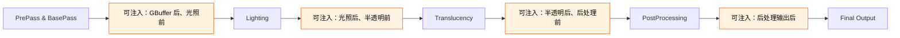

---

## 8. RDG 调试与验证

本节只收 RDG 专属的调试手段，CVar 名称与默认值逐条核对 5.8 源码 `Engine/Source/Runtime/RenderCore/Private/RenderGraph.cpp` 的声明。通用渲染调试（GPU 捕获、ShowFlags 可视化、GPU 崩溃取证、外部 profiler）见 [`card-03-debugging.md`](card-03-debugging.md)。

### 8.1 验证与即时模式

| CVar | 作用 |
|---|---|
| `r.RDG.Validation` | 校验 API 调用与 Pass 参数依赖的正确性 |
| `r.RDG.ImmediateMode` | Pass 一创建就立即执行。崩在 Pass lambda 里时，用它能拿到连线代码的调用栈 |
| `r.RDG.ClobberResources` | 分配时就用指定 clear color 清掉所有 render target 和 texture / buffer UAV，用来暴露「读了从没写过的资源」 |
| `r.RDG.TransitionLog` | 把资源状态转换打到控制台 |
| `r.RDG.CullPasses` | 裁剪输出未被使用的 Pass。排查「Pass 静默不执行」时关掉它做对照 |
| `r.RDG.BarrierPass` | 是否允许 `AddBarrierPass`。只在不支持 split barrier 的平台上使用，用于手动批量提交 barrier |
| `r.RDG.Events` | 控制 RDG event 如何发出 |
| `r.RDG.VerboseCSVStats` | 输出更详细的 CSV 统计 |

`r.RDG.Validation` 在 5.7 和 5.8 里是同一个名字。网上流传的「5.8 把 `r.RDG.Validate` 改名成 `r.RDG.Validation`」并不成立——5.7 源码里就已经是 `r.RDG.Validation`，不存在 `r.RDG.Validate` 这个 CVar。

### 8.2 `r.RDG.Debug.*` 细粒度开关

5.8 的 `r.RDG.Debug.*` 家族一共 6 个，分成**三个过滤器**和**三个行为开关**：

| CVar | 类别 | 作用 |
|---|---|---|
| `r.RDG.Debug.GraphFilter` | 过滤器 | 把调试事件限定到某个 graph。设 `None` 复位 |
| `r.RDG.Debug.PassFilter` | 过滤器 | 限定到特定 Pass。设 `None` 复位 |
| `r.RDG.Debug.ResourceFilter` | 过滤器 | 限定到某个资源。设 `None` 复位 |
| `r.RDG.Debug.FlushGPU` | 行为 | 每个 Pass 之后 flush GPU。开启时会连带关掉 `r.RDG.AsyncCompute` 和 `r.RDG.ParallelExecute` |
| `r.RDG.Debug.ExtendResourceLifetimes` | 行为 | 延长资源生命周期，可用 `r.RDG.Debug.ResourceFilter` 只针对特定资源 |
| `r.RDG.Debug.DisableTransientResources` | 行为 | 把资源从 transient 分配器里排除。用 `r.RDG.Debug.ResourceFilter` 指定范围，不指定则针对全部资源 |

三个过滤器是给行为开关配套用的：先用 `PassFilter` / `ResourceFilter` 把范围缩到可疑的那几个 Pass 或那一个资源，再开 `FlushGPU` / `ExtendResourceLifetimes` / `DisableTransientResources`。反过来在全局开这些重开销开关，帧率会掉到没法交互。

### 8.3 并行与异步相关

间歇性、换机器就不复现的 RDG 错误，多数是并行执行或 transient 别名引起的。这组 CVar 用来逐级串行化，看症状在哪一级消失：

| CVar | 作用 |
|---|---|
| `r.RDG.ParallelExecute` | Pass 并行执行总开关 |
| `r.RDG.ParallelExecute.PassMin` / `.PassMax` | 参与并行的 Pass 数下限 / 上限 |
| `r.RDG.ParallelExecute.PassTaskModeThreshold` | 切换 Pass task 模式的阈值 |
| `r.RDG.ParallelExecuteStress` | 压测并行路径 |
| `r.RDG.ParallelSetup` / `r.RDG.ParallelCompile` | Setup / Compile 阶段并行 |
| `r.RDG.ParallelSetup.TaskPriorityBias` | Setup 任务优先级偏置 |
| `r.RDG.ParallelDestruction` | 并行析构 |
| `r.RDG.ParallelMobile` | 移动端并行开关 |
| `r.RDG.AsyncCompute` | 异步计算队列开关 |
| `r.RDG.AsyncComputeTransientAliasing` | 异步计算上的 transient 资源别名 |
| `r.RDG.TransientAllocator` | Transient 分配器开关 |
| `r.RDG.TransientAllocator.IndirectArgumentBuffers` | Indirect 参数 buffer 是否走 transient |
| `r.RDG.TransientExtractedResources` | 被 extract 的资源是否保持 transient |
| `r.RDG.OverlapUAVs` | 允许 UAV 读写重叠（关掉可排查 UAV 竞争） |
| `r.RDG.MergeRenderPasses` | 相邻 Raster Pass 是否合并 RenderPass |

### 8.4 资源 Dump

`FRDGResourceDumpContext` 声明在 `Engine/Source/Runtime/RenderCore/Public/RenderGraphDefinitions.h` 与 `RenderGraphResources.h`，实现在 `Engine/Source/Runtime/RenderCore/Private/DumpGPU.cpp`。它是 `r.DumpGPU` 那套帧级捕获的 RDG 侧承载对象——资源、Pass 参数、barrier 信息都经由它导出。

驱动它的 `r.DumpGPU.*` CVar 完整清单见 [`card-03-debugging.md`](card-03-debugging.md) 的内置调试工具一节，本节不重复。

### 8.5 排查决策树

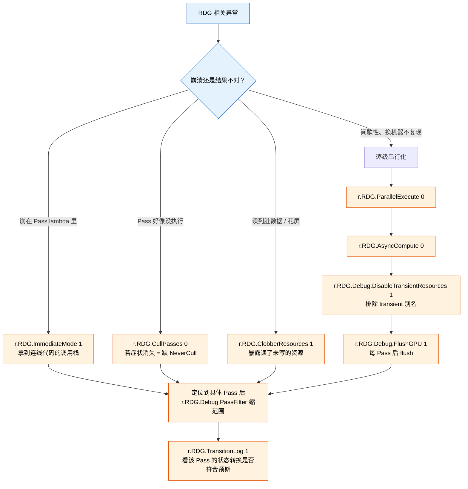

先缩范围再开重开销开关，是这张图的主线：`PassFilter` / `ResourceFilter` 定位到具体对象之后，`FlushGPU` 之类才用得起。

---

## 9. UE 5.8 新增特性

### 9.1 AddDispatchPass + FRDGDispatchPass

**5.8 新增**。允许 Pass 创建多条命令列表并异步提交，突破单条命令列表的限制。

`AddDispatchPass` 的 Lambda 接收 `FRDGDispatchPassBuilder&` 而非 `FRHICommandList&`，通过 `CreateCommandList()` 创建独立命令列表，每条命令列表需 `FinishRecording()` 完成录制。

**执行流程**：

```
AddDispatchPass 注册
  → FRDGDispatchPass 创建（TaskMode = Async, bDispatchPass = 1）
  → Execute() 阶段：QueueAsyncCommandListSubmit 提交所有命令列表
  → FRDGDispatchPassBuilder::CreateCommandList() 创建 FRHICommandList
  → Lambda 中用户调用 EndRenderPass() + FinishRecording()
  → FRDGDispatchPass::Execute() 提交所有命令列表
```

**关键源码**（`RenderGraphPass.h:715-768`）：

```cpp
class FRDGDispatchPass : public FRDGPass
{
    // bDispatchPass = 1
    // TaskMode = ERDGPassTaskMode::Async
    void Execute(FRHIComputeCommandList& RHICmdList) override
    {
        RHICmdList.GetAsImmediate().QueueAsyncCommandListSubmit(MoveTemp(CommandLists));
    }
    TArray<FRHICommandListImmediate::FQueuedCommandList, FRDGArrayAllocator> CommandLists;
    UE::Tasks::FTaskEvent CommandListsEvent{ UE_SOURCE_LOCATION };
};

class FRDGDispatchPassBuilder
{
    FRHICommandList* CreateCommandList();
    void AddPrerequisite(const UE::Tasks::FTask& Task);
};
```

### 9.2 FRDGBlackboard

**5.8 新增**。一种映射结构，生命周期绑定到 Render Graph Allocator，用于跨 Pass 传递不可变数据，避免显式 marshalling。

**关键 API**（`RenderGraphBlackboard.h:56`）：

```cpp
class FRDGBlackboard
{
    template <typename StructType, typename... ArgsType>
    StructType& Create(ArgsType&&... Args);           // 创建实例（断言唯一）

    template <typename StructType>
    StructType* GetMutable() const;                   // 获取可变指针（可能 null）

    template <typename StructType>
    const StructType* Get() const;                    // 获取不可变指针（可能 null）

    template <typename StructType, typename... ArgsType>
    StructType& GetOrCreate(ArgsType&&... Args);      // 获取或创建

    template <typename StructType>
    StructType& GetMutableChecked() const;            // 获取（断言存在）

    template <typename StructType>
    const StructType& GetChecked() const;             // 获取（断言存在）
};
```

**使用步骤**：

1. 用 `RDG_REGISTER_BLACKBOARD_STRUCT(StructType)` 宏注册结构体
2. 在初始化阶段调用 `GraphBuilder.Blackboard.Create<FMyStruct>(...)` 创建
3. 在后续 Pass 中调用 `GraphBuilder.Blackboard.GetChecked<FMyStruct>()` 读取

### 9.3 FRDGResourceDumpContext

**5.8 新增**。GPU 资源转储的核心上下文，用于调试和故障排查。

**关键成员**（`Private/DumpGPU.cpp:253`）：

```cpp
class FRDGResourceDumpContext
{
    static constexpr const TCHAR* kBaseDir = TEXT("Base/");
    static constexpr const TCHAR* kPassesDir = TEXT("Passes/");
    static constexpr const TCHAR* kResourcesDir = TEXT("Resources/");
    static constexpr const TCHAR* kStructuresDir = TEXT("Structures/");
    static constexpr const TCHAR* kStructuresMetadataDir = TEXT("StructuresMetadata/");

    bool bEnableDiskWrite = false;
    bool bUpload = false;
    bool bStream = false;
    float DeltaTime = 0.0f;
    int32 DumpedFrameId = 0;
    int32 FrameCount = 1;

    void Start();   // 创建目录结构 + 初始化转储文件
    void Finish();  // 完成转储 + 计时统计

    // 输出文件：Passes.json / ResourceDescs.json / PassDrawCounts.json / Infos.json / Status.txt
};
```

`FRDGBuilder` 中的入口：

```cpp
// RenderGraphBuilder.h:436
#if RDG_DUMP_RESOURCES
static RENDERCORE_API FString BeginResourceDump(const TCHAR* Cmd = TEXT(""), const TCHAR* Context = TEXT(""));
static RENDERCORE_API bool IsDumpingFrame();
#endif
```

### 9.4 AddSetupTask

**5.8 新增**。在 Graph 执行前启动并行任务，用于准备数据。

```cpp
template <typename TaskLambda>
UE::Tasks::FTask AddSetupTask(
    TaskLambda&& Task,
    bool bCondition = true,
    ERDGSetupTaskWaitPoint WaitPoint = ERDGSetupTaskWaitPoint::Compile
);

template <typename TaskLambda>
UE::Tasks::FTask AddSetupTask(
    TaskLambda&& Task,
    UE::Tasks::ETaskPriority Priority,
    bool bCondition = true,
    ERDGSetupTaskWaitPoint WaitPoint = ERDGSetupTaskWaitPoint::Compile
);

// 带 Pipe 的变体
template <typename TaskLambda>
UE::Tasks::FTask AddSetupTask(
    TaskLambda&& Task,
    UE::Tasks::FPipe* Pipe,
    UE::Tasks::ETaskPriority Priority = UE::Tasks::ETaskPriority::Normal,
    bool bCondition = true,
    ERDGSetupTaskWaitPoint WaitPoint = ERDGSetupTaskWaitPoint::Compile
);

// 带 Prerequisites 的变体
template <typename TaskLambda, typename PrerequisitesCollectionType>
UE::Tasks::FTask AddSetupTask(
    TaskLambda&& Task,
    PrerequisitesCollectionType&& Prerequisites,
    UE::Tasks::ETaskPriority Priority = UE::Tasks::ETaskPriority::Normal,
    bool bCondition = true,
    ERDGSetupTaskWaitPoint WaitPoint = ERDGSetupTaskWaitPoint::Compile
);
```

`ERDGSetupTaskWaitPoint`（`RenderGraphDefinitions.h:210`）：

| 值 | 说明 |
|-----|------|
| `Compile` | （默认）在编译前同步。任务会修改 RDG 资源（如 buffer 上传内容、size callback）时使用 |
| `Execute` | 在执行前同步。任务不影响 RDG 编译时使用 |

还有 `AddCommandListSetupTask` 系列，用于需要在命令列表上下文中执行的 setup 任务。

### 9.5 AddPassDependency

**5.8 新增**。在 Pass 之间添加用户定义的依赖，用于微调异步计算的重叠。

```cpp
RENDERCORE_API void AddPassDependency(FRDGPass* Producer, FRDGPass* Consumer);
```

### 9.6 SetPassWorkload

**5.8 新增**。设置 Pass 执行 Lambda 的预期工作负载，用于指导并行调度。

```cpp
void SetPassWorkload(FRDGPass* Pass, uint32 Workload);
```

默认 `Workload = 1`。推荐设置为复杂 draw/dispatch 调用的数量，仅当某个 Pass 相对其他 Pass 非常昂贵时作为性能调优使用。

### 9.7 其他 5.8 变化

- `ParallelCompile` 和 `ParallelSetup` 分离为独立的 `ERDGBuilderFlags`（之前合并为 `ParallelSetup`）
- `FRDGPass::bDispatchPass` 标志用于区分 Dispatch Pass 和普通 Pass
- `FRDGDispatchPass` 的 `LaunchDispatchPassTasks` 虚方法被 `FRDGDispatchPassBuilder` 调用
- 5.5 废弃的 `FRDGPass*` lambda 参数在 5.8 中确认不再支持
- `GLevelEditorModeToolsIsValid()` 在 5.8 中已删除定义（注：此条为编辑器相关，非 RDG 核心）

---

## 10. 关键源码文件索引

| 文件 | 路径（相对于 `Engine/Source/Runtime/RenderCore/Public/`） | 核心内容 |
|------|------|----------|
| `RenderGraphBuilder.h` | `RenderGraphBuilder.h` | `FRDGBuilder` 主类声明（AddPass / Execute / 资源创建等） |
| `RenderGraphBuilder.inl` | `RenderGraphBuilder.inl` | `FRDGBuilder` 内联实现（资源创建、AddPass 模板、AddDispatchPass） |
| `RenderGraphPass.h` | `RenderGraphPass.h` | `FRDGPass` / `TRDGLambdaPass` / `FRDGDispatchPass` / `FRDGDispatchPassBuilder` / Barrier 批处理 |
| `RenderGraphDefinitions.h` | `RenderGraphDefinitions.h` | 枚举定义（`ERDGPassFlags` / `ERDGBufferFlags` / `ERDGTextureFlags` / `ERDGSetupTaskWaitPoint`）、Handle 类型、`FRDGTextureDesc` |
| `RenderGraphResources.h` | `RenderGraphResources.h` | `FRDGResource` / `FRDGViewableResource` / `FRDGTexture` / `FRDGBuffer` / `FRDGUniformBuffer` / View 类型、`FRDGBufferDesc` |
| `RenderGraphFwd.h` | `RenderGraphFwd.h` | 前向声明和类型别名（`FRDGTextureRef` 等） |
| `RenderGraphBlackboard.h` | `RenderGraphBlackboard.h` | `FRDGBlackboard` 黑板数据结构 |
| `RenderGraphAllocator.h` | `RenderGraphAllocator.h` | `FRDGAllocator` 分配器 |
| `RenderGraphEvent.h` | `RenderGraphEvent.h` | `FRDGEventName` 事件名 |
| `RenderGraphUtils.h` | `RenderGraphUtils.h` | 工具函数（`HasBeenProduced` / `GetIfProduced` / `GetLoadActionIfProduced` / `TryGetRHI` 等） |
| `RenderGraphValidation.h` | `RenderGraphValidation.h` | `FRDGUserValidation` 用户验证类 |
| `RenderGraphTrace.h` | `RenderGraphTrace.h` | RDG Insight 追踪 |
| `RenderGraphTextureSubresource.h` | `RenderGraphTextureSubresource.h` | 子资源布局/范围类型 |
| `DumpGPU.h` | `DumpGPU.h` | GPU 资源转储框架 |
| `GlobalShader.h` | `GlobalShader.h` | 全局 Shader 管理 |
| `ShaderParameterStruct.h` | `ShaderParameterStruct.h` | Shader 参数结构体宏（`_RDG` 宏） |

**实现文件**（`Private/` 目录下）：

| 文件 | 路径 | 核心内容 |
|------|------|----------|
| `RenderGraph.cpp` | `Private/RenderGraph.cpp` | `FRDGBuilder::Execute()` / `Compile()` 等核心实现 |
| `DumpGPU.cpp` | `Engine/Source/Runtime/RenderCore/Private/DumpGPU.cpp` | `FRDGResourceDumpContext` 完整实现 |
| `RenderGraphValidation.cpp` | `Engine/Source/Runtime/RenderCore/Private/RenderGraphValidation.cpp` | `FRDGUserValidation` 实现 |
| `RenderGraphBlackboard.cpp` | `Engine/Source/Runtime/RenderCore/Private/RenderGraphBlackboard.cpp` | `FRDGBlackboard::AllocateIndex` 等 |

### 10.1 渲染器侧与 RHI 侧相关文件

上表覆盖 `RenderCore` 模块内部。下表补上 RDG 编程实际会碰到的渲染器侧与 RHI 侧文件——自定义 Pass 的 hook 点就在这几个文件里。

| 文件路径 | 内容 |
|----------|------|
| `Engine/Source/Runtime/RenderCore/Public/RenderGraphBuilder.h` | `FRDGBuilder` 主类：`AddPass`、`CreateTexture`、`Execute`、`QueueTextureExtraction`、`AddDispatchPass`、`AddSetupTask`、`AddPassDependency`、`SetPassWorkload` |
| `Engine/Source/Runtime/RenderCore/Public/RenderGraphResources.h` | `FRDGTextureRef`、`FRDGBufferRef`、`FRDGResource`、资源描述符、`ERDGTextureFlags`、`ERDGBufferFlags` |
| `Engine/Source/Runtime/RenderCore/Public/RenderGraphPass.h` | `FRDGPass`、`TRDGLambdaPass`、`FRDGDispatchPass`、`FRDGDispatchPassBuilder`、`ERDGPassFlags`、`ERDGPassTaskMode` |
| `Engine/Source/Runtime/RenderCore/Public/RenderGraphUtils.h` | 工具函数：`AddCopyTexturePass`、`AddClearUAVPass`、`FComputeShaderUtils::AddPass`、`AddReadbackTexturePass`、`FRDGExternalAccessQueue` |
| `Engine/Source/Runtime/RenderCore/Public/RenderGraphDefinitions.h` | `ERDGPassFlags`、`ERDGBufferFlags`、`ERDGTextureFlags`、`ERDGBuilderFlags`、`FRDGBlackboard` 前向声明 |
| `Engine/Source/Runtime/RenderCore/Public/RenderGraphBlackboard.h` | `FRDGBlackboard` 实现 |
| `Engine/Source/Runtime/RenderCore/Private/RenderGraph.cpp` | `FRDGBuilder::Execute`、Compile + Culling 实现 |
| `Engine/Source/Runtime/RenderCore/Private/RenderGraphAllocator.cpp` | Transient 资源分配器、别名优化 |
| `Engine/Source/Runtime/RenderCore/Private/RenderGraphValidation.cpp` | Debug 验证（`-rdgimmediate` 资源泄漏检测） |
| `Engine/Source/Runtime/Renderer/Private/PostProcess/PostProcessing.cpp` | 后处理链 RDG 实现，`AddPostProcessingPasses` 入口 |
| `Engine/Source/Runtime/Renderer/Private/DeferredShadingRenderer.cpp` | `FDeferredShadingRenderer::Render` 完整渲染管线 |
| `Engine/Source/Runtime/Renderer/Private/SceneRendering.cpp` | `FRDGBuilder` 创建位置、`RenderGraph` 初始化 |
| `Engine/Source/Runtime/RHI/Public/RHICommandList.h` | `FRHICommandList`、`Transition` 等底层 Barrier |
| `Engine/Source/Runtime/RenderCore/Public/ShaderParameterMacros.h` | `BEGIN_SHADER_PARAMETER_STRUCT`、`RDG_TEXTURE_ACCESS` 等宏定义 |

### 10.2 推荐阅读顺序

1. `RenderGraphBuilder.h` —— 先读懂 `FRDGBuilder` 的公开 API
2. `RenderGraphResources.h` —— 理解资源描述符和生命周期
3. `RenderGraphPass.h` —— 了解 Pass 类型体系
4. `RenderGraphUtils.h` —— 常用工具函数
5. `PostProcessing.cpp` —— 看后处理链如何用 RDG 组合
6. `DeferredShadingRenderer.cpp` —— 看完整渲染管线如何编排 RDG
7. `RenderGraph.cpp` —— 深入 Compile / Execute 实现

---

## 附录 A：RDG 参数宏

Pass 参数结构体中使用 `_RDG` 后缀宏声明资源引用，使 RDG 可以自动跟踪依赖：

```cpp
BEGIN_SHADER_PARAMETER_STRUCT(FMyPassParameters, )
    RDG_TEXTURE_ACCESS(Input, ERHIAccess::SRV)       // 输入纹理
    RDG_TEXTURE_ACCESS(Output, ERHIAccess::UAV)       // 输出纹理 UAV
    RDG_BUFFER_ACCESS(IndirectArgs, ERHIAccess::IndirectArgs)
    SHADER_PARAMETER_RDG_TEXTURE(SceneColor)           // 纹理 SRV
    SHADER_PARAMETER_RDG_BUFFER(VertexBuffer)           // 缓冲区 SRV
    SHADER_PARAMETER_RDG_TEXTURE_UAV(OutputUAV)        // 纹理 UAV
    SHADER_PARAMETER_RDG_BUFFER_UAV(OutputBufferUAV)   // 缓冲区 UAV
    SHADER_PARAMETER_RDG_UNIFORM_BUFFER(ViewUB)        // Uniform Buffer
    RDG_RENDER_TARGET_BINDING_SLOTS()                  // RenderTarget 绑定
END_SHADER_PARAMETER_STRUCT()
```

这些宏展开为 RDG 能识别的成员字段，在 `AddPass` 时被 `FRDGParameterStruct` 解析，用于推导资源访问模式、Barrier 和裁剪。

**事件与作用域宏**（均已核对 5.8 源码存在）：

| 宏 | 声明位置 | 用途 |
|---|---|---|
| `RDG_EVENT_NAME` | `Engine/Source/Runtime/RenderCore/Public/RenderGraphEvent.h` | 构造 Pass 的事件名 |
| `RDG_EVENT_SCOPE` | 同上 | 建立 GPU profile 事件作用域 |
| `RDG_EVENT_SCOPE_STAT` | 同上 | 事件作用域 + 统计 |
| `RDG_CSV_STAT_EXCLUSIVE_SCOPE` | 同上 | CSV 独占统计作用域 |
| `RDG_GPU_MASK_SCOPE` | `Engine/Source/Runtime/RenderCore/Public/RenderGraphBuilder.h` | 多 GPU 掩码作用域 |
| `RDG_REGISTER_BLACKBOARD_STRUCT` | `Engine/Source/Runtime/RenderCore/Public/RenderGraphBlackboard.h` | 注册黑板结构 |

调研稿里出现过的 `RDG_RECORD_AND_TRACK_RESOURCE` 和 `RDG_DEBUG_MARKER` 在 5.8 中不存在，已剔除。

---

## 附录 B：资源类继承关系

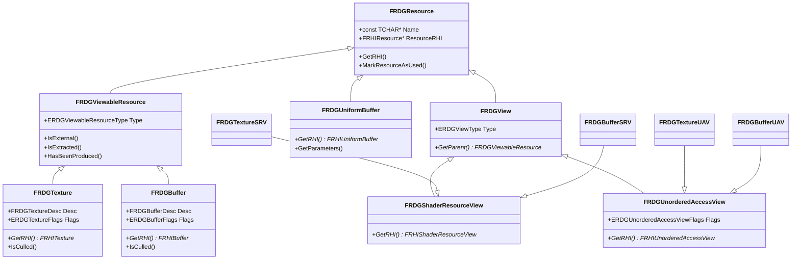

---

## 附录 C：Pass 类继承关系

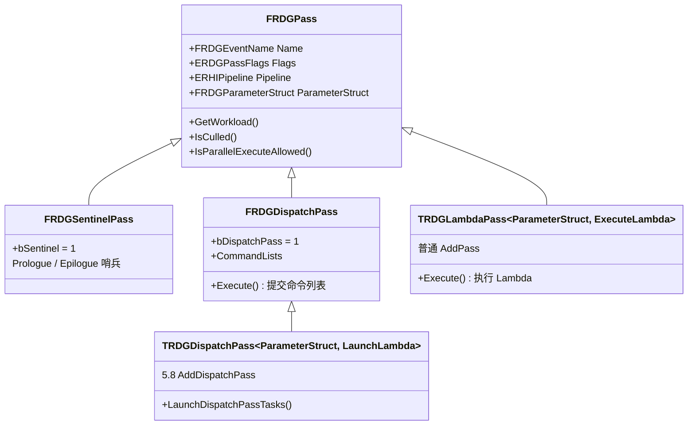

---

## 附录 D：常见陷阱

| 陷阱 | 后果 | 修法 |
|------|------|------|
| 忘记 `RDG_EVENT_SCOPE` | GPU Profile 看不到此 Pass 耗时 | 每个 Pass 参数结构加 `RDG_EVENT_SCOPE` |
| 未声明 `NeverCull` 的副作用 Pass 被裁剪 | Pass 静默不执行 | 确认是否需要 `NeverCull` |
| 跨帧直接持有 `FRDGTextureRef` | 下一帧引用悬挂 | 用 `QueueTextureExtraction` 提取 + `RegisterExternalTexture` 导入 |
| Lambda 内捕获 `FRDGTextureRef` 而非 `FRHITexture*` | Execute 阶段访问已释放的 Transient 资源 | Lambda 内用 `GetRHI()` 获取 `FRHITexture*` |
| 在 `Execute` 之后调用 `CreateTexture` | 崩溃（Graph 已锁定） | 所有资源声明必须在 `Execute` 之前完成 |
| 多个 Pass 写入同一资源不加 UAV Barrier | 数据竞争、不可预测结果 | 使用 `ERDGPassFlags::NeverCull` 手动管理或依赖自动推导 |
| 用 `FRHICommandListImmediate&` 作为 Lambda 参数导致无法并行 | 强制 Inline 执行，失去并行加速 | 无 `Immediate` 需求时用 `FRHICommandList&` 或加 `FRDGAsyncTask` |
| 混淆 `RDG_GPU_MASK_SCOPE` 与旧宏 `RDG_GPU_MASK` | 编译错误 | 5.8 使用 `RDG_GPU_MASK_SCOPE(GraphBuilder, GPUMask)` |
| `FSceneRenderTargets::Get()` 编译报错 | 5.8 已移除旧 API | 改用 `View.GetSceneTextures()` 获取 `FSceneTextures` 引用 |
