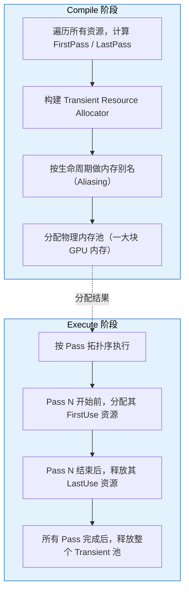
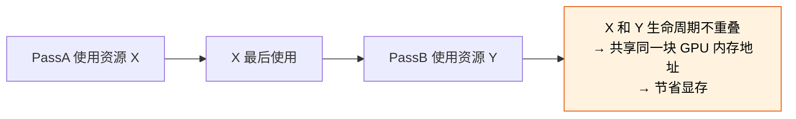
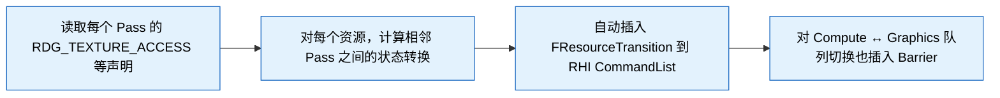
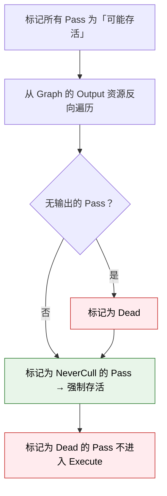
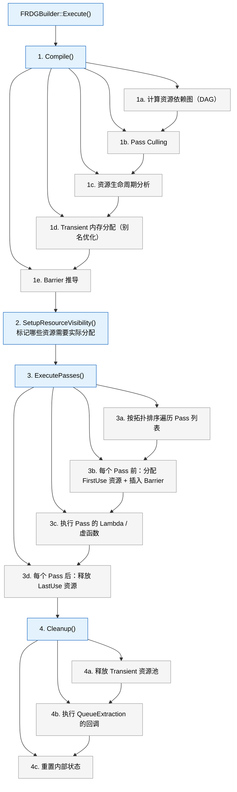
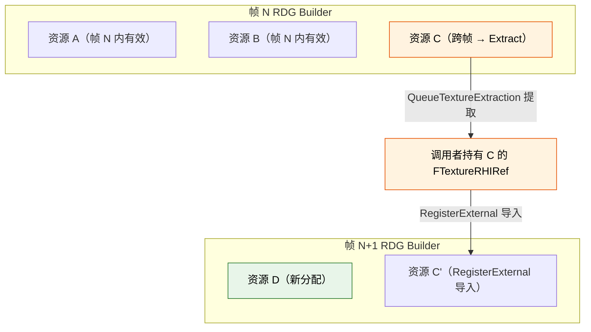
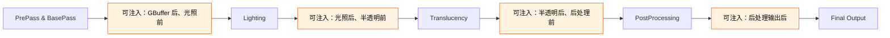

# UE 5.8 Render Graph (RDG) 知识卡片

## 术语说明

| 术语 | 说明 |
|------|------|
| Transient 资源 | 仅在一次 RDG Execution 内有效的临时资源，由 RDG 自动分配和回收 |
| Barrier | GPU 资源状态转换屏障，保证读写顺序正确 |
| Pass Culling | 编译阶段剔除无下游消费者的 Pass，减少无效 GPU 工作 |
| 资源别名（Aliasing） | 生命周期不重叠的多个 Transient 资源共享同一块 GPU 物理内存 |

---

## 1. RDG 核心概念

### FRDGBuilder 生命周期

```cpp
FRDGBuilder GraphBuilder(RHICmdList);   // 创建：绑定 RHI CommandList
// ... 注册 Pass、声明资源 ...
GraphBuilder.Execute();                   // 执行：编译 → 分配 → 调度 → 清理
// 析构时自动销毁所有 Transient 资源
```

**三阶段模型：**

| 阶段 | 行为 | 可做什么 |
|------|------|----------|
| **Setup**（构造后） | 仅注册 Pass 和资源声明，不分配 GPU 内存 | `CreateTexture` / `AddPass` / `RDG_TEXTURE_ACCESS` |
| **Compile**（Execute 入口） | 推导资源生命周期、裁剪无用 Pass、计算内存别名 | 不可干预 |
| **Execute**（Compile 后） | 分配 Transient 资源、按拓扑序执行 Pass、插入 Barrier、释放资源 | 只读访问已注册 Pass 的结果 |

### Pass 注册方式

**Lambda Pass（最常用，轻量）：**

```cpp
GraphBuilder.AddPass(
    RDG_EVENT_NAME("MyPass"),
    Inputs,
    ERDGPassFlags::Raster | ERDGPassFlags::NeverCull,
    [&](FRHICommandList& RHICmdList)
    {
        // 实际渲染指令
    });
```

**完整 Pass 类（需要完整 PSO 控制时）：** 继承 `FRDGPipelineStatePass`，在 `AddPass` 中注册。

**全局 Pass（不依赖任何 RDG 资源）：**

```cpp
GraphBuilder.AddGlobalPass("MyGlobalPass", [](FRHICommandList& RHICmdList)
{
    // 无 RDG 资源依赖的纯 RHI 操作
});
```

### 资源声明宏

| 宏 | 语义 | 生命周期 |
|------|--------|----------|
| `RDG_CreateTexture(Desc, Name)` | 创建 Transient Texture | 仅在此 RDG Execution 内有效 |
| `RDG_CreateBuffer(Desc, Name)` | 创建 Transient Buffer | 同上 |
| `RDG_RegisterExternalTexture(TextureRef)` | 导入外部已有 Texture | 调用者管理生命周期 |
| `RDG_RegisterExternalBuffer(BufferRef)` | 导入外部已有 Buffer | 同上 |

### 资源使用声明

每个 Pass 的参数结构体通过 `RDG_TEXTURE_ACCESS` / `RDG_BUFFER_ACCESS` 等宏声明资源的使用方式，RDG 据此推导 Barrier：

```cpp
BEGIN_SHADER_PARAMETER_STRUCT(FMyPassParameters, )
    RDG_TEXTURE_ACCESS(MyInput,  ERHIAccess::SRVGraphics)   // 只读输入
    RDG_TEXTURE_ACCESS(MyOutput, ERHIAccess::UAVGraphics)   // 可写输出
    RDG_BUFFER_ACCESS(MyBuffer,  ERHIAccess::IndirectArgs)  // Indirect 参数
    RDG_EVENT_SCOPE(EventScope)                              // GPU Profile 域
END_SHADER_PARAMETER_STRUCT()
```

### 资源生命周期推导机制

RDG 在 Compile 阶段对每个资源执行：

1. **首次使用** —— 资源创建（或从外部导入）
2. **最后使用** —— 资源可回收 / 销毁
3. **使用区间推导** —— 遍历所有 Pass 的依赖图，计算每个资源的 `FirstPass` 和 `LastPass`
4. **内存分配** —— Transient 资源共享同一块物理内存池，时间不重叠的别名资源复用同一块

---

## 2. Pass 类型

### FRDGPipelineStatePass（完整 PSO 控制）

```cpp
class FRDGPipelineStatePass : public FRDGRasterizerPass
{
    // 提供完整的 FGraphicsPipelineStateInitializer 控制
    // 适合需要自定义 Blend/Depth/Stencil/Rasterizer 状态的 Pass
    FGraphicsPipelineStateInitializer PSOInitializer;
};
```

**适用场景：** 自定义渲染管线、需要精确控制 PSO 状态的 Pass、Mesh 绘制。

### FRDGAsyncComputePass（异步计算）

```cpp
GraphBuilder.AddPass(
    RDG_EVENT_NAME("AsyncComputeTask"),
    Parameters,
    ERDGPassFlags::AsyncCompute,  // 在异步计算队列执行
    [&](FRHICommandList& RHICmdList) { ... });
```

**约束：**
- 不能有 Raster 依赖（不能读写 RT / DSV）
- 只能访问 UAV / SRV 资源
- 需要 GPU 硬件支持 Async Compute Queue
- Barrier 管理走独立的 Async Compute 队列

### FRDGPostProcessPass（后处理）

UE 后处理链的 Pass 基类，提供 `FPostProcessMaterialInputs`、`FPostProcessPassParameters` 等标准参数结构，自动处理：

- Viewport 矩形（SceneColor 区域 vs 全屏）
- 半分辨率 / 1/4 分辨率派生
- 多 View 的 Tile 调度

### Lambda Pass vs 完整 Pass 类

| 维度 | Lambda Pass | 完整 Pass 类 |
|------|-------------|--------------|
| 声明复杂度 | 一行 `AddPass` | 需定义类 + 重写虚函数 |
| PSO 控制 | 有限（需手动 `SetGraphicsPipelineState`） | 完整 `FGraphicsPipelineStateInitializer` |
| 可复用性 | 低（内嵌在构建函数中） | 高（可被多个 Builder 复用） |
| Debug 友好 | 匿名 lambda，栈追踪不清晰 | 具名类，断点友好 |
| 适用场景 | 简单后处理、Clear、Copy、Dispatch | 复杂 Mesh 绘制、自定义管线段 |

---

## 3. 资源管理细节

### 外部资源导入

```cpp
// 步骤 1: 注册外部资源
FRDGTextureRef ExternalRDG = GraphBuilder.RegisterExternalTexture(
    /*FTextureRHIRef*/ ExternalRHI,
    TEXT("ExternalTexture"));

// 步骤 2: 在 Pass 参数中引用
// 步骤 3: Execute 结束后，外部资源回到调用者手中
// 调用者负责 Release / 复用
```

**关键规则：**
- `RegisterExternalTexture` 不获取所有权，RDG 不负责销毁
- 外部资源在整个 RDG Execution 期间回到原始状态
- 常用于跨帧传递（从上一帧的 RDG 输出导入当前帧）

### Transient 资源的分配与回收



### 跨 RDG Execution 的持久化资源传递

```cpp
// 帧 N: 输出需要跨帧保留的资源
FRDGTextureRef Output = GraphBuilder.CreateTexture(Desc, TEXT("Persistent"));
// ... 在 Pass 中写入 Output ...
GraphBuilder.QueueTextureExtraction(Output, &OutExtractedTextureRef);
// Execute 后，OutExtractedTextureRef 持有 FTextureRHIRef

// 帧 N+1: 导入上一帧保留的资源
FRDGTextureRef PrevFrameInput = GraphBuilder.RegisterExternalTexture(
    OutExtractedTextureRef, TEXT("PrevFrameInput"));
```

**`QueueTextureExtraction` / `QueueBufferExtraction`** 是跨帧传递的唯一通道。提取出的资源从 Transient 池迁移到调用者管理的生命周期。

### 资源别名（Aliasing）的内存复用

RDG 的 Transient Resource Allocator 的核心优化：生命周期不重叠的资源共享同一块 GPU 物理内存。



**实现：** `FRDGTransientResourceAllocator` 在 Compile 阶段构建一个区间分配问题，求解最小内存峰值。一个分配块可以被多个资源的时间片复用。

---

## 4. Barrier 管理

### RDG 如何自动推导 Barrier



**自动推导的 Barrier 类型：**

| 相邻状态 | 自动插入的 Barrier |
|----------|-------------------|
| SRVGraphics → UAVGraphics | `ERHITransitionType::Translate`（写后读） |
| UAVGraphics → SRVGraphics | `ERHITransitionType::Translate`（读后写） |
| RTV → SRVGraphics | `ERHITransitionType::Translate`（渲染目标 → 采样） |
| Graphics → AsyncCompute | `ERHITransitionType::CrossQueue`（跨队列同步） |
| AsyncCompute → Graphics | 同上 |

### 手动 Barrier 覆盖

```cpp
GraphBuilder.AddPass(
    RDG_EVENT_NAME("CustomPass"),
    Parameters,
    ERDGPassFlags::Raster | ERDGPassFlags::NeverCull,  // NeverCull 防止被裁剪
    [&](FRHICommandList& RHICmdList)
    {
        // 手动插入 Barrier 覆盖自动推导
        RHICmdList.Transition({
            FRHITransitionInfo(TextureRHI, ERHIAccess::Unknown, ERHIAccess::RTV)
        });
        // ... 自定义渲染 ...
    });
```

**`ERDGPassFlags::NeverCull` 的作用：**
- 防止 RDG 认为此 Pass 无输出而被裁剪
- 常用于有副作用的 Pass（写入外部资源、触发 Subpass 等）

### 跨 Pass Texture 状态转换

```
Pass 1: Write → RTV
    ↓ Barrier: RTV → SRVGraphics（自动）
Pass 2: Read  → SRVGraphics
    ↓ Barrier: SRVGraphics → UAVGraphics（自动）
Pass 3: Write → UAVGraphics
```

RDG 保证每个资源在 Pass 边界上的状态是确定的。如果一个资源被多个 Pass 以不同方式使用，RDG 在 Pass 之间插入正确的 Transition。

---

## 5. 裁剪与执行

### Pass Culling 机制



**裁剪条件：**
- Pass 的所有输出资源无下游消费者
- Pass 未标记 `NeverCull` 或 `ERDGPassFlags::GenerateStructure`
- 该 Pass 不是 Graph 的显式 Output Pass

### Execute 阶段完整流程



### 多帧 RDG 资源生命周期管理



**双缓冲 / 多缓冲跨帧模式：**

```cpp
// 常见于 TAA / Motion Blur 等需要历史帧数据的 Pass
// 维持两个 FRDGTextureRef，轮流作为输入输出
// 用 RegisterExternalTexture 导入上一帧提取的 History
// 用 QueueTextureExtraction 导出当前帧的 History
```

---

## 6. 自定义 Pass 注入实践

### 插入自定义 RDG Pass 的标准模式

```cpp
void AddMyCustomPass(FRDGBuilder& GraphBuilder, const FViewInfo& View, FRDGTextureRef Input)
{
    // 1. 声明参数结构
    BEGIN_SHADER_PARAMETER_STRUCT(FMyPassParameters, )
        RDG_TEXTURE_ACCESS(Input,  ERHIAccess::SRVGraphics)
        RDG_TEXTURE_ACCESS(Output, ERHIAccess::UAVGraphics)
        RDG_EVENT_SCOPE(EventScope)
    END_SHADER_PARAMETER_STRUCT()

    // 2. 创建输出资源
    FRDGTextureRef Output = GraphBuilder.CreateTexture(
        Input->Desc, TEXT("MyPassOutput"));

    // 3. 填充参数
    auto* Parameters = GraphBuilder.AllocParameters<FMyPassParameters>();
    Parameters->Input  = Input;
    Parameters->Output = Output;

    // 4. 注册 Pass
    GraphBuilder.AddPass(
        RDG_EVENT_NAME("MyCustomPass"),
        Parameters,
        ERDGPassFlags::Compute | ERDGPassFlags::NeverCull,
        [&](FRHICommandList& RHICmdList)
        {
            // 5. 绑定 Shader + Dispatch
            FMyShader::Dispatch(RHICmdList, View, Output);
        });
}
```

### 访问 Scene 数据

```cpp
// 在渲染函数中，通过 FSceneView / FViewInfo 获取：
const FViewInfo& View = *static_cast<const FViewInfo*>(InViews[0]);

// 访问 Scene：
FScene* Scene = View.Family->Scene;
FSceneRenderTargets& SceneContext = FSceneRenderTargets::Get(RHICmdList);

// 访问 View Uniform Buffer：
View.ViewUniformBuffer
```

### 常用 Hook 点

| Hook 点 | 源码位置 | 时机 | 可访问数据 |
|---------|---------|------|-----------|
| **GBuffer 之后** | `DeferredShadingRenderer.cpp` · `RenderBasePass` 后 | BasePass 刚完成 | GBuffer A/B/C/E、SceneDepth、PrePass |
| **PostProcessing 链** | `PostProcessing.cpp` · `AddPostProcessingPasses` | ToneMapping 前 | SceneColor、SeparateTranslucency、DistanceField 等 |
| **SSR 之后** | `ScreenSpaceReflections.cpp` | Reflections 完成后 | SSR 输出、SceneColor |
| **Translucency 之后** | `TranslucencyPass` 后 | 半透明渲染完成 | Translucency RT、SceneColor |
| **Lighting 之前** | `DeferredShadingRenderer.cpp` · `RenderLights` | 光照计算开始前 | GBuffer、Light Data |
| **自定义 Pass Hook** | `FPostProcessingInputs` 的 `OverrideOutput` | 可替换整个后处理链输出 | 所有后处理中间资源 |

**后处理链注入示例：**

```cpp
// 在 FPostProcessingInputs 初始化后注入
void AddCustomPostProcessPass(FRDGBuilder& GraphBuilder,
    const FPostProcessingInputs& Inputs)
{
    // 从 Inputs 中获取 SceneColor 等资源
    FRDGTextureRef SceneColor = Inputs.SceneColor;
    FRDGTextureRef SeparateTranslucency = Inputs.SeparateTranslucency;

    // 插入自定义 Pass
    AddMyCustomPass(GraphBuilder, *Inputs.View, SceneColor);
}
```

**场景渲染管线注入点：**



---

## 7. 关键源码文件

| 文件路径 | 内容 |
|----------|------|
| `Engine/Source/Runtime/RenderCore/Public/RenderGraphBuilder.h` | `FRDGBuilder` 主类：`AddPass`、`CreateTexture`、`Execute`、`QueueTextureExtraction` |
| `Engine/Source/Runtime/RenderCore/Public/RenderGraphResources.h` | `FRDGTextureRef`、`FRDGBufferRef`、`FRDGResource`、资源描述符、`ERDGResourceFlags` |
| `Engine/Source/Runtime/RenderCore/Public/RenderGraphPass.h` | `FRDGPipelineStatePass`、`FRDGAsyncComputePass`、Pass 基类、`ERDGPassFlags` |
| `Engine/Source/Runtime/RenderCore/Public/RenderGraphUtils.h` | 工具函数：`RDG_CreateTexture` 宏、`RDG_EVENT_NAME`、`RDG_GPU_MASK` |
| `Engine/Source/Runtime/RenderCore/Private/RenderGraph.cpp` | `FRDGBuilder::Execute`、Compile + Culling 实现 |
| `Engine/Source/Runtime/RenderCore/Private/RenderGraphAllocator.cpp` | Transient 资源分配器、别名优化 |
| `Engine/Source/Runtime/RenderCore/Private/RenderGraphValidation.cpp` | Debug 验证（`rdgim` 资源泄漏检测） |
| `Engine/Source/Runtime/Renderer/Private/PostProcessing/PostProcessing.cpp` | 后处理链 RDG 实现，`AddPostProcessingPasses` 入口 |
| `Engine/Source/Runtime/Renderer/Private/DeferredShadingRenderer.cpp` | `FDeferredShadingRenderer::Render` 完整渲染管线 |
| `Engine/Source/Runtime/Renderer/Private/SceneRendering.cpp` | `FRDGBuilder` 创建位置、`RenderGraph` 初始化 |
| `Engine/Source/Runtime/RHI/Public/RHICommandList.h` | `FRHICommandList`、`Transition` 等底层 Barrier |
| `Engine/Source/Runtime/RenderCore/Public/ShaderParameterMacros.h` | `BEGIN_SHADER_PARAMETER_STRUCT`、`RDG_TEXTURE_ACCESS` 等宏定义 |

### 推荐阅读顺序

1. `RenderGraphBuilder.h` —— 先读懂 `FRDGBuilder` 的公开 API
2. `RenderGraphResources.h` —— 理解资源描述符和生命周期
3. `RenderGraphPass.h` —— 了解 Pass 类型体系
4. `PostProcessing.cpp` —— 看后处理链如何用 RDG 组合
5. `DeferredShadingRenderer.cpp` —— 看完整渲染管线如何编排 RDG
6. `RenderGraph.cpp` —— 深入 Compile / Execute 实现

---

## 附录：常见陷阱

| 陷阱 | 后果 | 修法 |
|------|------|------|
| 忘记 `RDG_EVENT_SCOPE` | GPU Profile 看不到此 Pass 耗时 | 每个 Pass 参数结构加 `RDG_EVENT_SCOPE` |
| 未声明 `NeverCull` 的副作用 Pass 被裁剪 | Pass 静默不执行 | 确认是否需要 `NeverCull` |
| 跨帧直接持有 `FRDGTextureRef` | 下一帧引用悬挂 | 用 `QueueTextureExtraction` 提取 + `RegisterExternalTexture` 导入 |
| Lambda 内捕获 `FRDGTextureRef` 而非 `FRHITexture*` | Execute 阶段访问已释放的 Transient 资源 | Lambda 内用 `GetRHI()` 获取 `FRHITexture*` |
| 在 `Execute` 之后调用 `CreateTexture` | 崩溃（Graph 已锁定） | 所有资源声明必须在 `Execute` 之前完成 |
| 多个 Pass 写入同一资源不加 UAV Barrier | 数据竞争、不可预测结果 | 使用 `ERDGPassFlags::NeverCull` 手动管理或依赖自动推导 |