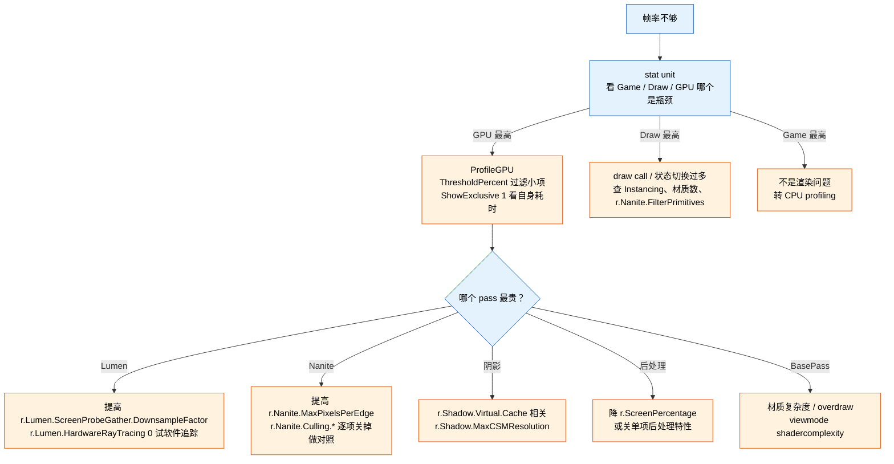
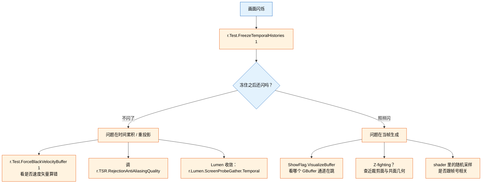

# 客户问题路由表 — 症状到技术栈

> **验证状态**：本文档引用的 CVar 与工具名均取自其他卡片中已核对 5.8 源码的内容。
> 引用给客户前仍需按 [`card-13-verify-locally.md`](card-13-verify-locally.md) 确认他们那个版本。

这份是入口。客户描述一个现象，先在这里定位到「哪一类问题、第一步查什么、去哪份文档」，
再进具体卡片。**不要从子系统文档开始读**——那样会在客户问「为什么帧率不够」的时候去翻 Nanite。

## 目录

| 节 | 内容 |
|---|---|
| [1. 症状路由表](#1-症状路由表) | 客户原话 → 第一步查什么 |
| [2. 需求分类与优先级](#2-需求分类与优先级) | 管线定制 5 类 + 底层优化 8 类 |
| [3. 三条高频排查路径](#3-三条高频排查路径) | 帧率不够 / 画面闪烁 / 要特殊效果 |
| [4. 接手新项目先问什么](#4-接手新项目先问什么) | 定位信息清单 |

---

## 1. 症状路由表

| 客户可能这么说 | 大概哪一类 | 第一步 | 去哪份 |
|---|---|---|---|
| 「帧率不够 / 掉帧」 | 性能 | `stat unit` 分清 Game / Draw / GPU 三端，再 `ProfileGPU` 看 pass | [card-04](card-04-performance.md) |
| 「某个场景特别卡，别的还行」 | 性能（内容相关） | `ProfileGPU` 对比两个场景的 pass 耗时差 | [card-04](card-04-performance.md) |
| 「画面闪烁 / 抖动」 | temporal | `r.Test.FreezeTemporalHistories 1`——冻住就稳说明在累积侧 | [card-03](card-03-debugging.md) |
| 「有拖影 / 鬼影」 | temporal | `r.Test.ForceBlackVelocityBuffer 1` 看是否速度矢量算错 | [card-03](card-03-debugging.md) |
| 「画面发黑 / 花屏 / 明显不对」 | 渲染内容 | `ShowFlag.VisualizeBuffer` 逐通道看 GBuffer 对不对 | [card-03](card-03-debugging.md) |
| 「GPU 崩溃 / 显示驱动已恢复」 | GPU crash | `r.GPUCrashDebugging 1` + `r.GPUCrashDebugging.Breadcrumbs 1` 拿崩溃 pass 名 | [card-03](card-03-debugging.md) §4 |
| 「某平台效果和 PC 不一样」 | 平台一致性 | 先确认两边实际生效的 Feature Level 与 Shader Platform | [card-07](card-07-platform-adaptation.md) |
| 「移动端跑不起来 / 太慢」 | 移动端 | 确认走 Forward 还是 Mobile Deferred（`r.Mobile.ShadingPath`） | [card-07](card-07-platform-adaptation.md) |
| 「我想加一个自定义效果」 | 管线定制 | 先判断能否用后处理材质或 `ISceneViewExtension`，别急着改引擎 | [card-12](card-12-pipeline-extension.md) |
| 「我要改 BasePass / Lumen 内部行为」 | 管线定制（重） | 确认扩展点确实做不到，再谈改引擎的升级成本 | [card-12](card-12-pipeline-extension.md) §6 |
| 「Shader 编译太慢」 | Shader | `stat ShaderCompiling` 看队列，查 Permutation 爆炸源 | [card-06](card-06-shader-material.md) |
| 「显存爆了 / OOM」 | 显存 | `r.DumpRenderTargetPoolMemory` + `stat RHI`，再看 Nanite / VSM 池 | [card-04](card-04-performance.md) |
| 「Nanite 网格一直是低模」 | Nanite 流送 | `r.Nanite.ShowStats` 看流送池是否不足 | [card-00](card-00-nanite.md) |
| 「Lumen 噪点多 / 收敛慢 / 漏光」 | Lumen | 先确认走软件追踪还是硬件追踪（`r.Lumen.HardwareRayTracing`） | [card-02](card-02-lumen.md) |
| 「阴影闪 / 阴影开销大」 | 虚拟阴影图 | `r.Shadow.Virtual.Cache 0` 对照，判断是否缓存失效过频 | [card-04](card-04-performance.md) |
| 「RDG 报资源状态错 / Pass 没执行」 | RDG | `r.RDG.Validation 1`、`r.RDG.CullPasses 0` 对照 | [card-08](card-08-rdg.md) §8 |
| 「我改了这个 CVar 没反应」 | CVar 语义 | 查声明处看 `ECVF_ReadOnly` / 读取线程 / scalability 覆盖 | [card-13](card-13-verify-locally.md) §4 |

**用法**：这张表只回答「先做什么」。做完一步拿到新信息，再回来或进具体卡片。
不要跳过第一步直接猜——「先分层再深入」是所有排查路径的共同主线。

---

## 2. 需求分类与优先级

领导给的方向是「UE 渲染管线定制」+「引擎项目底层优化」，对应下面两类。
优先级一列是按「出现频率 × 影响范围」的经验估计，客户需求落地后应据实调整。

### 类别 A：渲染管线定制

| # | 场景 | 优先级 | 核心能力 | 主文档 |
|---|---|---|---|---|
| A1 | 自定义后处理效果 | P0 | 后处理材质的 `BL_*` 位置选择；或 `SubscribeToPostProcessingPass` | [card-12](card-12-pipeline-extension.md) §4-5 |
| A2 | 自定义 Pass 注入（非后处理） | P1 | `ISceneViewExtension` 的 hook 点 + RDG Pass 编写 | [card-12](card-12-pipeline-extension.md) §2、[card-08](card-08-rdg.md) §7 |
| A3 | Lumen 定制与降级 | P0 | 三种追踪后端的选择与开销、Surface Cache 调优 | [card-02](card-02-lumen.md) |
| A4 | 材质系统扩展（Substrate / 传统） | P1 | 材质编译链条、Permutation 裁剪、Substrate 结构 | [card-06](card-06-shader-material.md) |
| A5 | Nanite 适配与定制 | P1 | Cluster/Page 结构、流送、材质 shade binning、已知限制 | [card-00](card-00-nanite.md) |

### 类别 B：引擎底层优化

| # | 场景 | 优先级 | 核心能力 | 主文档 |
|---|---|---|---|---|
| B1 | GPU 性能瓶颈定位 | P0 | 三端确认 → pass 级定位 → 具体优化 | [card-04](card-04-performance.md) |
| B2 | Shader 编译与 Permutation 管理 | P1 | 编译链条、Permutation 维度裁剪 | [card-06](card-06-shader-material.md) |
| B3 | 移动端渲染优化 | P0 | Forward / Mobile Deferred 路径差异、带宽 | [card-07](card-07-platform-adaptation.md) |
| B4 | 内存与显存优化 | P1 | RT 池、Nanite 流送池、VSM 页缓存 | [card-04](card-04-performance.md)、[card-00](card-00-nanite.md) |
| B5 | 平台适配与跨平台一致性 | P0 | Feature Level、Shader Platform、管线裁剪 | [card-07](card-07-platform-adaptation.md) |
| B6 | GPU Crash 与 TDR 诊断 | P2 | Breadcrumbs → 厂商工具（Aftermath / Intel） | [card-03](card-03-debugging.md) §4 |
| B7 | 异步计算与并行渲染 | P2 | RDG 并行执行、async compute 队列 | [card-08](card-08-rdg.md) §8.3 |
| B8 | VR 渲染优化 | P2 | instanced stereo、注视点渲染（`xr.OpenXRFBFoveation*`） | [card-07](card-07-platform-adaptation.md) |

---

## 3. 三条高频排查路径

### 3.1 「帧率不够」

关键纪律：**三端确认之前不要动任何 CVar**。GPU 不是瓶颈时降渲染质量毫无用处，
而这是最常见的误诊。

### 3.2 「画面闪烁」

这条路径的价值全在第一步：**冻结时间历史能一刀把「当帧 vs 累积」分开**。
不做这一步，闪烁问题会在 TSR 参数和材质之间来回猜。

### 3.3 「想要特殊渲染效果」

见 [card-12](card-12-pipeline-extension.md) §7 的选点决策树。一句话版本：
材质能做就别写 C++，扩展点能做就别改引擎，真要改引擎先算清升级成本。

---

## 4. 接手新项目先问什么

在给任何建议之前，这些信息决定了建议是否成立：

| 要问的 | 为什么要问 |
|---|---|
| **引擎版本，精确到小版本** | CVar 名跨版本改动频繁，子系统内部细调项尤其不稳 |
| **源码版还是安装版？改过引擎吗？** | 改过就意味着任何结论都要在他们的分支上复核，也决定升级成本 |
| **目标平台清单** | 决定 Feature Level、走延迟还是 Forward、有哪些能力可用 |
| **Nanite / Lumen / VSM 各自开没开** | 这三个决定整条管线形态，也是多数性能问题的来源 |
| **帧预算与当前实测** | 「慢」是相对的，没有目标数字无法判断优化到哪算完 |
| **能不能拿到可复现场景或抓帧** | 拿不到只能猜；`r.DumpGPU` 抓的帧或 RenderDoc 捕获最有用 |
| **他们已经试过什么** | 避免重复，也能看出他们的理解停在哪一层 |

**拿不到引擎版本就不要给具体 CVar 名。** 这是本库最容易造成的伤害——给一个在客户版本
不存在的名字，客户敲进去得到 unknown command，之后你说什么都要打折。

---

## 关联

- [`card-13-verify-locally.md`](card-13-verify-locally.md) —— 任何结论引用前怎么自己核
- [`card-12-pipeline-extension.md`](card-12-pipeline-extension.md) —— 管线定制的扩展点选择
- [`card-11-final-report.md`](card-11-final-report.md) —— 全景图与学习路线
- [`card-10-knowledge-map.md`](card-10-knowledge-map.md) —— 源码索引与 CVar 速查
