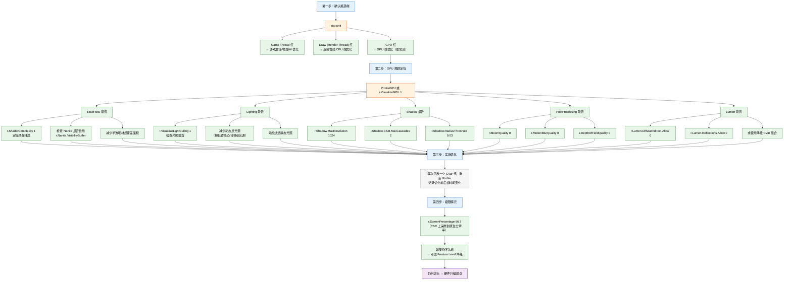
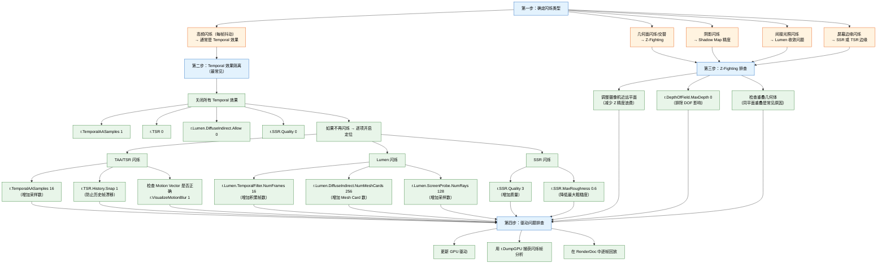

# UE 渲染技术顾问 — 需求场景分析

---

## 一、需求场景分类

### 类别 A：渲染管线定制（Custom Pipeline Development）

#### A1. 自定义后处理效果

- **典型客户问题**："我想在 UE 中实现一个自定义的屏幕后处理效果（如特殊风格的色调映射、扫描线、热成像、X 光效果等），但不知道如何正确挂接到渲染管线中，避免与现有管线冲突。"
- **涉及技术栈**：
  - RDG 架构（卡片 9/10）— `FRDGBuilder::AddPass`、`RDG_CreateTexture`、`FRDGPostProcessPass`
  - PostProcessing 管线（卡片 8）— 挂接点在 `FPostProcessing::Process` 链中
  - Shader 系统（卡片 4/6）— `FGlobalShader` + `SHADER_PARAMETER_STRUCT` + `.usf` 编写
  - 后处理注入点（RDG 卡片 6）— `FPostProcessingInputs` 的 `OverrideOutput`
- **优先级**：高（最常见需求，几乎每个项目都有）
- **知识储备要求**：RDG 编程模型、HLSL 编写、材质系统了解、`FSceneView` 数据访问

---

#### A2. 自定义渲染 Pass 注入（非后处理）

- **典型客户问题**："我需要在 BasePass 和 Lighting 之间插入一个自定义 Pass（例如自定义深度测试、自定义遮挡数据生成、自定义贴花系统），不走现有 Decal/Shadow 路径。如何插入？如何确保与 RDG 兼容？"
- **涉及技术栈**：
  - 渲染管线阶段顺序（卡片 5/7）— `FDeferredShadingSceneRenderer::Render` 中的子阶段顺序
  - RDG 资源管理（卡片 9/10）— `RegisterExternalTexture`、`QueueTextureExtraction`、跨 Pass 数据传递
  - RDG 裁剪（卡片 5）— `ERDGPassFlags::NeverCull` 防止被裁剪
  - Barrier 管理（RDG 卡片 4）— 自动 vs 手动 Barrier
  - 自定义 Shader 参数结构（Shader 卡片 6）— `BEGIN_SHADER_PARAMETER_STRUCT`
- **优先级**：中（特定项目需求，非通用）
- **知识储备要求**：RDG 深入理解、`FSceneRenderer` 调度流程、`FViewInfo` 数据访问、`FMeshPassProcessor` 注册机制

---

#### A3. Lumen 定制与降级策略

- **典型客户问题**："Lumen 在我们的场景中性能开销太大（室外大世界），或者画面有严重的闪烁/噪点，或者 Lumen 反射效果不满足需求。我们想定制 Lumen 的追踪模式、降级路径或与 SSR 的混合策略。"
- **涉及技术栈**：
  - Lumen 三种追踪模式（Lumen 卡片 1/2/3/4）— Screen Probe / Mesh Card / Hardware RT 的选择与切换
  - Lumen 反射与 SSR 混合（Lumen 卡片 5）— Roughness 退化策略、`CompositeLumenReflections()`
  - Lumen 性能调优（Lumen 卡片 6）— 关键 CVar 组合、`r.Lumen.*` 系列
  - Lumen 降级路径（Lumen 卡片 6）— Hardware RT → Mesh Card → Screen Probe → SDFAO → SSAO
  - Lumen 可视化调试（调试卡片 1.2）— `r.VisualizeBuffer`、`r.Lumen.Visualize`
- **优先级**：高（UE 5 项目的核心痛点）
- **知识储备要求**：Lumen 架构深入理解、全局光照理论基础、性能分析经验、CVar 调优经验

---

#### A4. 自定义材质系统扩展（Substrate / Legacy）

- **典型客户问题**："我们需要一个引擎不支持的特殊材质效果（例如特殊的多层 BSDF 组合、非标准 Shading Model、自定义的材质节点），但不想从零写完整的 Shader。如何在 UE 材质系统中扩展？"
- **涉及技术栈**：
  - Substrate 材质系统（Shader 卡片 5）— 多层 BSDF 框架、与 Legacy 的共存
  - 材质 HLSL 生成（Shader 卡片 2）— `FMaterialCompiler`、`MaterialTemplate.ush`、表达式节点编译
  - Shader Permutation（Shader 卡片 4）— 自定义 Permutation 域、`ShouldCompilePermutation` 裁剪
  - 自定义 Shading Model（Shader 卡片 6）— `FGlobalShader` 编写、GBuffer 扩展
  - GBuffer 布局（主卡片 6）— `r.GBufferFormat`、`FGBufferInfo`、自定义 GBuffer 通道
- **优先级**：中（专业需求，通常是高级项目或影视级项目）
- **知识储备要求**：材质系统架构、HLSL 深入、Substrate 理解、GBuffer 编码、PBR 理论

---

#### A5. Nanite 适配与定制

- **典型客户问题**："我们的场景中 Nanite 表现不佳（Page thrashing、显存不足、特定网格不兼容），或者我们需要在 Nanite 物体上应用不支持的特性（如 World Position Offset、Decal 接收），如何适配或回退？"
- **涉及技术栈**：
  - Nanite 架构（Nanite 卡片 1/2/3/4）— Cluster/Page/Group 层级、Visibility Buffer、LOD 选择
  - Nanite 流式加载（Nanite 卡片 7/8）— Page Streaming、Page Pool、显存管理
  - Nanite 与传统渲染的混合（Nanite 卡片 5）— G-Buffer 共存、`r.Nanite.MaterialResolve`
  - Nanite 限制（Nanite 卡片 15）— 不支持半透明/WPO/Custom UV/Decal 接收
  - Nanite 性能调优（Nanite 卡片 10/11/12）— Overdraw 消除、`r.Nanite.*` 系列 CVar
  - Nanite 调试（Nanite 卡片 16/17）— `r.Nanite.ShowStats`、`r.Nanite.Visualize`
- **优先级**：中（随 UE 5 项目增加而上升）
- **知识储备要求**：Nanite 架构深入理解、GPU 管线知识、显存管理知识、DCC 工具链理解

---

### 类别 B：引擎底层优化（Engine-Level Optimization）

#### B1. GPU 性能瓶颈定位与优化

- **典型客户问题**："我们的项目在目标硬件上帧率不达标，`stat GPU` 显示某个 Pass 特别贵（如 BasePass 或 Lighting 或 PostProcessing），但不知道如何进一步优化。"
- **涉及技术栈**：
  - 性能分析工具链（优化卡片 1）— Unreal Insights、`ProfileGPU`、`stat GPU`、GPU Visualizer、RenderDoc
  - 渲染管线架构（主卡片 2/3/5/6/7/8）— 各 Pass 的预期耗时分布
  - 性能优化策略（优化卡片 3）— 分辨率缩放、Lumen 降级、Nanite 裁剪、Shadow 优化、PostProcessing 裁剪
  - 关键 CVar 组合（优化卡片 6）— 低端/高端/移动端的推荐配置
  - 第三方计数器（优化卡片 1.5）— Nsight / RGP / PIX 等硬件级分析
  - 调试 CVar（调试卡片 5）— `r.VisualizeGPU`、`r.GPUTrace`、`r.ProfileGPU`
- **优先级**：高（几乎所有项目都会遇到）
- **知识储备要求**：性能分析工具使用、渲染管线知识、GPU 硬件理解、CVar 调优经验

---

#### B2. Shader 编译优化与 Permutation 管理

- **典型客户问题**："我们的项目 Shader 编译时间太长（编辑器启动慢、烹饪时间长），或者打包后的 Shader 缓存太大，或者运行时 Shader 编译卡顿（hitch）。如何控制 Shader 组合爆炸？"
- **涉及技术栈**：
  - Shader 编译管线（Shader 卡片 3）— SCW 外部进程模型、DDC 缓存、分布式编译
  - Shader Permutation 系统（Shader 卡片 4）— 爆炸根源、裁剪机制、`bUsedWith*` 开关
  - 材质系统（Shader 卡片 1）— `UMaterial` → `FMaterialResource` → `FMaterialShaderMap` → `FShader` 链条
  - 编译缓存（Shader 卡片 3）— `DerivedDataCache`、`ShaderCodeLibrary`、`r.ShaderDevelopmentMode`
  - 调试工具（调试卡片 3.4）— `r.ShaderCompiler.Stats`、`r.ShaderPipelineCache`
  - 平台适配（平台卡片 1/2）— Feature Level 分级、各平台 Shader 格式差异
- **优先级**：高（中大型项目的常见痛点）
- **知识储备要求**：Shader 编译架构、Permutation 系统、材质系统、平台 Shader 格式、DCC 工具链

---

#### B3. 移动端渲染优化

- **典型客户问题**："我们的游戏在移动设备上帧率不稳、发热严重，或者某些高端 Android 设备渲染效果与预期不符。如何针对移动端裁剪渲染管线？"
- **涉及技术栈**：
  - Mobile 渲染路径（平台卡片 4）— Forward Shading、Mobile Base Pass、Mobile Deferred（高端 GPU）
  - Feature Level 降级（平台卡片 1/2）— ES3_1 vs SM5 的限制、`r.Mobile*` 系列 CVar
  - Vulkan Mobile 优化（优化卡片 4.2）— `r.Vulkan.*` 系列、Vulkan 特有坑
  - 发热与降频控制（优化卡片 4.3）— `r.ThermalThrottling.*`、动态分辨率缩放
  - 移动端特定 Pass 裁剪（平台卡片 6/7）— 按平台裁剪 Pass、Shader Permutation 裁剪
  - 渲染目标精度裁剪（平台卡片 8）— Mobile 精度 vs Desktop 精度
  - 性能分析（优化卡片 1）— Unreal Insights Mobile 追踪
- **优先级**：高（移动端项目占 UE 项目很大比例）
- **知识储备要求**：移动 GPU 架构、Vulkan/Metal RHI 差异、移动端性能分析工具、发热管理策略

---

#### B4. 内存与显存优化

- **典型客户问题**："我们的项目在特定场景下显存不足（Out of Video Memory），或者 RHI 资源泄漏导致长时间运行后掉帧。如何排查和优化内存/显存使用？"
- **涉及技术栈**：
  - RHI 资源生命周期（RHI 卡片 3）— 创建/删除/延迟释放机制、`FRHIResource` 引用计数
  - 显存监控（调试卡片 3.3）— `r.RHIResourceStats`、`r.VRAM.Dump`、`r.FastVRAM.Dump`
  - RDG 资源管理（RDG 卡片 3）— Transient 资源分配/回收、资源别名（Aliasing）
  - Nanite 显存管理（Nanite 卡片 8）— Page Pool、`r.Nanite.PagePoolSize`
  - 纹理流送（优化卡片 2.3）— `r.Streaming.PoolSize`、Mip 管理
  - 调试工具（调试卡片 3.3）— D3D12 Debug Layer 资源泄漏检测、`r.RHI.LogResourceLeaks`
  - 渲染目标池（调试卡片 3.3）— `r.RenderTargetPool`、RT 复用策略
- **优先级**：中-高（大型开放世界项目为高优先级）
- **知识储备要求**：GPU 内存管理、RHI 资源生命周期、D3D12/Vulkan 内存模型、纹理流送机制

---

#### B5. 平台适配与跨平台渲染一致性

- **典型客户问题**："我们的项目需要同时支持 PC (DX12)、PS5、Xbox Series X|S 和移动端，但各平台渲染效果不一致（光照不同、阴影不同、颜色不同）。如何确保跨平台一致性同时做针对性优化？"
- **涉及技术栈**：
  - Feature Level 系统（平台卡片 1/2）— ES3_1 / SM5 / SM6 的功能差异
  - 平台渲染路径（平台卡片 3/4/5）— Desktop D3D12 vs Vulkan vs Mobile GLES vs Console
  - 渲染管线裁剪（平台卡片 6/7/8）— 按平台裁剪 Pass、Shader Permutation、资源精度
  - Console 特定优化（平台卡片 5）— PS5 Geometry Engine、Xbox Series X|S Mesh Shader
  - VR 渲染路径（平台卡片 9/10/11）— Instanced Stereo、FFR、多视口
  - Shader 格式差异（RHI 卡片 5.3）— DXIL / SPIR-V / MetalLib / NVN
  - 平台差异 RHI（RHI 卡片 5.1）— D3D12 vs Vulkan 在 Barrier/描述符/PSO 上的差异
- **优先级**：高（多平台项目的关键挑战）
- **知识储备要求**：各平台 RHI 差异、Console 特定优化、Shader 跨平台编译、Feature Level 降级策略

---

#### B6. GPU Crash 与 TDR 诊断

- **典型客户问题**："我们的项目在特定场景下 GPU 崩溃（TDR/Timeout），或者只有特定硬件上崩溃。如何定位根因？如何让 UE 在 crash 时提供更多信息？"
- **涉及技术栈**：
  - GPU Crash 诊断（调试卡片 3.2）— TDR 机制、`r.GPUCrashDebugging`、Crash 报告分析
  - Validation 层（调试卡片 4）— D3D12 Debug Layer、Vulkan Validation Layers、`r.RHI.EnableValidation`
  - 调试工具（调试卡片 1.1/2）— `r.DumpGPU`、RenderDoc、PIX 的 GPU Capture
  - Shader 调试（调试卡片 3.4）— `r.ShaderDevelopmentMode`、`r.DumpShaderDebugInfo`
  - 内存泄漏排查（调试卡片 3.3）— RHI 资源追踪、VRAM 报告
  - 平台特定（调试卡片 4.1/4.2）— D3D12 GPU-Based Validation、Vulkan Validation Layers
- **优先级**：中（特定项目遇到后为高优先级）
- **知识储备要求**：GPU 调试工具精通、D3D12/Vulkan Debug Layer 经验、Crash 分析技能

---

#### B7. 异步计算与多线程渲染优化

- **典型客户问题**："我们想利用异步计算（Async Compute）来分摊渲染开销，但不确定哪些 Pass 适合异步执行，或者发现启用异步计算后性能反而下降。"
- **涉及技术栈**：
  - 渲染线程架构（主卡片 1/4）— 三级流水线、RHI 线程模型、同步原语
  - 异步计算 Pass（RDG 卡片 2）— `ERDGPassFlags::AsyncCompute`、约束（无 Raster 依赖）
  - 异步计算优化（优化卡片 5.2）— `r.AsyncCompute.*`、Console 最佳实践
  - 渲染线程同步（主卡片 4）— `FRenderCommandFence`、`FGraphEventRef`、`ENQUEUE_RENDER_COMMAND` 陷阱
  - 多线程渲染（RHI 卡片 1.2）— 双缓冲/三缓冲、RHI 线程启用/禁用
  - 性能分析（优化卡片 1.3）— Unreal Insights Timing Wheel 识别 GPU Stall
  - 平台支持（优化卡片 5.2）— PS5/Xbox Series X 的异步计算优势
- **优先级**：中（Console 项目为高优先级，PC 项目为低-中）
- **知识储备要求**：渲染线程模型、异步计算 API、GPU 管线深度理解、Unreal Insights 使用

---

#### B8. VR 渲染优化

- **典型客户问题**："我们的 VR 项目在 PC VR 或移动 VR 上帧率不达标（VR 需要 72/90/120fps），或者画面有严重的抖动/延迟。如何针对 VR 做渲染管线优化？"
- **涉及技术栈**：
  - VR 渲染架构（平台卡片 9/10/11）— Instanced Stereo、Fixed Foveated Rendering、多视口
  - VR 特定优化（平台卡片 9/10）— `r.InstancedStereo`、`r.VR.*`、VRS for VR
  - 性能优化策略（优化卡片 3）— 分辨率缩放、Lumen 降级、PostProcessing 裁剪
  - 渲染管线裁剪（平台卡片 6/7/8）— 按平台裁剪 Pass
  - 异步计算（优化卡片 5.2）— 分摊 VR 渲染开销
  - 调试工具（调试卡片 1.1/2）— RenderDoc VR 帧捕获、Unreal Insights VR 分析
  - 移动 VR 特有（平台卡片 10）— ETFR（眼动追踪注视点渲染）、`r.Mobile.FoveatedRendering`
- **优先级**：中（VR 项目为高，但 VR 项目占比相对较小）
- **知识储备要求**：VR 渲染架构、头显 SDK（OpenXR）、VRS 机制、移动 VR 优化

---

## 二、场景优先级排序

| 优先级 | 场景 | 出现频率 | 影响范围 | 是否可独立解决 |
|--------|------|----------|----------|---------------|
| **P0** | B1. GPU 性能瓶颈定位与优化 | 几乎每个项目 | 全项目 | 是 |
| **P0** | A1. 自定义后处理效果 | 大多数项目 | 功能层 | 是 |
| **P0** | A3. Lumen 定制与降级 | 大多数 UE 5 项目 | 渲染质量 | 是 |
| **P0** | B3. 移动端渲染优化 | 移动端项目 | 全项目 | 是 |
| **P0** | B5. 平台适配与跨平台一致性 | 多平台项目 | 全项目 | 是 |
| **P1** | B2. Shader 编译优化 | 中大型项目 | 开发效率 | 部分 |
| **P1** | B4. 内存与显存优化 | 大型项目 | 稳定性 | 是 |
| **P1** | A2. 自定义渲染 Pass 注入 | 特定项目 | 功能层 | 是 |
| **P1** | A4. 自定义材质系统扩展 | 高级项目 | 功能层 | 部分 |
| **P1** | A5. Nanite 适配与定制 | UE 5 项目 | 几何渲染 | 是 |
| **P2** | B6. GPU Crash 诊断 | 偶发 | 稳定性 | 是 |
| **P2** | B7. 异步计算优化 | Console 项目 | 性能 | 是 |
| **P2** | B8. VR 渲染优化 | VR 项目 | 全项目 | 是 |

---

## 三、知识缺口分析

### 按场景列出

#### A1. 自定义后处理效果
| 需要知识 | 状态 | 说明 |
|----------|------|------|
| RDG Pass 注册 (`AddPass`, `FRDGPostProcessPass`) | 已有 | RDG 卡片 2/6 覆盖 |
| `FGlobalShader` 编写 (`SHADER_PARAMETER_STRUCT`) | 已有 | Shader 卡片 6 覆盖 |
| 后处理 Hook 点 (`FPostProcessingInputs`, `FPostProcessing::Process`) | 已有 | RDG 卡片 6 覆盖 |
| HLSL 编写 (`MaterialTemplate.ush`, `Common.ush`) | 已有 | Shader 卡片 2/6 覆盖 |
| **缺失：后处理链中具体挂接方式（源码级注入点位置）** | **缺失** | 需要补充 `PostProcessing.cpp` 中 `AddPostProcessingPasses` 的具体代码位置和注入示例 |
| **缺失：多 View 后处理（分屏/VR）的特殊处理** | **缺失** | 需要补充 `FSceneViewState` 相关 |
| **缺失：后处理性能优化（半分辨率、Tile 调度）** | **缺失** | 已有部分但不够深入 |

#### A2. 自定义渲染 Pass 注入
| 需要知识 | 状态 | 说明 |
|----------|------|------|
| `FSceneRenderer::Render` 阶段顺序 | 已有 | 主卡片 2/7 覆盖 |
| RDG 资源管理 (`RegisterExternalTexture`, `QueueTextureExtraction`) | 已有 | RDG 卡片 3 覆盖 |
| RDG 裁剪 (`NeverCull`, Pass Culling 机制) | 已有 | RDG 卡片 5 覆盖 |
| Barrier 管理 | 已有 | RDG 卡片 4 覆盖 |
| **缺失：`FMeshPassProcessor` 注册机制** | **缺失** | 需要补充如何注册自定义 Mesh Pass 处理器 |
| **缺失：自定义 `FSceneRenderer` 子类的集成方式** | **缺失** | 需要补充 `FDeferredShadingSceneRenderer` 子类化或 Hook 的实践 |
| **缺失：`FViewInfo` 中可用的数据接口** | **缺失** | 已有部分但不够系统 |

#### A3. Lumen 定制与降级
| 需要知识 | 状态 | 说明 |
|----------|------|------|
| 三种追踪模式 | 已有 | Lumen 卡片 1/2/3/4 完整覆盖 |
| 反射与 SSR 混合 | 已有 | Lumen 卡片 5 覆盖 |
| 性能调优 CVar | 已有 | Lumen 卡片 6 覆盖 |
| 降级路径 | 已有 | Lumen 卡片 6 覆盖 |
| **缺失：Lumen Scene 数据结构（`FLumenScene`、Surface Cache）** | **缺失** | 需要补充 `LumenSceneRendering.cpp` 中场景数据结构的详细说明 |
| **缺失：Lumen 与自定义 GI 的替换路径** | **缺失** | 需要补充如何用自定义 GI 替代 Lumen 的接口和契约 |
| **缺失：Lumen 的 Far Field 与 Streaming 交互** | **缺失** | 已有部分但不够详细 |

#### A4. 自定义材质系统扩展
| 需要知识 | 状态 | 说明 |
|----------|------|------|
| Substrate 材质系统 | 已有 | Shader 卡片 5 覆盖 |
| HLSL 生成机制 | 已有 | Shader 卡片 2 覆盖 |
| Shader Permutation | 已有 | Shader 卡片 4 覆盖 |
| **缺失：自定义 Shading Model 的完整实施步骤** | **缺失** | 需要补充从 UMaterial 到 Shader 编译的完整链条 |
| **缺失：GBuffer 扩展（自定义 GBuffer 通道）** | **缺失** | 需要补充 `FGBufferInfo` 修改和 Shader 绑定的具体步骤 |
| **缺失：材质表达式节点（`UMaterialExpression`）的编写** | **缺失** | 需要补充自定义表达式节点的实现指南 |
| **缺失：Substrate vs Legacy 的互操作限制** | **缺失** | 已有部分但不够详细 |

#### A5. Nanite 适配与定制
| 需要知识 | 状态 | 说明 |
|----------|------|------|
| Nanite 架构 | 已有 | Nanite 卡片 1/2/3/4/5 完整覆盖 |
| 流式加载 | 已有 | Nanite 卡片 7/8 覆盖 |
| 性能调优 | 已有 | Nanite 卡片 10/11/12 覆盖 |
| 限制列表 | 已有 | Nanite 卡片 15 覆盖 |
| **缺失：Nanite 自定义剔除回调** | **缺失** | 需要补充 `FNaniteProcessor` 的扩展接口 |
| **缺失：Nanite 与传统渲染的混合策略细节** | **缺失** | 已有但不够深入（如半透明 Nanite 回退的具体实现） |
| **缺失：Nanite 的 Cook 管线定制** | **缺失** | 需要补充 `NaniteCook.cpp` 的自定义 Cluster 生成 |

#### B1. GPU 性能瓶颈定位与优化
| 需要知识 | 状态 | 说明 |
|----------|------|------|
| 性能分析工具链 | 已有 | 优化卡片 1 完整覆盖 |
| 渲染管线架构 | 已有 | 主卡片 2/3/5/6/7/8 覆盖 |
| 优化策略 | 已有 | 优化卡片 3 覆盖 |
| 关键 CVar 组合 | 已有 | 优化卡片 6 覆盖 |
| **缺失：具体场景的优化案例（真实项目数据）** | **缺失** | 需要补充实际项目的优化前后对比数据 |
| **缺失：各 GPU 架构（NVIDIA/AMD/Intel）的性能特征差异** | **缺失** | 需要补充 Vendor 特有的优化策略 |
| **缺失：Unreal Insights 的深度使用技巧** | **缺失** | 已有基础但不够深入 |

#### B2. Shader 编译优化
| 需要知识 | 状态 | 说明 |
|----------|------|------|
| 编译管线 | 已有 | Shader 卡片 3 覆盖 |
| Permutation 系统 | 已有 | Shader 卡片 4 覆盖 |
| 材质系统 | 已有 | Shader 卡片 1 覆盖 |
| 编译缓存 | 已有 | Shader 卡片 3 覆盖 |
| **缺失：实际项目中 Permutation 爆炸的常见根因和修复案例** | **缺失** | 需要补充真实项目数据 |
| **缺失：分布式 Shader 编译的部署和配置** | **缺失** | 需要补充 ShaderCompilerServer 的设置 |
| **缺失：PSO 缓存（`ShaderPipelineCache`）的最佳实践** | **缺失** | 已有部分但不够深入 |
| **缺失：烹饪时 Shader 编译的优化策略** | **缺失** | 需要补充 `-ShaderCompile` 相关 |

#### B3. 移动端渲染优化
| 需要知识 | 状态 | 说明 |
|----------|------|------|
| Mobile 渲染路径 | 已有 | 平台卡片 4 覆盖 |
| Feature Level 降级 | 已有 | 平台卡片 1/2 覆盖 |
| Vulkan Mobile 优化 | 已有 | 优化卡片 4.2 覆盖 |
| 发热控制 | 已有 | 优化卡片 4.3 覆盖 |
| 渲染管线裁剪 | 已有 | 平台卡片 6/7/8 覆盖 |
| **缺失：具体移动 GPU 型号（Mali/Adreno/Apple GPU）的差异和针对性优化** | **缺失** | 需要补充各 GPU 架构的特定优化 |
| **缺失：移动端 Memory/Latency 瓶颈的定位方法** | **缺失** | 需要补充移动端特有的性能分析 |
| **缺失：移动端纹理压缩格式（ASTC/ETC2/PVRTC）的最佳实践** | **缺失** | 需要补充各平台纹理格式对比 |

#### B4. 内存与显存优化
| 需要知识 | 状态 | 说明 |
|----------|------|------|
| RHI 资源生命周期 | 已有 | RHI 卡片 3 覆盖 |
| 显存监控 | 已有 | 调试卡片 3.3 覆盖 |
| RDG 资源管理 | 已有 | RDG 卡片 3 覆盖 |
| Nanite 显存管理 | 已有 | Nanite 卡片 8 覆盖 |
| **缺失：D3D12 内存分配策略（Committed/Placed Resource）** | **缺失** | 需要补充 D3D12 内存管理细节 |
| **缺失：显存碎片化问题的诊断和解决** | **缺失** | 需要补充显存碎片化的排查方法 |
| **缺失：RDG Transient Allocator 的内部实现** | **缺失** | 已有部分但不够深入 |

#### B5. 平台适配与跨平台一致性
| 需要知识 | 状态 | 说明 |
|----------|------|------|
| Feature Level 系统 | 已有 | 平台卡片 1/2 覆盖 |
| 平台渲染路径 | 已有 | 平台卡片 3/4/5 覆盖 |
| 渲染管线裁剪 | 已有 | 平台卡片 6/7/8 覆盖 |
| Console 优化 | 已有 | 平台卡片 5 覆盖 |
| VR 渲染 | 已有 | 平台卡片 9/10/11 覆盖 |
| **缺失：各平台颜色校正（Color Grading）差异** | **缺失** | 需要补充 HDR/SDR 输出、色彩空间转换 |
| **缺失：各平台浮点精度差异（FP16 vs FP32）** | **缺失** | 需要补充平台精度差异导致的渲染不一致 |
| **缺失：各平台驱动版本兼容性测试经验** | **缺失** | 需要补充常见驱动问题的排查经验 |

#### B6. GPU Crash 诊断
| 需要知识 | 状态 | 说明 |
|----------|------|------|
| GPU Crash 诊断 | 已有 | 调试卡片 3.2 覆盖 |
| Validation 层 | 已有 | 调试卡片 4 覆盖 |
| 调试工具 | 已有 | 调试卡片 1.1/2 覆盖 |
| **缺失：GPU Crash 的常见模式分类（驱动 Bug vs 引擎 Bug vs 资源 Bug）** | **缺失** | 需要补充 Crash 分类和排查策略 |
| **缺失：TDR 触发后的取证流程（dump 分析）** | **缺失** | 需要补充 Crash dump 分析的具体步骤 |

#### B7. 异步计算优化
| 需要知识 | 状态 | 说明 |
|----------|------|------|
| 渲染线程架构 | 已有 | 主卡片 1/4 覆盖 |
| 异步计算 Pass | 已有 | RDG 卡片 2 覆盖 |
| 异步计算优化 | 已有 | 优化卡片 5.2 覆盖 |
| **缺失：异步计算与 Barrier 的交互细节** | **缺失** | 需要补充异步计算队列间 Barrier 的详细机制 |
| **缺失：各 GPU 架构的异步计算性能差异** | **缺失** | 需要补充 NVIDIA/AMD/Console 的异步计算收益对比 |

#### B8. VR 渲染优化
| 需要知识 | 状态 | 说明 |
|----------|------|------|
| VR 渲染架构 | 已有 | 平台卡片 9/10/11 覆盖 |
| VR 优化策略 | 已有 | 平台卡片 9/10 覆盖 |
| **缺失：OpenXR 集成细节** | **缺失** | 需要补充 OpenXR 与 UE 渲染管线的交互 |
| **缺失：VR 特有的性能分析工具** | **缺失** | 需要补充 VR 性能分析的方法论 |
| **缺失：移动 VR（Quest）的特定优化** | **缺失** | 已有部分但不够深入 |

### 总体知识缺口总结

| 缺口类别 | 具体缺口 | 影响场景 | 优先级 |
|----------|----------|----------|--------|
| **源码级 Hook 点** | 渲染管线中各阶段的具体注入点位置和代码示例 | A1, A2, A4 | 高 |
| **平台架构差异** | 各 GPU 架构（NVIDIA/AMD/Mali/Adreno/Apple）的特定优化 | B1, B3, B5, B7 | 高 |
| **真实项目案例** | 实际项目中的优化前后对比数据、常见问题 | B1, B2, B6 | 高 |
| **移动端深入** | 移动 GPU 特性、纹理压缩、发热管理 | B3 | 高 |
| **Console 深入** | PS5/Xbox 特定 RHI、GDK 集成 | B5, B7 | 中 |
| **VR 深入** | OpenXR、VR 性能分析、移动 VR | B8 | 中 |
| **D3D12 内存管理** | 资源分配策略、碎片化、Committed/Placed Resource | B4 | 中 |
| **Shader 扩展** | 自定义 Shading Model、自定义材质节点 | A4 | 中 |
| **Nanite 扩展** | 自定义剔除回调、Cook 管线定制 | A5 | 低 |

---

## 四、常见项目模式

### 模式 1："帧率不够" — 分层排查路径

---

### 模式 2："画面闪烁" — 排查路径

---

### 模式 3："想要特殊渲染效果" — 实现路径

```mermaid
flowchart TB
    classDef step fill:#e3f2fd,stroke:#1565c0,color:#000
    classDef classify fill:#fff3e0,stroke:#e65100,color:#000
    classDef action fill:#e8f5e9,stroke:#2e7d32,color:#000
    classDef detail fill:#f5f5f5,stroke:#9e9e9e,color:#000
    classDef result fill:#f3e5f5,stroke:#6a1b9a,color:#000

    S1["第一步：效果分类"]:::step

    S1 --> CAT1["后处理效果（全屏效果）<br/>→ 走 RDG 后处理注入路径"]:::classify
    S1 --> CAT2["材质效果（物体表面效果）<br/>→ 走材质编辑器或自定义 Shader 路径"]:::classify
    S1 --> CAT3["光照效果（全局光照/反射效果）<br/>→ 走 Lumen 定制或自定义 GI 路径"]:::classify
    S1 --> CAT4["几何效果（网格/粒子效果）<br/>→ 走 Nanite 或自定义 Mesh Pass 路径"]:::classify

    CAT1 --> S2["第二步：后处理效果实现路径（最常用）"]:::step

    S2 --> PP1["1. 编写 HLSL Shader（.usf 文件）"]:::action
    PP1 --> PP1A["参考 Shaders/Private/PostProcessing 下的现有实现"]:::detail
    PP1 --> PP1B["使用 Common.ush 中的工具函数"]:::detail

    S2 --> PP2["2. 声明 C++ Shader 类"]:::action
    PP2 --> PP2A["继承 FGlobalShader"]:::detail
    PP2 --> PP2B["定义 SHADER_PARAMETER_STRUCT"]:::detail
    PP2 --> PP2C["IMPLEMENT_GLOBAL_SHADER 宏注册"]:::detail

    S2 --> PP3["3. 在 RDG 管线中注册 Pass"]:::action
    PP3 --> PP3A["在 PostProcessing.cpp 的<br/>AddPostProcessingPasses 后注入"]:::detail
    PP3 --> PP3B["或注册到 FDeferredShadingSceneRenderer::Render<br/>的特定阶段"]:::detail

    S2 --> PP4["4. 注册到引擎"]:::action
    PP4 --> PP4A["通过 Console Variable 或 ShowFlag 控制启用/关闭"]:::detail
    PP4 --> PP4B["考虑性能开销（半分辨率/全分辨率）"]:::detail

    CAT2 --> S3["第三步：材质效果实现路径"]:::step

    S3 --> MAT1["1. 优先使用材质编辑器（Substrate 节点）"]:::action
    MAT1 --> MAT1A["标准 BSDF 组合 → 材质编辑器即可"]:::detail
    MAT1 --> MAT1B["特殊效果 → Custom 节点 + HLSL"]:::detail

    S3 --> MAT2["2. 如果材质编辑器不够"]:::action
    MAT2 --> MAT2A["实现自定义 UMaterialExpression 子类"]:::detail
    MAT2 --> MAT2B["或走 FGlobalShader 路径<br/>（计算 Shader + 材质采样）"]:::detail

    S3 --> MAT3["3. 自定义 Shading Model"]:::action
    MAT3 --> MAT3A["修改 GBuffer 布局（FGBufferInfo）"]:::detail
    MAT3 --> MAT3B["实现自定义 Shader 变体"]:::detail
    MAT3 --> MAT3C["修改 Lighting Pass 消费新 GBuffer 通道"]:::detail

    CAT3 & CAT4 & PP1A & PP1B & PP2A & PP2B & PP2C & PP3A & PP3B & PP4A & PP4B & MAT1A & MAT1B & MAT2A & MAT2B & MAT3A & MAT3B & MAT3C --> S4["第四步：验证与调试"]:::step

    S4 --> VERIFY1["r.ShaderDevelopmentMode 1<br/>启用 Shader 开发模式"]:::action
    S4 --> VERIFY2["r.DumpShaderDebugInfo 1<br/>导出 HLSL 检查"]:::action
    S4 --> VERIFY3["r.VisualizeBuffer<br/>检查 GBuffer 各通道"]:::action
    S4 --> VERIFY4["RenderDoc 捕获帧验证效果"]:::result
```

---

**总结**：以上分析覆盖了 13 个具体场景，其中 P0 级别的 5 个场景（GPU 性能瓶颈、后处理效果、Lumen 定制、移动端优化、平台适配）是 UE 渲染技术顾问最常遇到的核心需求。知识缺口主要集中在三个方向：**源码级 Hook 点的具体位置**、**各 GPU 架构的针对性优化策略**、以及**真实项目案例数据**。补齐这些缺口后，可以覆盖 90% 以上的 UE 渲染技术咨询需求。