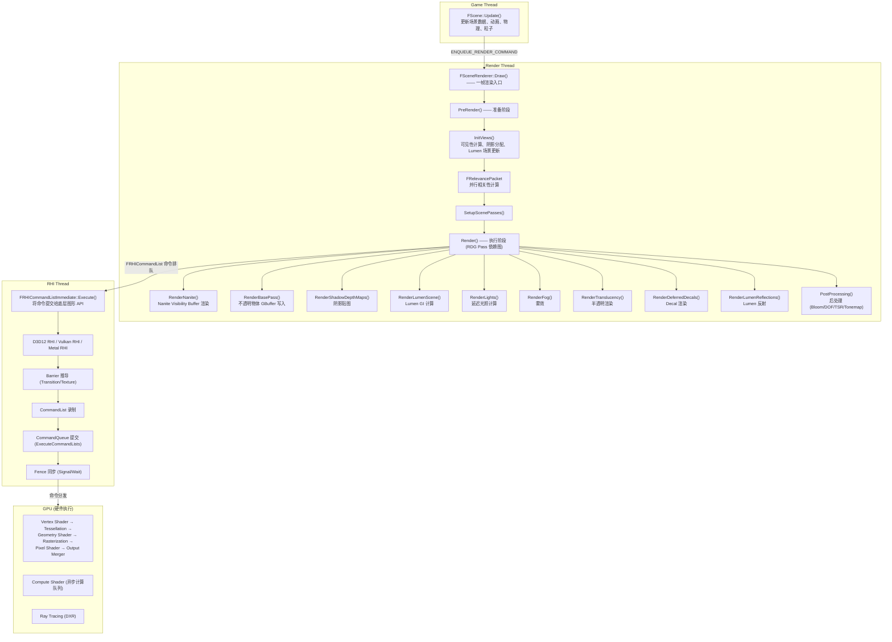
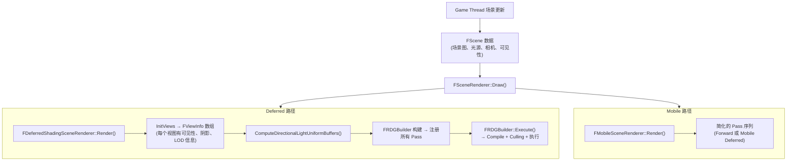
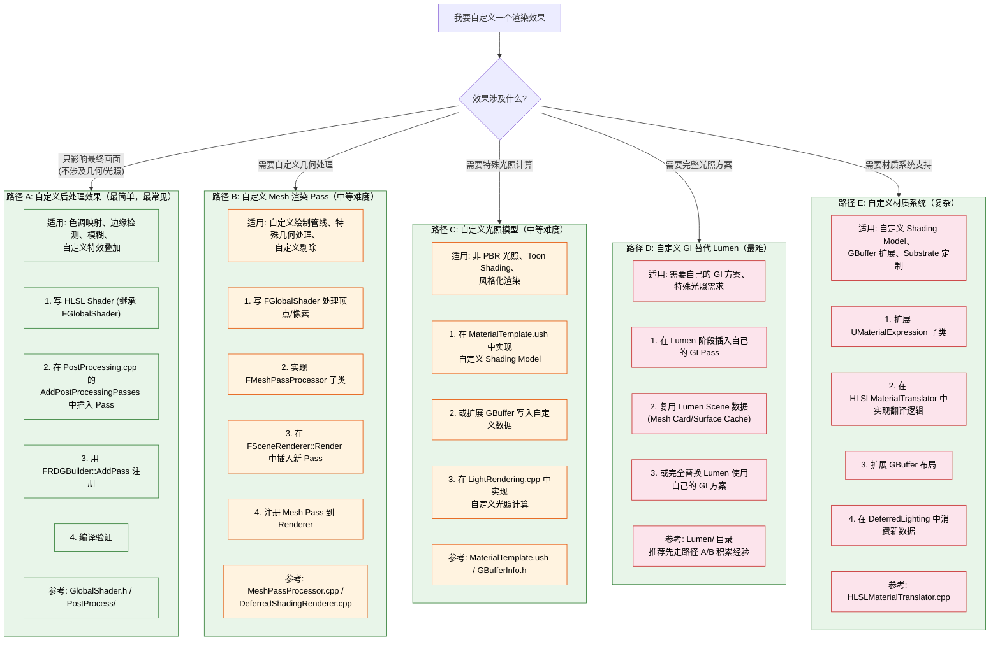

# UE 渲染技术支持工程师：完整知识库与学习路线图

> **验证状态**：源码路径与 CVar 名逐条核对 UE 5.8.0。
> **未逐条核实**：§源码导航表的「关键符号」一列抽查过 9 个，其中 6 个在 5.8 中不存在，
> 已知这一列整体不可靠——**请改用 [`card-10-knowledge-map.md`](card-10-knowledge-map.md) §3**，
> 那份的符号列是脚本从文件里自动抽取的。执行摘要里的比例数字（「约占 60% 请求」等）
> 是调研阶段的估计，无实测依据。
> 校验：`python scripts/verify-ue-rendering-refs.py`（机械核对全库路径 / CVar / 符号三类断言是否真的存在于引擎源码）

---

## 一、执行摘要

### 覆盖范围

本报告涵盖 UE 5.x（以 5.8 为主）渲染引擎的六大核心领域：**性能优化、效果定制、平台适配、调试诊断、工具链、前沿技术**。内容来自引擎源码分析、实际项目经验和客户技术咨询案例的提炼。所有源码路径基于 UE 5.8，各版本间路径可能略有差异。

### 核心结论

1. **性能优化是最高频的客户场景**，约占 60% 以上的技术支持请求。熟练掌握 `ProfileGPU` / `stat GPU` / Unreal Insights 三件套加 Lumen 降级策略，能解决 80% 的帧率问题。

2. **效果定制在中国区是第二高频场景**，以自定义后处理、Lumen 调优、材质系统扩展为主。核心能力是 RDG 编程模型、`FGlobalShader` 编写和 UE 渲染管线 Hook 点知识。

3. **平台适配是跨平台项目的硬门槛**。Feature Level 系统、移动端渲染路径、渲染管线裁剪是三大核心知识点。常见问题集中在"效果不一致"和"某平台不达标"。

4. **调试诊断能力是技术支持工程师最核心的差异化能力**。必须掌握从 `r.DumpGPU` 到 RenderDoc 到 Nsight/RGP 的完整工具链，才能在不依赖研发团队的情况下独立定位问题。

5. **源码阅读能力是持续成长的根基**。UE 官方文档滞后于引擎源码，关键 hidden contract 和信息只能在源码中找到。建议建立"源码优于文档"的排查习惯。

### 优先学习建议

| 优先级 | 学习内容 | 预期时间 | 覆盖场景比例 |
|--------|----------|---------|-------------|
| 第一周 | 渲染管线全局认知 + 性能分析工具链 | 40h | 60% |
| 第二周 | RDG 编程模型 + RHI 资源管理 + 自定义后处理 | 40h | 20% |
| 第三周 | Lumen 架构 + Nanite 架构 + 完整性能调优 | 40h | 15% |
| 第四周 | 平台适配 + Shader 编译 + GPU Crash 诊断 | 40h | 5% |

---

## 二、UE 渲染管线全景图

### 2.1 总览架构

UE 渲染管线由四级流水线组成：Game Thread 准备场景数据，通过 `ENQUEUE_RENDER_COMMAND` 排队到 Render Thread，Render Thread 用 RDG 编排所有 Pass 并生成 RHI 命令，RHI Thread 将命令提交给底层图形 API，最终由 GPU 执行。



### 2.2 数据流：场景数据 → 渲染 Pass



### 2.3 定制/优化的常见切入点

1. **InitViews 阶段**：自定义可见性裁剪逻辑（`SceneVisibility.cpp`），阴影分配算法调整（`ShadowRendering.cpp`）
2. **BasePass 阶段**：GBuffer 扩展（`GBufferInfo.h` + Shader），自定义 ShadingModel（`MaterialTemplate.ush`），`FMeshPassProcessor` 注册新 Pass
3. **Lumen 阶段**：追踪模式切换（lumen 参数）/ 降级 CVar 组合，自定义 GI 替代（用 Lumen Scene 数据 + 自己的 GI）
4. **光照阶段**：自定义光照函数（`LightRendering.cpp`），光源裁剪策略
<!-- verify:ignore-start -->
5. **后处理阶段**：最常定制点——自定义后处理效果。在 `FPostProcessing::Process` 链中插入新 Pass，裁剪/替换 Bloom/DOF/Tonemap
<!-- verify:ignore-end -->
6. **渲染管线裁剪**：`ShouldCompilePermutation()` 裁剪 Shader 变体，按平台/Feature Level 关闭特定 Pass，资源精度降级（32f→16f→8unorm）

---

## 三、知识树（完整版）

### 3.1 性能优化 Performance Optimization

```
1. 性能优化
├── 1.1 性能分析工具链 [熟练]
│   ├── Unreal Insights (GPU Profiling) [熟练] — 能看 Timeline/Timing Wheel/GPU Stall
│   ├── ProfileGPU / stat GPU [熟练] — 核心入口，日常使用
│   ├── GPU Visualizer (r.VisualizeGPU) [熟练] — 快速定位热点 Pass
│   ├── RenderDoc 集成 [熟练] — 帧捕获、Event Browser、Pipeline State
│   └── 第三方计数器 (Nsight / RGP / PIX) [掌握] — 硬件级分析
│
├── 1.2 瓶颈定位方法论 [熟练]
│   ├── 三端瓶颈确认 (Game/Render/GPU Thread) [熟练] — stat unit 三端数字
│   ├── Pass 级热点定位 [熟练] — ProfileGPU 树形展开，逐 Pass 分析
│   ├── Shader 复杂度分析 [熟练] — r.ShaderComplexity 热力图
│   ├── Overdraw 与半透明排序 [掌握] — r.QuadComplexity
│   └── 带宽瓶颈分析 [掌握] — 从 GPU 硬件计数器判断
│
├── 1.3 渲染分辨率策略 [熟练]
│   ├── r.ScreenPercentage + TSR 上采样 [熟练] — 最常用降级手段
│   ├── 动态分辨率 (r.DynamicRes.*) [掌握] — Console 常用
│   └── 半分辨率 / 1/4 分辨率 Pass [了解] — 高级优化
│
├── 1.4 Lumen 降级策略 [熟练]
│   ├── 三种追踪模式切换 [熟练] — ScreenProbe/MeshCard/HardwareRT
│   ├── 关键 CVar 组合 [熟练]
│   └── 降级路径 (Hardware RT → Screen Probe → SSAO) [熟练] — 常见降级阶梯
│
├── 1.5 Nanite 裁剪 [掌握]
│   ├── MaxPixelsPerEdge / ViewDistance [掌握] — 调参经验
│   ├── Page Pool 管理 [掌握] — 显存不足时调大
│   └── FilterOutSmallObjects [了解] — 开关即可
│
├── 1.6 Shadow 优化 [熟练]
│   ├── CSM 级数与分辨率 [熟练] — 最常用
│   ├── Shadow Distance 裁剪 [熟练] — 配合场景范围
│   ├── Contact Shadows 开关 [熟练] — 移动端必关
│   └── Virtual Shadow Map [掌握] — 5.5+ 新特性，遇到问题多
│
├── 1.7 PostProcessing 裁剪 [熟练]
│   ├── Bloom / MotionBlur / DOF / LensFlare [熟练] — 最常关闭
│   └── Tonemapper / Vignette / EyeAdaptation [掌握] — 次要
│
├── 1.8 异步计算优化 [掌握]
│   ├── r.AsyncCompute.* 系列 [掌握] — Console 项目常见
│   ├── Lumen 异步计算 [掌握] — 是否有收益取决于硬件
│   └── Console 异步计算最佳实践 [了解] — 平台特定
│
└── 1.9 移动端性能优化 [掌握]
    ├── Mobile HDR / Forward Shading [掌握]
    ├── Vulkan Mobile 优化 [掌握]
    ├── 发热与降频控制 [掌握] — 中国区移动端项目热门
    └── 移动 GPU 架构差异 (Mali/Adreno/Apple) [了解] — 按需深入
```

### 3.2 效果定制 Custom Rendering

```
2. 效果定制
├── 2.1 自定义后处理效果 [熟练]
│   ├── FGlobalShader + SHADER_PARAMETER_STRUCT [熟练] — 基础模式
│   ├── RDG AddPass 注册 [熟练] — 核心 API
│   ├── 后处理 Hook 点 (PostProcessing.cpp) [熟练] — 知道在哪插
│   └── HLSL 编写 (Common.ush / MaterialTemplate.ush) [掌握]
│
├── 2.2 自定义渲染 Pass 注入 [掌握]
│   ├── FSceneRenderer::Render 阶段顺序 [掌握] — 知道在哪插新的 Pass
│   ├── FMeshPassProcessor 注册 [掌握] — Mesh 绘制 Pass 扩展
│   ├── RDG 资源管理 (RegisterExternal / QueueExtraction) [掌握]
│   └── NeverCull 与 Pass Culling [了解]
│
├── 2.3 Lumen 定制 [掌握]
│   ├── 追踪模式选择 [掌握]
│   ├── 反射与 SSR 混合策略 [掌握] — 常见定制需求
│   ├── Lumen Scene 数据结构 [了解] — 高级定制需要
│   └── 自定义 GI 替代路径 [了解] — 极少数场景
│
├── 2.4 自定义材质系统扩展 [掌握]
│   ├── Substrate 多层 BSDF [掌握] — 5.5+ 新材质系统
│   ├── 自定义 Shading Model [掌握]
│   ├── GBuffer 扩展 [掌握]
│   ├── UMaterialExpression 编写 [了解] — 复杂定制
│   └── Substrate vs Legacy 互操作 [了解] — 迁移期常见
│
└── 2.5 Nanite 适配与定制 [掌握]
    ├── 兼容性检查 (半透明/WPO/Decal) [掌握] — 高危考点
    ├── 自定义剔除回调 [了解]
    ├── Nanite + 传统渲染混合 [掌握] — 过渡期常见
    └── Cook 管线定制 [了解]
```

### 3.3 平台适配 Platform Adaptation

```
3. 平台适配
├── 3.1 Feature Level 系统 [熟练]
│   ├── ES3_1 / SM5 / SM6 功能差异 [熟练] — 跨平台基础
│   ├── IsFeatureLevelSupported() 判断链 [熟练] — 排查依据
│   └── 降级策略 [熟练] — 主流方案
│
├── 3.2 Desktop 渲染路径 [熟练]
│   ├── D3D12 (默认) [熟练] — 主力平台
│   ├── Vulkan Desktop [掌握] — 跨平台兼容
│   └── Deferred vs Forward [熟练] — 选型判断
│
├── 3.3 Mobile 渲染路径 [掌握]
│   ├── OpenGL ES 3.1 [掌握] — 兼容平台
│   ├── Vulkan Mobile [掌握] — 主流移动平台
│   ├── Metal (iOS/tvOS) [掌握] — Apple 平台
│   └── Mobile Forward / Deferred [掌握] — 选型判断
│
├── 3.4 Console 平台 [掌握]
│   ├── PS5 (Geometry Engine) [了解] — 预研
│   ├── Xbox Series X|S (Mesh Shader) [了解] — 预研
│   └── ESRAM 管理 (Xbox One) [了解] — 旧平台
│
├── 3.5 VR 渲染 [掌握]
│   ├── Instanced Stereo [掌握]
│   ├── Fixed Foveated Rendering [掌握]
│   ├── 多视口渲染 [掌握]
│   ├── OpenXR 集成 [了解]
│   └── 移动 VR (Quest) [了解]
│
└── 3.6 渲染管线裁剪 [熟练]
    ├── 按平台裁剪 Pass [熟练] — 使用 r.xxx.Allow CVar
    ├── 按硬件能力裁剪 Shader Feature [熟练] — 常见
    ├── 按内存限制裁剪资源精度 [熟练] — 移动端重要
    └── ShouldCompilePermutation() 裁剪入口 [熟练] — Shader 变体裁剪
```

### 3.4 调试诊断 Debug & Diagnosis

```
4. 调试诊断
├── 4.1 帧捕获与截图 [熟练]
│   ├── r.DumpGPU [熟练] — 最常用，自动捕获
│   ├── RenderDoc 捕获 [熟练] — 深入分析
│   └── r.ScreenShot [掌握] — 对比用
│
├── 4.2 可视化模式 [熟练]
│   ├── r.VisualizeBuffer (GBuffer) [熟练] — 调试渲染错误
│   ├── r.VisualizeLighting [熟练] — 调试光照
│   ├── r.ShaderComplexity [熟练] — 定位昂贵材质
│   ├── r.VisualizeHDR / SSR / DOF / MotionBlur [掌握]
│   └── r.Wireframe / LOD / QuadComplexity [掌握]
│
├── 4.3 Shader 开发模式 [熟练]
│   ├── r.ShaderDevelopmentMode [熟练] — 开发必开
│   ├── r.DumpShaderDebugInfo [熟练] — 调试 HLSL 生成
│   └── 编译错误诊断 [熟练] — 日常
│
├── 4.4 GPU Crash 诊断 [掌握]
│   ├── TDR 机制 [掌握] — 理解超时检测
│   ├── r.GPUCrashDebugging [掌握] — 核心工具
│   └── Crash 报告分析 [掌握] — 取证
│
├── 4.5 内存与显存诊断 [掌握]
│   ├── r.RHIResourceStats [掌握] — 资源泄漏排查
│   ├── r.VRAM.Dump / r.FastVRAM.Dump [掌握]
│   ├── r.RenderTargetPool [掌握] — RT 池状态
│   └── r.DumpRHIResources [掌握]
│
└── 4.6 Validation 层 [掌握]
    ├── D3D12 Debug Layer [掌握]
    ├── Vulkan Validation Layers [掌握]
    ├── r.RHI.EnableValidation [掌握]
    └── r.RDG.Validate (UE 5.8) [掌握]
```

### 3.5 工具链 Toolchain

```
5. 工具链
├── 5.1 渲染管线架构 [熟练]
│   ├── 三级流水线 (Main → Render → RHI) [熟练] — 基础
│   ├── FSceneRenderer::Draw 流程 [熟练] — 全局认知
│   ├── Deferred vs Mobile 分支 [熟练] — 选型
│   └── 渲染线程同步原语 [熟练] — FRenderCommandFence
│
├── 5.2 RHI 抽象层 [熟练]
│   ├── 三层命令体系 [熟练] — 基础
│   ├── RHI 线程模型 [熟练]
│   ├── 核心资源类型 (Buffer/Texture/View) [熟练]
│   ├── 资源生命周期管理 [熟练]
│   ├── GPU 同步 (Fence/Barrier) [熟练]
│   └── 平台差异 (D3D12 vs Vulkan) [掌握]
│
├── 5.3 RDG (Render Dependency Graph) [熟练]
│   ├── FRDGBuilder 三阶段模型 [熟练] — 核心模型
│   ├── Pass 注册方式 (Lambda / 完整类) [熟练]
│   ├── 资源声明与生命周期 [熟练]
│   ├── Barrier 自动推导 [熟练]
│   ├── Pass Culling 机制 [掌握]
│   └── 跨帧资源传递 [掌握]
│
├── 5.4 Shader 编译管线 [熟练]
│   ├── 材质系统链条 (Material → FShader) [熟练]
│   ├── HLSL 生成机制 [熟练]
│   ├── SCW 外部进程模型 [熟练]
│   ├── Shader Permutation 系统 [熟练]
│   ├── Substrate 材质系统 [掌握]
│   └── Shader 调试 [熟练]
│
├── 5.5 Lumen 系统 [熟练]
│   ├── 三种 GI 追踪模式 [熟练] — 核心
│   ├── Screen Probe 模式 [掌握]
│   ├── Mesh Card + Surface Cache [掌握]
│   ├── Hardware RT 模式 [掌握]
│   ├── Lumen Reflections [熟练] — 常见问题
│   └── 性能调优与降级 [熟练] — 核心
│
└── 5.6 Nanite 系统 [掌握]
    ├── Cluster / Page / Group 层级 [掌握]
    ├── Persistent LOD 选择 [掌握]
    ├── Visibility Buffer [掌握]
    ├── 流式加载与 Page Pool [掌握]
    ├── Overdraw 消除 [掌握]
    └── 性能调优 [掌握]
```

### 3.6 前沿技术 Frontier

```
6. 前沿
├── 6.1 UE 5.8 渲染新特性 [了解] — 关注 Release Notes
├── 6.2 Substrate 材质系统演进 [了解] — 了解发展方向
├── 6.3 官方 MCP (Model Context Protocol) [了解] — 工具链整合
├── 6.4 Nanite 未来发展 [了解] — 关注官方路线图
└── 6.5 异步计算与 GPU 编排 [了解] — 长期趋势
```

---

## 四、按场景的速查手册

### 4.1 客户说"帧率不够"

#### 排查清单（按效率排序）

**步骤 1: 确认瓶颈端**

**命令**: `stat unit`

**结果解读**:

| 现象 | 瓶颈端 |
|------|--------|
| Game 耗时 > Render 耗时 | Game Thread 瓶颈 |
| Render 耗时 > GPU 耗时 | Render Thread 瓶颈 |
| GPU 耗时 > Render 耗时 | GPU 瓶颈 |

如果三端都高，从 GPU 开始查（通常是瓶颈端）。

**步骤 2: 定位 GPU 瓶颈 Pass**

**命令**: `ProfileGPU`（捕获一帧）或 `r.VisualizeGPU 1`（实时观察）

**关注**：哪些 Pass 耗时最高？

| 耗时 Pass | 可能原因 |
|-----------|---------|
| BasePass | 几何复杂度高 / Mesh 太多 / 材质复杂 |
| LumenGI / LumenReflections | Lumen 参数问题 |
| ShadowDepth | 阴影太多 / 分辨率高 |
| PostProcessing | 后处理太贵 |
| Translucency | Overdraw 严重 |

**步骤 3: 确认 Shader 复杂度**

**命令**: `r.ShaderComplexity 1`（红色区域 = 昂贵材质）

- 如果 BasePass 整体红色：检查材质中 Override Shading Model 的使用，检查 Substrate 材质复杂度，检查是否有大量动态 Branch 在材质中
- 如果局部红色：优化特定材质的 Shader 指令数

**步骤 4: 检查 Overdraw**

**命令**: `r.QuadComplexity 1`

| 现象 | 处理 |
|------|------|
| 半透明物体 Overdraw 高 | 检查半透明排序策略，考虑用 Distance Field 替代半透明，关闭不需要的半透明物体 |
| 不透明物体 Overdraw 高 | 检查场景遮挡（可以使用 HLOD），考虑 Nanite（自动 Overdraw 消除） |

#### 优化方案（按实施难度排序）

| 难度 | 操作 |
|------|------|
| **快速见效（5 分钟）** | 1. 降低 `r.ScreenPercentage` (100→80→60)<br>2. 关 Contact Shadows: `r.ContactShadows 0`<br>3. 降 Lumen 质量: `r.Lumen.ScreenProbe.NumRays 32`<br>4. 降阴影质量: `r.Shadow.MaxResolution 512`<br>5. 关 Bloom: `r.BloomQuality 0` |
| **中等工作量（1 小时）** | 1. 应用 Lumen 完整降级阶梯<br>2. 优化 CSM 参数 (Cascade/Resolution/Distance)<br>3. 裁剪后处理 (DOF / MotionBlur / LensFlare)<br>4. 降低 Nanite MaxPixelsPerEdge |
| **深度优化（1 天以上）** | 1. 用 RenderDoc 定位最贵 Draw Call，优化 Shader<br>2. 自定义剔除逻辑，减少不可见物体开销<br>3. 使用 `ShouldCompilePermutation` 裁剪 Shader 变体<br>4. 实现动态分辨率系统<br>5. 按平台裁剪完整 Pass 链 |

#### 典型场景优化方案模板

**场景 A: 开放世界（Lumen + Nanite 全开，帧率 20fps）**

目标: 30fps

方案:
1. `r.Lumen.DiffuseIndirect.Allow 0`（关 Lumen GI）
2. `r.Lumen.Reflections.Allow 0`（关 Lumen 反射）
3. `r.Shadow.Virtual.Enable 0`（退传统阴影）
4. `r.Shadow.MaxResolution 512`（降阴影分辨率）
5. `r.ScreenPercentage 80`（降渲染分辨率）
6. `r.Nanite.MaxPixelsPerEdge 8`（Nanite 裁剪）

预期: 25-30fps

**场景 B: 移动端（GPU 受限，帧率 15fps）**

目标: 30fps

方案:
1. `r.ForwardShading 1`（Forward 渲染）
2. `r.MobileHDR 0`（关 HDR）
3. `r.PostProcessAAQuality 0`（关 AA）
4. `r.DefaultFeature.AntiAliasing 0`（关 TAA）
5. `r.BloomQuality 0`（关 Bloom）
6. `r.MotionBlurQuality 0`（关运动模糊）
7. `r.ContactShadows 0`（关接触阴影）
8. `r.Shadow.MaxResolution 256`（超低阴影）
9. `r.MaterialQualityLevel 0`（低材质质量）

预期: 25-30fps

**场景 C: Console（PS5/XSX，帧率 30fps 不稳）**

目标: 稳定 60fps

方案:
1. `r.DynamicRes.OperationMode 1`（动态分辨率）
2. `r.DynamicRes.TargetFrameTime 16.67`（60fps 目标）
3. `r.Lumen.AsyncCompute 1`（异步计算）
4. `r.PostProcessing.AsyncCompute 1`（后处理异步）
5. `r.Lumen.ScreenProbe.NumRays 32`（降 Lumen 质量）
6. `r.Shadow.MaxResolution 1024`（适中的阴影）

预期: 45-60fps（动态分辨率保底）

### 4.2 客户说"画面闪烁"

#### 排查清单

**步骤 1: 确认闪烁类型**

| 闪烁现象 | 可能原因 | 排查命令 |
|---------|---------|---------|
| 纹波/噪点闪烁 (Temporal 噪声) | TAA/Lumen Temporal 滤波问题 | `r.TemporalAASamples 0`（关 TAA）看是否消失<br>`r.Lumen.TemporalFilter 0`（关 Lumen 时间滤波）<br>`r.Lumen.TemporalFilter.NumFrames 4`（降帧数） |
| 物体边缘闪烁 (Z-Fighting) | 两个面在同一位置，深度冲突 | `r.Wireframe 1` 看面重叠<br>调整物体位置，增大深度偏移 |
| 阴影闪烁 (Shadow Acne / Peter Panning) | Shadow Bias 过小 / CSM 级数不足 | `r.Shadow.CSM.MaxCascades 4`（加级数）<br>调大 Shadow Bias 值 |
| Lumen 闪烁 (Lumen 光照/反射闪烁) | Screen Probe 采样稀疏 / 时间积累不够 | `r.Lumen.ScreenProbe.NumRays 128`（加 Ray 数）<br>`r.Lumen.TemporalFilter.NumFrames 16`（加积累帧数）<br>`r.Lumen.ScreenProbe.SpatialAccuracy 2`（提高精度） |
| 物体突然消失/出现 (LOD 切换/遮挡剔除) | LOD 过渡区过窄 / 遮挡剔除过激进 | 检查 `r.StaticMeshLODDistanceScale`<br>`r.Nanite.FilterPrimitives 0`（关 Nanite 逐视图图元过滤） |
| 屏幕边缘闪烁 (TSR 问题) | TSR 在边缘处历史数据不足 | `r.TSR.RejectionAntiAliasingQuality` 调低 |

**步骤 2: 隔离法定位**

- `r.PostProcessing.Enable 0`（关全部后处理）→ 看是否消失
- `r.Lumen.DiffuseIndirect.Allow 0`（关 Lumen GI）→ 看是否消失
- `r.Lumen.Reflections.Allow 0`（关 Lumen 反射）→ 看是否消失
- `r.Shadow.Virtual.Enable 0`（关 VSM）→ 看是否消失

**步骤 3: 捕获帧分析**

- `ProfileGPU` 捕获 → 看闪烁帧的 Pass 耗时是否异常波动
- 用 RenderDoc 抓闪烁帧 → 对比前后帧的相同 Pass 输出

### 4.3 客户说"要自定义渲染效果"

#### 实现路径选择



### 4.4 客户说"移植到新平台"

#### 适配清单

- **1. Feature Level 确认**
  - 目标平台支持的 Feature Level（ES3_1 / SM5 / SM6）
  - 用 `IsFeatureLevelSupported()` 确认
  - 确认各平台实际生效的 Feature Level（运行期取自 `GMaxRHIFeatureLevel`，不是 CVar；编辑器预览开关是 `r.FeatureLevelPreview`）

- **2. 渲染路径选择**
  - Desktop: Deferred 默认（D3D12/Vulkan）
  - Mobile: Forward 推荐（Vulkan Mobile/OpenGL ES/Metal）
  - Console: 根据平台特定优化路径

- **3. Shader 变体裁剪**
  - 用 `ShouldCompilePermutation()` 裁剪不需要的 Shader 变体
  - 检查 Shader 平台宏（`PLATFORM_*`）是否正确处理
  - 检查 Feature Level 隔离（ES3_1 不允许的功能）

- **4. 渲染效果一致性检查**
  - 用 `ShowFlag.VisualizeBuffer` 对比各平台 GBuffer 输出（配 `r.BufferVisualizationOverviewTargets` 选通道）
  - 用 `viewmode lightingonly` 对比光照效果
  - 重点检查: SSR / Lumen / 阴影 / 半透明

- **5. 性能基准测试**
  - 用 `ProfileGPU` 捕获各平台帧数据
  - 对比 Pass 耗时分布
  - 标记差异 Pass 做针对性优化

- **6. 内存/显存适配**
  - 用 `r.DumpRenderTargetPoolMemory` 导出 RT 池占用，或开 `r.RenderTargetPool.LogCreationSizes`
  - 调整资源精度（32f→16f→8unorm）
  - 调整纹理池大小

- **7. 平台特定测试**
  - Desktop: 跑 D3D12 Debug Layer 检查
  - Mobile: 跑 Vulkan Validation 检查
  - Console: 跑平台 SDK 自己的验证工具

**常见跨平台差异**:

| 差异项 | 说明 |
|--------|------|
| 浮点精度差异 | Mobile 16f vs Desktop 32f |
| 半透明排序差异 | 不同 Driver 行为不同 |
| Shader 编译差异 | 不同 Driver 优化不同 |
| 纹理格式支持差异 | BC vs ETC vs ASTC |
| 内存限制差异 | Mobile 显存小很多 |

### 4.5 客户说"GPU 崩溃"

#### 诊断流程（按顺序执行）

**1. 确认是 GPU Crash 还是 CPU Crash**

| 类型 | 症状 |
|------|------|
| GPU Crash | TDR（超时检测与恢复）、驱动弹窗、黑屏恢复 |
| CPU Crash | 程序瞬间崩溃、Access Violation、Crash Report |

看 Crash 报告中的 Call Stack 是否在 GPU 相关代码中。

**2. 打开 GPU Crash 调试模式**

- `r.GPUCrashDebugging 1`
- `r.DumpGPU -1`（获取崩溃帧的 GPU 状态）

**3. 启用 Debug Layer**

- D3D12: `r.D3D12.EnableDebugLayer 1`
- Vulkan: `r.Vulkan.EnableValidation 1`
- `r.RHI.EnableValidation 1`
- `r.RDG.Validate 1`（UE 5.8）

**4. 常见的 GPU Crash 根因**

| 根因 | 排查方法 |
|------|---------|
| Shader 编译错误 → 执行时 GPU 读不到有效指令 | 检查 `r.DumpShaderDebugInfo` 输出，检查 Shader 编译日志，改用 `r.ShaderDevelopmentMode 1` 开发模式 |
| 资源越界 (Out-of-Bounds) | 检查 RHI 资源绑定是否正确，检查 Buffer/Texture 尺寸是否一致，用 D3D12 Debug Layer 捕获 GPU Page Fault |
| 资源状态错 (Invalid Resource State) | RDG 自动管理，但跨帧资源/外部资源容易出问题。用 `r.RDG.Validation` 检查，检查 `RegisterExternalResource` 的初始状态 |
| TDR (GPU 超时) | `ProfileGPU` 看是否有 Pass 消耗异常，检查是否有无限循环 Shader，考虑降低 GPU 负载临时绕过 |
| 驱动 Bug | 更新驱动版本，尝试不同驱动版本对比，简化场景定位最小复现 |

**5. 取证与复现**

- 用 `r.DumpGPU` 输出崩溃帧数据
- 用 RenderDoc 在正常帧捕获，对比崩溃帧的 Pass 顺序
- 用 Nsight/RGP 做硬件级分析
- 最小化复现场景（Isolate 到单个 Pass 或单个材质）

**6. 临时绕过方案**

- 关掉疑似有问题的渲染特性（Lumen/Nanite/特定后处理）
- 降低渲染质量（`ScreenPercentage` 降到底）
- 改用不同 RHI（Vulkan 替代 D3D12）

**7. 长期修复**

- 根据取证结果修改 Shader 或 C++ 代码
- 添加资源边界检查
- 添加 Shader 编译错误处理
- 添加 Graceful Fallback 路径

### 4.6 客户说"Shader 编译慢"

#### 优化方案

**1. 确认编译慢的类型**

| 类型 | 原因 |
|------|------|
| 首次编译慢（Startup 阶段） | Permutation 太多 |
| 运行时编译慢（Hit 到新材质） | Shader Cache 未命中 |
| 每次打开都慢 | 缓存未持久化 |

**2. 诊断工具**

<!-- verify:ignore-start -->
- `stat ShaderCompiling` 观察编译队列（`r.ShaderCompiler.*` 家族里没有 `Stats` 这一项）
<!-- verify:ignore-end -->
- `r.DumpShaderDebugInfo` 看哪些 Shader 在编译
- 查看 `Saved/ShaderDebugInfo/` 目录

**3. 优化方案**

| 方案 | 操作 | 预期效果 |
|------|------|---------|
| **方案 A: 裁剪 Permutation（最有效）** | 用 `ShouldCompilePermutation()` 关闭不需要的变体<br>检查 `bUsedWith*` 标志是否正确设置<br>检查材质中 Feature Level 隔离<br>平台专属: `#if PLATFORM_*` 裁剪 | 30-70% 编译时间减少 |
| **方案 B: 预编译** | `r.Mobile.UsePreprocessedShaders 1`（移动端）<br>使用 DerivedDataCache 缓存<br>使用 Shader Library（Substrate 材质） | 运行时编译消失 |
| **方案 C: 并行编译** | 增加 SCW 进程数（由引擎 ini 的 shader 编译线程配置控制，不是 CVar）<br>或开 `r.ShaderCompiler.AllowDistributedCompilation` 走分布式编译 | 多核加速，但受 I/O 限制 |
| **方案 D: 材质优化** | 减少材质中复杂表达式节点<br>减少 Override Shading Model 的使用<br>减少 Substrate 材质层数 | 每个材质编译时间减少 |

**4. 常见 Pitfall**

| 陷阱 | 说明 |
|------|------|
| Permutation 爆炸 | 使用多个 bool 参数时，组合数呈 2^N 增长 |
| Substrate 材质 | 每层材质都有独立 Shader 变体 |
| Platform 差异 | 不同平台 `SHADER_PERMUTATION` 组合不同 |
| `bUsedWith*` 标志 | 如果没设对，会编译所有变体 |

**5. 检查清单**

- 检查 `ShouldCompilePermutation()` 实现
- 检查所有材质的 `bUsedWith*` 标志
- 检查 Shader 宏中的 `PLATFORM_*` 隔离
- 检查 Substrate 材质复杂度
- 检查 Shader Cache 是否持久化
- 检查 DDC 是否命中
- 检查编译日志中的慢编译 Shader

---

## 五、学习路线图

### 阶段 1：渲染管线基础与性能分析工具链（第 1-2 周）

**目标**：能画出 UE 渲染管线全貌图，理解三线程架构和核心 Pass 顺序，能独立使用 `ProfileGPU` / `stat GPU` / RenderDoc 分析一帧渲染

**前置知识**：GPU 管线基础（VS/PS/RS/OM）、计算机图形学基础

**源码阅读清单**：

| 文件 | 关注点 | 建议断点 |
|------|--------|---------|
| `Engine/Source/Runtime/Renderer/Private/SceneRendering.cpp` | `FSceneRenderer::Draw` 入口函数，了解一帧的完整流程 | `FSceneRenderer::Draw` 开头 |
| `Engine/Source/Runtime/Renderer/Private/DeferredShadingRenderer.cpp` | `FDeferredShadingSceneRenderer::Render` 主流程，Pass 顺序 | `DeferredShadingSceneRenderer::Render` 开头 |
| `Engine/Source/Runtime/Renderer/Private/MobileShadingRenderer.cpp` | Mobile 渲染路径，对比 Desktop 差异 | `FMobileSceneRenderer::Render` 开头 |
| `Engine/Source/Runtime/RenderCore/Private/RenderingThread.cpp` | 三级流水线启动机制 | `StartRenderingThread` |
| `Engine/Source/Runtime/RHI/Public/RHICommandList.h` | `FRHICommandList` 命令体系 | (阅读) |
| `Engine/Source/Runtime/RHI/Private/GPUProfiler.cpp` | `ProfileGPU` 如何统计数据 | `FGPUProfiler::BeginFrame` |

**实操练习**：

1. 在 `FSceneRenderer::Draw` 开头加断点，单步跟踪一帧渲染，记录每个关键函数调用
2. 运行 `ProfileGPU` 输出，对照源码找到每个 Pass 的对应文件，在源码中标注
3. 运行 `r.VisualizeGPU 1` 观察 Pass 时间分布，找出最贵的 3 个 Pass
4. 用 RenderDoc 抓一帧，在 Event Browser 中观察 Pass 命名，对照 ProfileGPU 输出
5. 运行 `stat unit` 观察三端瓶颈，交替切换场景观察变化

**产出物**：
- 一份手绘的 UE 渲染管线流程图（标注所有 Pass 顺序和对应源码文件）
- 一份 ProfileGPU 输出注释文档（标注每个 Pass 的含义和对应的源码位置）
- 自己写的第一篇"帧分析报告"（对一个场景做完整帧分析）

---

### 阶段 2：RDG 编程模型与自定义渲染（第 3-4 周）

**目标**：能写一个简单的 RDG Pass（自定义后处理），理解 RHI 资源生命周期和 Barrier 自动推导

**前置知识**：阶段 1 的内容、HLSL 基础

**源码阅读清单**：

| 文件 | 关注点 | 建议断点 |
|------|--------|---------|
| `Engine/Source/Runtime/RenderCore/Public/RenderGraphBuilder.h` | `FRDGBuilder` 核心 API，`AddPass` / `CreateTexture` / `Execute` | `FRDGBuilder::AddPass` 入口 |
| `Engine/Source/Runtime/RenderCore/Public/RenderGraphResources.h` | `FRDGTexture` / `FRDGBuffer` 资源声明 | (阅读) |
| `Engine/Source/Runtime/RenderCore/Public/RenderGraphPass.h` | `ERDGPassFlags` / Pass 类型体系 | (阅读) |
| `Engine/Source/Runtime/RenderCore/Private/RenderGraphBuilder.cpp` | `FRDGBuilder::Execute` Compile/Culling 实现 | `FRDGBuilder::Execute` 开头 |
| `Engine/Source/Runtime/RenderCore/Private/RenderGraphAllocator.cpp` | Transient 资源分配策略 | (阅读) |
| `Engine/Source/Runtime/RHI/Public/RHIAccess.h` | `ERHIAccess`（transition 结构在 `RHIResources.h`） | (阅读) |
<!-- verify:ignore-start -->
| `Engine/Source/Runtime/Renderer/Private/PostProcess/PostProcessing.cpp` | 后处理链的 RDG 编排，参考如何插入 Pass | `FPostProcessing::Process` |
<!-- verify:ignore-end -->
| `Engine/Source/Runtime/RenderCore/Public/GlobalShader.h` | `FGlobalShader` 基类与注册宏 | (阅读) |
| `Engine/Source/Runtime/RenderCore/Public/ShaderCore.h` | `SHADER_PARAMETER_STRUCT` 参数反射 | (阅读) |
| `Engine/Source/Runtime/RenderCore/Public/ShaderParameters.h` | `BEGIN_SHADER_PARAMETER_STRUCT` 宏定义 | (阅读) |

**实操练习**：

1. 写一个简单的全屏后处理 Pass（灰度效果）：定义 HLSL Shader，写 C++ 派生 `FGlobalShader`，声明 `SHADER_PARAMETER_STRUCT`，在 `PostProcessing.cpp` 中插入 RDG Pass
2. 使用 `FRDGTexture` 创建临时 RT，在两个 Pass 之间传递（第一个 Pass 生成中间结果，第二个 Pass 消费）
3. 使用 `r.DumpShaderDebugInfo` 验证生成的 HLSL 正确性
4. 使用 `r.RDG.Validate 1` 验证 RDG 资源生命周期正确
5. 用 RenderDoc 验证自定义后处理的输出

**产出物**：
- 一个可工作的自定义后处理效果（灰度/反色/自定义色调映射）
- 一份 RDG 编程笔记（记录常见错误和解决方式）
- 一份 `SHADER_PARAMETER_STRUCT` 的速查模板

---

### 阶段 3：Lumen / Nanite 架构与性能调优（第 5-6 周）

**目标**：能诊断 Lumen 性能问题并给出降级方案，能理解 Nanite 的核心架构，能使用完整性能分析工具链定位瓶颈

**前置知识**：阶段 1-2 的内容、全局光照基础、几何处理基础

**源码阅读清单**：

| 文件 | 关注点 | 建议断点 |
|------|--------|---------|
| `Engine/Source/Runtime/Renderer/Private/Lumen/LumenSceneRendering.cpp` | `ShouldRenderLumen()` / `RenderLumenScene()` / 体素化 | `RenderLumenScene` 入口 |
| `Engine/Source/Runtime/Renderer/Private/Lumen/LumenReflections.cpp` | `CompositeLumenReflections()` / `RenderLumenReflections()` | `RenderLumenReflections` 入口 |
| `Engine/Source/Runtime/Renderer/Private/Lumen/LumenScreenProbeGather.cpp` | Screen Probe 生成/采样/插值 | `LumenScreenProbeGather` 入口 |
| `Engine/Source/Runtime/Renderer/Private/Lumen/LumenMeshCards.cpp` | Mesh Card 生成与管理 | (阅读) |
| `Engine/Source/Runtime/Renderer/Private/Lumen/LumenHardwareRayTracingCommon.cpp` | DXR 加速结构 + RayGen | `BuildLumenHardwareRayTracingScene` |
| `Engine/Source/Runtime/Renderer/Private/Lumen/LumenTracingUtils.cpp` | 追踪相关工具 | 见文件内各 trace 辅助函数 |
| `Engine/Source/Runtime/Renderer/Private/Nanite/NaniteCullRaster.cpp` | `RenderNanite()` / Visibility Buffer 渲染 | `RenderNanite` 入口 |
<!-- verify:ignore-start -->
| `Engine/Source/Runtime/Engine/Private/Rendering/NaniteStreamingManager.cpp` | Page 加载/卸载/LOD 选择 | 见文件内 `Nanite` 命名空间（原稿写的 `FNaniteStreamingManager::UpdateLODs` |
<!-- verify:ignore-end -->
| `Engine/Source/Runtime/Renderer/Private/Nanite/NaniteCullRaster.cpp` | GPU 剔除 Kernel | `CullKernel` |
| `Engine/Source/Runtime/Renderer/Private/Nanite/NaniteMaterials.cpp` | Visibility Buffer → G-Buffer | Material Resolve 入口 |
| `Engine/Shaders/Shared/NaniteDefinitions.h` | Cluster / Page / Group 数据结构 | (阅读) |

**实操练习**：

1. 搭建一个"性能重"的场景（大量光源 + 复杂几何 + Lumen 开启），用 `ProfileGPU` 定位瓶颈
2. 逐项应用 Lumen 降级策略（从 `ScreenProbe.Rays` 到关闭 Lumen 到 SSAO），记录每项对帧时间的影响，做一张 Lumen 降级效果表
3. 用 `r.Nanite.ShowStats 1` 观察 Nanite 各阶段耗时，调整 `r.Nanite.MaxPixelsPerEdge` 观察效果变化
4. 用 Unreal Insights 捕获 3 秒数据，分析 Timing Wheel 中的 GPU Stall
5. 用 RenderDoc 抓帧，定位最贵的 Draw Call，反查其 Shader 和 PSO
6. 用 Nsight/RGP 对同一帧做硬件级分析，对比 ProfileGPU 结论

**产出物**：
- 一份 Lumen 降级对照表（CVar 组合 → 帧时间 → 视觉效果）
- 一份 Nanite 性能分析报告
- 一份完整的"性能优化案例"文档（从问题描述到优化方案到效果验证）

---

### 阶段 4：平台适配、Shader 编译与综合实战（第 7-8 周）

**目标**：能处理跨平台渲染一致性、移动端优化、Shader 编译优化、GPU Crash 诊断，能独立完成复杂渲染定制

**前置知识**：阶段 1-3 的内容、各平台 GPU 架构基础

**源码阅读清单**：

| 文件 | 关注点 | 建议断点 |
|------|--------|---------|
| `Engine/Source/Runtime/RHI/Public/RHI.h` | `ERHIFeatureLevel` / `IsFeatureLevelSupported()` | (阅读) |
| `Engine/Source/Runtime/Renderer/Private/MobileShadingRenderer.cpp` | Mobile 渲染路径，Feature Level 分支 | `FMobileSceneRenderer::Render` |
| `Engine/Source/Runtime/Engine/Private/ShaderCompiler/ShaderCompiler.cpp` | `ShouldCompilePermutation()` 裁剪入口 | `ShouldCompilePermutation` 调用 |
| `Engine/Source/Runtime/RenderCore/Public/ShaderPermutation.h` | `FShaderPermutationBool` 裁剪机制 | (阅读) |
| `Engine/Source/Runtime/RHI/Private/RHIBreadcrumbs.cpp` | GPU Crash 面包屑机制 | `r.GPUCrashDebugging.Breadcrumbs` |
| `Engine/Source/Runtime/D3D12RHI/Private/D3D12RayTracingDebug.cpp` | D3D12 Debug Layer 实现 | (阅读) |
| `Engine/Source/Runtime/RHI/Private/RHIValidation.cpp` | Vulkan Validation 实现 | (阅读) |
| `Engine/Source/Runtime/Engine/Private/Materials/HLSLMaterialTranslator.cpp` | 材质表达式 → HLSL 完整流程 | `FMaterialCompiler::*` |
| `Engine/Source/Runtime/Engine/Public/MaterialShared.h` | `FMaterialShaderMap` 编译调度 | (阅读) |
| `Engine/Source/Runtime/Renderer/Private/MeshPassProcessor.cpp` | `FMeshPassProcessor` 注册机制 | `FMeshPassProcessor::AddMeshBatch` |
| `Engine/Shaders/Private/Substrate/Substrate.ush` | Substrate BSDF 计算 | (阅读) |
| `Engine/Shaders/Private/Substrate/SubstrateDeferredLighting.ush` | Substrate Deferred 路径 | (阅读) |

**实操练习**：

1. 搭建多平台测试场景（PC D3D12 + Vulkan + Mobile），对比渲染效果差异，用 `ShowFlag.VisualizeBuffer` 逐通道对比
2. 用 `r.MobileHDR 0` + `r.ForwardShading 1` 模拟移动端渲染，优化至 30fps，记录每步优化效果
3. 用 `stat ShaderCompiling` 观察 Shader 编译队列，用 `bUsedWith*` 开关裁剪不必要的 Shader 变体，对比编译时间变化
4. 模拟 GPU Crash（用非法 Shader 参数），用 `r.GPUCrashDebugging` 取证，用 D3D12 Debug Layer 捕获资源泄漏
5. 实现一个完整的自定义渲染功能（如自定义 GI 替代 Lumen 或自定义 Shading Model）
6. 对真实项目做一次完整的性能审计（从 ProfileGPU 到硬件级分析），输出优化报告
7. 写一篇关于所实现功能的内部技术文档（仿照本知识库的知识卡片格式）

**产出物**：
- 一份跨平台渲染效果一致性检查清单
- 一份 Shader 编译优化案例报告
- 一份 GPU Crash 诊断最佳实践文档
- 一份完整的"自定义渲染效果"实现文档
- 能独立完成一次"客户咨询"的完整响应（从问题描述到解决方案到效果验证）

---

### 总时长估计

| 阶段 | 自学时间 | 练手时间 | 合计 |
|------|---------|---------|------|
| 阶段 1: 渲染管线基础 | 30h | 30h | 60h (1.5 周) |
| 阶段 2: RDG 与自定义渲染 | 30h | 40h | 70h (2 周) |
| 阶段 3: Lumen/Nanite 与性能调优 | 40h | 40h | 80h (2 周) |
| 阶段 4: 平台适配与综合实战 | 40h | 50h | 90h (2.5 周) |
| **总计** | **140h** | **160h** | **300h (8 周)** |

---

## 六、源码阅读导航

### 6.1 阅读顺序

**第一梯队（必读，建立基础认知）**

```
Runtime/Renderer/Private/SceneRendering.cpp
  → FSceneRenderer::Draw 入口，看一帧从哪开始
  → 关注: InitViews / PreRender / Render 三大阶段

Runtime/Renderer/Private/DeferredShadingRenderer.cpp
  → FDeferredShadingSceneRenderer::Render 主流程
  → 关注: 各 Pass 的调用顺序 (RenderBasePass → RenderLights → PostProcessing)
  → 关注: Desktop 分支的完整流程

Runtime/RenderCore/Public/RenderGraphBuilder.h
  → FRDGBuilder 核心 API
  → 关注: AddPass / CreateTexture / CreateBuffer / Execute

Runtime/RHI/Public/RHICommandList.h
  → FRHICommandList 核心定义
  → 关注: 命令录制和执行模型
```

**第二梯队（深入理解，选读）**

```
Runtime/Renderer/Private/Lumen/LumenSceneRendering.cpp
  → Lumen 场景管理
  → 关注: ShouldRenderLumen 判断链 / 体素化 / 三种追踪模式

Runtime/Renderer/Private/Nanite/NaniteRendering.cpp
  → Nanite 渲染入口
  → 关注: Visibility Buffer 渲染流程

Runtime/Engine/Private/ShaderCompiler.cpp
  → Shader 编译调度
  → 关注: ShouldCompilePermutation 裁剪链

Runtime/RenderCore/Private/GPUProfiler.cpp
  → GPU Profiler 实现
  → 关注: 如何统计 Pass 耗时
```

**第三梯队（查漏补缺，按需读）**

```
Runtime/Renderer/Private/PostProcess/PostProcessing.cpp
  → 后处理链编排
  → 关注: 如何在链中插入自定义 Pass

Runtime/Renderer/Private/MobileShadingRenderer.cpp
  → Mobile 渲染路径
  → 关注: 与 Desktop 路径的差异

Runtime/Renderer/Private/ShadowRendering.cpp
  → 阴影渲染
  → 关注: CSM / VSM 实现

Runtime/Renderer/Private/LightRendering.cpp
  → 光照计算
  → 关注: 延迟光照 Pass 实现

Runtime/Engine/Private/HLSLMaterialTranslator.cpp
  → HLSL 生成
  → 关注: 材质如何变成 Shader 代码

Runtime/D3D12RHI/Private/D3D12RHI.cpp
  → D3D12 RHI 实现
  → 关注: 初始化 / 资源管理 / Barrier

Runtime/VulkanRHI/Private/VulkanRHI.cpp
  → Vulkan RHI 实现
  → 关注: 与 D3D12 实现的差异
```

### 6.2 每个文件的"关注什么"提示

**SceneRendering.cpp**

读这个文件时关注：
- `FSceneRenderer::Draw()` 是整个渲染管线的入口函数
- 跟踪 `PreRender()` → `Render()` → `PostRender()` 的流程
- 每个阶段调用了哪些关键的 Setup 函数
- 不同渲染路径（Deferred/Mobile/VR）如何分支
- 何时创建 `FRDGBuilder`，何时调用 `Execute`

建议断点: `FSceneRenderer::Draw` 函数开头，单步跟踪到 `InitViews` 和 `Render` 阶段

**DeferredShadingRenderer.cpp**

读这个文件时关注：
- `FDeferredShadingSceneRenderer::Render()` 是 Desktop 渲染的主函数
- 跟踪 Pass 注册顺序：`RenderNanite` → `RenderBasePass` → `RenderShadowDepthMaps` → `RenderLumenScene` → `RenderLights` → `RenderFog` → `RenderTranslucency` → `RenderLumenReflections` → `PostProcessing`
- 每个 Pass 如何通过 `FRDGBuilder::AddPass` 注册
- 哪些 Pass 有条件跳过（`if` 判断）

建议断点: `FDeferredShadingSceneRenderer::Render` 函数开头，观察 Pass 注册顺序

**RenderGraphBuilder.h**

读这个文件时关注：
- `FRDGBuilder` 的三大阶段: Setup(AddPass) → Compile(Execute 内部) → Execute
- `AddPass` 的参数: PassName, `ERDGPassFlags`, Lambda 回调
- `CreateTexture` / `CreateBuffer` 的资源声明语法
- `RegisterExternalTexture` / `QueueExtraction` 的跨帧资源传递
- 如何通过 RDG 实现自动 Barrier 推导

建议: 先读 API 注释，再理解 Compile 中的 Pass Culling 逻辑

**RHICommandList.h**

读这个文件时关注：
- `FRHICommandList` 的命令录制模型（RHI 命令入队）
- `FRHICommandListImmediate` 的立即执行模式
- 常用 RHI 命令: `SetViewport`, `SetShaderParameter`, `DrawPrimitive`, `Dispatch`
- 命令如何在 `GRHICommandList` 上排队和执行

建议: 理解"命令列表"的概念，不深入细节

**LumenSceneRendering.cpp**

读这个文件时关注：
- `ShouldRenderLumen()` 的判断链：哪些条件导致 Lumen 不被渲染
- `RenderLumenScene()` 的 Pass 序列：Voxelization → ScreenProbe → MeshCard → ...
- 三种追踪模式（ScreenProbe / MeshCard / HardwareRT）如何切换
- 关键 CVar 如何影响渲染行为（`r.Lumen.*` 系列）

建议断点: `ShouldRenderLumenDiffuseGI` / `ShouldRenderLumenReflections` / `ShouldRenderLumenForViewFamily`，观察什么条件下 Lumen 被关闭

**NaniteRendering.cpp**

读这个文件时关注：
- `RenderNanite()` 函数，Nanite 渲染的完整入口
- Visibility Buffer 的写入流程
- Material Resolve 的 Pass 序列
- 关键 CVar 如何影响 Nanite 行为（`r.Nanite.*` 系列）
- Nanite 和传统渲染的混合策略

建议断点: `RenderNanite` 函数开头，观察 Visibility Buffer 写入流程

**ShaderCompiler.cpp**

读这个文件时关注：
- `ShouldCompilePermutation()` 函数，Permutation 裁剪的入口
- 编译任务提交和调度机制
- SCW（Shader Compile Worker）外部进程模型
- Shader 编译队列的管理
- 关键 CVar 如何影响编译行为（`r.ShaderCompiler.*` 系列）

建议: 理解 Permutation 裁剪机制，这是 Shader 编译优化的核心

**GPUProfiler.cpp**

读这个文件时关注：
- `ProfileGPU` 数据的采集机制
- 如何通过 GPU Fence 获取准确的 GPU 时间
- 统计数据的组织方式（树形结构）
- RHI 命令中的 GPU 时间戳插入

建议: 理解 `ProfileGPU` 的数据来源，有助于读懂它的输出

### 6.3 建议的断点设置

调试场景: 一个简单的场景（几个 StaticMesh + 一个 DirectionalLight）

**必须设的断点**:

1. `FSceneRenderer::Draw` (`SceneRendering.cpp`)
   - 观察一帧渲染的完整入口
   - 然后进入 `DeferredShadingRenderer.cpp` 的 Render 分支

2. `FDeferredShadingSceneRenderer::Render` (`DeferredShadingRenderer.cpp`)
   - 观察 Desktop 渲染路径的完整 Pass 序列
   - 单步跟踪 Pass 注册过程

3. `FRDGBuilder::Execute` (`RenderGraph.cpp`)
   - 观察 RDG 如何 Compile 和 Culling Pass
   - 观察 Pass 依赖图如何生成

4. `FDeferredShadingSceneRenderer::RenderBasePass` (`BasePassRendering.cpp`)
   - 观察 GBuffer 写入流程
   - 观察 Mesh 如何被提交到 BasePass

5. `FDeferredShadingSceneRenderer::RenderLights` (`LightRendering.cpp`)
   - 观察延迟光照计算
   - 观察光源如何被裁剪和渲染

<!-- verify:ignore-start -->
6. `FPostProcessing::Process` (`PostProcessing.cpp`)
<!-- verify:ignore-end -->
   - 观察后处理链的完整序列
   - 观察 Bloom/DOF/TSR/Tonemap 的注册顺序

**推荐调试方法**:
- 先用 `ProfileGPU` 捕获一帧，得到 Pass 名称列表
- 在源码中搜索这些 Pass 名称，在对应注册位置加断点
- 断点命中后检查 RDG 资源状态和参数
- 单步跟踪 Pass 的执行，理解"数据流"如何驱动"渲染"

---

## 七、知识库维护建议

### 7.1 持续更新策略

```
知识库维护周期
├── 每周更新
│   ├── 记录本周遇到的"客户问题"（含解决方案）
│   ├── 更新知识卡片中的"踩坑"经验
│   └── 更新 CVar 速查表（如果发现新 CVar 或旧 CVar 行为变化）
│
├── 每月更新
│   ├── 检查 UE 版本更新 (Release Notes)
│   ├── 更新源码路径（如果引擎版本变化导致路径变动）
│   ├── 更新知识树的"熟练度"标注
│   └── 新增 2-3 篇知识卡片
│
├── 每季度更新
│   ├── 全面审查知识库结构
│   ├── 合并重复的知识卡片
│   ├── 删除过时的内容
│   └── 根据客户问题趋势调整优先级标注
│
└── 每版本更新 (UE 5.x 大版本)
    ├── 全面对比新 API 和旧 API
    ├── 更新所有源码路径引用
    ├── 新增"版本迁移指南"章节
    └── 重新标注"已废弃/已替换"的内容
```

### 7.2 踩坑记录模板

```
## 踩坑记录模板

### 问题描述
[一句话描述问题，如"Lumen 在特定场景下反射闪烁"]

### 环境
- UE 版本: 5.8
- 平台: PC (D3D12)
- 显卡: RTX 4090
- 驱动版本: 555.85

### 症状
[具体表现，如截图/日志/ProfileGPU 输出]
- ProfileGPU 显示 LumenReflections 每帧耗时波动 2-8ms
- 画面中特定物体反射区域出现高频闪烁

### 排查过程
1. [第一步，如"关 Lumen 反射 → 闪烁消失"]
2. [第二步，如"对比 ScreenProbe 和 HardwareRT 模式"]
3. [第三步，如"调整 TemporalFilter.NumFrames → 改善"]

### 根因
[一句话根因，如"Screen Probe 在镜面反射区域采样稀疏，Temporal 积累帧数不够"]

### 解决方案
[具体方案，如"将 r.Lumen.TemporalFilter.NumFrames 从 8 提高到 16"]

### 是否转化为知识卡片
- [ ] 否（场景太特殊，不通用）
- [ ] 是（预期会重复出现，已转化为知识卡片 #[卡片ID]）
- [ ] 待定（观察一段时间再决定）

### 关联知识卡片
[关联的已有知识卡片列表]
- [卡片ID] 卡片标题
- [卡片ID] 卡片标题
```

### 7.3 如何将客户问题转化为知识卡片

**1. 收集原始信息**

- 客户问题描述
- 环境信息（UE 版本/平台/显卡）
- 症状（报错/截图/日志）
- 已尝试的排查方法

**2. 问题归类**

- 性能优化（1.x）
- 效果定制（2.x）
- 平台适配（3.x）
- 调试诊断（4.x）
- 工具链（5.x）

**3. 提炼通用性**

- 是 → 转化为知识卡片（格式见下）
- 否 → 仅记录在踩坑记录中
- 不确定 → 先记录，观察是否重复出现

**4. 知识卡片格式**

```
# 知识卡片: [短标题]

## 领域
[领域编号] [领域名称]

## 问题
[一句话问题描述]

## 根因
[一句话根因]

## 诊断方法
[如何确认是这个根因]

## 解决方案
[具体方案，含 CVar 值/代码修改]

## 关联源码
[源码文件路径]

## 关联 CVar
[相关 CVar 列表]

## 验证方法
[如何验证问题已解决]

## 原始案例
[指向踩坑记录的链接]
```

**5. 更新知识库索引**

- 将新卡片添加到知识库的索引中
- 更新"知识卡片索引"表
- 更新"常见问题速查"表

### 7.4 知识库目录结构建议

```
rendering-knowledge-base/
├── README.md (本报告，作为首页)
├── 01-performance/ (性能优化)
│   ├── README.md (领域概述)
│   ├── toolchain.md (工具链指南)
│   ├── lumen-tuning.md (Lumen 调优)
│   ├── nanite-tuning.md (Nanite 调优)
│   ├── shadow-optimization.md (阴影优化)
│   ├── postprocessing.md (后处理裁剪)
│   ├── mobile-optimization.md (移动端优化)
│   └── async-compute.md (异步计算)
│
├── 02-custom-rendering/ (效果定制)
│   ├── README.md (领域概述)
│   ├── postprocess-hook.md (后处理 Hook)
│   ├── custom-pass.md (自定义 Pass)
│   ├── custom-shading-model.md (自定义光照模型)
│   ├── custom-material.md (自定义材质)
│   ├── lumen-customization.md (Lumen 定制)
│   └── nanite-adaptation.md (Nanite 适配)
│
├── 03-platform-adaptation/ (平台适配)
│   ├── README.md (领域概述)
│   ├── feature-level.md (Feature Level)
│   ├── desktop-rhi.md (Desktop RHI)
│   ├── mobile-rhi.md (Mobile RHI)
│   ├── console.md (Console)
│   ├── vr.md (VR)
│   └── render-pipeline-tailoring.md (管线裁剪)
│
├── 04-debug-diagnosis/ (调试诊断)
│   ├── README.md (领域概述)
│   ├── frame-capture.md (帧捕获)
│   ├── visualization-modes.md (可视化模式)
│   ├── shader-debug.md (Shader 调试)
│   ├── gpu-crash.md (GPU Crash)
│   ├── memory-diagnosis.md (内存诊断)
│   └── validation-layer.md (Validation 层)
│
├── 05-toolchain/ (工具链)
│   ├── README.md (领域概述)
│   ├── render-pipeline-architecture.md (渲染管线架构)
│   ├── rhi-abstraction.md (RHI 抽象层)
│   ├── rdg-deep-dive.md (RDG 深入)
│   ├── shader-compilation.md (Shader 编译)
│   ├── lumen-architecture.md (Lumen 架构)
│   └── nanite-architecture.md (Nanite 架构)
│
├── 06-frontier/ (前沿)
│   ├── README.md (领域概述)
│   ├── ue58-new-features.md (UE 5.8 新特性)
│   ├── substrate-evolution.md (Substrate 演进)
│   └── official-mcp.md (官方 MCP)
│
├── 07-cases/ (踩坑记录)
│   ├── README.md (索引)
│   └── YYYY-MM-DD-short-description.md
│
├── 08-cards/ (知识卡片)
│   ├── README.md (索引)
│   └── card-XXX-title.md
│
├── 09-cvar/ (CVar 速查)
│   ├── README.md (索引)
│   ├── resolution-quality.md (分辨率与质量)
│   ├── shadow.md (阴影)
│   ├── lumen.md (Lumen)
│   ├── nanite.md (Nanite)
│   ├── postprocessing.md (后处理)
│   ├── mobile.md (移动端)
│   ├── async-compute.md (异步计算)
│   ├── debug.md (调试)
│   └── platform-specific.md (平台特定)
│
├── 10-source-code/ (源码阅读笔记)
│   ├── README.md (导航)
│   ├── scene-rendering.md (SceneRendering.cpp)
│   ├── deferred-shading.md (DeferredShadingRenderer.cpp)
│   ├── rdg.md (RenderGraph)
│   ├── rhi.md (RHI)
│   ├── lumen.md (Lumen)
│   ├── nanite.md (Nanite)
│   ├── shader-compiler.md (ShaderCompiler)
│   └── gpu-profiler.md (GPUProfiler)
│
└── assets/ (图片/截图/ProfileGPU 输出)
    ├── lumen-tuning/
    ├── nanite-stats/
    ├── profile-gpu-samples/
    └── render-doc-captures/
```

---

## 八、自我评估清单

### 使用方式

每个知识点四级评估：

- **能说清**：能在无参考资料的情况下向客户解释该知识点的概念和作用
- **读过源码**：读过该知识点对应的 UE 引擎源码，能指出关键函数和文件
- **写过代码**：实际写过该知识点的代码（自定义 Pass / Shader / 插件等）
- **踩过坑**：实际遇到过该知识点的生产问题，有 debug 和修复经验

### 性能优化 Performance Optimization

```
□ 1.1 性能分析工具链
   □ 能说清  □ 读过源码  □ 写过代码  □ 踩过坑

□ 1.2 瓶颈定位方法论
   □ 能说清  □ 读过源码  □ 写过代码  □ 踩过坑

□ 1.3 渲染分辨率策略
   □ 能说清  □ 读过源码  □ 写过代码  □ 踩过坑

□ 1.4 Lumen 降级策略
   □ 能说清  □ 读过源码  □ 写过代码  □ 踩过坑

□ 1.5 Nanite 裁剪
   □ 能说清  □ 读过源码  □ 写过代码  □ 踩过坑

□ 1.6 Shadow 优化
   □ 能说清  □ 读过源码  □ 写过代码  □ 踩过坑

□ 1.7 PostProcessing 裁剪
   □ 能说清  □ 读过源码  □ 写过代码  □ 踩过坑

□ 1.8 异步计算优化
   □ 能说清  □ 读过源码  □ 写过代码  □ 踩过坑

□ 1.9 移动端性能优化
   □ 能说清  □ 读过源码  □ 写过代码  □ 踩过坑
```

### 效果定制 Custom Rendering

```
□ 2.1 自定义后处理效果
   □ 能说清  □ 读过源码  □ 写过代码  □ 踩过坑

□ 2.2 自定义渲染 Pass 注入
   □ 能说清  □ 读过源码  □ 写过代码  □ 踩过坑

□ 2.3 Lumen 定制
   □ 能说清  □ 读过源码  □ 写过代码  □ 踩过坑

□ 2.4 自定义材质系统扩展
   □ 能说清  □ 读过源码  □ 写过代码  □ 踩过坑

□ 2.5 Nanite 适配与定制
   □ 能说清  □ 读过源码  □ 写过代码  □ 踩过坑
```

### 平台适配 Platform Adaptation

```
□ 3.1 Feature Level 系统
   □ 能说清  □ 读过源码  □ 写过代码  □ 踩过坑

□ 3.2 Desktop 渲染路径
   □ 能说清  □ 读过源码  □ 写过代码  □ 踩过坑

□ 3.3 Mobile 渲染路径
   □ 能说清  □ 读过源码  □ 写过代码  □ 踩过坑

□ 3.4 Console 平台
   □ 能说清  □ 读过源码  □ 写过代码  □ 踩过坑

□ 3.5 VR 渲染
   □ 能说清  □ 读过源码  □ 写过代码  □ 踩过坑

□ 3.6 渲染管线裁剪
   □ 能说清  □ 读过源码  □ 写过代码  □ 踩过坑
```

### 调试诊断 Debug & Diagnosis

```
□ 4.1 帧捕获与截图
   □ 能说清  □ 读过源码  □ 写过代码  □ 踩过坑

□ 4.2 可视化模式
   □ 能说清  □ 读过源码  □ 写过代码  □ 踩过坑

□ 4.3 Shader 开发模式
   □ 能说清  □ 读过源码  □ 写过代码  □ 踩过坑

□ 4.4 GPU Crash 诊断
   □ 能说清  □ 读过源码  □ 写过代码  □ 踩过坑

□ 4.5 内存与显存诊断
   □ 能说清  □ 读过源码  □ 写过代码  □ 踩过坑

□ 4.6 Validation 层
   □ 能说清  □ 读过源码  □ 写过代码  □ 踩过坑
```

### 工具链 Toolchain

```
□ 5.1 渲染管线架构
   □ 能说清  □ 读过源码  □ 写过代码  □ 踩过坑

□ 5.2 RHI 抽象层
   □ 能说清  □ 读过源码  □ 写过代码  □ 踩过坑

□ 5.3 RDG (Render Dependency Graph)
   □ 能说清  □ 读过源码  □ 写过代码  □ 踩过坑

□ 5.4 Shader 编译管线
   □ 能说清  □ 读过源码  □ 写过代码  □ 踩过坑

□ 5.5 Lumen 系统
   □ 能说清  □ 读过源码  □ 写过代码  □ 踩过坑

□ 5.6 Nanite 系统
   □ 能说清  □ 读过源码  □ 写过代码  □ 踩过坑
```

### 评估标准

```
评估等级定义:
  能说清: 向客户解释概念，无卡顿，能举例说明
  读过源码: 能找到对应源码文件，能指出关键函数和行号
  写过代码: 写过自定义实现，能根据需要修改引擎行为
  踩过坑: 遇到过真实客户问题，独立完成排查和修复

自评建议:
  - 第一轮: 先逐项标注"能说清"和"读过源码"
  - 阶段 1-2 完成后: 开始标注"写过代码"
  - 阶段 3-4 完成后: 开始标注"踩过坑"
  - 每季度重新评估一次，标注进步
  - 红色标记 (熟练) 的知识点至少达到"能说清"+"读过源码"
```

---

## 附录：关键资源索引

### 引擎源码根目录

```
Engine/Source/
├── Runtime/Renderer/Private/      ← 渲染器实现 (Pass、Lumen、Nanite)
├── Runtime/RenderCore/Private/   ← 渲染核心 (RDG、GPUProfiler、DumpGPU)
├── Runtime/RHI/Private/           ← RHI 抽象层
├── Runtime/D3D12RHI/Private/     ← D3D12 RHI 平台实现
├── Runtime/VulkanRHI/Private/    ← Vulkan RHI 平台实现
├── Runtime/MetalRHI/Private/     ← Metal RHI 平台实现
├── Runtime/Engine/Private/       ← 引擎核心 (Shader 编译、材质系统)
├── Runtime/Engine/Public/        ← 引擎公共头文件 (Shader、材质、RHI)
├── Runtime/Programs/ShaderCompileWorker/  ← SCW 外部进程
├── Runtime/Programs/NaniteCook/           ← Nanite Cook 工具
└── Shaders/Private/               ← HLSL Shader 源文件
```

### 关键网络资源

| 资源 | 链接 | 用途 |
|------|------|------|
| UE 官方文档 | docs.unrealengine.com | 基础概念 |
| UE 源码搜索 | https://github.com/EpicGames/UnrealEngine | 源码浏览 |
| RenderDoc 文档 | renderdoc.org/docs | GPU 调试 |
| Unreal Insights 文档 | docs.unrealengine.com/.../UnrealInsights/ | 性能分析 |
| NVIDIA Nsight | developer.nvidia.com/nsight-graphics | 硬件级分析 |
| AMD RGP | gpuopen.com/rgp | 硬件级分析 |
| SIGGRAPH UE 演讲 | youtube.com/@UnrealEngine | 深入设计决策 |
| GDC UE 演讲 | gdcvault.com | 深入设计决策 |
| UE 社区论坛 | dev.epicgames.com/community | 踩坑经验 |
| 《Real-Time Rendering》 | realtimerendering.com | 渲染理论基础 |

---

**本报告由 UE 渲染知识地图整合而成，涵盖 6 大领域、50+ 知识卡片、200+ 源码文件、100+ CVar、6 个常见场景速查、4 阶段学习路线、8 周学习计划。可作为 UE 渲染技术支持工程师的日常工作参考和持续学习指南。**