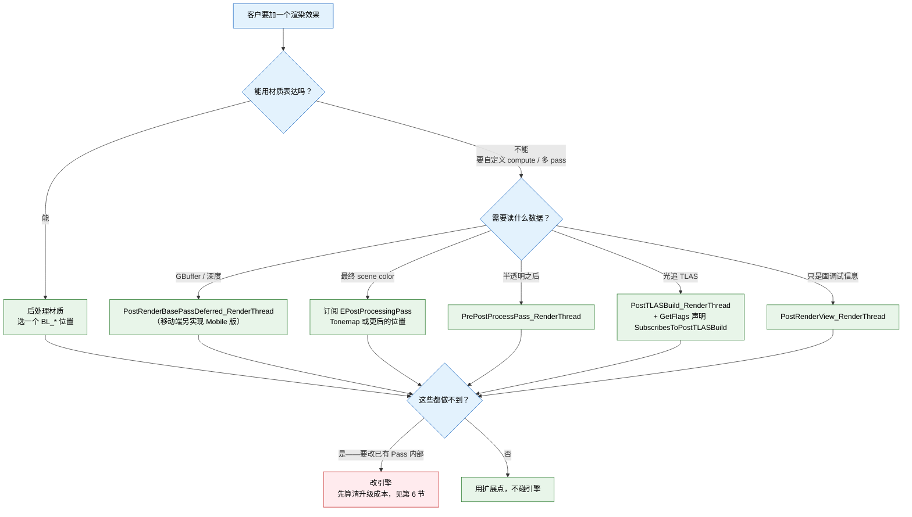

# UE 5.8 渲染管线定制扩展点 — 知识卡片

> **验证状态**：本文档全部 hook 点签名、枚举值、注册 API 逐条取自 UE 5.8.0 源码
> `Engine/Source/Runtime/Engine/Public/SceneViewExtension.h` 与
> `Engine/Source/Runtime/Engine/Classes/Engine/BlendableInterface.h`，含引擎自己的注释原意。
> 校验：`python scripts/verify-ue-rendering-refs.py`

客户说「我要在渲染管线里加一个自己的 Pass」时，第一个要回答的不是「怎么写 shader」，
而是**在哪一层接进去**。这份文档就管这件事。

## 目录

| 节 | 内容 |
|---|---|
| [1. 三条路的选择](#1-三条路的选择) | 改引擎 / 扩展点 / 后处理材质——决策表 |
| [2. ISceneViewExtension 全部 hook 点](#2-isceneviewextension-全部-hook-点) | 21 个虚函数，按调用时机排 |
| [3. 注册与生命周期](#3-注册与生命周期) | `NewExtension` / 引用保持 / 逐帧开关 / 优先级 |
| [4. 订阅后处理链](#4-订阅后处理链) | `EPostProcessingPass` 11 个位置及与后处理材质的对应 |
| [5. 后处理材质（不写 C++ 的路）](#5-后处理材质不写-c-的路) | `EBlendableLocation` 全部位置 |
| [6. 改引擎的代价与纪律](#6-改引擎的代价与纪律) | 上游合并、可维护性、什么时候值得 |
| [7. 选点决策树](#7-选点决策树) | 需求 → 该用哪个 hook |

---

## 1. 三条路的选择

| 路径 | 能做什么 | 代价 | 什么时候选 |
|---|---|---|---|
| **后处理材质**（Post Process Material） | 在固定的若干位置对 scene color 做逐像素处理 | 最低。美术就能做，不写 C++，不碰引擎 | 效果能用材质表达、且落在某个 blendable 位置上 |
| **`ISceneViewExtension`** | 往管线的 21 个时机点插入任意 RDG Pass，读写 GBuffer / scene color / 自定义 RT | 中。要写 C++ 插件，但**不改引擎** | 绝大多数「加一个自定义 Pass」的需求 |
| **改引擎** | 任何事 | 最高。每次升级都要重新合并，且客户的引擎从此是分叉的 | 前两条都做不到时——通常是要改已有 Pass 的内部行为，而不是加新 Pass |

**给客户的第一句话应该是**：先确认需求能不能用 `ISceneViewExtension` 表达。它是引擎官方为
「第三方往渲染管线插东西」准备的接口，21 个 hook 点里有 15 个直接拿到 `FRDGBuilder&`，
也就是可以直接注册 RDG Pass。绕过它去改引擎，往往是不知道它存在。

---

## 2. `ISceneViewExtension` 全部 hook 点

声明在 `Engine/Source/Runtime/Engine/Public/SceneViewExtension.h`。按调用时机排。
「线程」一列很关键——game thread 上的钩子不能碰 RDG，render thread 上的不能碰 UObject。

### 2.1 Game thread（准备阶段）

| Hook | 时机（引擎注释原意） |
|---|---|
| `SetupViewFamily(FSceneViewFamily&)` | 创建 view family 时 |
| `SetupView(FSceneViewFamily&, FSceneView&)` | 创建 view 时 |
| `SetupViewPoint(APlayerController*, FMinimalViewInfo&)` | 创建视点、剔除之前——外部追踪设备要改视图基准位置时用 |
| `SetupViewProjectionMatrix(FSceneViewProjectionData&)` | 创建 view 时，非立体设备要改投影矩阵时用 |
| `BeginRenderViewFamily(FSceneViewFamily&)` | view family 即将被渲染时 |
| `PostCreateSceneRenderer(const FSceneViewFamily&, ISceneRenderer*)` | scene renderer 创建之后 |

### 2.2 Render thread（渲染阶段，拿 `FRDGBuilder&`）

| Hook | 时机 |
|---|---|
| `PreRenderViewFamily_RenderThread(FRDGBuilder&, FSceneViewFamily&)` | 渲染开始处 |
| `PreRenderView_RenderThread(FRDGBuilder&, FSceneView&)` | 渲染开始处，逐 view，在 `PreRenderViewFamily_RenderThread` 之后 |
| `PreInitViews_RenderThread(FRDGBuilder&)` | InitViews 之前 |
| `PreRenderBasePass_RenderThread(FRDGBuilder&, bool bDepthBufferIsPopulated)` | BasePass 之前。`bDepthBufferIsPopulated` 表示深度缓冲是否已被写过 |
| `PostRenderBasePassDeferred_RenderThread(FRDGBuilder&, FSceneView&, const FRenderTargetBindingSlots&, TRDGUniformBufferRef<FSceneTextureUniformParameters>)` | **延迟渲染器**的 BasePass 刚结束——拿到 GBuffer 绑定和 scene texture uniform buffer |
| `PostRenderBasePassMobile_RenderThread(FRHICommandList&, FSceneView&)` | **移动渲染器**的 BasePass 刚结束。注意这个给的是 `FRHICommandList&` 不是 RDG |
| `PostTLASBuild_RenderThread(FRDGBuilder&, FSceneView&)` | 光追 TLAS 构建完成之后 |
| `PrePostProcessPass_RenderThread(FRDGBuilder&, const FSceneView&, const FPostProcessingInputs&)` | 后处理开始之前 |
| `PrePostProcessPassMobile_RenderThread(FRDGBuilder&, const FSceneView&, const FMobilePostProcessingInputs&)` | 移动渲染器的后处理开始之前 |
| `PostRenderViewFamily_RenderThread(FRDGBuilder&, FSceneViewFamily&)` | 3D 内容之后——引擎注释说适合调试用途 |
| `PostRenderView_RenderThread(FRDGBuilder&, FSceneView&)` | 同上，逐 view |

**延迟 / 移动两套要分别实现**：`PostRenderBasePassDeferred_RenderThread` 与
`PostRenderBasePassMobile_RenderThread` 是两个不同的函数，且后者拿的是 `FRHICommandList&`。
只实现延迟版本，移动端就静默不生效——这是跨平台项目最容易踩的一个。

### 2.3 控制类

| Hook | 作用 |
|---|---|
| `GetPriority()` | 决定多个 view extension 的相对顺序，**数值大的先执行** |
| `IsActiveThisFrame(const FSceneViewExtensionContext&)` | 返回 false 则本帧整个扩展不参与。**每帧都会查** |
| `IsActiveThisFrame_Internal(const FSceneViewExtensionContext&)` | 当没有 IsActive functor 给出确定答案时的兜底 |
| `GetFlags()` | 返回 `ESceneViewExtensionFlags`：`SubscribesToPostTLASBuild`（要用 TLAS 钩子必须声明）/ `RequiresHardwareInlineRayTracing` |
| `SubscribeToPostProcessingPass(...)` | 订阅后处理链上的具体位置，见第 4 节 |

`GetFlags()` 里的 `SubscribesToPostTLASBuild` 是个隐藏契约：**只实现
`PostTLASBuild_RenderThread` 不够，还必须在 `GetFlags()` 里声明这个 flag**，否则钩子不会被调用。

---

## 3. 注册与生命周期

继承 `FSceneViewExtensionBase`（不要直接继承 `ISceneViewExtension`），用工厂注册：

```cpp
// 头文件
class FMyViewExtension : public FSceneViewExtensionBase
{
public:
    FMyViewExtension(const FAutoRegister& AutoRegister, /* 你的参数 */);

    virtual void PostRenderBasePassDeferred_RenderThread(
        FRDGBuilder& GraphBuilder,
        FSceneView& InView,
        const FRenderTargetBindingSlots& RenderTargets,
        TRDGUniformBufferRef<FSceneTextureUniformParameters> SceneTextures) override;

    virtual int32 GetPriority() const override { return 0; }
    virtual bool IsActiveThisFrame_Internal(const FSceneViewExtensionContext& Context) const override;
};

// 注册处（通常是模块 StartupModule 或某个 subsystem）
TSharedRef<FMyViewExtension, ESPMode::ThreadSafe> MyExtension;
MyExtension = FSceneViewExtensions::NewExtension<FMyViewExtension>(/* 你的参数 */);
```

**引擎注释里写明的两条生命周期规则**：

1. **必须自己保住引用**——`NewExtension` 返回的 `TSharedRef` 要存成成员变量。引用一出作用域，
   扩展就注销。这是设计成这样的：清理自动且安全。
2. 引擎会把扩展**多留一帧**，让 render thread 上正在跑的工作能安全收尾。

派生类还有两个现成的：`FWorldSceneViewExtension`（绑定到某个 world）和
`FHMDSceneViewExtension`（HMD 场景）。要限定作用范围时先看这两个能不能直接用。

---

## 4. 订阅后处理链

`SubscribeToPostProcessingPass` 让你在后处理链的具体位置插回调。位置枚举
`EPostProcessingPass` 定义在 `SceneViewExtension.h` 里，11 个：

| `EPostProcessingPass` | 对应的后处理材质位置 | 备注 |
|---|---|---|
| `BeforeDOF` | `BL_SceneColorBeforeDOF` | |
| `AfterDOF` | `BL_SceneColorAfterDOF` | |
| `TranslucencyAfterDOF` | `BL_TranslucencyAfterDOF` | |
| `SSRInput` | `BL_SSRInput` | |
| `ReplacingTonemapper` | `BL_ReplacingTonemapper` | 以下位置**可能是最后一个 Pass**，因此能拿到有效的 `OverrideOutput` render target |
| `MotionBlur` | `BL_SceneColorBeforeBloom` | 同上 |
| `Tonemap` | `BL_SceneColorAfterTonemapping` | 同上 |
| `FXAA` | — | 同上 |
| `SMAA` | — | 同上 |
| `VisualizeDepthOfField` | — | 同上 |
| `MAX` | — | 计数用，不是有效位置 |

两件事值得记住：

- **枚举顺序 = 后处理链顺序**，所以想插在「Bloom 之前」就订阅 `MotionBlur`（它对应
  `BL_SceneColorBeforeBloom`）。名字和实际语义不完全一致，看右边那一列更准。
- 引擎注释明确指出：从 `ReplacingTonemapper` 往后的位置**有可能是链上最后一个 Pass**，
  这时 `OverrideOutput` 才是有效的 render target。想替换整条链的最终输出，只能在这几个位置。

---

## 5. 后处理材质（不写 C++ 的路）

如果效果能用材质表达，`EBlendableLocation`（`Engine/Source/Runtime/Engine/Classes/Engine/BlendableInterface.h`）
给了这些位置。美术在后处理体积里挂材质即可，零 C++：

| `EBlendableLocation` | 值 | 显示名 |
|---|---|---|
| `BL_SceneColorAfterTonemapping` | 0 | Scene Color After Tonemapping |
| `BL_SceneColorAfterDOF` | 1 | Scene Color After DOF |
| `BL_SceneColorBeforeDOF` | 2 | Scene Color Before DOF |
| `BL_ReplacingTonemapper` | 3 | Replacing the Tonemapper |
| `BL_SSRInput` | 4 | SSR Input |
| `BL_TranslucencyAfterDOF` | 5 | Translucency After DOF |
| `BL_SceneColorBeforeBloom` | 6 | Scene Color Before Bloom |

枚举里还有 `BL_BeforeTranslucency` / `BL_BeforeTonemapping` / `BL_AfterTonemapping` 三个旧名，
是为兼容早期资产保留的别名。新做的东西用上表里带显示名的那批。

`BL_SceneColorBeforeDOF` 的引擎注释说明了一个容易忽略的点：它**总是在渲染分辨率上跑**，
输入输出都在线性色彩空间，`Input0` 是上一 Pass 的 scene color（不含 AfterDOF 半透明），
`Input1` 是 AfterDOF 半透明。做需要精确控制输入的效果时要看清这些。

---

## 6. 改引擎的代价与纪律

客户如果已经在改引擎（做「引擎项目底层优化」的项目多半如此），有几件事要先问清：

| 要问的 | 为什么 |
|---|---|
| 引擎是源码版还是从 Perforce/Git 拉的分支？ | 决定他们怎么拿上游更新 |
| 现有改动有没有集中在少数文件？ | 分散的改动每次升级都是重新做一遍 |
| 有没有把改动整理成 patch / 独立模块？ | 能整理成插件的部分应该搬出引擎 |
| 目标引擎版本升级节奏？ | 决定「改引擎」这笔债多久还一次 |

**判据**：一个需求如果能用 `ISceneViewExtension` + 后处理材质表达，就不该改引擎——
不是因为改引擎难，是因为**每次引擎升级都要付一次成本**，而扩展点不用。

真的必须改引擎的典型情形：要改已有 Pass 的**内部**行为（比如改 BasePass 的 GBuffer 布局、
改 Lumen 的追踪逻辑），扩展点只能在 Pass 之间插入，改不到 Pass 内部。

改了之后的纪律：把改动尽量收拢到少数文件、每处加可搜索的标记注释、维护一份改动清单
（文件 + 为什么改 + 上游对应版本），这样升级时才知道要重新合什么。

---

## 7. 选点决策树



主线：**从最外层往内选**。材质能做就别写 C++，扩展点能做就别改引擎。真要改引擎时，
第 6 节那张表先问一遍。

---

## 关联

- [`card-08-rdg.md`](card-08-rdg.md) —— 拿到 `FRDGBuilder&` 之后怎么写 Pass（资源声明、Barrier、参数结构体、常用 Hook 点）
- [`card-01-pipeline-overview.md`](card-01-pipeline-overview.md) —— 这些 hook 点在整条管线里的位置
- [`card-03-debugging.md`](card-03-debugging.md) —— 插进去之后不生效时怎么查
- [`card-13-verify-locally.md`](card-13-verify-locally.md) —— 本机核证：怎么自己确认某个 hook / 符号在客户那个版本存不存在
