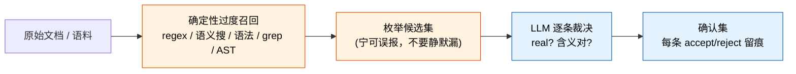

# Enumerate-Then-Adjudicate：先机械枚举候选，再让 LLM 逐条裁决

## 核心规则

需要"找全某类东西的所有实例"时（所有 caller / 所有引用 / 所有违规点 / 所有待迁移 site / 所有实体 / 所有日期），**不要**把整份文档丢给 LLM 让它"找全 X"。改成两段：

1. **确定性方法过度召回**——先用 regex / 语义搜 / 语法 / grep / AST 查询把候选**枚举**出来，宁可误报，不要静默漏。
2. **LLM 逐条裁决**——把枚举出的候选做成显式 worklist，让 LLM 对**每一条**判"是不是真的、含义对不对"，accept / reject 各自留痕。

这样把"无界、不可见的漏"换成"有界、可量化的漏"。

## 为什么"找全"是 agent 的静默失败模式

让 LLM 直接"find all X"有一个**看不见**的失败模式：它漏掉的实例**不留任何痕迹**。

- non-event 无法审计——你永远不知道它没返回什么。
- 它有时返回得比实际少，而且是 non-deterministic 的，没有任何信号提示"这里少了"。
- "它找全了吗？"这个问题**根本不可回答**。

对比之下，机械枚举出的候选集是**有限、可枚举、可逐条 inspect** 的——LLM 不再能静默省略，每个候选都在 worklist 上必须被处置，漏掉变成一次显式的 reject（留痕），而不是一次无声的消失。

## 流程

关键是**反转信任顺序**（有点反直觉）：先让老派的确定性机械把问题变成有限、显式的，**再**请 LLM 来做它真正擅长的——在一个它无法悄悄跳过的枚举集上做判断。前置约束 LLM，正是它输出可信的原因。

## 为什么这是可信 check（对上四要素）

对照 [`adversarial-verification.md`](adversarial-verification.md) 的 MFIC 四要素：

- **Mechanically**——召回由机器穷举保证，不靠 LLM 的注意力或采样。要考虑的集合是**被生成的**，不是"被注意到的"。
- **Falsifiable / 逐条可审计**——"找全了吗"（不可答）变成"这里有 N 个候选，每个都有 accept / reject 裁决"（完全可查）。
- **Independent**——prefilter 与 LLM 的失败模式解耦：regex 会过度召回但不会悄悄跳过它本该匹配的形态；LLM 会拒掉误报但再也藏不住一个漏。组合体拿到 prefilter 的召回 + LLM 的精度，两套不同机制互不替代。

## 诚实的限制（也是真正的收益）

组合体**只能找到 prefilter 捞出来的东西**——prefilter 漏掉的候选，LLM 永远看不到，所以召回被 prefilter **封顶**，不是被 LLM 提高。

但这恰恰是收益所在：prefilter 的召回是一个**可测量、可刻画的数**（拿 labeled corpus 跑、或用 input-mutation 量化），而"LLM 到底找全没有"根本无从测量。你未必提高了召回，但你把一个**无界、不可见**的失败，换成了一个**有界、可量化**的失败。永远优先选那个你能给出一个数的失败模式。

## 何时用 / 何时不用

| 用 | 不用 |
|---|---|
| "找全所有 X"，且**漏掉不可见**（找全 caller / 引用 / 违规点 / 待迁移 site / 实体 / 日期 / 引文）| 候选集天然有界且很小——直接读完就行 |
| 要对每个 Y 做审计式判断（每条都要 accept / reject 留痕）| 任务是判断**单个已知对象**，不是"找全" |
| 有可用的确定性 prefilter（哪怕召回不完美，只要可测）| 没有任何确定性 prefilter 可用，且漏报本身可接受 |

## 具体做法

1. **选 prefilter**——按"X 已知的形态"选：已知文本形态用 regex（如法律引文工具 *eyecite* 就是先匹配已知引文形态）；易出现的区域用向量 / 语义搜；结构化的用语法 / classical parser / AST 查询；代码里找用途用 grep 关键字 + 继承图。
2. **让它过度召回**——刻意接受误报，以换取"不静默漏报"。
3. **把候选做成显式 worklist**——每条一个待处置项。
4. **LLM 逐条裁决**——real? 含义对? → accept / reject，每条留痕。
5. **（可选）量化 prefilter 的召回**——拿 labeled corpus 或 input-mutation 给出一个覆盖率数字，让"漏"变得有界可报。

## 反方向的同一骨架：生成类任务（读一个仓库写文档）

前面讲「找全某类东西」。反方向是**要产出一份新东西**（README / 项目说明 / 迁移报告）而模型手上没有事实——于是它**望文生义**：按目录名猜职责、没有 LICENSE 就默认写 MIT、看到最近提交时间就写「活跃维护中」。跟「找不全」是同一种静默失败：**读起来完全合理，没人会去质疑。**

| 本 pattern | 生成类任务里的形态 |
|---|---|
| prefilter 过度召回 | 机械采集**事实清单**：清单文件 / 依赖 / 目录树 / CI / 许可证 / 入口线索 / git 事实。宁可多采 |
| LLM 逐条裁决 | 每条事实判「进不进这份文档、放哪一节」；采集摘要里没有的版本号 / 端口 / 命令 / 路径**不写** |
| 召回被 prefilter 封顶 | 采集器采不到的模型看不到 ⇒ 差额做成**显式产出**：文末一份「待确认」清单，每项注明「需要谁确认什么」 |

最后一行是本 pattern 主体没写到的一条：**prefilter 封顶召回时，把差额做成显式出口，而不是让它静默消失。** 主体只说「召回上限 = prefilter，功夫花在 prefilter 上」；这里给出第二条路——**承认上限，并把上限之外的东西变成一份可交给人的清单**。比提高 prefilter 召回便宜，而且它把「模型不知道」从不可见变成可见。

⚠️ 一条容易漏的红线：**git 只给了最近提交时间 ⇒ 不得据此写「项目活跃维护中」**。这是 [`../guidelines/code/reporting-limits-and-null-results.md`](../guidelines/code/reporting-limits-and-null-results.md) 规则 4 的实例——提交时间的机制预测不了「维护状态」。

**外部实现指针（未复制进本仓库）**：`scripts/repo_digest.py` + `references/repo-readme-generation.md`，见 [gzhanlei/tech-doc-style-chinese](https://github.com/gzhanlei/tech-doc-style-chinese)（MIT，衍生自 [Fenng/Tech-Doc-Style-Chinese](https://github.com/Fenng/Tech-Doc-Style-Chinese)）。零依赖 Python，采不到的一律输出「未检测到」；**2026-08-21 在本仓库实测跑通，没有编造**。不复制进来的理由：本仓库不生成 README，引入 552 行第三方代码要跟上游同步，真要用时一条 `curl` 就够。

## 跟 iterative-retrieval 的区别

[`coordination-patterns.md`](coordination-patterns.md) 的 iterative-retrieval 是"worker 自己迭代 fetch 上下文"——探索**未知的文件集**，扩大搜索面。本 pattern 相反：先用机械方法把候选集**定死、收窄、枚举**，再逐条判。两者互补——探索阶段可以 iterative-retrieval 把范围摸出来，一旦要"列全某个 X 的清单"就切到 enumerate-then-adjudicate。

## Anti-Patterns

| 反 pattern | 为什么错 | 修法 |
|---|---|---|
| 把整份文档丢给 LLM 让它"找全 X" | 漏掉的实例不留痕、不可审计、non-deterministic | 先机械枚举候选，再逐条裁决 |
| prefilter 追求精确、宁缺毋滥 | 漏报=静默失败，正是要消除的那种 | prefilter 刻意过度召回，把去误报交给 LLM |
| 候选不落成显式 worklist，让 LLM"顺手都看看" | LLM 又能静默跳过 | 每个候选是必须处置的一项，reject 也要留痕 |
| 声称"覆盖了全部"但不给数 | 不可证伪的空话 | 用 labeled corpus / input-mutation 给召回一个数 |
| 忘了 prefilter 封顶召回，以为 LLM 会补漏 | LLM 看不到 prefilter 没捞的东西 | 明确"召回上限=prefilter"，把功夫花在 prefilter 的召回上 |

## 项目实例参考

本 pattern 提炼自 pmarreck 的 [MFIC — Mechanically-Falsifiable Independent Control](https://gist.github.com/pmarreck/b30aa3ca69cb70a5526f8a63ab8c8d7e)（Section 2 例 2），essay 里给的真实世界例子是 *eyecite*（法律引文先按已知形态匹配再判定）。**已在本机项目完整验证一轮**（2026-07-30，见下「完整验证」小节）：一个真实的「找全所有不存在的 API 名」任务，prefilter 的假阴性可标定、逐条裁决确实堵住了静默漏，且暴露出原文没覆盖的四条（按类型分桶、假阴性要有对照组、反面教材要能排除、裁决率高时改生成）。

一个**相关但非完整**的本机落地（2026-07，某 C++ 渲染器项目 CRAP 评测）：top-N 高危函数的「机械枚举候选 → 逐条 accept/reject 留痕」正是本 pattern 的形态——但那里的枚举本身是完整的（lizard 全量列出所有函数），没触及本 pattern 最难的「漏掉不可见」那一面，所以只算部分印证「逐条裁决防静默跳过」，**不算**验证「prefilter 召回封顶」。详见 [`../guidelines/code/complexity-coverage-metrics.md`](../guidelines/code/complexity-coverage-metrics.md)。

### 完整验证：审计生成式参考资料（2026-07-30，`references/ue-rendering/` 渲染知识库）

一批约 29 万字符的 UE 渲染知识库，内容混有自动化调研产物。要回答的问题正是本 pattern 的形状：
「里面**所有**不存在的 API 名 / 文件路径 / CVar 名，找全」。直接让模型读一遍找是不可能的——
编造出来的名字（`NaniteRendering.cpp`、`r.VisualizeBuffer`、`FGPUCrashDebugging`）**读起来
完全合理**，人和模型都发现不了。

做法与结果：

| 步骤 | 做法 | 结果 |
|---|---|---|
| prefilter（机械枚举） | 正则从文档抽出全部反引号断言，按类型分三桶 | 路径 239 / CVar 431 / 符号数百条 |
| 判官（独立 oracle） | 拿引擎源码建索引，逐条判「存在 / 存在但写法不对 / 不存在」 | 判官是引擎源码，不是写文档的人 |
| 逐条裁决 | 每条不存在的都要处置：换真名、或改写、或标为反面教材 | 路径 79→0，CVar 163→0，符号 70→0 |

从这轮跑出来的、原文没写到的四条：

1. **断言要按类型分桶枚举，一类一个 prefilter。** 路径、CVar 名、符号名是**三条互相独立**的
   编造轴——校验了路径不等于覆盖了符号，实测出现过「文件真、符号假」的组合（源码导航表里
   路径对但那一列的类名不存在）。只做一轴会得到「已清零」的假象。

2. **prefilter 的假阴性要单独标定，且必须有对照组。** 本轮踩到两次：一次是索引只扫了
   `Engine/Source/` 漏掉 `Engine/Plugins/`；一次是引擎分发裁掉了 `Engine/Source/Programs/`。
   识别信号是**对照组也失败**——拿几个确定存在的名字一起查，它们必须全部命中；全都不命中时
   坏的是方法不是被测对象（实测踩过：shell 里未加引号的引擎路径被目录名中的空格拆开，
   grep 静默返回空，于是所有名字包括对照组都「不存在」）。

3. **反面教材要能从统计里排除。** 文档会**故意**写出不存在的名字（「这些名字调研稿里有但引擎里
   没有」的对照表）。没有排除机制，gate 就会长期报固定数量的「缺陷」，而一个永远非零的 gate
   等于训练人忽略它。本轮的做法是显式标记（`<!-- verify:ignore-start/end -->`）+ 一份需写明
   理由的允许清单。

4. **裁决率高到一定程度时，改「生成」比改「裁决」划算。** 一份文档 95 条 CVar 断言里 58 条不存在
   （61%）时，逐条修的成本高于直接从源码重新生成整张表，而且修完仍不知道漏没漏。改成生成后
   还多一层保障：**生成器遇到不存在的名字直接报错退出**，于是「表里混进假名字」这件事在结构上
   不可能发生。判据是裁决率——低（如 15%）就逐条修，高（如 60%）就重生成。

## 相关 Guidelines / Techniques

- [`techniques/adversarial-verification.md`](adversarial-verification.md) —— "选可信 check：四要素 + oracle 判据"，本 pattern 是其一个具体落地
- [`techniques/coordination-patterns.md`](coordination-patterns.md) —— iterative-retrieval（探索未知文件集），跟本 pattern 互补
- [`guidelines/code/validation.md`](../guidelines/code/validation.md) —— "看代码对 ≠ 验证"；"让 LLM 找全" 的静默漏是同类自欺的一种
- [`guidelines/workflow/knowledge-promotion.md`](../guidelines/workflow/knowledge-promotion.md) —— 外部来源、未在项目验证的内容，落地时的态度
