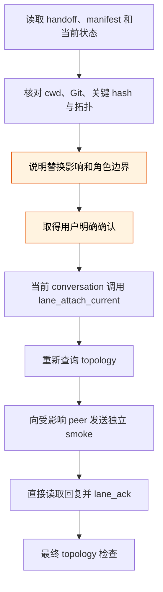
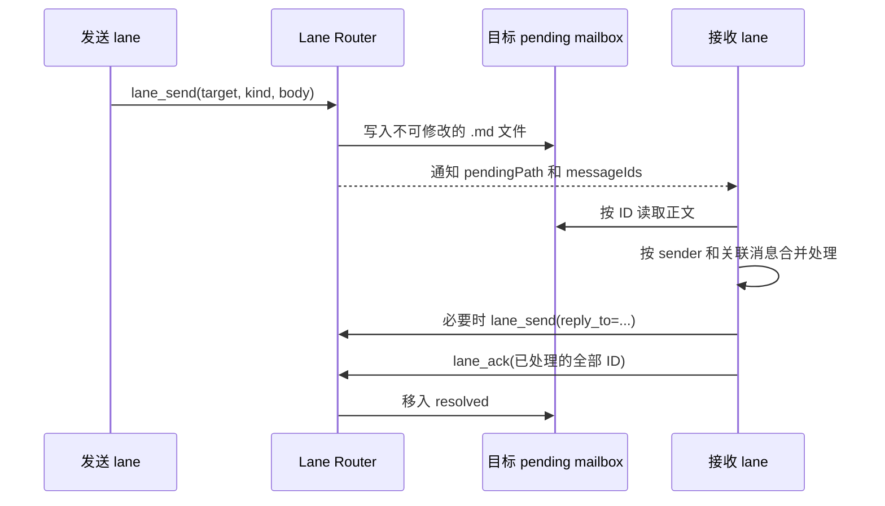

# Lane Router 使用手册

Lane Router 让同一台可信机器上的长期 Claude/Codex 对话以稳定地址互相投递消息，并在目标对话可用时通知它处理持久 mailbox。它解决的是 lane 的绑定、投递和唤醒；如何划分角色、设计 seam contract 和选择 coordinator，仍以 [`role-lane-coordination`](../skills/collaboration/role-lane-coordination/SKILL.md) 为准。

## 术语表

| 术语 | 含义 |
|---|---|
| lane | 持久的角色和上下文边界，地址形如 `<project>/<lane>`；它不是一次性 task。 |
| binding | lane 当前对应的 Claude conversation 或 Codex thread。 |
| mailbox | 每条 lane 的持久消息目录，分为 `pending` 和 `resolved`。 |
| notification | 只携带 lane 地址、`pendingPath` 和 message ID 的唤醒索引；它不包含消息正文。 |
| correction | 通过新消息修正旧消息，并用 `reply_to` 保留关联；它不会改写已经落盘的原消息。 |

## 安装与启动

前提是 Node.js `>=22.12`，并且 Lane Router 仓库已经构建。首次安装或仓库更新后，在 `<lane-router-repo>` 中运行：

```powershell
npm ci
npm run build
npm link
```

### Codex

在希望作为新 thread 工作目录的项目目录中运行：

```powershell
lane-router-codex
```

恢复已有 thread 时运行：

```powershell
lane-router-codex resume <thread-id>
```

launcher 会按需启动 Router process，并把 stock Codex TUI 连接到本地 adapter。不要手动启动 Router、固定它的 PID/端口，或把历史 discovery 值写进脚本。新 thread 使用调用 `lane-router-codex` 时的当前目录；`resume` 保留原 thread 的工作目录。

### Claude Code

把构建产物注册为 user-scope MCP，其中 `<lane-router-repo>` 必须展开成当前机器上的绝对路径：

```powershell
claude mcp add --scope user lane -- node "<lane-router-repo>\dist\mcp\lane-mcp-server.js"
claude mcp get lane
claude mcp list
```

普通 `claude` 可以调用四项 Lane Router tools。需要 Channel 在没有用户输入时自动唤醒 lane，Claude Code 2.1.220 使用：

```powershell
claude --dangerously-load-development-channels server:lane
```

自定义 Channel 当前是 research preview；首次启动需由用户确认 local development warning。不要使用旧的 `--channels server:lane` 写法。

Claude 的 user-scope MCP 保存的是 `dist` 的绝对路径。仓库移动、`dist` 尚未构建或构建产物被清理后，配置会失效；重新 build，并用 `claude mcp get lane` 检查连接。Codex 命令缺失时先运行 `Get-Command lane-router-codex`，再检查 `npm link` 是否仍指向当前构建。

## 四项对话工具

| 工具 | 用途与约束 |
|---|---|
| `lane_directory(project)` | 只读列出同 project 的 lane 和角色说明；无需用户确认。拓扑变更前先调用它，优先复用职责匹配的 lane。 |
| `lane_attach_current(address, role_description?)` | 创建、接替、轮换 lane 或修改角色说明。调用前必须在普通对话中解释拓扑变化并取得用户明确确认；不要添加机械式 `confirmed` 参数。接替现有 lane 且不改角色时省略 `role_description`。 |
| `lane_send(target, kind, body, reply_to?)` | 向目标 `pending` mailbox 写入不可修改的消息。普通消息用 `normal`；修正旧消息用 `correction` 并以 `reply_to` 指向原 message ID。 |
| `lane_ack(message_ids)` | 当前 lane 完成处理后，批量把每个已处理 ID 从 `pending` resolve。未完成、未理解或仍需重试的消息不要提前 ack。 |

lane 是长期 role/context 边界，不要为每个临时 task 创建一条 lane。创建、接替、轮换和修改 `role_description` 都是持久拓扑变化；先查目录、提出具体建议、取得确认，再 attach。当前 conversation 已绑定另一条 active lane 时，Router 会拒绝隐式换绑。

### 接替与轮换的闭环检查

计划让当前 conversation 接替已有 lane 时，不能只看地址存在就直接 attach。接替或轮换采用下面的闭环；只操作当前 conversation，绝不代表另一条 conversation 调用 `lane_attach_current`。



smoke 回复至少回显原 dispatch ID、当前工作目录、handoff/SoT hash 和理解到的角色边界；smoke 本身不得顺手实现功能。保留每个 reply ID，逐条读完并 ack，不能把多条回复压成无法追溯的一句“都正常”。

### 自动轮换 conversation

上下文过长、但 lane 的长期角色仍然有效时，先在旧 conversation 说明同地址接替的影响并取得用户明确确认，再让旧 agent 写精简 handoff 并调用：

```powershell
lane-router-rotate <codex|claude> <lane-address> --handoff-file <absolute-path> [--terminal <wt|powershell|cmd>]
```

handoff 文件必须位于 `~/.lane-router/rotation-handoffs/`，使用 UUID `.md` 文件名。新 conversation 只接替完全相同的地址并省略 `role_description`；恢复 cwd、Git 状态、批准范围、验证证据和 pending mailbox 后先报告就绪，不自行推进新功能。launcher 返回成功只证明新 terminal 已创建，必须等新 conversation 报告 attach 成功后，才能关闭旧 terminal 或把轮换记为完成。

Windows 上创建交互式独立 terminal 时，不要把 Node `spawn` 的 `spawn` 事件当作窗口可见且持续存在的证据。真实验证表明，直接 `spawn` PowerShell 并设置 `detached: true` 可以先报告成功、随后立刻退出，既没有窗口也没有启动目标 CLI。Lane Router 因此通过 PowerShell `Start-Process -WindowStyle Normal` 创建可见 terminal；若轮换没有窗口，检查实际进程链应为 `PowerShell → terminal-child → lane-router-codex/claude`（terminal child 旧名 `rotation-terminal-child`，2026-08-18 泛化为三条开窗命令共享），不要只看 launcher 退出码。

### 打开与新建 lane

lane 收到用户"打开某已有 lane / 新建某 lane"的指令时，不要自己拼 terminal 与 CLI 启动方式，调用统一命令：

```powershell
lane-router-lane new  <project>/<lane> --role "<角色说明>" [--backend claude] [--cwd <dir>] [--terminal <wt|powershell|cmd>]
lane-router-lane open <project>/<lane> [--cwd <dir>] [--terminal <wt|powershell|cmd>]
```

- 调用方不需要知道目标 lane 是什么 agent：`open` 从 Router 的 binding 记录读出 backend 与 conversation id。当前只支持 claude；codex 报"暂不支持"，可手动 `lane-router-codex resume <thread-id>`。
- **`new` 是拓扑变更**：调用方 conversation 必须先在对话中说明并取得用户明确确认，再调命令——与 `lane_attach_current` 的政策一致，命令不设机械式 confirm 参数。命令开出新 terminal，bootstrap prompt 指示新对话读 AGENTS.md、查目录、带 `role_description` attach、报告就绪后等待指令。地址已存在时报错并提示改用 `open`。`--cwd` 默认取调用命令时的目录。
- **`open` 只恢复离线 lane**：目标在线（channel 仍开着）时拒绝；lane 不存在提示走 `new`；lane 存在但无 active binding 提示走轮换流程——`open` 不会顺手升级成接替。恢复在 Router 记录的工作目录进行（该记录由 lifecycle hook 随每次 turn 上报），Router 没有记录时要求显式 `--cwd`。恢复后 channel 重连，pending 通知会自动重发。
- 三条开窗命令（`lane-router-lane new` / `lane-router-lane open` / `lane-router-rotate`）都遵循同一验证纪律：窗口开了不算成功，等新窗口里的 CLI 真启动、launcher 退出 0 才算。

`--terminal` 三档通用，默认 `wt`：`wt` 强制 Windows Terminal 窗口（机器缺 wt 时默认档静默回退 `powershell`，显式传 `wt` 则报错）；`powershell` / `cmd` 只定 shell，窗口宿主由系统默认决定——Win11 或配置过 console delegation 的 Win10 机器上同样出 Windows Terminal 窗口。

## 收发主流程



收到 notification 后按以下顺序处理：

1. 先确认该 ID 对应的文件仍在 `pendingPath`，再直接读取 `.md`；不要从 notification 猜正文，也不要等待不存在的 `lane_receive`。已经 ack 的 ID 即使被旧 notification 再次提到，也不是新任务。
2. 核对消息头中的 `sender`、`kind` 和 `reply_to`。同一 sender 或同一修正链的消息可在一个 turn 中一起处理。
3. 完成消息要求的实际工作。跨 lane 回报应附证据、文件路径、验证结果和明确请求，不只发送结论。
4. 需要回复时用 `lane_send`；回复具体消息时填写 `reply_to`。
5. 最后用一次 `lane_ack` 覆盖本轮真正处理完成的每个 message ID。ack 是通信层的“已处理”，不是项目 worklog 或 durable result 的替代品。

notification 可以重复，直到对应 ID 被 ack。只在对话里说“已处理”不会改变 mailbox 状态；它会造成同一 ID 反复提醒。重复轮询也不要重复向用户报告同一个状态变化。

### 消息到达繁忙或离线 lane 时

- `normal` 不应打断正在运行的 turn。目标空闲或当前 turn 结束后再处理。
- Codex 收到 `correction` 时可以 steer 当前 turn；Claude Channel 没有等价原语，只能把 correction 排到下一 turn。Claude 侧不得声称当前 turn 已被改变。
- 目标离线时消息保持 `pending`。恢复原 session/thread 后会再次获得处理机会；系统提供至少一次提醒，不保证 exactly-once，因此只有完成处理后才 ack。

## 单向投递与双向协作

- 只需要把材料交给另一条 lane、发送方不等待结果时，单向 `lane_send` 即可；接收方离线不会丢消息。
- 需要可靠往返时，双方都应是已绑定、可恢复和可唤醒的持久 lane。V1 的 `lane_send` 要求发送方已有 active binding；不要把一次性临时对话伪装成永久 role，也不要把未绑定对话当成可靠回复地址。
- 多条 lane 的结果必须汇合时，只让一个 coordinator lane 持有共享接线和最终综合职责。发送给 coordinator 的 brief 要区分已验证事实与假设，并附 oracle 或原始输出。

## 状态必须绑定证据

`lane_directory` 只能证明 topology、角色说明和 binding，不能证明某条 lane 正在采样、编辑、测试、阻塞或空闲。没有 fresh evidence 时明确说“没有新证据”，不要把 UI 沉默、短时间未回复或 coordinator 的记忆写成活动状态，也不要仅因此唤醒或改派；先尊重已经约定的 ETA/timebox。

| 状态词 | 最低证据 |
|---|---|
| dispatched | Router 已接受消息，并返回 dispatch message ID。 |
| pending | 对应 ID 仍在目标 `pending`；这不等于目标正在工作。 |
| acknowledged | `lane_ack` 已 resolve 对应 ID。 |
| working | 有新的显式状态回复、相关 diff/status、运行进程或其他当前活动证据。 |
| offline-green | 约定的 focused tests 已通过，但尚未证明部署或 live 行为。 |
| deployed | 精确 artifact 已复制，来源与目标 hash 已核对。 |
| live-started | 目标进程或 runtime root 已确认存在；尚未证明终端验收通过。 |
| live-passed | 终端 acceptance evidence 已取得，并明确对应的运行/产物根目录、确切命令、commit/hash、完整 unit/episode 数与适用的安全计数；打开或继续旧状态、只完成局部步骤都不算。 |
| production-ready | 当前生产证据 gate 全部通过；必须列出 gate，不能由某个较低状态推断。 |

不要用“done”代替上述不同状态。dispatch、ack、code review、build 或打开 UI 都不能单独证明 live-passed。

## 有界派活与失效同步

一次 `lane_send` 只承载一个目标或 root cause 明确的有界 slice，并路由给最早出现原因的边界 owner。推荐正文包含：

```text
目标 / owner / 精确 files 或 hunks
明确 non-goals
当前 SoT path + commit/hash
已经失效的 evidence、route 或 artifact
精确 acceptance target + 禁止的替代证据
red→green 证据、regression 和 stop condition
timebox
共享 worktree / nested repo / deploy 注意事项
```

适合并行的窄任务可使用约 10 分钟的 timebox：每份任务只有一个具体交付物和明确 non-goals，例如只读审计、找出确切命令、给出一条 seam 诊断、准备验证清单，或实现一个已经定位根因的 red→green 修复。这个长度是经验默认值，不是所有任务的统一硬截止。

timebox 是收窄范围和同步证据的 checkpoint，不是成功判据，也不计入 goal `blocked` 的同一阻塞条件审计。到点时返回最小的已验证结果、证据、精确 blocker 和剩余范围；不能牺牲正确性、捏造完成、危险中断正在进行且不可安全拆分的操作，或把到时当成停止以结果为目标的自主任务的权限。长时间 live run 可以持续运行，同时把相关诊断/验证拆成约 10 分钟的有界任务。发送方保留 dispatch ID；回复尽量填写 `reply_to`。报告中分别标明 dispatch ID、reply ID、commit ID 和 live artifact ID，不能混成一个“版本号”。

用户修正改变语义时，coordinator 先更新 durable SoT，再向每个受影响 owner 发送 `correction`。消息必须同时给出新 SoT、被废止的旧证据/路径、当前 acceptance target 和禁止替代项；只在聊天里纠正一次，不能使已经在运行的其他 lane 自动失效旧前提。修复只有进入 canonical script/program path、由 owner commit、经过独立验证，并在下一份 brief 中明确点名后，才算已经传播；pilot 或旧 chat 里出现过不算。

### 共享 worktree 与 nested repo

- 同一 workspace 的 lane 会立即看到彼此未提交的编辑，任一 commit 也会移动共享 HEAD。只 stage 精确文件/hunk，保留无关 dirty changes，回报实际 changed files；不要为了让状态“干净”而 broad clean/reset。
- nested repo 有独立 HEAD、build 和 deploy provenance。主 repo HEAD 不能证明 nested HEAD，更不能证明已部署 artifact。声称 live validity 前，分别核对主 commit、nested commit、built artifact hash、deployed artifact hash，并确认真实进程已经 restart/reload。

## Router 与 runtime 的职责边界

Lane Router 是 coordination transport，不是业务程序的逐步控制器。live runtime 只由一条明确的 operator lane 控制；其他验证/读数 lane 可以并行核对 artifact 与 metric，但不能同时发动作。lane 可以设计、实现、测试、启动、停止或监控 canonical program，但 runtime action 必须由该程序产生；不要用 conversation 的直接点击或临时 MCP action 填补程序缺口，再把结果报告成完整运行。

## 故障排查

| 症状 | 检查与处理 |
|---|---|
| `lane-router-codex` 找不到 | 运行 `Get-Command lane-router-codex`；若不存在，在当前 Lane Router repo 重新 build 并 `npm link`。 |
| Claude 看不到 tools | 运行 `claude mcp get lane` 和 `claude mcp list`；确认绝对 `dist` 路径仍存在且已构建。 |
| Claude tools 可用但没有自动通知 | 确认本次启动使用 `claude --dangerously-load-development-channels server:lane`，并已接受首次 development warning。 |
| Codex launcher 启动失败 | 直接读取 launcher 暴露的 Router stderr；不要把启动失败简化成“等待超时”，也不要凭历史 PID 手动处理进程。 |
| `lane-router-rotate` 返回成功但没有新窗口 | 检查是否使用包含 Windows `Start-Process` 修复的构建，并核对是否存在 `PowerShell → rotation-terminal-child → CLI` 进程链；Node 的 `spawn` 事件本身不是可见窗口证据。 |
| `lane-router-lane open` 报 `not found` | 正在运行的 Router 是没有 resume 查询端点的旧构建。等用户决定受控重启 Router，不要自行结束共享进程。 |
| `lane-router-lane open` 报 `already online` | 目标 lane 的 channel 还开着（terminal 没关或刚关不久），这是正常拒绝语义，不是故障。 |
| `lane-router-lane open` 要求 `--cwd` | 该 lane 在 cwd 记录功能上线后还没跑过任何 turn。让它跑一个 turn 再开，或显式传原项目目录。 |
| 消息反复提醒 | 检查对应 ID 是否仍在 `pending`。未 ack 会再次提醒；处理完成后批量调用 `lane_ack`。 |
| repo 移动或更新后失效 | 重新 build；Claude 重新检查/注册绝对 `dist` 路径，Codex 重新检查 `npm link`。 |
| 代理环境变化但已运行的 Router 未采用 | 代理补全只在创建新 Router process 时发生。不要自行结束共享 Router；先确认没有其他使用者，再由用户或维护者决定受控重启。 |

日常使用不需要 Lane Router 管理 CLI、Windows service、固定端口或手工进程管理。Claude MCP 和 Codex launcher 都会 ensure Router；额外管理面不属于 V1。

## 验证状态与边界

截至 2026-08-09，本机真实最小闭环已经验证：Codex coordinator 向已接替 lane 的 Claude conversation 发送 `normal`；Claude 在没有用户输入时收到 Channel notification，按 ID 读取正文、ack，并向 coordinator 回复；双方消息均从 `pending` 移到 `resolved`。Codex launcher 的新 thread 工作目录、Windows system proxy 继承和启动 stderr 也分别经过真实环境验证。

以下行为有设计和自动测试覆盖，但本轮没有完成真实 Claude lifecycle harness 验证：busy turn 中的 correction、退出后恢复、安全接替等待 `Stop`。使用这些边界时应按 Lane Router 仓库的 `docs/manual-tests.md` 执行真实手工验证，不能把 fake backend 或自动测试结果写成真实 CLI/TUI/Channel 已通过。

`lane-router-lane`（2026-08-18）：参数、拒绝分支、terminal 脚本生成与 resume 命令构建有自动测试；hook payload 携带 `cwd` 已真机抓取核销，`--resume` 默认保留 session id 已由官方 CLI 文档核销。端到端（新建全流程、恢复全流程、pending 重发、`--terminal` 三档真开窗）尚未真机执行——需要共享 Router 先受控重启到含 resume 端点的构建，用例见 Lane Router 仓库 `docs/manual-tests.md` 的 `TC-LANE-*`。
