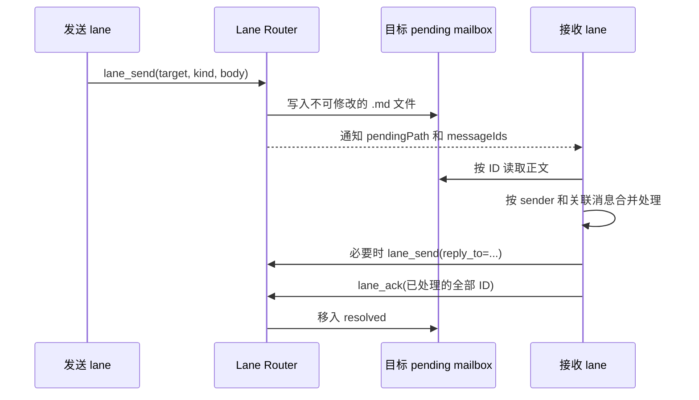

# Lane Router 使用手册

Lane Router 让同一台可信机器上的长期 Claude/Codex 对话以稳定地址互相投递消息，并在目标对话可用时通知它处理持久 mailbox。它解决的是 lane 的绑定、投递和唤醒；如何划分角色、设计 seam contract 和选择 coordinator，仍以 [`role-lane-coordination`](../skills/collaboration/role-lane-coordination/SKILL.md) 为准。

## 术语表

| 术语 | 含义 |
|---|---|
| lane | 持久的角色和上下文边界，地址形如 `<project>/<lane>`；它不是一次性 task。 |
| binding | lane 当前对应的 Claude conversation 或 Codex thread。 |
| mailbox | 每条 lane 的持久消息目录，分为 `pending` 和 `resolved`。 |
| notification | 只携带 lane 地址、`pendingPath` 和 message ID 的唤醒索引；它不包含消息正文。 |
| correction | 通过新消息修正旧消息，并用 `reply_to` 保留关联；它不会改写已经落盘的原消息。 |

## 安装与启动

前提是 Node.js `>=22.12`，并且 Lane Router 仓库已经构建。首次安装或仓库更新后，在 `<lane-router-repo>` 中运行：

```powershell
npm ci
npm run build
npm link
```

### Codex

在希望作为新 thread 工作目录的项目目录中运行：

```powershell
lane-router-codex
```

恢复已有 thread 时运行：

```powershell
lane-router-codex resume <thread-id>
```

launcher 会按需启动 Router process，并把 stock Codex TUI 连接到本地 adapter。不要手动启动 Router、固定它的 PID/端口，或把历史 discovery 值写进脚本。新 thread 使用调用 `lane-router-codex` 时的当前目录；`resume` 保留原 thread 的工作目录。

### Claude Code

把构建产物注册为 user-scope MCP，其中 `<lane-router-repo>` 必须展开成当前机器上的绝对路径：

```powershell
claude mcp add --scope user lane -- node "<lane-router-repo>\dist\mcp\lane-mcp-server.js"
claude mcp get lane
claude mcp list
```

普通 `claude` 可以调用四项 Lane Router tools。需要 Channel 在没有用户输入时自动唤醒 lane，Claude Code 2.1.220 使用：

```powershell
claude --dangerously-load-development-channels server:lane
```

自定义 Channel 当前是 research preview；首次启动需由用户确认 local development warning。不要使用旧的 `--channels server:lane` 写法。

Claude 的 user-scope MCP 保存的是 `dist` 的绝对路径。仓库移动、`dist` 尚未构建或构建产物被清理后，配置会失效；重新 build，并用 `claude mcp get lane` 检查连接。Codex 命令缺失时先运行 `Get-Command lane-router-codex`，再检查 `npm link` 是否仍指向当前构建。

## 四项对话工具

| 工具 | 用途与约束 |
|---|---|
| `lane_directory(project)` | 只读列出同 project 的 lane 和角色说明；无需用户确认。拓扑变更前先调用它，优先复用职责匹配的 lane。 |
| `lane_attach_current(address, role_description?)` | 创建、接替、轮换 lane 或修改角色说明。调用前必须在普通对话中解释拓扑变化并取得用户明确确认；不要添加机械式 `confirmed` 参数。接替现有 lane 且不改角色时省略 `role_description`。 |
| `lane_send(target, kind, body, reply_to?)` | 向目标 `pending` mailbox 写入不可修改的消息。普通消息用 `normal`；修正旧消息用 `correction` 并以 `reply_to` 指向原 message ID。 |
| `lane_ack(message_ids)` | 当前 lane 完成处理后，批量把每个已处理 ID 从 `pending` resolve。未完成、未理解或仍需重试的消息不要提前 ack。 |

lane 是长期 role/context 边界，不要为每个临时 task 创建一条 lane。创建、接替、轮换和修改 `role_description` 都是持久拓扑变化；先查目录、提出具体建议、取得确认，再 attach。当前 conversation 已绑定另一条 active lane 时，Router 会拒绝隐式换绑。

## 收发主流程



收到 notification 后按以下顺序处理：

1. 使用通知给出的 `pendingPath` 和 message ID 直接读取 `.md`；不要从 notification 猜正文，也不要等待不存在的 `lane_receive`。
2. 核对消息头中的 `sender`、`kind` 和 `reply_to`。同一 sender 或同一修正链的消息可在一个 turn 中一起处理。
3. 完成消息要求的实际工作。跨 lane 回报应附证据、文件路径、验证结果和明确请求，不只发送结论。
4. 需要回复时用 `lane_send`；回复具体消息时填写 `reply_to`。
5. 最后用一次 `lane_ack` 覆盖本轮真正处理完成的每个 message ID。ack 是通信层的“已处理”，不是项目 worklog 或 durable result 的替代品。

### 消息到达繁忙或离线 lane 时

- `normal` 不应打断正在运行的 turn。目标空闲或当前 turn 结束后再处理。
- Codex 收到 `correction` 时可以 steer 当前 turn；Claude Channel 没有等价原语，只能把 correction 排到下一 turn。Claude 侧不得声称当前 turn 已被改变。
- 目标离线时消息保持 `pending`。恢复原 session/thread 后会再次获得处理机会；系统提供至少一次提醒，不保证 exactly-once，因此只有完成处理后才 ack。

## 单向投递与双向协作

- 只需要把材料交给另一条 lane、发送方不等待结果时，单向 `lane_send` 即可；接收方离线不会丢消息。
- 需要可靠往返时，双方都应是已绑定、可恢复和可唤醒的持久 lane。V1 的 `lane_send` 要求发送方已有 active binding；不要把一次性临时对话伪装成永久 role，也不要把未绑定对话当成可靠回复地址。
- 多条 lane 的结果必须汇合时，只让一个 coordinator lane 持有共享接线和最终综合职责。发送给 coordinator 的 brief 要区分已验证事实与假设，并附 oracle 或原始输出。

## 故障排查

| 症状 | 检查与处理 |
|---|---|
| `lane-router-codex` 找不到 | 运行 `Get-Command lane-router-codex`；若不存在，在当前 Lane Router repo 重新 build 并 `npm link`。 |
| Claude 看不到 tools | 运行 `claude mcp get lane` 和 `claude mcp list`；确认绝对 `dist` 路径仍存在且已构建。 |
| Claude tools 可用但没有自动通知 | 确认本次启动使用 `claude --dangerously-load-development-channels server:lane`，并已接受首次 development warning。 |
| Codex launcher 启动失败 | 直接读取 launcher 暴露的 Router stderr；不要把启动失败简化成“等待超时”，也不要凭历史 PID 手动处理进程。 |
| 消息反复提醒 | 检查对应 ID 是否仍在 `pending`。未 ack 会再次提醒；处理完成后批量调用 `lane_ack`。 |
| repo 移动或更新后失效 | 重新 build；Claude 重新检查/注册绝对 `dist` 路径，Codex 重新检查 `npm link`。 |
| 代理环境变化但已运行的 Router 未采用 | 代理补全只在创建新 Router process 时发生。不要自行结束共享 Router；先确认没有其他使用者，再由用户或维护者决定受控重启。 |

日常使用不需要 Lane Router 管理 CLI、Windows service、固定端口或手工进程管理。Claude MCP 和 Codex launcher 都会 ensure Router；额外管理面不属于 V1。

## 验证状态与边界

截至 2026-08-09，本机真实最小闭环已经验证：Codex coordinator 向已接替 lane 的 Claude conversation 发送 `normal`；Claude 在没有用户输入时收到 Channel notification，按 ID 读取正文、ack，并向 coordinator 回复；双方消息均从 `pending` 移到 `resolved`。Codex launcher 的新 thread 工作目录、Windows system proxy 继承和启动 stderr 也分别经过真实环境验证。

以下行为有设计和自动测试覆盖，但本轮没有完成真实 Claude lifecycle harness 验证：busy turn 中的 correction、退出后恢复、安全接替等待 `Stop`。使用这些边界时应按 Lane Router 仓库的 `docs/manual-tests.md` 执行真实手工验证，不能把 fake backend 或自动测试结果写成真实 CLI/TUI/Channel 已通过。
