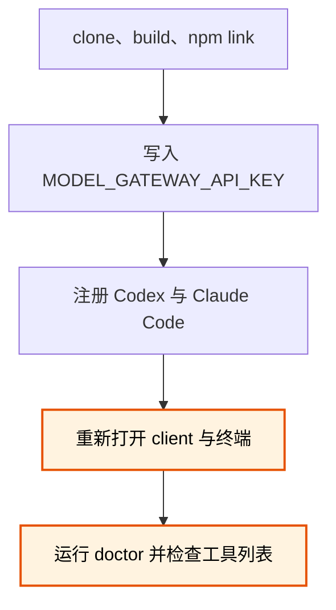

# Model Worker MCP 安装与使用

## 结论

[ModelWorkerMCP](https://github.com/MotionlessPeri/ModelWorkerMCP) 是一个本机 MCP server。Codex、Claude Code 等 coordinator 可以把结构化任务提交给独立 worker daemon；任务被接受后，即使 coordinator 断开，daemon 仍会继续执行并保存状态。

当前版本需要 Windows、Node.js 22.x、Git 2.35 或更新版本，以及可用的 Claude Code runtime，通过 Claude Code harness 调用 `kimi-k3`。公共 MCP 协议不绑定具体 provider 或 model。

## 术语说明

| 术语 | 含义 |
|---|---|
| coordinator | 调用 MCP、拆分任务并检查结果的主 agent，例如 Codex 或 Claude Code。 |
| worker | 接受一个有边界任务并返回结构化结果的模型执行单元。 |
| daemon | 在本机保存 task、session 和 artifact，并在 client 断开后继续执行的后台进程。 |
| capability profile | daemon 强制执行的一组 workspace、shell 和写入权限。 |

## 前置检查

动手前先确认版本。`patch_proposal` 在建隔离工作区时要跑 `git apply --allow-empty`，这个选项从 Git 2.35 才有；更早的 Git 会让整条 patch 路径失败，`text_only` 和 `workspace_read` 不受影响。

```powershell
node --version   # 需要 22.x
git --version    # 需要 2.35 或更新
```

Git 版本不够时的报错具有误导性：抛出的是 `unsupported_workspace_state` 加一句 "Git could not apply the source workspace state"，字面指向你的仓库状态，真因藏在 `diagnostic` 字段里的 `unknown option 'allow-empty'`。

要跑项目自带的测试套件还需要装 Codex CLI——`client-registration` 的两条测试会真实调用 `codex`，缺失时报 `spawn codex.exe ENOENT`。日常安装和使用不需要它。

`npm test` 在 Windows 开发机上不是稳定的绿灯：几个重型集成测试文件（进程守护、Git baseline、discovery ACL、stdio bootstrap）跑一次挂几个，且每次挂的用例不同，干净的 master 上同样如此。判断自己的改动有没有引入回归，靠的是跟基线跑一遍对照失败的文件集合，而不是要求全绿。

## 安装

不要把 API key 写进 clone 命令、shell 历史、MCP 配置或仓库文件。

```powershell
git clone git@github.com:MotionlessPeri/ModelWorkerMCP.git
Set-Location ModelWorkerMCP
npm ci
npm run build
npm link
model-worker-mcp version --json
```

最后一条命令应返回 `package_version` 和 `schema_version`。`npm link` 把当前 clone 注册为用户级 launcher。

更新已有安装时，要重建 launcher、重启旧 daemon 并重新连接 client：

```powershell
git pull --ff-only
npm ci
npm run build
npm link
model-worker-mcp daemon restart
model-worker-mcp doctor --json
```

完成后重新打开或重连 Codex 与 Claude Code。不要让新 launcher 继续连接旧版本 daemon。

## 配置凭据

正式接口只使用用户环境变量 `MODEL_GATEWAY_API_KEY`。已有 Claude settings credential 时，用项目提供的迁移命令读取；命令会在写入前要求确认，且不会输出 credential：

```powershell
model-worker-mcp credential import-claude-settings `
  --source "$env:USERPROFILE\.claude\settings.json" `
  --target user-env
```

写入用户环境后，关闭并重新打开 Codex、Claude Code 和终端，使新进程继承变量。credential 变更后还要执行 `model-worker-mcp daemon restart`。

## 注册 MCP client

先检查是否已经存在同名 server；不要静默覆盖其他配置：

```powershell
codex mcp get model-worker --json
claude mcp get model-worker
```

“未找到”表示可以继续。存在时先核对 command、args 和配置范围，再决定保留还是显式移除。

新配置推荐使用 strict 请求完整性模式：

```powershell
codex mcp add model-worker -- model-worker-mcp stdio --request-integrity required
claude mcp add --scope user model-worker -- model-worker-mcp stdio --request-integrity required
```

安装流程中容易漏掉的是 host 重启与最终诊断：



检查注册结果：

```powershell
codex mcp get model-worker --json
codex mcp list
claude mcp get model-worker
claude mcp list
model-worker-mcp doctor --json
```

`doctor` 不调用真实模型。成功结果应包含 `"ok":true`、`"health":"healthy"` 和 `"credential_present":true`。

## strict 请求完整性

strict session 要求 `task_submit` 和 `task_continue` 带有本地计算的摘要。把不含 `expected_request_digest` 的完整 JSON 通过 stdin 交给 launcher：

```powershell
'{"model_id":"kimi-k3","objective":"Reply","capability_profile":"text_only","idempotency_key":"task-1"}' |
  model-worker-mcp request-digest task_submit
```

把返回的 `algorithm` 放入 `expected_request_digest.algorithm`，把返回的 `digest` 值放入 `expected_request_digest.value`；其余字段必须保持不变：

```json
{
  "expected_request_digest": {
    "algorithm": "sha256:model-worker-request-v1",
    "value": "<digest>"
  }
}
```

摘要用于发现 coordinator 或 harness 改写参数，不是 credential，也不授予额外权限。

如果 client 无法在写请求前计算摘要，可明确改用兼容模式：先删除同名注册，再把上面的 `required` 改成 `optional` 重新注册。兼容模式仍会验证主动提供的摘要，但不强制每个写请求都包含它。

```powershell
codex mcp remove model-worker
claude mcp remove --scope user model-worker
```

## 调用流程

1. 调用 `model_list`，确认 `kimi-k3`、credential 和所需 capability profile 可用。
2. 调用 `task_submit`，保存返回的 `task_id` 和 `session_id`。
3. 用同一个 `task_id` 调用 `task_get`；轮询不会产生新的模型请求。
   默认配置下 `task_get.wait_ms` 的上限是 `0`；省略该字段或传 `0`，由 coordinator 定时轮询。只有 daemon 显式调高该上限后才使用长轮询值。
   不想自己轮询就用 `model-worker-mcp task wait <task-id>`：它阻塞到任务终结再退出，见下「做完主动唤醒」。
4. 需要纠正时，对 session 当前 head 调用 `task_continue`，不要伪造新的首轮任务。它会恢复上一轮的对话上下文，worker 记得自己说过什么，所以不必把前情复述进新任务。前提是 session 仍是 `open`、`after_task_id` 是当前 head 且已终结。
5. 不再需要任务时调用 `task_cancel`。它请求取消 active task，不会删除历史记录。

## 做完主动唤醒

派了任务之后不必反复问「好了没」。MCP 协议虽然有服务端通知，但**收到通知不会唤醒一个回合制的 agent 对话**——能叫醒它的是用户消息、定时器，以及**后台进程结束**。所以正道是把等待变成一个会退出的进程：

```powershell
model-worker-mcp task wait <task-id>
```

把它作为后台命令跑，进程退出就是「任务做完了」的信号，harness 会因此回到这个对话。轮询读的是本机数据库，不额外消耗上游额度。

退出码分开表达结局，便于脚本分支：`0` 终结（stdout 是含 `result` 的最终快照）、`3` 事件停滞疑似卡死、`4` 超出整体预算、`5` 连不上 daemon 或任务不存在、`2` 参数错。默认 20 秒一轮询、12 分钟无事件判停滞、整体 2 小时；`--poll-ms` / `--stall-ms` / `--timeout-ms` 可调，后两者给 `0` 表示不设限。

`3` 是提醒不是判决——任务可能只是卡在一次很长的工具调用里，它仍在 daemon 中运行。要真的结束用 `task_cancel`。

## 传文件给 worker

大段内容不要内联进 `objective`——strict 模式下请求要跟摘要逐字节一致，长文本既笨重又容易出错。用 `local_file` 输入把文件冻结成附件：

```json
{
  "inputs": [{ "kind": "local_file", "name": "readme", "path": "E:\\proj\\README.md" }]
}
```

**操作者必须先授权目录**，否则一切 `local_file` 都被拒绝。授权写在数据根的 `model-registry.json` 顶层，跟换网关是同一份文档：

```json
{
  "local_file_roots": ["E:\\proj"]
}
```

改完执行 `model-worker-mcp daemon restart`。默认（未声明或空数组）是拒绝一切，这是刻意的——没有显式授权，daemon 不替操作者猜哪些本地文件可以交给 worker。

几条使用边界：

- 文本类附件的内容会被读进 worker 的上下文，上限 256 KiB；超限或二进制附件只给出元数据，并附一句说明为什么没有内容，不会静默截断。
- 单个文件大小上限 16 MiB（硬上限 64 MiB）。
- 可选 `expected_sha256` 做完整性校验。
- 三种拒绝各有稳定错误码：越出授权目录是 `workspace_out_of_scope`，文件不存在、指向目录、摘要不匹配都是 `invalid_request`。都在任务被接受前返回。

## Capability profiles

| Profile | 适用场景 | 权限边界 |
|---|---|---|
| `text_only` | 问答、分析、已冻结附件 | 不接收 workspace。 |
| `workspace_read` | 需要理解整个代码库的分析或调研 | 只读授权 workspace，不提供 shell 或写入工具。 |
| `patch_proposal` | 修改代码并运行有限测试 | 在独立 Git clone 中工作，只返回 patch，不直接修改原 workspace。 |

复杂任务优先选择能提供足够上下文的最低 profile。worker 可以使用 Claude Code harness 自带的 subagent 和网络能力，但 daemon 仍以 profile 限制 workspace 与写入边界。

派 `patch_proposal` 任务时，brief 里要写清「不需要 commit，交付以相对 baseline 的 patch 自动生成」，并给出验收要跑的命令（构建 / 类型检查 / 测试）。worker 在隔离 clone 里工作，装依赖要自己跑一遍。

## 让 worker 跑扇出 workflow（调研 / 审计类重活）

worker 的 harness 带 `workflows` capability，可以跑几十个 subagent 的扇出任务（实测 54 agent / 15 分钟 / 五阶段全走完）。三条契约，都靠踩坑得到：

1. **workflow 脚本必须写成纯文本模式，不能用 `agent({schema})`。** kimi-k3 这条网关路径上，大的 `StructuredOutput` 载荷会被上游取消——十几字节能过，3-6 KB 必死（`toolDenialKind: "cancelled"`，不是 daemon 的策略拒绝，daemon 侧已排除并结案）。而内置 workflow（`deep-research` 等）每个阶段都用 schema，所以**内置扇出 workflow 在该路径上整体不可用**。替代写法：`agent()` 不带 schema、让它返回 JSON 文本、脚本里剥围栏后取首个完整 JSON 值解析，配一次「重发一遍、只输出 JSON 本体」的重试。参考实现：`agent_coding_guidelines/.claude/skills/research-radar/radar-textmode.js`（含 `parseLoose` / `jsonAgent` 两个可搬走的 helper）。
   同一个取消在上层有**两副面孔**：模型选择重试 → `StructuredOutput retry cap (5) exceeded`；模型服从取消话术里的「STOP and wait」→ `subagent completed without calling StructuredOutput`。排查时别当成两个 bug。
2. **派发用 `Workflow({ scriptPath })`，脚本放进 workspace，参数烤进脚本常量。** brief 里明确「只传 scriptPath、不传 args」。
3. **worker 提交 workflow 后必然立刻结束回合，别在 brief 里对抗。** 实测 0/5——包括它逐字复述指令并承诺「我不会提前结束回合」之后照犯。回合收敛是模型的默认行为，prompt 侧堵不住。daemon 的兜底（等后台任务清空才 finalize，交付物出现在 `task_get` 的 `result.summary`）是唯一可靠机制；起了后台 workflow 的任务会 running 到真实交付，`timeout_ms` 按 workflow 时长留（默认 2 小时一般够）。

## 委派的验收纪律（coordinator 侧）

- **worker 的自述会把误诊写成事实。** 实例：把自己的调用姿势错误报成「该 workflow 不可用（上轮已确认）」——「上轮」根本不存在。方法性结论（"X 不可用" / "已确认 Y"）一律要求附证据（错误原文 / runId），没有就当假设处理。
- **扇出真跑没跑，看运行记录不听汇报**：workflow 落盘的 `wf_*.json` 里 `agentCount` / `totalTokens` 是硬判据（0 = 没跑）。daemon 新版交付物直接回 `task_get`，一般不用再扒；worker 声称与 result 对不上时再去。
- **验收 ≠ 重跑核验**。抽查即可：URL 抽样可达 + 引语逐字比对 + stats 自洽（fetch 失败数异常高 = 「搜索没跑完」别读成「无 signal」）+ 与去重账本比对。成本是几次 WebFetch，不是把 worker 的活重做一遍。实测一次抽查抓出 worker 报告里 3 处错误。
- **去重要指定「逐条对照」的粒度**。给了完整账本文件当输入，worker 仍可能只对照显眼的黑名单节、漏扫日期条目（实测漏了 2 条旧货）。brief 里写明对照范围，或 coordinator 侧机械 diff 兜底。

## 计费口径

- **成本看 `cost_amount`，不看 units。** `usage` 的三个数各是一个计量面：`input/output_units` 只计 worker 主循环（不含 subagent），workflow 自己的 `totalTokens` 另算，`cost_amount` 才是全量权威。拿 units 估成本会差一个数量级。
- **kimi-k3 网关无 prompt caching**（`cache_write` 恒 0）：多轮长 context 任务每轮全量重发 context，这是费用大头。单线程长对话（几十轮工具调用）可能比一次扇出更贵——实测 95 轮手搜 $14 vs 54-agent 扇出同量级。

## 运行与排障

```powershell
model-worker-mcp daemon status
model-worker-mcp daemon restart
model-worker-mcp daemon stop
model-worker-mcp doctor --json
```

- client 断开不会自动取消已经接受的 task；重新连接后用 `task_get` 查询。
- `daemon restart` 会保留 queued task，但 active task 会变为 `interrupted`——且**首轮任务被打断后无法 `task_continue` 续接**（resume handle 只在任务完成时落库；工具侧已立项修复，修好前中断即全损）。**重启前先确认没有任务在跑**：实测一次为部署修复而重启，杀掉了一个已跑 40 分钟的扇出任务。
- 重启换端口后 MCP client **必须人工重连**，实测 4 次无一自动恢复；症状是工具调用 `fetch failed`。多会话共用一个 daemon 时，重启会把所有会话的连接一起打断。
- strict 写请求返回 `invalid_request` 时，先检查摘要是否缺失或请求字段是否在计算摘要后发生变化。
- MCP 显示 disconnected 时，先确认 `model-worker-mcp version --json` 能从新终端运行，再检查 `doctor`。
- `patch_proposal` 报 `unsupported_workspace_state` 时先看 `diagnostic` 字段：出现 `unknown option 'allow-empty'` 说明 Git 低于 2.35，该升级 Git 而不是改工作区。
- `local_file` 报 `workspace_out_of_scope` 且信息提到 `local_file_roots`，说明操作者还没授权目录，见上「传文件给 worker」。
- **重启 daemon 前先确认自己的终端里有 `MODEL_GATEWAY_API_KEY`**。新 daemon 继承的是执行 restart 那个进程的环境；从一个没有该变量的 shell 重启，daemon 会带着空凭据起来，之后所有任务都失败。
- 任务长时间没有新 event 不等于 deadline 失效——两者要分开看。`task_get` 的 event 序号不动是「worker 卡住」，而 deadline 到点会把任务转成 `timed_out`。判断挂死看 event 停滞，别看 deadline。
- 不要手工编辑 `%LOCALAPPDATA%\model-worker-mcp` 中的 SQLite、discovery 或 artifact。

完整协议、运维细节和最新限制以远端仓库的 [README](https://github.com/MotionlessPeri/ModelWorkerMCP/blob/master/README.md)、[客户端注册](https://github.com/MotionlessPeri/ModelWorkerMCP/blob/master/docs/client-registration.md)和[运行维护](https://github.com/MotionlessPeri/ModelWorkerMCP/blob/master/docs/operations.md)为准。

## 卸载

先移除 client 注册并停止 daemon，再解除 npm link：

```powershell
codex mcp remove model-worker
claude mcp remove --scope user model-worker
model-worker-mcp daemon stop
npm unlink --global model-worker-mcp
```

卸载 launcher 不会自动删除 `%LOCALAPPDATA%\model-worker-mcp` 的任务历史。确认不再需要这些数据并完成备份后，再由用户显式处理该目录。
