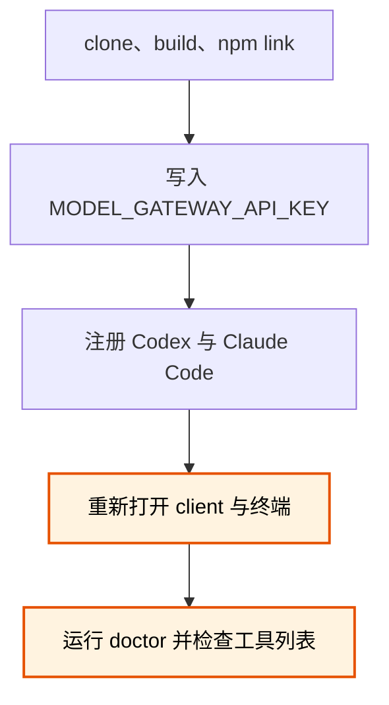

# Model Worker MCP 安装与使用

## 结论

[ModelWorkerMCP](https://github.com/MotionlessPeri/ModelWorkerMCP) 是一个本机 MCP server。Codex、Claude Code 等 coordinator 可以把结构化任务提交给独立 worker daemon；任务被接受后，即使 coordinator 断开，daemon 仍会继续执行并保存状态。

当前版本需要 Windows、Node.js 22.x、Git 2.35 或更新版本，以及可用的 Claude Code runtime，通过 Claude Code harness 调用 `kimi-k3`。公共 MCP 协议不绑定具体 provider 或 model。

## 术语说明

| 术语 | 含义 |
|---|---|
| coordinator | 调用 MCP、拆分任务并检查结果的主 agent，例如 Codex 或 Claude Code。 |
| worker | 接受一个有边界任务并返回结构化结果的模型执行单元。 |
| daemon | 在本机保存 task、session 和 artifact，并在 client 断开后继续执行的后台进程。 |
| capability profile | daemon 强制执行的一组 workspace、shell 和写入权限。 |

## 前置检查

动手前先确认版本。`patch_proposal` 在建隔离工作区时要跑 `git apply --allow-empty`，这个选项从 Git 2.35 才有；更早的 Git 会让整条 patch 路径失败，`text_only` 和 `workspace_read` 不受影响。

```powershell
node --version   # 需要 22.x
git --version    # 需要 2.35 或更新
```

Git 版本不够时的报错具有误导性：抛出的是 `unsupported_workspace_state` 加一句 "Git could not apply the source workspace state"，字面指向你的仓库状态，真因藏在 `diagnostic` 字段里的 `unknown option 'allow-empty'`。

要跑项目自带的测试套件还需要装 Codex CLI——`client-registration` 的两条测试会真实调用 `codex`，缺失时报 `spawn codex.exe ENOENT`。日常安装和使用不需要它。

## 安装

不要把 API key 写进 clone 命令、shell 历史、MCP 配置或仓库文件。

```powershell
git clone git@github.com:MotionlessPeri/ModelWorkerMCP.git
Set-Location ModelWorkerMCP
npm ci
npm run build
npm link
model-worker-mcp version --json
```

最后一条命令应返回 `package_version` 和 `schema_version`。`npm link` 把当前 clone 注册为用户级 launcher。

更新已有安装时，要重建 launcher、重启旧 daemon 并重新连接 client：

```powershell
git pull --ff-only
npm ci
npm run build
npm link
model-worker-mcp daemon restart
model-worker-mcp doctor --json
```

完成后重新打开或重连 Codex 与 Claude Code。不要让新 launcher 继续连接旧版本 daemon。

## 配置凭据

正式接口只使用用户环境变量 `MODEL_GATEWAY_API_KEY`。已有 Claude settings credential 时，用项目提供的迁移命令读取；命令会在写入前要求确认，且不会输出 credential：

```powershell
model-worker-mcp credential import-claude-settings `
  --source "$env:USERPROFILE\.claude\settings.json" `
  --target user-env
```

写入用户环境后，关闭并重新打开 Codex、Claude Code 和终端，使新进程继承变量。credential 变更后还要执行 `model-worker-mcp daemon restart`。

## 注册 MCP client

先检查是否已经存在同名 server；不要静默覆盖其他配置：

```powershell
codex mcp get model-worker --json
claude mcp get model-worker
```

“未找到”表示可以继续。存在时先核对 command、args 和配置范围，再决定保留还是显式移除。

新配置推荐使用 strict 请求完整性模式：

```powershell
codex mcp add model-worker -- model-worker-mcp stdio --request-integrity required
claude mcp add --scope user model-worker -- model-worker-mcp stdio --request-integrity required
```

安装流程中容易漏掉的是 host 重启与最终诊断：



检查注册结果：

```powershell
codex mcp get model-worker --json
codex mcp list
claude mcp get model-worker
claude mcp list
model-worker-mcp doctor --json
```

`doctor` 不调用真实模型。成功结果应包含 `"ok":true`、`"health":"healthy"` 和 `"credential_present":true`。

## strict 请求完整性

strict session 要求 `task_submit` 和 `task_continue` 带有本地计算的摘要。把不含 `expected_request_digest` 的完整 JSON 通过 stdin 交给 launcher：

```powershell
'{"model_id":"kimi-k3","objective":"Reply","capability_profile":"text_only","idempotency_key":"task-1"}' |
  model-worker-mcp request-digest task_submit
```

把返回的 `algorithm` 放入 `expected_request_digest.algorithm`，把返回的 `digest` 值放入 `expected_request_digest.value`；其余字段必须保持不变：

```json
{
  "expected_request_digest": {
    "algorithm": "sha256:model-worker-request-v1",
    "value": "<digest>"
  }
}
```

摘要用于发现 coordinator 或 harness 改写参数，不是 credential，也不授予额外权限。

如果 client 无法在写请求前计算摘要，可明确改用兼容模式：先删除同名注册，再把上面的 `required` 改成 `optional` 重新注册。兼容模式仍会验证主动提供的摘要，但不强制每个写请求都包含它。

```powershell
codex mcp remove model-worker
claude mcp remove --scope user model-worker
```

## 调用流程

1. 调用 `model_list`，确认 `kimi-k3`、credential 和所需 capability profile 可用。
2. 调用 `task_submit`，保存返回的 `task_id` 和 `session_id`。
3. 用同一个 `task_id` 调用 `task_get`；轮询不会产生新的模型请求。
   默认配置下 `task_get.wait_ms` 的上限是 `0`；省略该字段或传 `0`，由 coordinator 定时轮询。只有 daemon 显式调高该上限后才使用长轮询值。
4. 需要纠正时，对 session 当前 head 调用 `task_continue`，不要伪造新的首轮任务。
5. 不再需要任务时调用 `task_cancel`。它请求取消 active task，不会删除历史记录。

## Capability profiles

| Profile | 适用场景 | 权限边界 |
|---|---|---|
| `text_only` | 问答、分析、已冻结附件 | 不接收 workspace。 |
| `workspace_read` | 需要理解整个代码库的分析或调研 | 只读授权 workspace，不提供 shell 或写入工具。 |
| `patch_proposal` | 修改代码并运行有限测试 | 在独立 Git clone 中工作，只返回 patch，不直接修改原 workspace。 |

复杂任务优先选择能提供足够上下文的最低 profile。worker 可以使用 Claude Code harness 自带的 subagent 和网络能力，但 daemon 仍以 profile 限制 workspace 与写入边界。

## 运行与排障

```powershell
model-worker-mcp daemon status
model-worker-mcp daemon restart
model-worker-mcp daemon stop
model-worker-mcp doctor --json
```

- client 断开不会自动取消已经接受的 task；重新连接后用 `task_get` 查询。
- `daemon restart` 会保留 queued task，但 active task 会变为 `interrupted`。
- strict 写请求返回 `invalid_request` 时，先检查摘要是否缺失或请求字段是否在计算摘要后发生变化。
- MCP 显示 disconnected 时，先确认 `model-worker-mcp version --json` 能从新终端运行，再检查 `doctor`。
- `patch_proposal` 报 `unsupported_workspace_state` 时先看 `diagnostic` 字段：出现 `unknown option 'allow-empty'` 说明 Git 低于 2.35，该升级 Git 而不是改工作区。
- 不要手工编辑 `%LOCALAPPDATA%\model-worker-mcp` 中的 SQLite、discovery 或 artifact。

完整协议、运维细节和最新限制以远端仓库的 [README](https://github.com/MotionlessPeri/ModelWorkerMCP/blob/master/README.md)、[客户端注册](https://github.com/MotionlessPeri/ModelWorkerMCP/blob/master/docs/client-registration.md)和[运行维护](https://github.com/MotionlessPeri/ModelWorkerMCP/blob/master/docs/operations.md)为准。

## 卸载

先移除 client 注册并停止 daemon，再解除 npm link：

```powershell
codex mcp remove model-worker
claude mcp remove --scope user model-worker
model-worker-mcp daemon stop
npm unlink --global model-worker-mcp
```

卸载 launcher 不会自动删除 `%LOCALAPPDATA%\model-worker-mcp` 的任务历史。确认不再需要这些数据并完成备份后，再由用户显式处理该目录。
